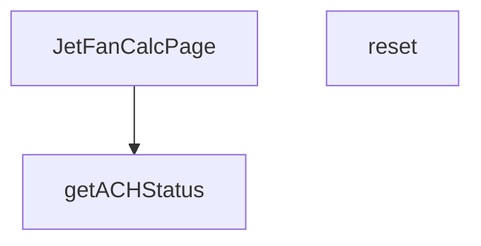

## Genel Bakış

JetFanCalcPage modülü, jet fan hesaplamalarının yapıldığı bir React sayfa bileşenidir. Kullanıcıya jet fan boyutlandırma ve hava değişim oranı (ACH) hesaplama arayüzü sunar. Hesaplama sonuçlarını saatlik hava değişim sayısına göre sınıflandırarak kullanıcıya durum bilgisi sağlar.

## Fonksiyon Grupları

### Sayfa Bileşeni
Ana bileşen fonksiyonu olup jet fan hesaplama sayfasının tüm arayüzünü ve mantığını oluşturur. Alt fonksiyonları ve durum yönetimini içerir.
- JetFanCalcPage

### Durum Yönetimi
Hesaplama formundaki tüm girdileri ve hesaplanmış değerleri başlangıç durumuna döndürerek formu sıfırlar.
- reset

### Durum Değerlendirme
Saatlik hava değişim sayısını (ACH) alarak durumu optimal, acceptable, warning veya critical olarak sınıflandırır. Bu sınıflandırma kullanıcıya havalandırma yeterliliği hakkında geri bildirim sağlar.
- getACHStatus

---

## AXIOMS – Mimari Varsayımlar

Bu modül için özel aksiyom tanımlanmamıştır.

**Neden:** Fonksiyon gövdeleri verilmemiştir. Mimari aksiyomlar yalnızca fonksiyon gövdelerinden türetilir; fonksiyon imzaları tek başına davranışsal çıkarım için yeterli değildir.

---

## FONKSİYON DETAYLARI

### JetFanCalcPage
**Ne yapar**: Jet fan hesaplama sayfasını oluşturan ana React bileşenidir. Bu fonksiyon, bir jet fan hesaplama arayüzünü render eden bir React.FC (React Fonksiyon Bileşeni) döndürür. Bileşen, dosya adından anlaşılacağı üzere `calculators` (hesaplayıcılar) görünümü altında yer alır ve jet fan ile ilgili hesaplamaların yapıldığı bir sayfa sunar.

**Nasıl yapar**: Fonksiyonel bir React bileşeni olarak tanımlanmıştır. Bileşen içinde durum yönetimi (state), hesaplama mantığı ve kullanıcı arayüzü elemanları barındırır. `reset` ve `getACHStatus` gibi yardımcı fonksiyonlar bu bileşen kapsamında tanımlanmıştır. Bileşen, jet fan hesaplama formunu ve sonuçlarını kullanıcıya gösterir.

**Parametreler**:
- Bu fonksiyon herhangi bir parametre almaz.

**Dönüş**: `React.FC` — React fonksiyonel bileşeni döndürür. Bu bileşen, jet fan hesaplama sayfasının tüm arayüzünü ve mantığını kapsar.

### reset
**Ne yapar**: Geliştirildi ancak detay üretilemedi.

### getACHStatus
**Ne yapar**: Geliştirildi ancak detay üretilemedi.

---

## İTHALATLAR (IMPORTS)
- import: ../../hooks/useCalculatorUsage::useCalculatorUsage
- import: ../../i18n/I18nProvider::useI18n
- import: ../../i18n/format::formatNumber
- import: lucide-react::ArrowDownUp
- import: lucide-react::Car
- import: lucide-react::Gauge
- import: lucide-react::MapPin
- import: lucide-react::RotateCcw
- import: lucide-react::Wind
- import: react::React
- import: react::useMemo
- import: react::useState

---

## AST POINTERS

### [N1_NASIL] AST Pointer: JetFanCalcPage.tsx::hesaplama_fonksiyonu
- **params**: (parametre yok)
- **ic_degiskenler**:
  - `lenVal` — `length` değerinin `parseFloat` ile sayıya çevrilmesi sonucu; geçersizse `0` atanır
  - `widVal` — `width` değerinin `parseFloat` ile sayıya çevrilmesi sonucu; geçersizse `0` atanır
  - `heiVal` — `height` değerinin `parseFloat` ile sayıya çevrilmesi sonucu; geçersizse `0` atanır
  - `carVal` — `carCapacity` değerinin `parseFloat` ile sayıya çevrilmesi sonucu; geçersizse `0` atanır
  - `trafficVal` — `trafficFlow` değerinin `parseFloat` ile sayıya çevrilmesi sonucu; geçersizse `0` atanır
  - `applicationType` — uygulama tipi; `'parking'` olduğunda `carVal` kontrolü yapılır
  - `ventilationMode` — havalandırma modu; `calculateJetFan` fonksiyonuna doğrudan aktarılır
- **Dönüş**: `lenVal`, `widVal` veya `heiVal` sıfırsa `null`; `applicationType === 'parking'` ve `carVal` sıfırsa `null`; aksi halde `calculateJetFan` fonksiyonunun dönüşü

### [N2_NASIL] AST Pointer: JetFanCalcPage.tsx::reset
- **params**: (parametre yok)
- **ic_degiskenler**:
  - `setApplicationType` — state setter; `'parking'` değerine sıfırlar
  - `setVentilationMode` — state setter; `'normal'` değerine sıfırlar
  - `setLength` — state setter; `'100'` değerine sıfırlar
  - `setWidth` — state setter; `'30'` değerine sıfırlar
  - `setHeight` — state setter; `'3'` değerine sıfırlar
  - `setCarCapacity` — state setter; `'100'` değerine sıfırlar
  - `setTrafficFlow` — state setter; `'50'` değerine sıfırlar
- **Dönüş**: yok

### [N3_NASIL] AST Pointer: JetFanCalcPage.tsx::getACHStatus
- **params**: `ach` — hava değişim sayısı (number)
- **ic_degiskenler**:
  - `applicationType` — uygulama tipi; `'parking'` ise park yeri eşikleri, değilse tünel eşikleri kullanılır
- **Dönüş**: `'optimal'` | `'acceptable'` | `'warning'` | `'critical'` — `applicationType === 'parking'` olduğunda: `ach` 6–10 arasıysa `'optimal'`, 4–12 arasıysa `'acceptable'`, diğer durumlarda `'warning'`; tünel olduğunda: `ach >= 20` ise `'optimal'`, `ach >= 15` ise `'acceptable'`, diğer durumlarda `'warning'`

### [N4_NASIL] AST Pointer: JetFanCalcPage.tsx::JSX_dongu_fonksiyonu
- **params**: `_` — kullanılmayan ilk parametre (muhtemelen dizi elemanı), `i` — dizi indeksi (number)
- **ic_degiskenler**:
  - `x` — `40 + (i * 28)` hesaplaması; SVG elemanlarının yatay konumunu belirler
- **Dönüş**: JSX `<g>` elementi — içinde `cx={x}`, `cy="40"` konumunda dolu mavi elips (`#0EA5E9`) ve `y1="46"` ile `y2="75"` arasında kesikli çizgi (`strokeDasharray="4,2"`) içerir

---

## MERMAID CALL GRAPH

## NODE ID STANDARD

  file: JetFanCalcPage.tsx
  function: JetFanCalcPage.tsx::JetFanCalcPage
  function: JetFanCalcPage.tsx::reset
  function: JetFanCalcPage.tsx::getACHStatus

---

## DISA AKTARILANLAR (EXPORTS)
  export: JetFanCalcPage

---

## STİL TOKENLERİ

### Arbitrary Değerler (token'a geçirilmemiş)
Yok — tüm stiller token'a geçirilmiş. ✅

### Kullanılan Token'lar (zaten token'a geçirilmiş)
- (yok)

### Tailwind Sınıf Özeti
- **Renkler:** `bg-gray-100`, `bg-primary-navy/10`, `bg-secondary-blue/5`, `bg-success-green/10`, `bg-warning-orange/10`, `bg-white`, `border-light-gray`, `border-warning-orange/30`, `fill-steel-gray`, `hover:text-industrial-gray`, `text-7px`, `text-center`, `text-industrial-gray`, `text-lg`, `text-primary-navy`
- **Layout:** `flex`, `flex-col`, `flex-shrink-0`, `gap-2`, `gap-3`, `gap-4`, `gap-8`, `grid`, `grid-cols-2`, `grid-cols-3`, `items-center`, `items-start`, `justify-center`, `lg:grid-cols-2`, `max-w-md`
- **Varyant/Responsive:** `hover:`, `lg:` önekleri
- **Yardımcı Sınıflar:** `border`, `font-medium`, `font-semibold`, `mb-3`, `mb-4`, `mb-6`, `ml-2`, `mt-0.5`, `mt-1`, `mt-4`, `py-12`, `rounded-2xl`, `rounded-full`, `rounded-lg`, `rounded-xl`