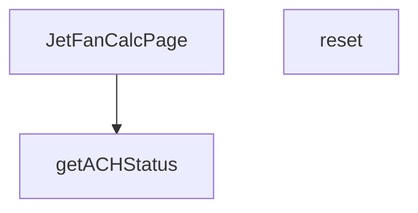

## Genel Bakış
VentHub HVAC projesinde yer alan bu modül, jet fan havalandırma sistemleri için hesaplama yapan bir sayfa bileşenidir. Kullanıcıların jet fan parametrelerini girerek hesaplama yapmasını, formu sıfırlamasını ve hesaplanan hava değişim sayısının (ACH) performans durumunu görsel olarak değerlendirmesini sağlar.

## Fonksiyon Grupları
### Sayfa Bileşeni
Tüm jet fan hesaplayıcı arayüzünü oluşturan ana React bileşenidir. Form alanlarını, hesaplama mantığını ve sonuç gösterimini tek bir yapıda birleştirerek kullanıcıya sunar.

- JetFanCalcPage

### Yardımcı Fonksiyonlar
Sayfa içindeki hesaplama ve durum değerlendirme işlemlerini destekleyen yardımcı işlevlerdir. Kullanıcının formu sıfırlamasına ve ACH değerinin performans seviyesini belirlenmesine olanak tanır.

- reset, getACHStatus

---

## AXIOMS – Mimari Varsayımlar

Bu modül, jet fan havalandırma hesaplayıcı bir React bileşenidir. Aşağıdaki mimari varsayımlar yalnızca fonksiyon imzalarından ve modül sabitlerinden çıkarılmıştır.

**[Aksiyom 1]:** Eğer `ach` parametresi sayısal (`number`) türünde değilse, `getACHStatus` fonksiyonu beklenmeyen davranış gösterir.

**[Aksiyom 2]:** Eğer `APPLICATION_OPTIONS` sabiti dizi (`array`) olarak tanımlı değilse, sayfa bileşeni form alanlarını doğru şekilde oluşturamaz.

**[Aksiyom 3]:** Eğer `VENTILATION_MODE_OPTIONS` sabiti dizi (`array`) olarak tanımlı değilse, sayfa bileşeni havalandırma modu seçim alanını doğru şekilde oluşturamaz.

**[Aksiyom 4]:** Eğer `reset()` çağrıldığında form durumu (state) erişilebilir değilse, form alanları sıfırlanamaz ve önceki değerler korunur.

**[Aksiyom 5]:** Eğer `JetFanCalcPage` bir React bileşeni olarak JSX bağlamında (`React Context`) çağrılmıyorsa, bileşen render edilemez.

---

## FONKSİYON DETAYLARI

### JetFanCalcPage
**Ne yapar**: Jet Fan hesaplama sayfasının ana React bileşenidir. HVAC (Isıtma, Havalandırma ve Klima) sistemi için jet fan hesaplamalarını kullanıcı arayüzünde sunar. Bu bileşen, hesaplama formunu, sonuçları ve ilgili durum göstergelerini yönetir.

**Nasıl yapar**: Fonksiyon bir React fonksiyonel bileşenidir (React.FC). İçerisinde hesaplama mantığını, form durumunu (state) ve kullanıcı etkileşimlerini yönetir. Jet fan sistemi için gerekli parametreleri (hava debisi, kanal boyutları, ACH değeri vb.) işleyerek hesaplama sonuçlarını oluşturur ve sayfada gösterir. Kullanıcının değerleri girip hesaplayabilmesini sağlar.

**Parametreler**:
Bu fonksiyon parametre almaz, çünkü bir React bileşenidir ve props üzerinden veri alması beklenir (ancak bu spesifikasyonda props tanımlanmamıştır).

**Dönüş**: `React.FC` tipinde bir JSX bileşeni döndürür. Bu, React Functional Component anlamına gelir ve hesaplama sayfasının tüm arayüzünü render eder.

### reset
**Ne yapar**: JetFanCalcPage sayfasındaki tüm kullanıcı girişlerini, mevcut hesaplama sonuçlarını ve sayfa durum değerlerini varsayılan ilk hallerine döndüren sıfırlama fonksiyonudur. Kullanıcının mevcut hesaplamasını sıfırlayarak tamamen yeni bir hesaplama süreci başlatmasını mümkün kılar. Formdaki tüm doldurulmuş alanları temizleyerek hata veya yanlış giriş durumlarında kolayca sıfırlama imkanı sunar.
**Nasıl yapar**: JetFanCalcPage bileşeni içinde yönetilen state nesnesindeki tüm form değerlerini, hesaplanmış performans verilerini ve tüm uyarı/hata mesajlarını ilk yükleme durumundaki varsayılan değerlerle günceller. Sayfa içindeki tüm durum bilgilerini sıfırlayarak kullanıcının baştan hesaplama yapmasına imkan tanır.
**Parametreler**: Bu fonksiyon herhangi bir giriş parametresi almaz.
**Dönüş**: Herhangi bir değer döndürmez, yalnızca sayfa içi durumu değiştirmek üzere çalışan void işlevidir, tanımında dönüş tipi belirtilmemiştir.

### getACHStatus
**Ne yapar**: Hesaplanan saatlik hava değişim sayısı (ACH - Air Change per Hour) değerine göre sistemin hava değişim performansını dört farklı risk kategorisinden birine sınıflandıran yardımcı doğrulama fonksiyonudur. Elde edilen durum değeri, kullanıcı arayüzünde uygun görsel ipuçları veya bilgilendirme mesajları ile kullanıcıya sunulmak üzere kullanılır. HVAC sistemlerinin yeterli hava değişimi sağlamasını kontrol etmek için temel bir kontrol mekanizmasıdır.
**Nasıl yapar**: Girdi olarak aldığı sayısal ach değerini önceden tanımlanmış endüstri standartlarındaki eşik değerlerle karşılaştırır, karşılaştırma sonucunda performansın hangi kategoriye ait olduğunu belirler. Belirlenen durum metni, arayüzde uygun renk, ikon veya uyarı metni ile gösterilerek kullanıcının sistem durumunu kolayca anlamasını sağlar.
**Parametreler**:
- name: ach — type: number — Sınıflandırma yapılacak temel girdi olan hesaplanmış saatlik hava değişim sayısını temsil eden sayısal değer, performans seviyesini belirlemek için eşiklerle karşılaştırılır.
**Dönüş**: Sadece dört farklı string değerden birini döndürür: 'optimal', 'acceptable', 'warning' veya 'critical'. Bu değerler sırasıyla mükemmel, kabul edilebilir, dikkat gerektiren ve kritik düzeyde hava değişim performansını ifade eder.

---

## SABİTLER
- **APPLICATION_OPTIONS** (array) — `[

  {

    value: 'parking',

    label: 'Otopark',

    description: 'Kapal...`
- **VENTILATION_MODE_OPTIONS** (array) — `[

  { value: 'normal', label: 'Normal', description: 'Günlük havalandırma' }...`

---

## AST POINTERS

### [N1_NASIL] AST Pointer: src/views/calculators/JetFanCalcPage.tsx::Hesaplama Callback (useMemo)
- **params**: (parametre yok — useCallback/memo内部闭包, state değişkenleri closure'dan okunur)
- **ic_degiskenler**:
  - `lenVal` — `parseFloat(length)` ile parse edilen oda uzunluğu, 0'a eşit veya küçükse `parseFloat` başarısız olursa 0'a düşer
  - `widVal` — `parseFloat(width)` ile parse edilen oda genişliği
  - `heiVal` — `parseFloat(height)` ile parse edilen oda yüksekliği
  - `carVal` — `parseFloat(carCapacity)` ile parse edilen araç kapasitesi
  - `trafficVal` — `parseFloat(trafficFlow)` ile parse edilen saatlik trafik akış değeri
- **Closure'dan Okunan State**: `length`, `width`, `height`, `carCapacity`, `trafficFlow`, `applicationType`, `ventilationMode`
- **Koşullar**: `lenVal/widVal/heiVal <= 0` ise `null` döner; `applicationType === 'parking'` ve `carVal <= 0` ise `null` döner
- **API Çağrısı**: `calculateJetFan({ applicationType, ventilationMode, length: lenVal, width: widVal, height: heiVal, carCapacity: carVal, trafficFlowPerHour: trafficVal })`
- **Dönüş**: `calculateJetFan`'in dönüş değeri veya `null`

---

## MERMAID CALL GRAPH

## NODE ID STANDARD

  file: src\views\calculators\JetFanCalcPage.tsx
  function: src\views\calculators\JetFanCalcPage.tsx::JetFanCalcPage
  function: src\views\calculators\JetFanCalcPage.tsx::reset
  function: src\views\calculators\JetFanCalcPage.tsx::getACHStatus

---

## DISA AKTARILANLAR (EXPORTS)
  export: JetFanCalcPage

---

## STİL TOKENLERİ

### Arbitrary Değerler (token'a geçirilmemiş)
Yok — tüm stiller token'a geçirilmiş. ✅

### Kullanılan Token'lar (zaten token'a geçirilmiş)
- (yok)

### Tailwind Sınıf Özeti
- **Renkler:** `bg-gray-100`, `bg-primary-navy/10`, `bg-secondary-blue/5`, `bg-success-green/10`, `bg-warning-orange/10`, `bg-white`, `border-light-gray`, `border-warning-orange/30`, `fill-steel-gray`, `hover:text-industrial-gray`, `text-7px`, `text-center`, `text-industrial-gray`, `text-lg`, `text-primary-navy`
- **Layout:** `flex`, `flex-col`, `flex-shrink-0`, `gap-2`, `gap-3`, `gap-4`, `gap-8`, `grid`, `grid-cols-2`, `grid-cols-3`, `items-center`, `items-start`, `justify-center`, `lg:grid-cols-2`, `max-w-md`
- **Varyant/Responsive:** `hover:`, `lg:` önekleri
- **Yardımcı Sınıflar:** `border`, `font-medium`, `font-semibold`, `mb-3`, `mb-4`, `mb-6`, `ml-2`, `mt-0.5`, `mt-1`, `mt-4`, `py-12`, `rounded-2xl`, `rounded-full`, `rounded-lg`, `rounded-xl`