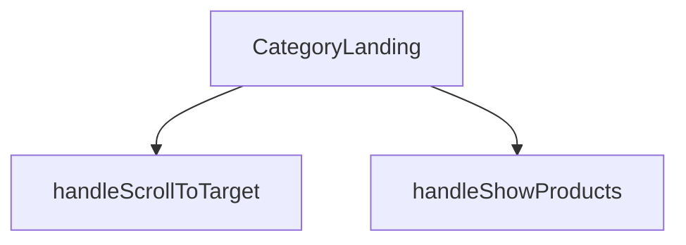

## Genel Bakış
Bu modül, Venthub HVAC platformunda belirli bir ürün kategorisi için landing page (karşılama sayfası) oluşturur. Kategori adı, ürün listesi ve alt kategori yapısı gibi verileri alarak kullanıcıya düzenli bir arayüz sunar ve temel sayfa içi gezinme etkileşimlerini yönetir.

## Fonksiyon Grupları
### Ana Sayfa Bileşeni
Kategori, ürün ve alt kategori verilerini alarak sayfanın temel yapısını ve tüm arayüzünü render eden merkezi React bileşenidir.
- CategoryLanding

### Kullanıcı Etkileşim İşleyicileri
Sayfa içindeki kullanıcı eylemlerine yanıt vererek belirli bölümlere kaydırma ve ürün listesinin görünürlüğünü değiştirme gibi navigasyon ve görüntüleme mantığını yöneten yardımcı işlevlerdir.
- handleScrollToTarget, handleShowProducts

---

## AXIOMS – Mimari Varsayımlar
Bu modül, bir kategori landing sayfasını render eden bir React bileşenidir. Doğru çalışması için aşağıdaki veri yapılarının ve koşulların var olması gerekir.

[Aksiyom 1]: Eğer `category` parametresi `null` veya `undefined` ise, bileşen ana içeriği render edemez ve bir hata durumuna geçer.
[Aksiyom 2]: Eğer `category` nesnesi geçerli bir `name` alanı içermiyorsa, sayfa başlığı boş veya tanımsız görünür.
[Aksiyom 3]: Eğer `products` boş bir dizi (`[]`) ise, "Ürün bulunamadı" gibi bir durum mesajı gösterilir ve ürün listesi bölümü boş render edilir.
[Aksiyom 4]: Eğer `subCategories` parametresi `null` veya `undefined` olarak传递 edilirse bileşen hata verir, çünkü varsayılan değeri (`[]`) sadece parametre hiç gönderilmediğinde geçerlidir.
[Aksiyom 5]: Eğer `handleScrollToTarget` fonksiyonu geçerli olmayan bir `targetId` (sayfada var olmayan bir ID) ile çağrılırsa, kaydırma işlemi gerçekleştirilmez.
[Aksiyom 6]: Eğer `handleShowProducts` çağrıldığında ilgili "ürünler" bölümü sayfada mevcut değilse, kaydırma işlemi başarısız olur.

---

## FONKSİYON DETAYLARI

### CategoryLanding
**Ne yapar**: Bu fonksiyon, bir kategori sayfasının ana görünümünü oluşturan React functional component'idir. Kategori bilgilerini, alt kategorileri ve ürün listesini alarak ilgili sayfayı render eder.
**Nasıl yapar**: `React.FC<CategoryLandingProps>` tipinde bir React component'idir. Fonksiyon, gelen props'ları (category, products, subCategories) işleyerek JSX ile kategori landing sayfasının yapısını döndürür.
**Parametreler**:
- `category`: CategoryLandingProps tipinde (özel tip) — Görüntülenecek ana kategori nesnesini temsil eder. Kategori adı, açıklaması gibi bilgileri içerir.
- `products`: CategoryLandingProps tipinde (özel tip) — Bu kategoriye ait ürün listesini barındıran dizi. Her bir ürün nesnesi product detaylarını tutar.
- `subCategories`: CategoryLandingProps tipinde (özel tip, opsiyonel) — Kategorinin alt kategorilerini içeren dizi. Varsayılan değeri boş dizi `[]`'dir.
**Dönüş**: JSX elementi döndürür. Sayfanın tüm görsel yapısını ve mantığını içeren React bileşenini render eder.

### handleScrollToTarget
**Ne yapar**: Verilen bir HTML element ID'sine (targetId) sahip sayfadaki hedef elemana yumuşak kaydırma (smooth scroll) işlemi başlatır.
**Nasıl yapar**: Parametre olarak bir `targetId` string'i alır. `document.getElementById` metoduyla bu ID'ye sahip DOM elementini bulur ve `scrollIntoView` methodunu çağırarak sayfayı o elemana kaydırır. Varsayılan olarak yumuşak kaydırma davranışı (`behavior: 'smooth'`) kullanılır.
**Parametreler**:
- `targetId`: string — Kaydırma işleminin hedefi olacak HTML elementinin `id` örneği. Örneğin `'products-anchor'`.
**Dönüş**: Fonksiyon herhangi bir değer döndürmez (`void`). Eylemi doğrudan tarayıcı penceresindeki kaydırma durumunu değiştirerek执行 eder.

### handleShowProducts
**Ne yapar**: Ürün listesini gösteren bölümü görünür hale getirir ve ardından sayfayı bu bölümün bulunduğu ankere kaydırarak kullanıcının ürünlere odaklanmasını sağlar.
**Nasıl yapar**: Bu bir event handler fonksiyonudur. İçerisinde `setShowProducts(true)` çağrısı yaparak durum değişkenini günceller (muhtemelen `use useState` hook'undan gelen bir state). Ardından `setTimeout` ile kısa bir gecikme (100ms) sonrası `handleScrollToTarget` fonksiyonunu `'products-anchor'` parametresiyle çağırarak sayfayı ilgili bölüme kaydırır. Gecikme, DOM'un güncellenmesine zaman tanımak için kullanılır.
**Parametreler**: Parametre almaz.
**Dönüş**: Fonksiyon herhangi bir değer döndürmez (`void`). Yan etkileri (durum güncelleme ve kaydırma) vardır.

---

## İTHALATLAR (IMPORTS)
- import: ../../hooks/useCategoryViewModel::useCategoryViewModel
- import: ../../hooks/useLocalizedRoutes::useLocalizedRoutes
- import: ../../i18n/I18nProvider::useI18n
- import: ../../lib/type-converters::DomainCategory
- import: ../../lib/type-converters::type DomainProduct
- import: @/components/ProductCard::ProductCard
- import: @/components/category/EnhancedNeedsWizard::EnhancedNeedsWizard
- import: @/components/navigation/Breadcrumb::Breadcrumb
- import: lucide-react::Info
- import: next/image::Image
- import: react::React
- import: react::useEffect
- import: react::useRef
- import: react::useState

---

## INTERFACES

### CategoryLandingProps
- `category: DomainCategory`
- `products: DomainProduct[]`
- `subCategories?: DomainCategory[]`

---

## AST POINTERS

### [N1_NASIL] AST Pointer: CategoryLandingView.tsx::CategoryLanding
- **params**: (category, products, subCategories = [])
- **ic_degiskenler**:
  - `t` — useI18n hook'undan gelen çeviri fonksiyonu, metinlerin lokalizasyonu için kullanılır
  - `Routes` — useLocalizedRoutes hook'undan gelen lokalize rota fonksiyonları, kategori URL'lerini oluşturmak için kullanılır
  - `wrapCategory` — useCategoryViewModel hook'undan gelen fonksiyon, ham kategori verisini view model'e dönüştürmek için kullanılır
  - `showProducts` — Ürünlerin gösterilip gösterilmeyeceğini kontrol eden boolean state
  - `activeFilter` — Ürün filtreleme durumunu tutan string state ("all" veya "quiet")
  - `wizardOpen` — EnhancedNeedsWizard'ın açık olup olmadığını kontrol eden boolean state
  - `disableAnimation` — İlk yüklemede animasyonları devre dışı bırakan boolean state
  - `productListRef` — Ürün listesi div'ine referans veren useRef nesnesi
  - `vm` — wrapCategory(category) ile oluşturulmuş ana kategorinin view model'i
  - `parentVm` — wrapCategory(subCategories.find(...)) ile oluşturulmuş üst kategorinin view model'i (eğer varsa)
  - `isAirCurtain` — Kategorinin "air-curtains" olup olmadığını kontrol eden boolean
  - `isSilentFan` — Kategorinin "quiet-duct-fans" olup olmadığını kontrol eden boolean
  - `isDehumidifier` — Kategorinin "dehumidifiers" olup olmadığını kontrol eden boolean
  - `breadcrumbItems` — Breadcrumb navigasyonu için dizi, t() ile çevrilmiş label'lar ve href'ler içerir
  - `heroImage` — Kategori görseli veya varsayılan görsel yolu
  - `filteredProducts` — activeFilter durumuna göre filtrelenmiş ürünler dizisi
- **Dönüş**: React.FC<CategoryLandingProps> (JSX döndürür)

### [N2_NASIL] AST Pointer: CategoryLandingView.tsx::useEffectCallback
- **params**: () (parametre yok)
- **ic_degiskenler**:
  - `animTimer` — 300ms sonra disableAnimation'ı false yapacak timeout nesnesi
- **Dönüş**: clearTimeout(animTimer) yapan cleanup fonksiyonu

### [N3_NASIL] AST Pointer: CategoryLandingView.tsx::handleScrollToTarget
- **params**: (targetId: string)
- **ic_degiskenler**:
  - `anchor` — document.getElementById(targetId) ile bulunan DOM elementi
- **Dönüş**: yok (void)

### [N4_NASIL] AST Pointer: CategoryLandingView.tsx::handleShowProducts
- **params**: () (parametre yok)
- **ic_degiskenler**: (yok, sadece setShowProducts ve handleScrollToTarget çağrılır)
- **Dönüş**: yok (void)

### [N5_NASIL] AST Pointer: CategoryLandingView.tsx::filterProducts
- **params**: (p: DomainProduct)
- **ic_degiskenler**: (yok, sadece parametre ve outer scope değişkeni activeFilter kullanılır)
- **Dönüş**: boolean (ürünün filtreleme durumuna göre true/false)

### [N6_NASIL] AST Pointer: CategoryLandingView.tsx::mapButton
- **params**: (f) — f nesnesi { key: string, label: string } yapısındadır
- **ic_degiskenler**: (yok, sadece parametre ve outer scope değişkenleri activeFilter, setActiveFilter kullanılır)
- **Dönüş**: JSX (<button> elementi)

### [N7_NASIL] AST Pointer: CategoryLandingView.tsx::mapProduct
- **params**: (p) — p DomainProduct tipindedir
- **ic_degiskenler**: (yok, sadece parametre kullanılır)
- **Dönüş**: JSX (<ProductCard> elementi)

---

## MERMAID CALL GRAPH

## NODE ID STANDARD

  file: src\views\category\CategoryLandingView.tsx
  function: src\views\category\CategoryLandingView.tsx::CategoryLanding
  function: src\views\category\CategoryLandingView.tsx::handleScrollToTarget
  function: src\views\category\CategoryLandingView.tsx::handleShowProducts

---

## DISA AKTARILANLAR (EXPORTS)
  export: CategoryLanding

---

## STİL TOKENLERİ

### Arbitrary Değerler (token'a geçirilmemiş)
Yok — tüm stiller token'a geçirilmiş. ✅

### Kullanılan Token'lar (zaten token'a geçirilmiş)
- `rounded-hvac-3xl`

### Tailwind Sınıf Özeti
- **Renkler:** `bg-gradient-to-l`, `bg-primary-navy`, `bg-primary-navy/5`, `bg-secondary-blue/5`, `bg-slate-100`, `bg-slate-50`, `bg-slate-900`, `bg-white`, `border-16`, `border-2`, `border-b`, `border-primary-navy/10`, `border-slate-100`, `border-slate-200`, `border-white`
- **Layout:** `absolute`, `flex`, `flex-col`, `flex-wrap`, `from-secondary-blue/10`, `gap-16`, `gap-2`, `gap-3`, `gap-4`, `gap-8`, `grid`, `grid-cols-1`, `grid-cols-2`, `h-full`, `items-center`
- **Varyant/Responsive:** `:`, `active:`, `group-hover:`, `hover:`, `lg:`, `md:`, `sm:`, `xl:` önekleri
- **Yardımcı Sınıflar:** `${activeFilter`, `${disableAnimation`, `${showProducts`, `-inset-10`, `:`, `===`, `active:scale-95`, `animate-fadeIn`, `aspect-square`, `blur-3xl`, `border`, `duration-500`, `duration-hvac-glacial`, `ease-in-out`, `f.key`