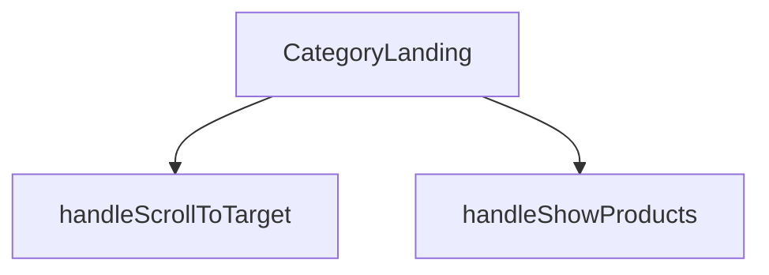

## Genel Bakış
Bu modül, Venthub HVAC platformunda belirli bir ürün kategorisinin ana sayfasını (landing page) oluşturan React bileşenidir. Kategori bilgileri, ilgili ürünler ve alt kategori yapısını alarak kullanıcıya düzenli bir arayüz sunar ve temel sayfa içi gezinme etkileşimlerini yönetir. Modül, bir kategori sayfasının görünüm ve akışını merkezi olarak kontrol eder.

## Fonksiyon Grupları
### Ana Sayfa Bileşeni
Kategori, ürün ve alt kategori verilerini alarak sayfanın temel yapısını ve tüm arayüzünü render eden merkezi React bileşenidir.
- CategoryLanding

### Kullanıcı Etkileşim İşleyicileri
Sayfa içindeki kullanıcı aksiyonlarına yanıt vererek belirli bölümlere kaydırma ve ürün listesinin görünürlüğünü değiştirme gibi navigasyon ve görüntüleme mantığını yöneten yardımcı işlevlerdir.
- handleScrollToTarget, handleShowProducts

---

## AXIOMS – Mimari Varsayımlar
- Bu modül davranışsal mantık içermez (salt veri / konfigürasyon / tip tanımı).
- [Aksiyom 1]: Modülün dışa açtığı yapı (anahtar kümesi / şema) bir sözleşmedir; tüketiciler bu sabit yapıya bağlıdır — kırıcı değişiklik tüm tüketicileri etkiler.
- [Aksiyom 2]: Bir öğe ekleme/çıkarma yapısal-uyumlu olmalı; ilgili tipler ve seçiciler aynı commit'te güncel tutulmalıdır.

---

## FONKSİYON DETAYLARI

### CategoryLanding
**Ne yapar**: Bu fonksiyon, bir kategori sayfasının ana görünümünü oluşturan React functional component'idir. Kategori bilgilerini, alt kategorileri ve ürün listesini alarak ilgili sayfayı render eder.
**Nasıl yapar**: `React.FC<CategoryLandingProps>` tipinde bir React component'idir. Fonksiyon, gelen props'ları (category, products, subCategories) işleyerek JSX ile kategori landing sayfasının yapısını döndürür.
**Parametreler**:
- `category`: CategoryLandingProps tipinde (özel tip) — Görüntülenecek ana kategori nesnesini temsil eder. Kategori adı, açıklaması gibi bilgileri içerir.
- `products`: CategoryLandingProps tipinde (özel tip) — Bu kategoriye ait ürün listesini barındıran dizi. Her bir ürün nesnesi product detaylarını tutar.
- `subCategories`: CategoryLandingProps tipinde (özel tip, opsiyonel) — Kategorinin alt kategorilerini içeren dizi. Varsayılan değeri boş dizi `[]`'dir.
**Dönüş**: JSX elementi döndürür. Sayfanın tüm görsel yapısını ve mantığını içeren React bileşenini render eder.

### handleScrollToTarget
**Ne yapar**: Verilen bir HTML element ID'sine (targetId) sahip sayfadaki hedef elemana yumuşak kaydırma (smooth scroll) işlemi başlatır.
**Nasıl yapar**: Parametre olarak bir `targetId` string'i alır. `document.getElementById` metoduyla bu ID'ye sahip DOM elementini bulur ve `scrollIntoView` methodunu çağırarak sayfayı o elemana kaydırır. Varsayılan olarak yumuşak kaydırma davranışı (`behavior: 'smooth'`) kullanılır.
**Parametreler**:
- `targetId`: string — Kaydırma işleminin hedefi olacak HTML elementinin `id` örneği. Örneğin `'products-anchor'`.
**Dönüş**: Fonksiyon herhangi bir değer döndürmez (`void`). Eylemi doğrudan tarayıcı penceresindeki kaydırma durumunu değiştirerek执行 eder.

### handleShowProducts
**Ne yapar**: Ürün listesini gösteren bölümü görünür hale getirir ve ardından sayfayı bu bölümün bulunduğu ankere kaydırarak kullanıcının ürünlere odaklanmasını sağlar.
**Nasıl yapar**: Bu bir event handler fonksiyonudur. İçerisinde `setShowProducts(true)` çağrısı yaparak durum değişkenini günceller (muhtemelen `use useState` hook'undan gelen bir state). Ardından `setTimeout` ile kısa bir gecikme (100ms) sonrası `handleScrollToTarget` fonksiyonunu `'products-anchor'` parametresiyle çağırarak sayfayı ilgili bölüme kaydırır. Gecikme, DOM'un güncellenmesine zaman tanımak için kullanılır.
**Parametreler**: Parametre almaz.
**Dönüş**: Fonksiyon herhangi bir değer döndürmez (`void`). Yan etkileri (durum güncelleme ve kaydırma) vardır.

---

## İTHALATLAR (IMPORTS)
- import: ../../hooks/useCategoryViewModel::useCategoryViewModel
- import: ../../i18n/I18nProvider::useI18n
- import: ../../lib/type-converters::DomainCategory
- import: ../../lib/type-converters::type DomainProduct
- import: ../../utils/routes::Routes
- import: @/components/ProductCard::ProductCard
- import: @/components/category/EnhancedNeedsWizard::EnhancedNeedsWizard
- import: @/components/navigation/Breadcrumb::Breadcrumb
- import: lucide-react::Info
- import: next/image::Image
- import: react::React
- import: react::useEffect
- import: react::useRef
- import: react::useState

---

## INTERFACES

### CategoryLandingProps
- `category: DomainCategory`
- `products: DomainProduct[]`
- `subCategories?: DomainCategory[]`

---

## AST POINTERS

### [N1_NASIL] AST Pointer: CategoryLandingView.tsx::CategoryLanding
- **params**: (category, products, subCategories = [])
- **ic_degiskenler**:
  - `t` — useI18n hook'undan gelen çeviri fonksiyonu, UI metinlerini uluslararasılaştırmak için kullanılır.
  - `wrapCategory` — useCategoryViewModel hook'undan gelen, category nesnesini view model formatına dönüştüren fonksiyon.
  - `showProducts` — Ürün listesinin gösterilip gizleneceğini kontrol eden state (boolean).
  - `activeFilter` — Ürün listesinde aktif olan filtre değerini tutan state (varsayılan: 'all').
  - `wizardOpen` — EnhancedNeedsWizard bileşeninin açık/kapalı durumunu kontrol eden state (boolean).
  - `disableAnimation` — Sayfa yükleme animasyonunu başlangıçta devre dışı bırakmak için kullanılan state, 300ms sonra false olur.
  - `productListRef` — Ürün listesinin DOM elementine referans vermek için useRef, scroll kontrolü için kullanılır.
  - `vm` — `wrapCategory(category)` çağrısıyla elde edilen, ana kategorinin view modeli.
  - `parentVm` — `wrapCategory(subCategories.find(...))` ile bulunan üst kategorinin view modeli (yoksa undefined).
  - `isAirCurtain` — `category.slug === 'air-curtains'` kontrolüyle belirlenen, hava perdesi kategorisi olup olmadığının boolean değeri.
  - `isSilentFan` — `category.slug === 'quiet-duct-fans'` kontrolüyle belirlenen, sessiz fan kategorisi olup olmadığının boolean değeri.
  - `isDehumidifier` — `category.slug === 'dehumidifiers'` kontrolüyle belirlenen, nem alıcı kategorisi olup olmadığının boolean değeri.
  - `breadcrumbItems` — Breadcrumb bileşenine geçirilecek, navigasyon yolunu temsil eden nesne dizisi.
  - `heroImage` — `category.image_url` veya varsayılan bir görsel yolunu içeren string, hero bölümünde gösterilir.
  - `filteredProducts` — `products` dizisinin `activeFilter` durumuna göre filtrelenmiş hali (DomainProduct[]).
- **Dönüş**: React.ReactNode (JSX). Ana sayfa yapısını, hero bölümünü, kategoriye özel içerikleri, filtrelenmiş ürün listesini ve alt bileşenleri render eder.

### [N2_NASIL] AST Pointer: CategoryLandingView.tsx::handleScrollToTarget
- **params**: (targetId: string)
- **ic_degiskenler**:
  - `anchor` — `document.getElementById(targetId)` ile bulunan, verilen ID'ye sahip DOM elementi (HTMLElement | null).
- **Dönüş**: yok. Sayfayı belirli bir ID'ye sahip elemente kaydırır (smooth scroll).

### [N3_NASIL] AST Pointer: CategoryLandingView.tsx::handleShowProducts
- **params**: (yok)
- **ic_degiskenler**: (yok)
- **Dönüş**: yok. Ürün listesinin gösterilmesini sağlar (`setShowProducts(true)`) ve 100ms gecikmeyle `handleScrollToTarget`'i çağırarak products-anchor'a kaydırır.

### [N4_NASIL] AST Pointer: CategoryLandingView.tsx::filteredProducts_callback
- **params**: (p: DomainProduct)
- **ic_degiskenler**: (yok)
- **Dönüş**: boolean. `activeFilter` durumuna göre `p` ürününün filtrelenip filtrelenmeyeceğini belirler.

### [N5_NASIL] AST Pointer: CategoryLandingView.tsx::filterButton_map_callback
- **params**: (f)
- **ic_degiskenler**:
  - `f` — Filtre seçeneklerinden birini temsil eden nesne, `key` ve `label` özellikleri taşır.
- **Dönüş**: JSX (button elementi). Her filtre seçeneği için bir buton döner, tıklanırsa `setActiveFilter` çağrılır.

### [N6_NASIL] AST Pointer: CategoryLandingView.tsx::productCard_map_callback
- **params**: (p)
- **ic_degiskenler**: (yok)
- **Dönüş**: JSX (ProductCard bileşeni). Her `filteredProducts` elemanı için bir ProductCard döner.

---

## MERMAID CALL GRAPH

## NODE ID STANDARD

  file: src\views\category\CategoryLandingView.tsx
  function: src\views\category\CategoryLandingView.tsx::CategoryLanding
  function: src\views\category\CategoryLandingView.tsx::handleScrollToTarget
  function: src\views\category\CategoryLandingView.tsx::handleShowProducts

---

## DISA AKTARILANLAR (EXPORTS)
  export: CategoryLanding

---

## STİL TOKENLERİ

### Arbitrary Değerler (token'a geçirilmemiş)
Yok — tüm stiller token'a geçirilmiş. ✅

### Kullanılan Token'lar (zaten token'a geçirilmiş)
- `rounded-hvac-3xl`

### Tailwind Sınıf Özeti
- **Renkler:** `bg-gradient-to-l`, `bg-primary-navy`, `bg-primary-navy/5`, `bg-secondary-blue/5`, `bg-slate-100`, `bg-slate-50`, `bg-slate-900`, `bg-white`, `border-16`, `border-2`, `border-b`, `border-primary-navy/10`, `border-slate-100`, `border-slate-200`, `border-white`
- **Layout:** `absolute`, `flex`, `flex-col`, `flex-wrap`, `from-secondary-blue/10`, `gap-16`, `gap-2`, `gap-3`, `gap-4`, `gap-8`, `grid`, `grid-cols-1`, `grid-cols-2`, `h-full`, `items-center`
- **Varyant/Responsive:** `:`, `active:`, `group-hover:`, `hover:`, `lg:`, `md:`, `sm:`, `xl:` önekleri
- **Yardımcı Sınıflar:** `${activeFilter`, `${disableAnimation`, `${showProducts`, `-inset-10`, `:`, `===`, `active:scale-95`, `animate-fadeIn`, `aspect-square`, `blur-3xl`, `border`, `duration-500`, `duration-hvac-glacial`, `ease-in-out`, `f.key`