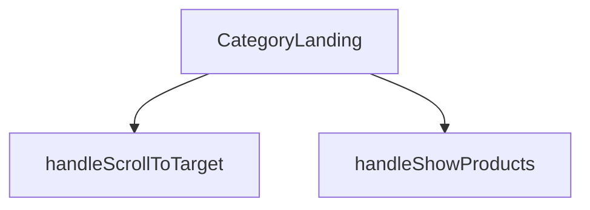

## Genel Bakış
Bu modül, HVAC ürün platformunun bir kategori sayfasının ana görünümünü ve kullanıcı etkileşimlerini yönetir. Kategori verileri, ürün listesi ve alt kategori yapısını alarak kullanıcıya düzenli bir arayüz sunar ve sayfa içi gezinme fonksiyonlarını sağlar.

## Fonksiyon Grupları
### Ana Sayfa Bileşeni
Kategori, ürün ve alt kategori verilerini kullanarak sayfanın tüm ana arayüzünü render eden temel React bileşenini temsil eder.
- CategoryLanding

### Kullanıcı Etkileşim İşleyicileri
Sayfa içindeki kullanıcı aksiyonlarını yönetir, belirli bir bölüme kaydırma ve ürün listesini gösterme gibi navigasyon ve görüntüleme taleplerini işler.
- handleScrollToTarget, handleShowProducts

---

## AXIOMS – Mimari Varsayımlar

Bu modül, kategori ana sayfası görünümünü oluşturan bir React bileşenidir. Doğru çalışması için aşağıdaki mimari varsayımlar geçerlidir.

[Aksiyom 1]: Eğer `category` prop'u sağlanmazsa veya geçerli bir kategori nesnesi içermiyorsa, bileşen kategori adını, açıklamasını veya ilgili diğer bilgileri doğru şekilde görüntüleyemez ve sayfa yapısı bozulabilir.

[Aksiyom 2]: Eğer `products` prop'u sağlanmazsa veya geçerli bir dizi içermiyorsa, bileşen ürün listesini render edemez ve kategori sayfasında ürün bölümü boş veya hatalı görünür.

[Aksiyom 3]: Eğer `subCategories` prop'u sağlanmazsa (varsayılan olarak boş dizi `[]` kullanılır), bileşen alt kategori bölümünü göstermez veya alt kategori navigasyonu çalışmaz; bu durum normal ve beklenen bir durumdur.

[Aksiyom 4]: Eğer `handleScrollToTarget` fonksiyonu bir `targetId` parametresi almadan çağrılırsa veya geçersiz bir `targetId` verilirse, fonksiyon ilgili sayfa bölümüne kaydırma işlemini gerçekleştiremez ve kullanıcı deneyimi olumsuz etkilenir.

[Aksiyom 5]: Eğer `handleShowProducts` fonksiyonu çağrıldığında sayfada görüntülenecek ürün verisi (`products`) mevcut değilse, fonksiyon ürün listesini gösterme işlemini başlatamaz veya boş bir liste görüntüler.

[Aksiyom 6]: Bileşen, `category` ve `products` verilerinin asenkron olarak yüklenmesini bekleyebilir; bu veriler henüz hazır değilken bileşenin render edilmesi durumunda geçici bir yükleme durumu (loading) veya boş bir arayüz gösterilmelidir (bu durum bileşen içinde yönetilmelidir).

[Aksiyom 7]: `handleScrollToTarget` ve `handleShowProducts` fonksiyonları, React bileşeninin yaşam döngüsü içinde uygun bağlamlarda (örneğin, bir buton tıklaması veya belirli bir koşul gerçekleştiğinde) tetiklenmelidir; aksi takdirde kullanıcı etkileşimleri beklenen sonucu vermez.

---

## FONKSİYON DETAYLARI

### CategoryLanding
**Ne yapar**: Bu fonksiyon, bir kategori sayfasının ana görünümünü oluşturan React functional component'idir. Kategori bilgilerini, alt kategorileri ve ürün listesini alarak ilgili sayfayı render eder.
**Nasıl yapar**: `React.FC<CategoryLandingProps>` tipinde bir React component'idir. Fonksiyon, gelen props'ları (category, products, subCategories) işleyerek JSX ile kategori landing sayfasının yapısını döndürür.
**Parametreler**:
- `category`: CategoryLandingProps tipinde (özel tip) — Görüntülenecek ana kategori nesnesini temsil eder. Kategori adı, açıklaması gibi bilgileri içerir.
- `products`: CategoryLandingProps tipinde (özel tip) — Bu kategoriye ait ürün listesini barındıran dizi. Her bir ürün nesnesi product detaylarını tutar.
- `subCategories`: CategoryLandingProps tipinde (özel tip, opsiyonel) — Kategorinin alt kategorilerini içeren dizi. Varsayılan değeri boş dizi `[]`'dir.
**Dönüş**: JSX elementi döndürür. Sayfanın tüm görsel yapısını ve mantığını içeren React bileşenini render eder.

### handleScrollToTarget
**Ne yapar**: Verilen bir HTML element ID'sine (targetId) sahip sayfadaki hedef elemana yumuşak kaydırma (smooth scroll) işlemi başlatır.
**Nasıl yapar**: Parametre olarak bir `targetId` string'i alır. `document.getElementById` metoduyla bu ID'ye sahip DOM elementini bulur ve `scrollIntoView` methodunu çağırarak sayfayı o elemana kaydırır. Varsayılan olarak yumuşak kaydırma davranışı (`behavior: 'smooth'`) kullanılır.
**Parametreler**:
- `targetId`: string — Kaydırma işleminin hedefi olacak HTML elementinin `id` örneği. Örneğin `'products-anchor'`.
**Dönüş**: Fonksiyon herhangi bir değer döndürmez (`void`). Eylemi doğrudan tarayıcı penceresindeki kaydırma durumunu değiştirerek执行 eder.

### handleShowProducts
**Ne yapar**: Ürün listesini gösteren bölümü görünür hale getirir ve ardından sayfayı bu bölümün bulunduğu ankere kaydırarak kullanıcının ürünlere odaklanmasını sağlar.
**Nasıl yapar**: Bu bir event handler fonksiyonudur. İçerisinde `setShowProducts(true)` çağrısı yaparak durum değişkenini günceller (muhtemelen `use useState` hook'undan gelen bir state). Ardından `setTimeout` ile kısa bir gecikme (100ms) sonrası `handleScrollToTarget` fonksiyonunu `'products-anchor'` parametresiyle çağırarak sayfayı ilgili bölüme kaydırır. Gecikme, DOM'un güncellenmesine zaman tanımak için kullanılır.
**Parametreler**: Parametre almaz.
**Dönüş**: Fonksiyon herhangi bir değer döndürmez (`void`). Yan etkileri (durum güncelleme ve kaydırma) vardır.

---

## INTERFACES

### CategoryLandingProps
- `category: DomainCategory`
- `products: DomainProduct[]`
- `subCategories?: DomainCategory[]`

---

## AST POINTERS

### [N1_NASIL] AST Pointer: CategoryLandingView.tsx::CategoryLanding
- **params**: `(category, products, subCategories = [])`
  - `category` — ana kategori nesnesi (DomainCategory), slug, parent_id, image_url içerir
  - `products` — bu kategorideki ürünlerin dizisi (DomainProduct[])
  - `subCategories` — alt kategoriler dizisi, varsayılan boş dizi
- **ic_degiskenler**:
  - `wrapCategory` — `useCategoryViewModel()` hook'undan dönen kategori view model sarmalama fonksiyonu
  - `showProducts` — `useState(false)`, ürün listesinin gösterilip gizleneceğini kontrol eden boolean state
  - `activeFilter` — `useState<string>('all')`, ürün filtreleme durumu ('all' veya 'quiet')
  - `wizardOpen` — `useState(false)`, needs wizard modalının açık/kapalı durumunu tutan state
  - `disableAnimation` — `useState(true)`, ilk yüklemede animasyonları devre dışı bırakan boolean, 300ms sonra false olur
  - `productListRef` — `useRef<HTMLDivElement>(null)`, ürün listesi div'ine DOM erişimi sağlayan ref
  - `vm` — `wrapCategory(category)`, ana kategorinin view model karşılığı (displayName, description, slug içerir)
  - `parentVm` — `wrapCategory(subCategories.find(s => s.id === category.parent_id))`, üst kategorinin view model karşılığı (bulunamazsa undefined)
  - `isAirCurtain` — `category.slug === 'air-curtains'` karşılaştırması, boolean, hava perdesi kategorisi olup olmadığını belirler
  - `isSilentFan` — `category.slug === 'quiet-duct-fans'` karşılaştırması, boolean, sessiz fan kategorisi olup olmadığını belirler
  - `isDehumidifier` — `category.slug === 'dehumidifiers'` karşılaştırması, boolean, nem alıcı kategorisi olup olmadığını belirler
  - `breadcrumbItems` — breadcrumb öğeleri dizisi, Ana Sayfa + (varsa üst kategori) + mevcut kategori
  - `heroImage` — `category.image_url || '/images/industrial_HVAC_air_handling_unit_warehouse.jpg'`, hero bölümündeki görselin URL'i
  - `filteredProducts` — `products.filter(...)`, activeFilter'a göre filtrelenmiş DomainProduct dizisi
- **Dönüş**: JSX — kategori landing sayfasının tam render'ı (hero, içerik bölümleri, ürün listesi, CTA, wizard)

---

### [N2_NASIL] AST Pointer: CategoryLandingView.tsx::useEffect (animasyon timer)
- **params**: (yok)
- **ic_degiskenler**:
  - `animTimer` — `setTimeout(() => setDisableAnimation(false), 300)` sonucu, 300ms sonra animasyonları etkinleştiren timer ID'si
- **Dönüş**: cleanup fonksiyonu — `clearTimeout(animTimer)` ile timer'ı temizler

---

### [N3_NASIL] AST Pointer: CategoryLandingView.tsx::handleScrollToTarget
- **params**: `(targetId: string)`
  - `targetId` — kaydırılacak hedef DOM elementinin id niteliği (ör: 'products-anchor', 'landing-content')
- **ic_degiskenler**:
  - `anchor` — `document.getElementById(targetId)` ile bulunan DOM elementi, bulunamazsa null
- **Dönüş**: yok — elementi bulursa `scrollIntoView({ behavior: 'smooth' })` ile yumuşak kaydırma yapar

---

### [N4_NASIL] AST Pointer: CategoryLandingView.tsx::handleShowProducts
- **params**: (yok)
- **ic_degiskenler**: (yok — doğrudan setShowProducts ve handleScrollToTarget çağırır)
- **Dönüş**: yok — `setShowProducts(true)` ile ürün listesini gösterir, 100ms sonra `handleScrollToTarget('products-anchor')` ile ürünlere kaydırır

---

### [N5_NASIL] AST Pointer: CategoryLandingView.tsx::filteredProducts (filter callback)
- **params**: `(p: DomainProduct)`
  - `p` — filtrelenen DomainProduct nesnesi, `noise_level` alanına erişilir
- **ic_degiskenler**: (yok)
- **Dönüş**: boolean — `activeFilter === 'all'` ise true; `activeFilter === 'quiet'` ise `Number(p.noise_level) || 100 <= 50` koşulu; diğer durumlarda true

---

### [N6_NASIL] AST Pointer: CategoryLandingView.tsx::filter button render (map callback)
- **params**: `(f)`
  - `f` — `{ key: string, label: string }` yapısındaki filtre nesnesi (ör: `{ key: 'all', label: 'Tüm Modeller' }`)
- **ic_degiskenler**: (yok)
- **Dönüş**: JSX — `button` elementi, `onClick` ile `setActiveFilter(f.key)` çağırır, aktif filtreye göre farklı CSS sınıfları uygular

---

### [N7_NASIL] AST Pointer: CategoryLandingView.tsx::product render (map callback)
- **params**: `(p)`
  - `p` — haritalanan DomainProduct nesnesi, `id` alanına erişilir
- **ic_degiskenler**: (yok)
- **Dönüş**: JSX — `ProductCard` component'i, `key={p.id}`, `product={p}`, `layout="grid"` props'ları ile render edilir

---

## MERMAID CALL GRAPH

## NODE ID STANDARD

  file: src\views\category\CategoryLandingView.tsx
  function: src\views\category\CategoryLandingView.tsx::CategoryLanding
  function: src\views\category\CategoryLandingView.tsx::handleScrollToTarget
  function: src\views\category\CategoryLandingView.tsx::handleShowProducts

---

## DISA AKTARILANLAR (EXPORTS)
  export: CategoryLanding

---

## STİL TOKENLERİ

### Arbitrary Değerler (token'a geçirilmemiş)
Yok — tüm stiller token'a geçirilmiş. ✅

### Kullanılan Token'lar (zaten token'a geçirilmiş)
- `rounded-hvac-3xl`

### Tailwind Sınıf Özeti
- **Renkler:** `bg-gradient-to-l`, `bg-primary-navy`, `bg-primary-navy/5`, `bg-secondary-blue/5`, `bg-slate-100`, `bg-slate-50`, `bg-slate-900`, `bg-white`, `border-16`, `border-2`, `border-b`, `border-primary-navy/10`, `border-slate-100`, `border-slate-200`, `border-white`
- **Layout:** `absolute`, `flex`, `flex-col`, `flex-wrap`, `from-secondary-blue/10`, `gap-16`, `gap-2`, `gap-3`, `gap-4`, `gap-8`, `grid`, `grid-cols-1`, `grid-cols-2`, `h-full`, `items-center`
- **Varyant/Responsive:** `:`, `active:`, `group-hover:`, `hover:`, `lg:`, `md:`, `sm:`, `xl:` önekleri
- **Yardımcı Sınıflar:** `${activeFilter`, `${disableAnimation`, `${showProducts`, `-inset-10`, `:`, `===`, `active:scale-95`, `animate-fadeIn`, `aspect-square`, `blur-3xl`, `border`, `duration-500`, `duration-hvac-glacial`, `ease-in-out`, `f.key`