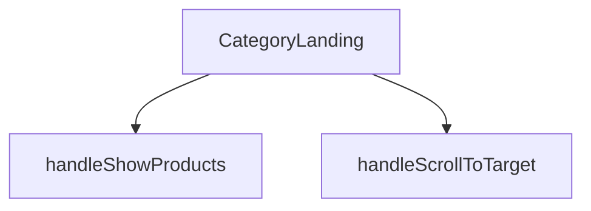

## Genel Bakış
Bu modül, bir kategori iniş sayfasını (landing page) oluşturan bir React bileşenidir. Kategori, aileler ve üst kategori gibi verileri alarak kullanıcı arayüzünü render eder. Ayrıca sayfa içi kaydırma ve ürün listesinin gösterilmesi gibi kullanıcı etkileşimlerini yöneten yardımcı fonksiyonlar içerir.

## Fonksiyon Grupları
### Ana Bileşen
Bu grup, modülün temel render mantığını ve dışarıdan alınan verilerle arayüzü oluşturmayı üstlenir.
- CategoryLanding

### Etkileşim İşleyicileri
Bu grup, kullanıcı etkileşimlerine yanıt veren ve belirli UI davranışlarını tetikleyen fonksiyonları içerir.
- handleScrollToTarget, handleShowProducts

---

## AXIOMS – Mimari Varsayımlar
- Bu modül davranışsal mantık içermez (salt veri / konfigürasyon / tip tanımı).
- [Aksiyom 1]: Modülün dışa açtığı yapı (anahtar kümesi / şema) bir sözleşmedir; tüketiciler bu sabit yapıya bağlıdır — kırıcı değişiklik tüm tüketicileri etkiler.
- [Aksiyom 2]: Bir öğe ekleme/çıkarma yapısal-uyumlu olmalı; ilgili tipler ve seçiciler aynı commit'te güncel tutulmalıdır.

---

## FONKSİYON DETAYLARI

### CategoryLanding
**Ne yapar**: Kategori ana sayfası bileşenidir. Belirli bir kategoriye ait ürün ailelerini ve alt kategorileri görüntülemek için kullanılan React fonksiyonel bileşenidir.
**Nasıl yapar**: Bileşen, aldığı `category`, `families` ve `parentCategory` prop'larını kullanarak kategori sayfasının yapısını oluşturur. Ürünlerin gösterilmesi ve sayfa içi kaydırma gibi etkileşimleri yönetmek için durum değişkenleri ve yardımcı fonksiyonlar içerir.
**Parametreler**:
- category: CategoryLandingProps.category — Görüntülenecek kategori bilgisi. Kesin tip tanımı verilen kaynak dosyada belirtilmemiştir.
- families: CategoryLandingProps.families — Kategoriye ait ürün aileleri listesi. Kesin tip tanımı verilen kaynak dosyada belirtilmemiştir.
- parentCategory: CategoryLandingProps.parentCategory — Üst kategori bilgisi. Kesin tip tanımı verilen kaynak dosyada belirtilmemiştir.
**Dönüş**: React.FC<CategoryLandingProps> — Belirtilen props yapısını alan bir React fonksiyonel bileşeni döndürür.

### handleScrollToTarget
**Ne yapar**: Geliştirildi ancak detay üretilemedi.

### handleShowProducts
**Ne yapar**: Geliştirildi ancak detay üretilemedi.

---

## İTHALATLAR (IMPORTS)
- import: ../../hooks/useCategoryViewModel::useCategoryViewModel
- import: ../../hooks/useLocalizedRoutes::useLocalizedRoutes
- import: ../../i18n/I18nProvider::useI18n
- import: ../../lib/type-converters::DomainCategory
- import: ../../utils/categoryHelpers::getLocalizedCategorySlug
- import: @/components/category/EnhancedNeedsWizard::EnhancedNeedsWizard
- import: @/components/category/SilentFanWizard::SilentFanWizard
- import: @/components/navigation/Breadcrumb::Breadcrumb
- import: @/components/products/FamilyCard::FamilyCard
- import: @/types/ui-models::type { FamilyListItem }
- import: lucide-react::Info
- import: next/image::Image
- import: react::React
- import: react::useEffect
- import: react::useRef
- import: react::useState

---

## INTERFACES

### CategoryLandingProps
- `category: DomainCategory`
- `families: FamilyListItem[]`
- `parentCategory?: DomainCategory | null`

---

## AST POINTERS

### [N1_NASIL] AST Pointer: src/views/category/CategoryLandingView.tsx::CategoryLanding
- **params**: `category`, `families`, `parentCategory`
- **ic_degiskenler**:
  - `t` — `useI18n()` hook'undan gelen çeviri fonksiyonu; metinleri yerelleştirmek için kullanılır
  - `lang` — `useI18n()` hook'undan gelen geçerli dil kodu; slug yerelleştirmede kullanılır
  - `Routes` — `useLocalizedRoutes()` hook'undan gelen rotalar; breadcrumb href'lerinde kullanılır
  - `wrapCategory` — `useCategoryViewModel()` hook'undan gelen fonksiyon; ham kategori nesnesini görünüm modeline dönüştürür
  - `showProducts` — `useState(false)` ile tanımlı boolean; ürün listesinin görünürlüğünü kontrol eder
  - `setShowProducts` — `showProducts` durumunu güncelleyen setter fonksiyonu
  - `wizardOpen` — `useState(false)` ile tanımlı boolean; sihirbaz modalının açık/kapalı durumunu tutar
  - `setWizardOpen` — `wizardOpen` durumunu güncelleyen setter fonksiyonu
  - `disableAnimation` — `useState(true)` ile tanımlı boolean; başlangıçta animasyonu devre dışı tutar, 300ms sonra `false` olur
  - `setDisableAnimation` — `disableAnimation` durumunu güncelleyen setter fonksiyonu
  - `productListRef` — `useRef<HTMLDivElement>(null)` ile oluşturulmuş DOM referansı; ürün listesi div'ine bağlanır
  - `vm` — `wrapCategory(category)` çağrısının sonucu; geçerli kategorinin görünüm modeli (`displayName`, `description` alanlarına sahip)
  - `parentVm` — `wrapCategory(parentCategory ?? undefined)` çağrısının sonucu; üst kategorinin görünüm modeli, breadcrumb'ta kullanılır
  - `isAirCurtain` — `category.slug === 'air-curtains'` karşılaştırmasının boolean sonucu; hava perdesi içeriğini koşullu göstermek için kullanılır
  - `isSilentFan` — `category.slug === 'inline-duct-fans'` karşılaştırmasının boolean sonucu; sessiz fan içeriğini koşullu göstermek için kullanılır
  - `isDehumidifier` — `category.slug === 'dehumidifiers'` karşılaştırmasının boolean sonucu; nem alıcı içeriğini koşullu göstermek için kullanılır
  - `breadcrumbItems` — breadcrumb navigasyonu için dizi; her eleman `label` ve `href` alanlarına sahip, üst kategori varsa araya eklenir
  - `heroImage` — `category.image_url` değeri varsa o, yoksa `'/images/industrial_HVAC_air_handling_unit_warehouse.jpg'` varsayılan görsel yolu
- **Dönüş**: JSX (React.FC<CategoryLandingProps>)

### [N2_NASIL] AST Pointer: src/views/category/CategoryLandingView.tsx::useEffect callback
- **params**: yok
- **ic_degiskenler**:
  - `animTimer` — `setTimeout(() => setDisableAnimation(false), 300)` çağrısının döndürdüğü zamanlayıcı kimliği; temizleme fonksiyonunda `clearTimeout` ile kullanılır
- **Dönüş**: cleanup fonksiyonu (`clearTimeout(animTimer)` çağırır)

### [N3_NASIL] AST Pointer: src/views/category/CategoryLandingView.tsx::handleScrollToTarget
- **params**: `targetId` (string)
- **ic_degiskenler**:
  - `anchor` — `document.getElementById(targetId)` çağrısının sonucu; hedef DOM elemanı veya `null`
- **Dönüş**: yok; `anchor` varsa `scrollIntoView({ behavior: 'smooth' })` çağırarak sayfayı kaydırır

### [N4_NASIL] AST Pointer: src/views/category/CategoryLandingView.tsx::handleShowProducts
- **params**: yok
- **ic_degiskenler**: yok
- **Dönüş**: yok; `setShowProducts(true)` çağırarak ürün listesini görünür yapar, ardından 100ms gecikmeyle `handleScrollToTarget('products-anchor')` çağırarak ürün bölümüne kaydırır

### [N5_NASIL] AST Pointer: src/views/category/CategoryLandingView.tsx::families.map callback
- **params**: `family` (FamilyListItem)
- **ic_degiskenler**: yok
- **Dönüş**: JSX (`<FamilyCard key={family.id} family={family} layout="grid" />`)

---


## MERMAID CALL GRAPH


## NODE ID STANDARD

  file: src\views\category\CategoryLandingView.tsx
  function: src\views\category\CategoryLandingView.tsx::CategoryLanding
  function: src\views\category\CategoryLandingView.tsx::handleScrollToTarget
  function: src\views\category\CategoryLandingView.tsx::handleShowProducts

---

## DISA AKTARILANLAR (EXPORTS)
  export: CategoryLanding

---

## STİL TOKENLERİ

### Arbitrary Değerler (token'a geçirilmemiş)
Yok — tüm stiller token'a geçirilmiş. ✅

### Kullanılan Token'lar (zaten token'a geçirilmiş)
- `rounded-hvac-3xl`

### Tailwind Sınıf Özeti
- **Renkler:** `bg-gradient-to-l`, `bg-primary-navy`, `bg-primary-navy/5`, `bg-secondary-blue/5`, `bg-slate-50`, `bg-slate-900`, `bg-white`, `border-16`, `border-2`, `border-b`, `border-primary-navy/10`, `border-slate-100`, `border-slate-200`, `border-white`, `from-secondary-blue/10`
- **Layout:** `absolute`, `flex`, `flex-col`, `from-secondary-blue/10`, `gap-16`, `gap-3`, `gap-4`, `gap-8`, `grid`, `grid-cols-1`, `grid-cols-2`, `h-full`, `items-center`, `justify-between`, `lg:grid-cols-2`
- **Varyant/Responsive:** `:`, `active:`, `group-hover:`, `hover:`, `lg:`, `md:`, `sm:`, `xl:` önekleri
- **Yardımcı Sınıflar:** `${disableAnimation`, `${showProducts`, `-inset-10`, `:`, `active:scale-95`, `animate-fadeIn`, `aspect-square`, `blur-3xl`, `border`, `content-auto`, `duration-500`, `duration-hvac-glacial`, `ease-in-out`, `font-black`, `font-bold`

## Tasarım Gerekçeleri (kaynaktan BİREBİR)

> Bu bölüm LLM tarafından **yazılmadı**; kaynaktaki işaretli bloklardan
> birebir kopyalandı. Özetlenmesi veya yeniden ifade edilmesi YASAKTIR —
> gerekçenin değeri tam olarak kelimelerindedir.


```text
⭐SESSİZ FAN ANLATISI — TETİKLEYİCİ KATEGORİ DEĞİL **SERİ** (REC-85, Recep kararı 2026-08-28).

Cetvel: `docs/standards/catalog-depth-standard.md` §1.1 (K1.1). Anlatı K1'in yerinde kalır
(kategori sayfası), ama konusu bir SERİ olduğu için tetikleyicisi de seridir.

NİÇİN: bölüm önce `inline-duct-fans` kategorisine bağlıydı; o kategori pasif ve 0 serili,
yani koşul HİÇBİR ZAMAN açılmadı — beş bileşenlik anlatı ve sihirbaz kullanıcıya bir kez
bile görünmedi. Kategoriye (`duct-fans`) taşımak da yanlış olurdu: ölçtüm, o kategoride
Quiet'in yanında 24 sessiz OLMAYAN model var (Lineo düz 7 · Radon 5 · VORT Commercial 7+5).
Doğru bağ, anlatının gerçek konusu olan seridir.

Seri kanonik slug ile aranır; `catalog-integrity` slug-unresolved kolu bu sabiti korur.
```
