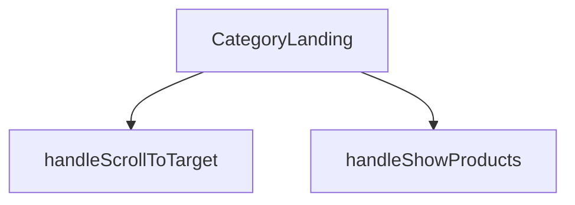

## Genel Bakış
Bu modül, HVAC ürün platformunda bir kategorinin ana landing sayfasını oluşturan React bileşenidir. Kategori bilgilerini, ürün listesini ve alt kategori yapısını alarak kullanıcıya düzenli ve gezilebilir bir arayüz sunar. Modül, sayfa içi kaydırma ve ürün gösterme gibi temel kullanıcı etkileşimlerini yöneterek kategori deneyimini kontrol eder.

## Fonksiyon Grupları
### Ana Sayfa Bileşeni
Kategori, ürün ve alt kategori verilerini bir araya getirerek sayfanın tüm temel yapısını ve ana arayüzünü render eden merkezi React bileşenidir.
- CategoryLanding

### Kullanıcı Etkileşim İşleyicileri
Sayfa içindeki kullanıcı aksiyonlarına yanıt vererek belirli bölümlere kaydırma ve ürün listesinin görünürlüğünü değiştirme gibi navigasyon ve görüntüleme mantığını yöneten yardımcı fonksiyonlardır.
- handleScrollToTarget, handleShowProducts

---

## AXIOMS – Mimari Varsayımlar

Bu modül, bir kategori landing sayfası oluşturan React bileşenidir. Aşağıda fonksiyon imzalarından çıkarılan mimari varsayımlar listelenmektedir.

[Aksiyom 1]: Eğer `category` prop'u `CategoryLanding` bileşenine sağlanmazsa, bileşen doğru şekilde render edilemez ve kategori sayfası eksik kalır. (`category` parametresi zorunludur, varsayılan değeri yoktur.)

[Aksiyom 2]: Eğer `products` prop'u `CategoryLanding` bileşenine sağlanmazsa, bileşende ürün listesi görüntülenemez ve sayfa işlevsiz kalır. (`products` parametresi zorunludur, varsayılan değeri yoktur.)

[Aksiyom 3]: Eğer `subCategories` prop'u sağlanmazsa, bileşen varsayılan olarak boş dizi (`[]`) ile çalışır ve alt kategori gösterimi devre dışı kalır.

[Aksiyom 4]: Eğer `handleScrollToTarget` fonksiyonuna geçilen `targetId` değerine karşılık gelen DOM elementi sayfada mevcut değilse, kaydırma işlemi gerçekleşmez veya beklenmeyen bir davranış oluşur.

[Aksiyom 5]: Eğer `handleShowProducts` fonksiyonu çağrıldığında bileşen iç durumu (state) products verisini içerecek şekilde hazırlanmamışsa, ürün gösterme işlemi düzgün çalışmayabilir.

---

## FONKSİYON DETAYLARI

### CategoryLanding
**Ne yapar**: Bu fonksiyon, bir kategori sayfasının ana görünümünü oluşturan React functional component'idir. Kategori bilgilerini, alt kategorileri ve ürün listesini alarak ilgili sayfayı render eder.
**Nasıl yapar**: `React.FC<CategoryLandingProps>` tipinde bir React component'idir. Fonksiyon, gelen props'ları (category, products, subCategories) işleyerek JSX ile kategori landing sayfasının yapısını döndürür.
**Parametreler**:
- `category`: CategoryLandingProps tipinde (özel tip) — Görüntülenecek ana kategori nesnesini temsil eder. Kategori adı, açıklaması gibi bilgileri içerir.
- `products`: CategoryLandingProps tipinde (özel tip) — Bu kategoriye ait ürün listesini barındıran dizi. Her bir ürün nesnesi product detaylarını tutar.
- `subCategories`: CategoryLandingProps tipinde (özel tip, opsiyonel) — Kategorinin alt kategorilerini içeren dizi. Varsayılan değeri boş dizi `[]`'dir.
**Dönüş**: JSX elementi döndürür. Sayfanın tüm görsel yapısını ve mantığını içeren React bileşenini render eder.

### handleScrollToTarget
**Ne yapar**: Verilen bir HTML element ID'sine (targetId) sahip sayfadaki hedef elemana yumuşak kaydırma (smooth scroll) işlemi başlatır.
**Nasıl yapar**: Parametre olarak bir `targetId` string'i alır. `document.getElementById` metoduyla bu ID'ye sahip DOM elementini bulur ve `scrollIntoView` methodunu çağırarak sayfayı o elemana kaydırır. Varsayılan olarak yumuşak kaydırma davranışı (`behavior: 'smooth'`) kullanılır.
**Parametreler**:
- `targetId`: string — Kaydırma işleminin hedefi olacak HTML elementinin `id` örneği. Örneğin `'products-anchor'`.
**Dönüş**: Fonksiyon herhangi bir değer döndürmez (`void`). Eylemi doğrudan tarayıcı penceresindeki kaydırma durumunu değiştirerek执行 eder.

### handleShowProducts
**Ne yapar**: Ürün listesini gösteren bölümü görünür hale getirir ve ardından sayfayı bu bölümün bulunduğu ankere kaydırarak kullanıcının ürünlere odaklanmasını sağlar.
**Nasıl yapar**: Bu bir event handler fonksiyonudur. İçerisinde `setShowProducts(true)` çağrısı yaparak durum değişkenini günceller (muhtemelen `use useState` hook'undan gelen bir state). Ardından `setTimeout` ile kısa bir gecikme (100ms) sonrası `handleScrollToTarget` fonksiyonunu `'products-anchor'` parametresiyle çağırarak sayfayı ilgili bölüme kaydırır. Gecikme, DOM'un güncellenmesine zaman tanımak için kullanılır.
**Parametreler**: Parametre almaz.
**Dönüş**: Fonksiyon herhangi bir değer döndürmez (`void`). Yan etkileri (durum güncelleme ve kaydırma) vardır.

---

## INTERFACES

### CategoryLandingProps
- `category: DomainCategory`
- `products: DomainProduct[]`
- `subCategories?: DomainCategory[]`

---

## AST POINTERS

### [N1_NASIL] AST Pointer: src/views/category/CategoryLandingView.tsx::CategoryLanding
- **params**: `category` — mevcut kategori nesnesi, `products` — ürün listesi (DomainProduct dizisi), `subCategories` — alt kategoriler dizisi (varsayılan: `[]`)
- **ic_degiskenler**:
  - `wrapCategory` — `useCategoryViewModel()` hook'undan gelen kategori sarmalama fonksiyonu
  - `showProducts` — products bölümünün görünürlüğünü kontrol eden state, başlangıçta `false`
  - `setShowProducts` — showProducts state'ini güncelleyen setter
  - `activeFilter` — ürün listesinde aktif filtre durumunu tutar, başlangıçta `'all'`
  - `setActiveFilter` — activeFilter state'ini güncelleyen setter
  - `wizardOpen` — EnhancedNeedsWizard modalının açık/kapalı durumunu tutar, başlangıçta `false`
  - `setWizardOpen` — wizardOpen state'ini güncelleyen setter
  - `disableAnimation` — animasyon devre dışı bırakma bayrağı, başlangıçta `true`
  - `setDisableAnimation` — disableAnimation state'ini güncelleyen setter
  - `productListRef` — ürün listesi div'ine referans (`useRef<HTMLDivElement>`)
  - `vm` — `wrapCategory(category)` çağrısıyla elde edilen kategori view modeli
  - `parentVm` — `wrapCategory(subCategories.find(...))` ile bulunan üst kategori view modeli (bulunamazsa `undefined`)
  - `isAirCurtain` — `category.slug === 'air-curtains'` kontrolü, mantıksal değer
  - `isSilentFan` — `category.slug === 'quiet-duct-fans'` kontrolü, mantıksal değer
  - `isDehumidifier` — `category.slug === 'dehumidifiers'` kontrolü, mantıksal değer
  - `breadcrumbItems` — breadcrumb navigasyon öğeleri dizisi, Ana Sayfa + varsa üst kategori + mevcut kategori
  - `heroImage` — `category.image_url` veya varsayılan görsel yolu
  - `filteredProducts` — `activeFilter`'e göre filtrelenmiş ürün listesi (noise_level kontrolü ile)
  - `animTimer` — `useEffect` içindeki `setTimeout` sonucu (temizlik için)
  - `anchor` — `document.getElementById(targetId)` ile bulunan DOM elementi
  - `targetId` — `handleScrollToTarget` parametresi, kaydırılacak hedef element ID'si
- **Dönüş**: JSX içeren React functional component (React.FC<CategoryLandingProps>)

### [N2_NASIL] AST Pointer: src/views/category/CategoryLandingView.tsx::handleScrollToTarget
- **params**: `targetId: string` — kaydırma yapılacak hedef DOM elementinin ID'si
- **ic_degiskenler**:
  - `anchor` — `document.getElementById(targetId)` ile bulunan DOM elementi, bulunursa `scrollIntoView` çağrılır
- **Dönüş**: yok (yan etki: sayfayı smooth olarak kaydırır)

### [N3_NASIL] AST Pointer: src/views/category/CategoryLandingView.tsx::handleShowProducts
- **params**: yok
- **ic_degiskenler**:
  - `showProducts` — state setter ile `true` yapılır
  - `setTimeout` — 100ms sonra `handleScrollToTarget('products-anchor')` çağrısı tetikler
- **Dönüş**: yok (yan etki: ürünleri gösterir ve products-anchor noktasına kaydırır)

---

## MERMAID CALL GRAPH

## NODE ID STANDARD

  file: src\views\category\CategoryLandingView.tsx
  function: src\views\category\CategoryLandingView.tsx::CategoryLanding
  function: src\views\category\CategoryLandingView.tsx::handleScrollToTarget
  function: src\views\category\CategoryLandingView.tsx::handleShowProducts

---

## DISA AKTARILANLAR (EXPORTS)
  export: CategoryLanding

---

## STİL TOKENLERİ

### Arbitrary Değerler (token'a geçirilmemiş)
Yok — tüm stiller token'a geçirilmiş. ✅

### Kullanılan Token'lar (zaten token'a geçirilmiş)
- `rounded-hvac-3xl`

### Tailwind Sınıf Özeti
- **Renkler:** `bg-gradient-to-l`, `bg-primary-navy`, `bg-primary-navy/5`, `bg-secondary-blue/5`, `bg-slate-100`, `bg-slate-50`, `bg-slate-900`, `bg-white`, `border-16`, `border-2`, `border-b`, `border-primary-navy/10`, `border-slate-100`, `border-slate-200`, `border-white`
- **Layout:** `absolute`, `flex`, `flex-col`, `flex-wrap`, `from-secondary-blue/10`, `gap-16`, `gap-2`, `gap-3`, `gap-4`, `gap-8`, `grid`, `grid-cols-1`, `grid-cols-2`, `h-full`, `items-center`
- **Varyant/Responsive:** `:`, `active:`, `group-hover:`, `hover:`, `lg:`, `md:`, `sm:`, `xl:` önekleri
- **Yardımcı Sınıflar:** `${activeFilter`, `${disableAnimation`, `${showProducts`, `-inset-10`, `:`, `===`, `active:scale-95`, `animate-fadeIn`, `aspect-square`, `blur-3xl`, `border`, `duration-500`, `duration-hvac-glacial`, `ease-in-out`, `f.key`