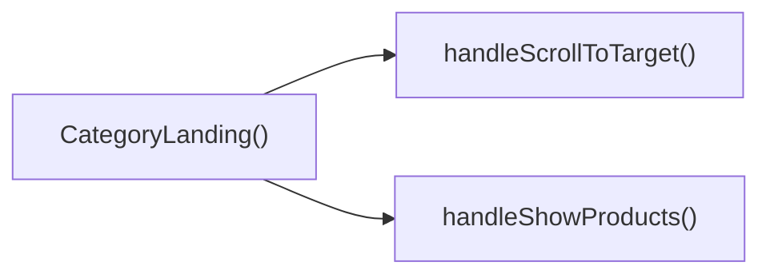

## Genel Bakış
Bu modül, ürün platformunun kategori ana sayfa görünümünü oluşturan React bileşenini barındırır. Gelen kategori bilgisi, ilgili ürünler ve alt kategoriler verilerini kullanarak kullanıcı arayüzünü render eder, kullanıcı etkileşimlerini yöneterek sorunsuz bir gezinme deneyimi sunar.

## Fonksiyon Grupları
### Ana Kategori Sayfası Bileşeni
Kategori, ürün ve alt kategori verilerini alarak kategori ana sayfasının tüm arayüzünü oluşturan ana React bileşenidir, sayfanın temel işleyişini yönetir.
- CategoryLanding

### Kullanıcı Etkileşimi İşleyicileri
Kullanıcıların sayfa içi aksiyonlarını yöneterek, istenen sayfa bölümüne kaydırma ve ürün listesini görüntüleme gibi kullanıcı taleplerini gerçekleştirir.
- handleScrollToTarget, handleShowProducts

---

## AXIOMS – Mimari Varsayımlar
Bu HVAC platformu kategori açılış sayfası modülünün doğru çalışması için aldığı zorunlu prop'ların eksiksiz ve doğru formatta iletilmesi, dahili fonksiyonların hedeflediği DOM elemanlarının sayfada mevcut olması zorunludur.

[Aksiyom 1]: Eğer CategoryLanding ana bileşenine zorunlu olarak iletilmesi gereken category prop'u iletilmezse, kategori temel bilgilerine erişilemez, sayfa içeriği hatalı veya boş render edilir.
[Aksiyom 2]: Eğer CategoryLanding ana bileşenine zorunlu olarak iletilmesi gereken products prop'u iletilmezse, kategoriye ait ürün listesi hiç görüntülenemez.
[Aksiyom 3]: Eğer handleScrollToTarget fonksiyonuna parametre olarak iletilen targetId değerine sahip herhangi bir DOM elemanı sayfada mevcut değilse, kaydırma işlemi gerçekleşmez, kullanıcı ilgili bölüme yönlendirilemez.
[Aksiyom 4]: Eğer handleShowProducts fonksiyonunun çalışması için gerekli olan ürün listesi kapsayıcı DOM elemanı sayfada mevcut değilse, ürün gösterimi tetikleme işlemi başarısız olur.
[Aksiyom 5]: Eğer subCategories prop'una dizi formatı dışında bir veri tipi iletilirse, alt kategori listesi hatalı render edilir veya hiç görüntülenmez.

---

## FONKSIYON DETAYLARI

### CategoryLanding
**Ne yapar**: VentHub HVAC projesinin kategori ana sayfa görünümünü oluşturan ana React bileşenidir. İlgili kategoriye ait ürünleri ve alt kategorileri alarak kullanıcıya sunan, kategori sayfalarının temel yapısını oluşturan bir arayüz bileşenidir. Ziyaretçilerin kategorinin tüm içeriğini düzenli bir şekilde keşfetmesini sağlamak için tasarlanmıştır.
**Nasıl yapar**: Tanımında belirtilen CategoryLandingProps tipini kullanarak aldığı tüm prop'ların tip güvenliğini sağlar, gelen kategori, ürün ve alt kategori verilerini önceden tanımlı sayfa düzenine yerleştirerek arayüzü kullanıcıya sunar. src/views/category/CategoryLandingView.tsx dosyasında tanımlı olan bu bileşen, projenin tüm farklı kategori sayfaları için tekrar kullanılabilir şekilde yapılandırılmıştır.
**Parametreler**:
- category: Category — Görüntülenecek ana kategorinin tüm detaylarını (isim, açıklama, kapak görseli vb.) içeren özel nesne tipi
- products: Product[] — İlgili ana kategoriye ait tüm ürünlerin detaylarını içeren nesne dizisi
- subCategories: Category[] — Ana kategoriye bağlı alt kategorilerin detaylarını içeren nesne dizisi, varsayılan olarak boş dizi atanmış ve opsiyonel bir parametredir
**Dönüş**: React.FC<CategoryLandingProps> tipinde bir React bileşeni döndürür, bu bileşen aldığı prop'lar ile kategori ana sayfasını tarayıcıda kullanıcıya render eder.

### handleScrollToTarget
**Ne yapar**: Kategori sayfası içindeki belirli bir bölüme otomatik kaydırma işlemini gerçekleştiren yardımcı fonksiyondur. Genellikle alt kategori bağlantılarına veya sayfa içi bölümler arası geçiş butonlarına tıklandığında tetiklenerek kullanıcının istediği içeriğe kolayca ulaşmasını sağlar. Sayfa içi navigasyon deneyimini iyileştirmek için tasarlanmış basit bir etkileşim fonksiyonudur.
**Nasıl yapar**: Parametre olarak aldığı hedef ID değeri ile tarayıcının DOM ağacından ilgili HTML elementini bulur, bulunan elementin konumuna tarayıcının yerleşik kaydırma API'lerini kullanarak geçiş yapar. Genellikle yumuşak kaydırma animasyonu ile kullanıcının konum değişikliğini rahatça algılamasını sağlar.
**Parametreler**:
- targetId: string — Kaydırma işleminin hedefleyeceği HTML elementinin benzersiz kimlik (id) değeri
**Dönüş**: Herhangi bir değer döndürmez, işlevi sadece DOM üzerindeki kaydırma işlemini tetiklemektir, dönüş tipi void olarak tanımlanır.

### handleShowProducts
**Ne yapar**: Kategori ana sayfasında ürün listesiyle etkileşimi yöneten kullanıcı eylemi fonksiyonudur. Genellikle "Tüm Ürünleri Göster" gibi bir çağrı butonuna tıklandığında tetiklenir, kullanıcının kategori içindeki ürünlere hızlıca erişmesini sağlar. Kategori sayfasındaki temel etkileşim noktalarından birini yöneterek kullanıcı deneyimini basitleştirir.
**Nasıl yapar**: Tetiklendiğinde ya sayfa içindeki ürünler bölümüne otomatik kaydırma yapar ya da varsayılan olarak gizli tutulan ürün listesinin görünürlüğünü açarak kullanıcının içeriği görmesini sağlar. Sayfanın yerel durumunu veya DOM öğelerini doğrudan kullanarak işlemlerini gerçekleştirir.
**Parametreler**: Herhangi bir dış parametre almaz, doğrudan sayfa üzerindeki yerel durum veya DOM öğeleriyle etkileşim kurar.
**Dönüş**: Herhangi bir değer döndürmez, dönüş tipi void olarak tanımlanır, sadece ilgili kullanıcı arayüzü eylemini gerçekleştirir.

---

## INTERFACES

### CategoryLandingProps
- `category: DomainCategory`
- `products: DomainProduct[]`
- `subCategories?: DomainCategory[]`

---

## AST POINTERS

### [N1_NASIL] AST Pointer: C:\Users\alize\venthub-hvac\src\views\category\CategoryLandingView.tsx::CategoryLanding
- **params**: category, products, subCategories = []
- **ic_degiskenler**:
  - `wrapCategory` — useCategoryViewModel hook'undan alınan kategori sarmalama fonksiyonu
  - `showProducts` — ürün listesinin görünürlüğünü kontrol eden state değeri
  - `setShowProducts` — showProducts state'ini güncelleyen setter fonksiyonu
  - `activeFilter` — ürün filtrelemede kullanılan aktif filtre state değeri
  - `setActiveFilter` — activeFilter state'ini güncelleyen setter fonksiyonu
  - `wizardOpen` — ihtiyaç sihirbazının açık/kapalı durumunu tutan state değeri
  - `setWizardOpen` — wizardOpen state'ini güncelleyen setter fonksiyonu
  - `disableAnimation` — animasyonların devre dışı olup olmadığını kontrol eden state değeri
  - `setDisableAnimation` — disableAnimation state'ini güncelleyen setter fonksiyonu
  - `productListRef` — ürün listesi div elementine erişmek için kullanılan ref nesnesi
  - `vm` — mevcut kategorinin wrapCategory ile sarmalanmış view model'i
  - `parentVm` - üst kategorinin (varsa) sarmalanmış view model'i
  - `isAirCurtain` — mevcut kategorinin hava perdesi kategorisi olup olmadığını belirten boolean
  - `isSilentFan` — mevcut kategorinin sessiz fan kategorisi olup olmadığını belirten boolean
  - `isDehumidifier` — mevcut kategorinin nem alma cihazı kategorisi olup olmadığını belirten boolean
  - `breadcrumbItems` — sayfada gösterilen ekmek kırıntısı öğelerini içeren dizi
  - `heroImage` — ana görselin kaynak URL'si
  - `animTimer` — animasyonları gecikmeli başlatmak için kullanılan timeout ID'si
  - `handleScrollToTarget` — belirtilen ID'ye sahip DOM elementine yumuşak kaydırma yapan yardımcı fonksiyon
  - `handleShowProducts` — ürün listesini görünür yapıp kaydırma işlemini tetikleyen fonksiyon
  - `filteredProducts` — aktif filtreye göre süzülmüş ürün listesi
- **Dönüş**: JSX element (React bileşen çıktısı)

### [N2_NASIL] AST Pointer: C:\Users\alize\venthub-hvac\src\views\category\CategoryLandingView.tsx::useEffectCleanup
- **params**: (yok)
- **ic_degiskenler**:
  - `animTimer` — önceki useEffect'te tanımlanan timeout nesnesi, temizlemek için kullanılır
- **Dönüş**: yok

### [N3_NASIL] AST Pointer: C:\Users\alize\venthub-hvac\src\views\category\CategoryLandingView.tsx::handleScrollToTarget
- **params**: targetId: string
- **ic_degiskenler**:
  - `anchor` — targetId ile bulunan hedef DOM elementini tutan değişken
- **Dönüş**: yok

### [N4_NASIL] AST Pointer: C:\Users\alize\venthub-hvac\src\views\category\CategoryLandingView.tsx::handleShowProducts
- **params**: (yok)
- **ic_degiskenler**:
  - `setShowProducts` — ürün listesi görünürlüğünü açmak için kullanılan üst kapsam state setter'ı
  - `handleScrollToTarget` — ürünler bölümüne kaydırma yapmak için çağrılan üst kapsam fonksiyonu
- **Dönüş**: yok

### [N5_NASIL] AST Pointer: C:\Users\alize\venthub-hvac\src\views\category\CategoryLandingView.tsx::productFilterCallback
- **params**: p: DomainProduct
- **ic_degiskenler**:
  - `activeFilter` — üst kapsamdaki aktif filtre değeri, filtreleme koşullarında kullanılır
  - `p.noise_level` — işlemdeki ürünün gürültü seviyesi, sessiz filtresi için kontrol edilir
- **Dönüş**: boolean (ürünün filtreden geçip geçmediğini belirten değer)

### [N6_NASIL] AST Pointer: C:\Users\alize\venthub-hvac\src\views\category\CategoryLandingView.tsx::filterButtonMapCallback
- **params**: f
- **ic_degiskenler**:
  - `f.key` — filtre benzersiz anahtarı, buton key'i ve aktiflik kontrolü için kullanılır
  - `f.label` — butonda gösterilecek filtre metni
  - `setActiveFilter` — butona tıklandığında aktif filtreyi güncellemek için kullanılan üst kapsam setter'ı
  - `activeFilter` — butonun aktif durumunu belirlemek için kullanılan üst kapsam state değeri
- **Dönüş**: JSX element (filtre butonu bileşeni)

### [N7_NASIL] AST Pointer: C:\Users\alize\venthub-hvac\src\views\category\CategoryLandingView.tsx::productCardMapCallback
- **params**: p
- **ic_degiskenler**:
  - `p.id` — ürün benzersiz ID'si, ProductCard bileşeninin key değeri olarak kullanılır
  - `ProductCard` — ürün kartı bileşeni, ürün verileriyle birlikte çağrılır
- **Dönüş**: JSX element (ürün kartı bileşeni)

---

## ÇAĞRI HARİTASI

### Disariya Cagrilar (Outgoing)
Dosya içindeki ana fonksiyon CategoryLanding(), sayfa içi hedefe kaydırma işlemini yönetmek için `handleScrollToTarget` fonksiyonunu, ürün listesini kullanıcıya sunmak içinse `handleShowProducts` fonksiyonunu çağırmaktadır.

### Disaridan Cagrilanlar (Incoming)
Sağlanan çağrı verisinde bu modülü kullanan herhangi bir dış dosya veya fonksiyon bilgisi bulunmamaktadır.

### Ic Ice Fonksiyonlar (Nested)
Yok

---

## DOSYA-İÇİ ÇAĞRI GRAFİĞİ
  CategoryLanding() → handleScrollToTarget()
  CategoryLanding() → handleShowProducts()

---

## NODE ID STANDARD

  file: src\views\category\CategoryLandingView.tsx
  function: src\views\category\CategoryLandingView.tsx::CategoryLanding
  function: src\views\category\CategoryLandingView.tsx::handleScrollToTarget
  function: src\views\category\CategoryLandingView.tsx::handleShowProducts

---

## DISA AKTARILANLAR (EXPORTS)
  export: CategoryLanding