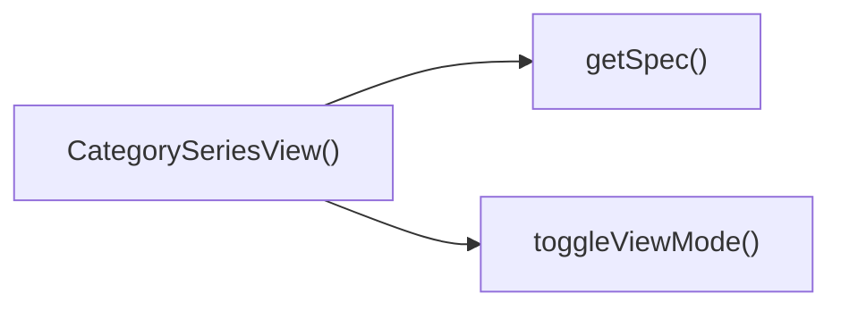

## Genel Bakış
Bu React modülü, VentHub HVAC platformunun kategori sayfalarında ürün serilerini görüntülemekten sorumlu görünüm katmanı bileşenidir. Dışarıdan alınan kategori, üst kategori ve ürün listesi verilerini işleyerek kullanıcılara ilgili ürün serilerini sunan bir arayüz oluşturur. İçindeki yardımcı fonksiyonlar sayesinde görünüm ayarlarını yönetir ve ürünlerden özel özellikleri kolayca çekme imkanı sunar.

## Fonksiyon Grupları
### Ana Görünüm Bileşeni
Modülün ana giriş noktası olarak gelen tüm giriş verilerini kullanarak kategori serisi görünümünü bütün işlevleriyle birlikte kullanıcıya sunar.
- CategorySeriesView

### Arayüz ve Veri İşleme Yardımcıları
Kullanıcı arayüzü etkileşimlerini yöneten ve ürün verilerinden istenen özel bilgileri çekmek için kullanılan destek fonksiyonlarını barındırır.
- toggleViewMode, getSpec

---

## AXIOMS – Mimari Varsayımlar
Bu React tabanlı kategori ürün serisi görüntüleme bileşeninin sorunsuz çalışması, giriş prop'larının ve dahili yardımcı fonksiyonlarının geçerli şekilde sağlanmasına bağlıdır.

[Aksiyom 1]: Eğer bileşene iletilen `category` prop'u geçerli bir kategori nesnesi olarak sağlanmazsa, bileşenin temel kategori metadaları ve başlığı görüntülenemez, boş veya hatalı bir arayüz oluşur.
[Aksiyom 2]: Eğer `parentCategory` prop'u gerektiğinde geçerli bir üst kategori nesnesi olarak sunulmazsa, kategori hiyerarşisi gösterimi ve üst kategoriye gezinme işlevleri çalışmaz, kullanıcı kategoriler arası geçiş yapamaz.
[Aksiyom 3]: Eğer `products` prop'u, DomainProduct tipinde geçerli ürün nesnelerinden oluşan bir liste olarak iletilmezse, kategori altındaki tüm ürün listesi yüklenemez, kullanıcı ürünleri görüntüleyemez.
[Aksiyom 4]: Eğer `getSpec` yardımcı fonksiyonu, herhangi bir DomainProduct nesnesi ve istediği spec anahtarı için geçerli bir değer döndürmezse, tüm ürünlerin özellik bilgileri eksik kalır, ürün kartları hatalı içerikle gösterilir.
[Aksiyom 5]: Eğer `toggleViewMode` fonksiyonu çağrıldığında girilen seri ismi için görünüm modunu güncellemezse, kullanıcı ürün listesinin görünümünü değiştiremez, sabit görünümde kalır.

---

## FONKSIYON DETAYLARI

### CategorySeriesView
**Ne yapar**: VentHub HVAC projesinin kategori görünüm modülünde, belirli bir kategori ve onun üst kategorisi kapsamındaki ürün serisini kullanıcılara sunan React fonksiyonel bileşenidir. Props olarak aldığı kategori ve ürün verilerini kullanarak ilgili ürün listesini kullanıcı arayüzünde görüntülemeye hazırlar, kategori hiyerarşisine uygun gezinti imkanı sunar.
**Nasıl yapar**: Gelen kategori, üst kategori ve ürün listesi prop'larını bileşen içerisine entegre eder, bileşen bünyesinde tanımlı toggleViewMode ve getSpec yardımcı fonksiyonları ile kullanıcı etkileşimlerini ve ürün özelliklerinin erişimini yönetir. React'in reaktif state yapısı sayesinde verilerde oluşan değişikliklerde görünümü otomatik olarak günceller, farklı görünüm modları arasında geçişe izin veren altyapıyı oluşturur.
**Parametreler**:
- name: category — Herhangi bir kategori nesnesi, görüntülenecek ürün serisinin ait olduğu mevcut kategorinin tüm metaverilerini içerir
- name: parentCategory — Herhangi bir kategori nesnesi, mevcut kategorinin üst kategorisi olarak hiyerarşik gezinti (breadcrumb) yapısı için kullanılır
- name: products — DomainProduct tipinde ürün nesnelerinden oluşan dizi, ilgili kategoriye ait tüm ürünlerin listesini barındırır
**Dönüş**: CategorySeriesViewProps prop tipini kabul eden bir React fonksiyonel bileşeni döndürür, bu bileşen DOM'a eklendiğinde kategori serisi görünümünü kullanıcıya render eder.

---

### toggleViewMode
**Ne yapar**: Kategori serisi görünümünde belirli bir ürün serisinin görüntülenme modunu (liste, grid gibi önceden tanımlı görünümler arası) değiştirmek için kullanılan kullanıcı etkileşimi fonksiyonudur. Kullanıcıların ürün listesini istedikleri formatta görmesini sağlayan temel etkileşim fonksiyonudur.
**Nasıl yapar**: Parametre olarak aldığı seri adı ile hedeflenen ürün serisini tanımlar, bileşen içindeki istemci tarafı state yönetimi aracılığıyla ilgili serinin görünüm modu değerini günceller. Herhangi bir sunucu isteği göndermeden yalnızca yerel state'i değiştirerek görünümün yeniden render edilmesini tetikler, sadece seçilen serinin görünümünü etkiler, diğer serilerin ayarlarını değiştirmez.
**Parametreler**:
- name: seriesName — string, görünüm modu değiştirilecek ürün serisinin benzersiz adı veya kimliği, hangi serinin görüntüleme ayarlarının güncelleneceğini belirtmek için kullanılır
**Dönüş**: Herhangi bir değer döndürmez, işlemi tamamladıktan sonra yalnızca ilgili bileşen state'ini güncelleyerek görünümün yeniden render edilmesini sağlar.

---

### getSpec
**Ne yapar**: Domain katmanında tanımlanan ürün nesnesinden istenen spesifik teknik veya ticari özelliği güvenli bir şekilde almak için kullanılan yardımcı fonksiyondur. Ürün özelliklerinin görünüm katmanında tutarlı bir şekilde erişilmesini sağlar.
**Nasıl yapar**: Aldığı ürün nesnesi ve istenen özellik anahtarı ile ürün nesnesinin ilgili alanına erişir, gerekli güvenli erişim kontrollerini yaparak tanımsız (undefined) değerlerin uygulama içinde hata oluşturmasının önüne geçer. Görünüm katmanında kullanılmak üzere özellik değerini kullanıma hazır hale getirir, farklı ürün tipleri için ortak bir özellik erişim standardı sunar.
**Parametreler**:
- name: p — DomainProduct, özelliği alınacak olan domain katmanı ürün nesnesi, ürünün tüm teknik özelliklerini, metaverilerini ve ticari bilgilerini içerir
- name: key — string, ürün nesnesinden alınmak istenen spesifik özelliğin anahtar adı, hangi özelliğin seçilip döndürüleceğini belirtir
**Dönüş**: İstenen özelliğin tipine uygun bir değer döndürür, eğer ilgili anahtar ürün nesnesinde mevcut değilse tanımsız bir değer döndürerek uygulamanın çalışma zamanı hatası almasının önüne geçer.

---

## INTERFACES

### CategorySeriesViewProps
- `category: DomainCategory`
- `parentCategory?: DomainCategory | null`
- `products: DomainProduct[]`

---

## AST POINTERS

### [N1_NASIL] AST Pointer: C:\Users\alize\venthub-hvac\src\views\category\CategorySeriesView.tsx::CategorySeriesView
- **params**: category, parentCategory, products
- **ic_degiskenler**:
  - `lang` — useI18n hook'undan alınan mevcut dil kodu, fiyat formatlamada kullanılır
  - `t` — useI18n hook'undan alınan çeviri fonksiyonu, arayüz metinlerini çevirmek için kullanılır
  - `addToCart` — useCart hook'undan alınan sepete ürün ekleme fonksiyonu
  - `wrapCategory` — useCategoryViewModel'den alınan kategori nesnesini view modeline dönüştüren fonksiyon
  - `groupProductsBySeries` — useCategoryViewModel'den alınan ürünleri serilerine göre gruplayan fonksiyon
  - `viewModes` — useState ile yönetilen, her seri için 'grid'/'matrix' görünüm modunu tutan state objesi
  - `setViewModes` — viewModes state'ini güncellemek için kullanılan state setter fonksiyonu
  - `vm` — geçerli kategorinin wrapCategory ile oluşturulmuş view modeli
  - `parentVm` — üst kategorinin wrapCategory ile oluşturulmuş view modeli
  - `seriesGroups` - ürünlerin groupProductsBySeries ile serilere ayrılmış hali
  - `breadcrumbItems` — Breadcrumb bileşenine gönderilen gezinme menüsü öğeleri listesi
  - `heroImage` — kategori için kullanılan ana görsel URL'si, kategori resmi yoksa varsayılan değeri alır
  - `toggleViewMode` — içeride tanımlanan, serinin görünüm modunu değiştiren fonksiyon
  - `getSpec` — içeride tanımlanan, üründen teknik özellik çeken yardımcı fonksiyon
- **Dönüş**: JSX React elementi, kategori sayfasının tüm içeriğini döndürür

### [N2_NASIL] AST Pointer: C:\Users\alize\venthub-hvac\src\views\category\CategorySeriesView.tsx::toggleViewMode
- **params**: seriesName: string
- **ic_degiskenler**:
  - `setViewModes` — üst kapsamdaki görünüm modları state'ini güncellemek için kullanılan setter
  - `prev` — setViewModes callback'inin aldığı önceki viewModes state değeri
  - `prev[seriesName]` — önceki state'de ilgili serinin mevcut görünüm modu
- **Dönüş**: yok (sadece state güncellemesi yapar)

### [N3_NASIL] AST Pointer: C:\Users\alize\venthub-hvac\src\views\category\CategorySeriesView.tsx::setViewModes_state_callback
- **params**: prev
- **ic_degiskenler**:
  - `seriesName` — üst kapsamdaki görünümü değiştirilecek seri adı
  - `prev[seriesName]` — önceki state'de ilgili serinin kayıtlı görünüm modu
- **Dönüş**: Record<string, 'grid' | 'matrix'> tipinde yeni state objesi

### [N4_NASIL] AST Pointer: C:\Users\alize\venthub-hvac\src\views\category\CategorySeriesView.tsx::getSpec
- **params**: p: DomainProduct, key: string
- **ic_degiskenler**:
  - `isRecord` — p.technical_specs'ın geçerli bir obje olup olmadığını kontrol eden fonksiyon
  - `p.technical_specs` — işlem yapılan ürünün teknik özellikler nesnesi
  - `specs` — p.technical_specs geçerliyse onu, değilse boş obje olarak atanan değer
  - `specs[key]` — belirtilen anahtarla aranan teknik özellik değeri
  - `specs[key.toLowerCase()]` — anahtar küçük harfe çevrilerek aranan teknik özellik değeri
  - `val` — bulunan özellik değeri
- **Dönüş**: string — bulunan değerin string hali, değer yoksa '-' string'i döndürür

### [N5_NASIL] AST Pointer: C:\Users\alize\venthub-hvac\src\views\category\CategorySeriesView.tsx::seriesGroups_map_callback
- **params**: series, _idx
- **ic_degiskenler**:
  - `viewModes` — üst kapsamdaki görünüm modları state objesi
  - `viewModes[series.name]` — işlem yapılan serinin mevcut görünüm modu
  - `isMatrix` — serinin matrix görünümünde olup olmadığını tutan boolean değer
  - `toggleViewMode` — görünüm modunu değiştiren üst kapsamdaki fonksiyon
  - `series.name` — işlem yapılan serinin adı
  - `series.products` — serideki ürün listesi
  - `series.minPrice` — serinin en düşük fiyat değeri
  - `formatCurrency` — fiyatları biçimlendiren yardımcı fonksiyon
  - `lang` — üst kapsamdaki mevcut dil kodu
- **Dönüş**: JSX <section> elementi, tek seri bölümünü içeren React elementi

### [N6_NASIL] AST Pointer: C:\Users\alize\venthub-hvac\src\views\category\CategorySeriesView.tsx::series_products_map_callback
- **params**: p
- **ic_degiskenler**:
  - `heroImage` — üst kapsamdaki varsayılan görsel URL'si, ürün resmi yoksa kullanılır
  - `getSpec` — üründen teknik özellik çeken üst kapsamdaki yardımcı fonksiyon
  - `addToCart` — ürünü sepete ekleyen fonksiyon
  - `formatCurrency` — ürün fiyatını biçimlendiren fonksiyon
  - `lang` — mevcut dil kodu
  - `t` — çeviri fonksiyonu
  - `p.image_url` — işlem yapılan ürünün görsel URL'si
  - `p.name` — ürünün adı
  - `p.sku` — ürünün stok takip numarası
  - `p.price` — ürünün satış fiyatı
- **Dönüş**: JSX <tr> elementi, matrix görünümünde ürün satırını içeren React elementi

---

## ÇAĞRI HARİTASI

### Disariya Cagrilar (Outgoing)
Aynı dosyada tanımlı CategorySeriesView() fonksiyonu, dosya içindeki getSpec ve toggleViewMode fonksiyonlarını çağırmaktadır.

### Disaridan Cagrilanlar (Incoming)
Verilen çağrı verisinde bu modülü kullanan herhangi bir dış dosya veya fonksiyon bilgisi paylaşılmamıştır.

### Ic Ice Fonksiyonlar (Nested)
Yok

---

## DOSYA-İÇİ ÇAĞRI GRAFİĞİ
  CategorySeriesView() → getSpec()
  CategorySeriesView() → toggleViewMode()

---

## NODE ID STANDARD

  file: src\views\category\CategorySeriesView.tsx
  function: src\views\category\CategorySeriesView.tsx::CategorySeriesView
  function: src\views\category\CategorySeriesView.tsx::toggleViewMode
  function: src\views\category\CategorySeriesView.tsx::getSpec

---

## DISA AKTARILANLAR (EXPORTS)
  export: CategorySeriesView