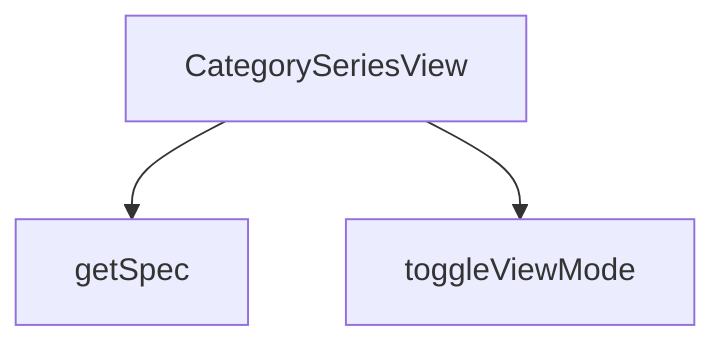

## Genel Bakış
CategorySeriesView modülü, VentHub HVAC platformunda kategori sayfalarında bulunan ürün serilerini gösteren bir React görünüm bileşenidir. Kategori, üst kategori ve ürün listesi bilgilerini alarak kullanıcılara düzenli bir seriler arayüzü sunar. Görünüm modu değiştirme ve ürün özelliklerini okuma gibi yardımcı işlevler içerir.

## Fonksiyon Grupları
### Ana Görünüm Bileşeni
Modülün tek giriş noktasıdır; kategori metadatasını, üst kategori bilgisini ve ürün listesini birleştirerek kullanıcılara kategori serisi görünümünü tam olarak sunar.
- CategorySeriesView

### Yardımcı Fonksiyonlar
Kullanıcı arayüzündeki görünüm modu geçişlerini yöneten ve DomainProduct nesnelerinden istenen özellik değerlerini güvenli biçimde çıkaran iki küçük yardımcı işlevdir.
- toggleViewMode, getSpec

---

## AXIOMS – Mimari Varsayımlar
Bu modül için özel aksiyom tanımlanmamıştır.

[Aksiyom 1]: Eğer CategorySeriesView bileşenine category prop'u verilmezse, bileşen doğru çalışamaz.
[Aksiyom 2]: Eğer CategorySeriesView bileşenine products prop'u verilmezse veya boş dizi ise, bileşen doğru çalışamaz.
[Aksiyom 3]: Eğer toggleViewMode fonks

---

## FONKSİYON DETAYLARI

### CategorySeriesView
**Ne yapar**: Kategoriye ait serileri ve ürünleri görüntüleyen bir React bileşenidir. Verilen kategori yapısına göre ürün listesini ve serileri kullanıcıya sunar.

**Nasıl yapar**: Bileşen, props olarak aldığı category, parentCategory ve products verilerini kullanarak kategori serileri görünümünü render eder. Seri bazlı gruplandırma ve navigasyon işlevleri sağlar.

**Parametreler**:
- category: object — Görüntülenen ana kategori nesnesi
- parentCategory: object — Üst kategori nesnesi, geri dönüş veya hiyerarşik yapı için kullanılır
- products: array — Kategoriye ait ürün listesi dizisi

**Dönüş**: React.FC<CategorySeriesViewProps> — Tip tanımlı bir React fonksiyonel bileşeni

### toggleViewMode
**Ne yapar**: Geliştirildi ancak detay üretilemedi.

### getSpec
**Ne yapar**: Geliştirildi ancak detay üretilemedi.

---

## INTERFACES

### CategorySeriesViewProps
- `category: DomainCategory`
- `parentCategory?: DomainCategory | null`
- `products: DomainProduct[]`

---

## AST POINTERS

### [N1_NASIL] AST Pointer: CategorySeriesView.tsx::CategorySeriesView
- **params**: (`category`, `parentCategory`, `products`)
- **ic_degiskenler**:
  - `lang` — `useI18n` hook'undan gelen mevcut dil kodu,para formatı ve çeviriler için kullanılır.
  - `t` — `useI18n` hook'undan gelen çeviri fonksiyonu, metinleri dil dosyasından çeker.
  - `addToCart` — `useCart` hook'undan gelen, sepete ürün eklemek için kullanılan fonksiyon.
  - `wrapCategory` — `useCategoryViewModel` hook'undan gelen, ham kategori nesnesini ViewModel'e dönüştüren fonksiyon.
  - `groupProductsBySeries` — `useCategoryViewModel` hook'undan gelen, ürünleri seriye göre gruplayan fonksiyon.
  - `viewModes` — Her seri için geçerli görünüm modunu (`'grid'` veya `'matrix'`) tutan state nesnesi.
  - `setViewModes` — `viewModes` state'ini güncellemek için kullanılan setter fonksiyonu.
  - `vm` — `wrapCategory(category)` çağrısından elde edilen ana kategori ViewModel'i.
  - `parentVm` — `wrapCategory(parentCategory)` çağrısından elde edilen üst kategori ViewModel'i (yoksa null/undefined).
  - `seriesGroups` — `groupProductsBySeries(products)` çağrısından elde edilen, ürünlere ait seri grupları dizisi.
  - `breadcrumbItems` — Breadcrumb navigasyonu için gerekli öğelerin dizisi, hesaplanmış ve sabitlenmiştir.
  - `heroImage` — Kategori için kullanılacak arka plan görselinin URL'i, `category.image_url` veya varsayılan yoldan alınır.
- **Dönüş**: JSX elemanı (React.FC<CategorySeriesViewProps>).

### [N2_NASIL] AST Pointer: CategorySeriesView.tsx::toggleViewMode
- **params**: (`seriesName: string`)
- **ic_degiskenler**:
  - `seriesName` — Görünümü değiştirilecek olan serinin adı.
  - `prev` — `setViewModes` updater fonksiyonunun parametresi, bir önceki `viewModes` state'inin değeridir.
- **Dönüş**: yok (state günceller).

### [N3_NASIL] AST Pointer: CategorySeriesView.tsx::getSpec
- **params**: (`p: DomainProduct`, `key: string`)
- **ic_degiskenler**:
  - `p` — Teknik özelliklerine bakılacak olan ürün nesnesi.
  - `key` — Aranacak olan teknik özellik anahtarı (ör. `'airflow_capacity'`).
  - `specs` — `p.technical_specs` alanının `isRecord` kontrolünden geçirilmiş hali, nesne değilse boş obje (`{}`) olarak alınır.
  - `val` — `specs` nesnesinde `key` ile veya `key`'in küçük harf hali ile aranan değer.
- **Dönüş**: Bulunan değer `String` formatında veya bulunamazsa `'-'` dizesi.

### [N4_NASIL] AST Pointer: CategorySeriesView.tsx::seriesGroups.map (callback)
- **params**: (`series`, `_idx`)
- **ic_degiskenler**:
  - `series` — `seriesGroups` dizisindeki mevcut seri nesnesi.
  - `_idx` — Mevcut elemanın dizideki indeksi (kullanılmıyor, `_` ile belirtilmiş).
  - `isMatrix` — Mevcut seri için `viewModes[series.name] === 'matrix'` kontrolünden elde edilen boolean değer,matris görünümde olup olmadığını belirler.
- **Dönüş**: JSX `<section>` elemanı.

### [N5_NASIL] AST Pointer: CategorySeriesView.tsx::series.products.map (callback)
- **params**: (`p`)
- **ic_degiskenler**:
  - `p` — `series.products` dizisindeki mevcut ürün nesnesi.
- **Dönüş**: JSX `<tr>` elemanı.

---

## MERMAID CALL GRAPH

## NODE ID STANDARD

  file: src\views\category\CategorySeriesView.tsx
  function: src\views\category\CategorySeriesView.tsx::CategorySeriesView
  function: src\views\category\CategorySeriesView.tsx::toggleViewMode
  function: src\views\category\CategorySeriesView.tsx::getSpec

---

## DISA AKTARILANLAR (EXPORTS)
  export: CategorySeriesView

---

## STİL TOKENLERİ

### Arbitrary Değerler (token'a geçirilmemiş)
Yok — tüm stiller token'a geçirilmiş. ✅

### Kullanılan Token'lar (zaten token'a geçirilmiş)
- `rounded-hvac-2xl`, `tracking-hvac-loose`, `tracking-hvac-relaxed`

### Tailwind Sınıf Özeti
- **Renkler:** `bg-cyan-500`, `bg-cyan-500/10`, `bg-secondary-blue`, `bg-slate-100`, `bg-slate-50`, `bg-slate-900`, `bg-slate-950`, `bg-white`, `border-b`, `border-collapse`, `border-cyan-500/20`, `border-slate-100`, `border-slate-200`, `hover:bg-slate-50/50`, `hover:text-slate-600`
- **Layout:** `flex`, `flex-col`, `flex-wrap`, `gap-16`, `gap-2`, `gap-3`, `gap-4`, `gap-8`, `grid`, `grid-cols-1`, `h-12`, `h-2`, `h-px`, `inline-flex`, `items-center`
- **Varyant/Responsive:** `:`, `hover:`, `lg:`, `md:`, `sm:`, `xl:` önekleri
- **Yardımcı Sınıflar:** `${!isMatrix`, `${isMatrix`, `:`, `animate-fadeIn`, `animate-pulse`, `border`, `divide-slate-50`, `divide-y`, `font-black`, `font-bold`, `font-extralight`, `font-light`, `font-medium`, `group`, `italic`