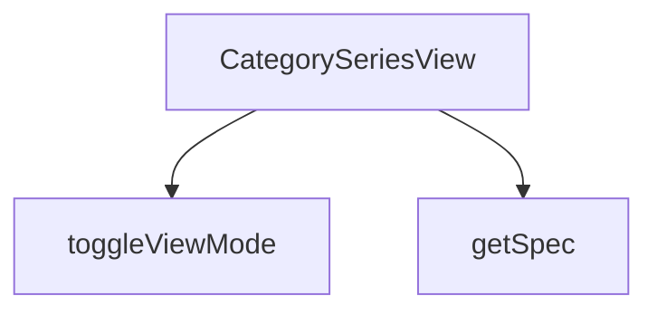

## Genel Bakış
VentHub HVAC platformunda kategori sayfalarına ait ürün serilerini gösteren React görünüm bileşenidir. Kategori, üst kategori ve ürün listesi bilgilerini alarak kullanıcılara düzenli bir seriler arayüzü sunar. Görünüm modu değiştirme ve ürün özelliklerini okuma gibi yardımcı işlevler içerir.

## Fonksiyon Grupları
### Ana Görünüm Bileşeni
Modülün tek giriş noktasıdır; kategori metadatasını, üst kategori bilgisini ve ürün listesini birleştirerek kullanıcılara kategori serisi görünümünü tam olarak sunar.
- CategorySeriesView

### Yardımcı Fonksiyonlar
Kullanıcı arayüzündeki görünüm modu geçişlerini yöneten ve DomainProduct nesnelerinden istenen özellik değerlerini güvenli biçimde çıkaran iki küçük yardımcı işlevdir.
- toggleViewMode, getSpec

---

## AXIOMS – Mimari Varsayımlar

Bu modül, bir React görünüm bileşeni olup fonksiyon imzalarından çıkarılabilecek mimari varsayımlar aşağıdadır.

**[Aksiyom 1]:** Eğer `products` dizisi boş veya tanımsız ise, görüntülenecek ürün serisi olmadığından modül içerik üretmez.

**[Aksiyom 2]:** Eğer `category` parametresi sağlanmazsa, hangi kategoriye ait serilerin listeleneceği belirsiz olduğundan modül doğru çalışmaz.

**[Aksiyom 3]:** Eğer `parentCategory` parametresi sağlanmazsa, üst kategori referansı eksik kalır; bu durumda üst kategoriye dayalı işlevler (örn. geri navigasyon, hiyerarşik bağlam) çalışmaz.

**[Aksiyom 4]:** Eğer `toggleViewMode` fonksiyonuna geçilen `seriesName` değeri mevcut ürünlerin hiçbirinin serisine karşılık gelmiyorsa, görünüm modu değişikliği hiçbir seriyi etkilemez.

**[Aksiyom 5]:** Eğer `getSpec` fonksiyonuna geçirilen `p` parametresi geçerli bir `DomainProduct` nesnesi değilse veya istenen `key` ürününn özellik listesinde bulunmuyorsa,fonksiyon `undefined` veya beklenmeyen bir değer döndürür.

**[Aksiyom 6]:** Bu modülün herhangi bir modül sabiti tanımlamadığından, eşik değer veya sabit konfigürasyon barındırmaz; tüm dinamik veri dışarıdan (`products`, `category`, `parentCategory`) sağlanmalıdır.

---

## FONKSİYON DETAYLARI

### CategorySeriesView
**Ne yapar**: Kategoriye ait serileri ve ürünleri görüntüleyen bir React bileşenidir. Verilen kategori yapısına göre ürün listesini ve serileri kullanıcıya sunar.

**Nasıl yapar**: Bileşen, props olarak aldığı category, parentCategory ve products verilerini kullanarak kategori serileri görünümünü render eder. Seri bazlı gruplandırma ve navigasyon işlevleri sağlar.

**Parametreler**:
- category: object — Görüntülenen ana kategori nesnesi
- parentCategory: object — Üst kategori nesnesi, geri dönüş veya hiyerarşik yapı için kullanılır
- products: array — Kategoriye ait ürün listesi dizisi

**Dönüş**: React.FC<CategorySeriesViewProps> — Tip tanımlı bir React fonksiyonel bileşeni

### toggleViewMode
**Ne yapar**: Geliştirildi ancak detay üretilemedi.

### getSpec
**Ne yapar**: Geliştirildi ancak detay üretilemedi.

---

## INTERFACES

### CategorySeriesViewProps
- `category: DomainCategory`
- `parentCategory?: DomainCategory | null`
- `products: DomainProduct[]`

---

## AST POINTERS

### [N1_NASIL] AST Pointer: src/views/category/CategorySeriesView.tsx::CategorySeriesView
- **params**: `(category, parentCategory, products)`
- **ic_degiskenler**:
  - `lang` — useI18n() hook'undan gelen aktif dil kodu (ör. 'tr', 'en')
  - `t` — useI18n() hook'undan gelen çeviri fonksiyonu; anahtar bazlı metin çevirisi yapar
  - `addToCart` — useCart() hook'undan gelen sepete ürün ekleme fonksiyonu; ürün ve miktar alır
  - `wrapCategory` — useCategoryViewModel() hook'undan gelen; ham kategori objesini view model'e dönüştürür
  - `groupProductsBySeries` — useCategoryViewModel() hook'undan gelen; ürünleri seri adına göre gruplar
  - `viewModes` — `useState<Record<string, 'grid' | 'matrix'>>` ile oluşturulan state; her seri adı için geçerli görünüm modunu tutar
  - `setViewModes` — viewModes state'inin setter fonksiyonu
  - `vm` — `wrapCategory(category)` çağrısıyla elde edilen kategori view model; displayName, slug, description gibi özellikleri içerir
  - `parentVm` — `wrapCategory(parentCategory)` çağrısıyla elde edilen üst kategori view model; null olabilir
  - `seriesGroups` — `groupProductsBySeries(products)` çağrısıyla elde edilen seri grupları dizisi; her eleman `{ name, products, minPrice }` yapısındadır
  - `breadcrumbItems` — breadcrumb navigasyon öğeleri dizisi; ev linki, varsa üst kategori linki ve mevcut kategori linkini içerir
  - `heroImage` — `category.image_url` veya fallback olarak varsayılan endüstriyel görsel yolunu tutan string
- **Dönüş**: JSX element (React bileşeni)

### [N2_NASIL] AST Pointer: src/views/category/CategorySeriesView.tsx::toggleViewMode
- **params**: `(seriesName: string)`
- **ic_degiskenler**:
  - (yok — doğrudan setViewModes callback içinde prev kullanılır)
- **Dönüş**: yok (void); state updater ile viewModes state'ini günceller, matrix↔grid arası geçiş yapar

### [N3_NASIL] AST Pointer: src/views/category/CategorySeriesView.tsx::getSpec
- **params**: `(p: DomainProduct, key: string)`
- **ic_degiskenler**:
  - `specs` — `isRecord(p.technical_specs)` kontrolü sonucu elde edilen teknik özellikler objesi; record değilse boş obje `{}` kullanılır
  - `val` — `specs[key]` veya `specs[key.toLowerCase()]` ile elde edilen değer; hem orijinal hem küçük harf anahtar ile arama yapar
- **Dönüş**: string — değer varsa `String(val)` olarak döner, yoksa `'-'` döner

### [N4_NASIL] AST Pointer: src/views/category/CategorySeriesView.tsx::(map callback — seriesGroups)
- **params**: `(series, _idx)`
- **ic_degiskenler**:
  - `isMatrix` — `viewModes[series.name] === 'matrix'` kontrolünden elde edilen boolean; matrix görünümde olup olmadığını belirler
- **Dönüş**: JSX element — serinin başlık, fiyat, görünüm toggle ve ürün kartları/tablosunu içeren section

### [N5_NASIL] AST Pointer: src/views/category/CategorySeriesView.tsx::(map callback — series.products tablo satırı)
- **params**: `(p: DomainProduct)`
- **ic_degiskenler**:
  - (yok — doğrudan p özellikleri JSX içinde kullanılır)
- **Dönüş**: JSX element — `<tr>` satırı; ürün görseli, adı, SKU, debi, ses, güç, fiyat ve sepete ekle butonunu içerir

---

## MERMAID CALL GRAPH

## NODE ID STANDARD

  file: src\views\category\CategorySeriesView.tsx
  function: src\views\category\CategorySeriesView.tsx::CategorySeriesView
  function: src\views\category\CategorySeriesView.tsx::toggleViewMode
  function: src\views\category\CategorySeriesView.tsx::getSpec

---

## DISA AKTARILANLAR (EXPORTS)
  export: CategorySeriesView

---

## STİL TOKENLERİ

### Arbitrary Değerler (token'a geçirilmemiş)
Yok — tüm stiller token'a geçirilmiş. ✅

### Kullanılan Token'lar (zaten token'a geçirilmiş)
- `rounded-hvac-2xl`, `tracking-hvac-loose`, `tracking-hvac-relaxed`

### Tailwind Sınıf Özeti
- **Renkler:** `bg-cyan-500`, `bg-cyan-500/10`, `bg-secondary-blue`, `bg-slate-100`, `bg-slate-50`, `bg-slate-900`, `bg-slate-950`, `bg-white`, `border-b`, `border-collapse`, `border-cyan-500/20`, `border-slate-100`, `border-slate-200`, `hover:bg-slate-50/50`, `hover:text-slate-600`
- **Layout:** `flex`, `flex-col`, `flex-wrap`, `gap-16`, `gap-2`, `gap-3`, `gap-4`, `gap-8`, `grid`, `grid-cols-1`, `h-12`, `h-2`, `h-px`, `inline-flex`, `items-center`
- **Varyant/Responsive:** `:`, `hover:`, `lg:`, `md:`, `sm:`, `xl:` önekleri
- **Yardımcı Sınıflar:** `${!isMatrix`, `${isMatrix`, `:`, `animate-fadeIn`, `animate-pulse`, `border`, `divide-slate-50`, `divide-y`, `font-black`, `font-bold`, `font-extralight`, `font-light`, `font-medium`, `group`, `italic`