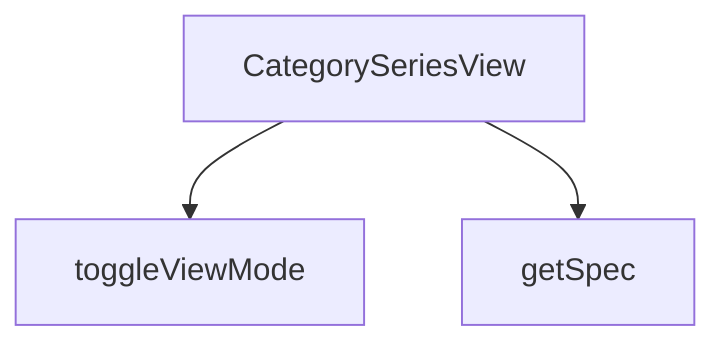

## Genel Bakış
CategorySeriesView modülü, VentHub HVAC platformunda kategori sayfalarında yer alan ürün serilerini görüntülemek için tasarlanmış bir React görünüm bileşenidir. Kategori, üst kategori ve ürün listesi bilgilerini alarak kullanıcılara düzenli bir seriler arayüzü sunar. Görünüm modu değiştirme ve ürün özelliklerini güvenli biçimde okuma gibi yardımcı işlevler içerir.

## Fonksiyon Grupları
### Ana Görünüm Bileşeni
Modülün tek giriş noktasıdır; kategori metadatasını, üst kategori bilgisini ve ürün listesini birleştirerek kullanıcılara kategori serisi görünümünü sunar.
- CategorySeriesView

### Yardımcı Fonksiyonlar
Kullanıcı arayüzündeki görünüm modu geçişlerini yöneten ve ürün nesnelerinden istenen özellik değerlerini güvenli biçimde çıkaran yardımcı işlevlerdir.
- toggleViewMode, getSpec

---

## AXIOMS – Mimari Varsayımlar

Bu modül için temel mimari varsayımlar şunlardır:

**[Aksiyom 1]:** Eğer `category` parametresi `undefined` veya `null` olarak verilmişse, `CategorySeriesView` bileşeni doğru şekilde render edilemez veya eksik/boş bir görünüm oluşur.

**[Aksiyom 2]:** Eğer `products` parametresi boş bir dizi (`[]`) olarak verilmişse, `CategorySeriesView` bileşeni hiçbir ürün serisi göstermez.

**[Aksiyom 3]:** Eğer `parentCategory` parametresi `undefined` veya `null` olarak verilmişse, `CategorySeriesView` bileşeni üst kategori bilgisi olmadan çalışır (başka bir hata üretmez).

**[Aksiyom 4]:** Eğer `toggleViewMode(seriesName)` fonksiyonu çağrılmışsa, geçerli bir `seriesName` dizgesi (`string`) ile çağrılmalıdır; aksi halde view mode değiştirme işlemi başarısız olur veya beklenmeyen bir durum oluşur.

**[Aksiyom 5]:** Eğer `getSpec(p, key)` fonksiyonunda `p` parametresi geçerli bir `DomainProduct` nesnesi değilse veya `key` parametresi geçerli bir özellik anahtarı (`string`) değilse, fonksiyon `undefined` veya `null` değer döndürür.

---

## FONKSİYON DETAYLARI

### CategorySeriesView
**Ne yapar**: Kategoriye ait serileri ve ürünleri görüntüleyen bir React bileşenidir. Verilen kategori yapısına göre ürün listesini ve serileri kullanıcıya sunar.

**Nasıl yapar**: Bileşen, props olarak aldığı category, parentCategory ve products verilerini kullanarak kategori serileri görünümünü render eder. Seri bazlı gruplandırma ve navigasyon işlevleri sağlar.

**Parametreler**:
- category: object — Görüntülenen ana kategori nesnesi
- parentCategory: object — Üst kategori nesnesi, geri dönüş veya hiyerarşik yapı için kullanılır
- products: array — Kategoriye ait ürün listesi dizisi

**Dönüş**: React.FC<CategorySeriesViewProps> — Tip tanımlı bir React fonksiyonel bileşeni

### toggleViewMode
**Ne yapar**: Geliştirildi ancak detay üretilemedi.

### getSpec
**Ne yapar**: Geliştirildi ancak detay üretilemedi.

---

## İTHALATLAR (IMPORTS)
- import: ../../hooks/useCartHook::useCart
- import: ../../hooks/useCategoryViewModel::useCategoryViewModel
- import: ../../hooks/useLocalizedRoutes::useLocalizedRoutes
- import: ../../i18n/I18nProvider::useI18n
- import: ../../i18n/format::formatCurrency
- import: ../../lib/type-converters::DomainCategory
- import: ../../lib/type-converters::DomainProduct
- import: ../../utils/type-converters::isRecord
- import: @/components/ProductCard::ProductCard
- import: @/components/navigation/Breadcrumb::Breadcrumb
- import: framer-motion::motion
- import: lucide-react::Activity
- import: lucide-react::LayoutGrid
- import: lucide-react::Table
- import: lucide-react::Wind
- import: lucide-react::Zap
- import: next/image::Image
- import: react::React
- import: react::useState

---

## INTERFACES

### CategorySeriesViewProps
- `category: DomainCategory`
- `parentCategory?: DomainCategory | null`
- `products: DomainProduct[]`

---

## AST POINTERS

### [N1_NASIL] AST Pointer: CategorySeriesView.tsx::CategorySeriesView
- **params**: (category, parentCategory, products) — Ana bileşen prop'ları: mevcut kategori nesnesi, üst kategori nesnesi ve bu kategorideki ürünler dizisi
- **ic_degiskenler**:
  - `lang` — `useI18n` hook'undan gelen mevcut dil kodu, para birimi formatlamada kullanılır
  - `t` — `useI18n` hook'undan gelen çeviri fonksiyonu, tüm metin etiketlerini uluslararasılaştırır
  - `addToCart` — `useCart` hook'undan gelen sepete ekleme fonksiyonu
  - `Routes` — `useLocalizedRoutes` hook'undan gelen yerelleştirilmiş rotalar nesnesi, kategori sayfa bağlantılarını oluşturur
  - `wrapCategory` — `useCategoryViewModel` hook'undan gelen kategori sarma fonksiyonu, ham kategori verisini görünüm modeline dönüştürür
  - `groupProductsBySeries` — `useCategoryViewModel` hook'undan gelen ürünleri seriye göre gruplama fonksiyonu
  - `viewModes` — Her seri için görünüm modunu ('grid' veya 'matrix') tutan state nesnesi
  - `setViewModes` — viewModes state'ini güncelleyen setter fonksiyonu
  - `vm` — `category` prop'unun `wrapCategory` ile sarılmış görünüm modeli, kategori adı ve açıklamasını sağlar
  - `parentVm` — `parentCategory` prop'unun sarılmış görünüm modeli, üst kategori bilgilerini sağlar
  - `seriesGroups` — Ürünlerin seri bazında gruplandırılmış hali, her grup seri adını ve ürün dizisini içerir
  - `breadcrumbItems` — Breadcrumb navigasyonu için öğe dizisi, ev sahibi, üst kategori ve mevcut kategori bağlantılarını içerir
  - `heroImage` — Kategori sayfasının hero bölümünde kullanılacak görsel URL'si, category.image_url yoksa varsayılan görsel kullanılır
  - `toggleViewMode` — Seri adına göre görünüm modunu değiştiren iç fonksiyon
  - `getSpec` — Ürün nesnesi ve anahtar parametresiyle teknik özellik değerini döndüren iç fonksiyon
- **Dönüş**: React.ReactNode (JSX markup — kategori serisi sayfasının tüm görsel yapısı)

### [N2_NASIL] AST Pointer: CategorySeriesView.tsx::toggleViewMode
- **params**: (seriesName: string) — Görünüm modu değiştirilecek serinin adı
- **ic_degiskenler**:
  - `seriesName` — Parametre olarak alınan seri adı, viewModes nesnesinde güncelleme yapılacak anahtar olarak kullanılır
- **Dönüş**: void (Stateful güncelleme — viewModes state'ini toggling yaparak seri adına ait görünüm modunu 'grid'↔'matrix' arasında değiştirir)

### [N3_NASIL] AST Pointer: CategorySeriesView.tsx::getSpec
- **params**: (p: DomainProduct, key: string) — p: Teknik özelliklerine bakılacak ürün nesnesi, key: Aranacak teknik özellik anahtarı
- **ic_degiskenler**:
  - `specs` — Ürünün `technical_specs` alanından gelen nesne, `isRecord` kontrolüyle doğrulanmış veya boş nesne
  - `val` — Specs nesnesinde önce orijinal key ile, sonra lowerCase key ile aranan değer
- **Dönüş**: string (Bulunan teknik özellik değerini String'e çevirerek döndürür, bulunamazsa '-' karakterini döndürür)

---

## MERMAID CALL GRAPH

## NODE ID STANDARD

  file: src\views\category\CategorySeriesView.tsx
  function: src\views\category\CategorySeriesView.tsx::CategorySeriesView
  function: src\views\category\CategorySeriesView.tsx::toggleViewMode
  function: src\views\category\CategorySeriesView.tsx::getSpec

---

## DISA AKTARILANLAR (EXPORTS)
  export: CategorySeriesView

---

## STİL TOKENLERİ

### Arbitrary Değerler (token'a geçirilmemiş)
Yok — tüm stiller token'a geçirilmiş. ✅

### Kullanılan Token'lar (zaten token'a geçirilmiş)
- `rounded-hvac-2xl`, `tracking-hvac-loose`, `tracking-hvac-relaxed`

### Tailwind Sınıf Özeti
- **Renkler:** `bg-cyan-500`, `bg-cyan-500/10`, `bg-secondary-blue`, `bg-slate-100`, `bg-slate-50`, `bg-slate-900`, `bg-slate-950`, `bg-white`, `border-b`, `border-collapse`, `border-cyan-500/20`, `border-slate-100`, `border-slate-200`, `hover:bg-slate-50/50`, `hover:text-slate-600`
- **Layout:** `flex`, `flex-col`, `flex-wrap`, `gap-16`, `gap-2`, `gap-3`, `gap-4`, `gap-8`, `grid`, `grid-cols-1`, `h-12`, `h-2`, `h-px`, `inline-flex`, `items-center`
- **Varyant/Responsive:** `:`, `hover:`, `lg:`, `md:`, `sm:`, `xl:` önekleri
- **Yardımcı Sınıflar:** `${!isMatrix`, `${isMatrix`, `:`, `animate-fadeIn`, `animate-pulse`, `border`, `divide-slate-50`, `divide-y`, `font-black`, `font-bold`, `font-extralight`, `font-light`, `font-medium`, `group`, `italic`