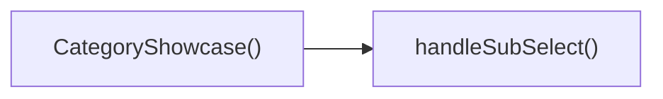

## Genel Bakış
Bu React modülü, VentHub HVAC platformunun kategori vitrini görünümünü oluşturan bir kullanıcı arayüzü bileşenidir. Üzerine aldığı ana kategori ve alt kategori verilerini kullanıcılara sunarken, kullanıcıların alt kategoriler arasında seçim yapması gibi etkileşimleri de yönetir.

## Fonksiyon Grupları
### Ana Vitrin Bileşeni
Kategori vitrininin temel yapısını oluşturur, dışarıdan alınan kategori verileri ve seçim tetikleyicisi gibi girdileri işleyerek kullanıcı arayüzünü kullanıma sunar.
- CategoryShowcase

### Kullanıcı Etkileşimi Yönetim Fonksiyonu
Kullanıcının bir alt kategori seçmesi durumunda tetiklenir, seçilen alt kategorinin benzersiz tanımlayıcısını alarak üst bileşene iletmek için gerekli işlemleri gerçekleştirir.
- handleSubSelect

---

## AXIOMS – Mimari Varsayımlar
Bu React kategori sergileme bileşeninin doğru şekilde çalışması, içerikleri sorunsuz render etmesi ve kullanıcı etkileşimlerini işlemesi için giriş prop'larının bütünlüğü ve iletilen callback fonksiyonunun geçerliliği zorunludur.

[Aksiyom 1]: Eğer prop olarak iletilen `category` nesnesi yoksa, ana kategori bilgileri yüklenemez, bileşen boş içerik gösterir veya çalışma zamanı hatası fırlatır.
[Aksiyom 2]: Eğer prop olarak iletilen `subCategories` dizisi yoksa, alt kategori listesi hiçbir şekilde render edilemez, kullanıcı seçim yapabilecek herhangi bir alt kategori öğesi göremez.
[Aksiyom 3]: Eğer prop olarak iletilen `onSubcategorySelect` callback fonksiyonu yoksa, kullanıcının herhangi bir alt kategoriye tıklaması sonrasında beklenen işlem (yönlendirme, içerik filtreleme vb.) tetiklenemez, hiçbir aksiyon gerçekleşmez.
[Aksiyom 4]: Eğer `handleSubSelect` fonksiyonuna iletilen `subSlug` değeri mevcut bir alt kategori slug'ı ile eşleşmiyorsa, `onSubcategorySelect` yanlış kimlik ile tetiklenir, istenen kategori içeriği hiçbir zaman yüklenemez.

---

## FONKSIYON DETAYLARI

### CategoryShowcase
**Ne yapar**: VentHub HVAC sisteminin kategori vitrini olarak çalışan bir React bileşenidir. Üst seviye ana kategori ve ona ait tüm alt kategorileri kullanıcıya sunarak, kullanıcının listeden istediği bir alt kategoriyi seçmesini sağlayan gezinme odaklı bir arayüz bileşenidir. Projenin CategoryShowcaseView bileşeni içinde yer alan, kategori gösterim akışının temel yapı taşlarından biridir.
**Nasıl yapar**: Kendisine prop olarak iletilen kategori ve alt kategori verilerini alır, kullanıcı arayüzünde uygun şekilde listeler. Kullanıcı listeden bir alt kategoriye tıkladığında, yine prop olarak aldığı geri çağırım fonksiyonunu tetikleyerek seçim bilgilerini üst bileşenlere iletir. Sadece aldığı prop verilerini kullanarak çalışan, bağımsız ve yeniden kullanılabilir bir React bileşeni olarak çalışır.
**Parametreler**:
- category: CategoryShowcaseProps içindeki ilgili türde — Gösterilen ana üst kategorinin tüm meta, görsel ve içerik verilerini barındıran nesnedir
- subCategories: CategoryShowcaseProps içindeki ilgili türde — Ana kategoriye bağlı tüm alt kategorilerin listesini içeren dizidir, her bir alt kategorinin kendi verilerini barındırır
- onSubcategorySelect: CategoryShowcaseProps içindeki ilgili türde — Kullanıcı listeden bir alt kategori seçtiğinde tetiklenen, seçim bilgisini üst bileşenlere ileten geri çağırım (callback) fonksiyonudur
**Dönüş**: React.FC<CategoryShowcaseProps> türünde bir React bileşeni döndürür. Bu bileşen tüm kategori vitrini arayüzünü ekrana çizmek için kullanılır.

### handleSubSelect
**Ne yapar**: CategoryShowcase bileşeni içinde çalışan, alt kategori seçim sürecini yöneten yardımcı işlemci fonksiyonudur. Kullanıcının seçtiği alt kategorinin benzersiz slug değerini alarak, ana bileşene prop olarak iletilen üst düzey geri çağırım fonksiyonunun tetiklenmesini sağlar. Sadece seçim olayının iletim sorumluluğunu üstlenerek ana bileşenin iş yükünü azaltır.
**Nasıl yapar**: Parametre olarak kendisine iletilen alt kategori slug değerini doğrudan CategoryShowcase propu olarak alınan onSubcategorySelect fonksiyonuna ileterek, seçim olayının üst bileşenlere ulaşmasını sağlar. Ekstra bir veri dönüşümü veya filtreleme yapmadan, aldığı değeri olduğu gibi ilgili geri çağırım fonksiyonuna iletir.
**Parametreler**:
- subSlug: string — Kullanıcı tarafından seçilen alt kategorinin benzersiz kısa tanımlayıcısı (slug) değeridir, adresleme ve tanımlama işlemlerinde kullanılan benzersiz etikettir
**Dönüş**: Herhangi bir değer döndürmez, sadece seçim olayını iletmek amacıyla çalıştığından return tipi void niteliğindedir, belirtilen tanıma göre ek bir dönüş değeri tanımlanmamıştır.

---

## INTERFACES

### CategoryShowcaseProps
- `category: DomainCategory`
- `subCategories: DomainCategory[]`
- `onSubcategorySelect?: (slug: string) => void`

---

## AST POINTERS

### [N1_NASIL] AST Pointer: C:\Users\alize\venthub-hvac\src\views\category\CategoryShowcaseView.tsx::CategoryShowcase
- **params**: category, subCategories, onSubcategorySelect
- **ic_degiskenler**:
  - `router` — Next.js useRouter() ile alınan uygulama yönlendiricisi
  - `t` — useI18n() ile alınan çoklu dil çeviri fonksiyonu
  - `wrapCategory` — useCategoryViewModel() üzerinden gelen kategori verisini view modeline sarmalayan fonksiyon
  - `wizardOpen` — useState ile yönetilen ihtiyaç sihirbazının açık/kapalı durumu
  - `setWizardOpen` — wizardOpen durumunu güncelleyen setter fonksiyonu
  - `vm` — wrapCategory ile ana kategori verisinden oluşturulan view model nesnesi
  - `isAirCurtain` - Kategori slug'ında "hava-perde" geçip geçmediğini kontrol eden boolean, hava perdesi kategorilerinde özel buton gösterimi sağlar
  - `breadcrumbRef` — breadcrumb DOM elementine ait referans, scroll animasyonu için kullanılır
  - `breadcrumbVisible` — breadcrumb elementinin görünürlük durumu, scroll animasyonunu tetikler
  - `heroBadgeRef` — hero bölümündeki rozet DOM elementinin referansı, scroll animasyonu için
  - `heroBadgeVisible` — hero rozetinin görünürlük durumu
  - `heroTitleRef` — hero bölümündeki başlık DOM elementinin referansı
  - `heroTitleVisible` — hero başlığının görünürlük durumu
  - `heroTextRef` — hero bölümündeki açıklama metni DOM elementinin referansı
  - `heroTextVisible` — hero metninin görünürlük durumu
  - `airCurtainBtnRef` — hava perdesi kategorilerinde gösterilen özel butonun DOM referansı
  - `airCurtainBtnVisible` — hava perdesi butonunun görünürlük durumu
  - `handleSubSelect` — alt kategori seçimini yöneten iç fonksiyon
  - `breadcrumbItems` — ekmek kırıntısı navigasyonunun öğelerini içeren dizi
  - `metadata` — kategori metadata'sına CategoryMetadataExtended tipi atanarak genişletilmiş nesne
  - `showcaseImages` — metadata içindeki vitrin görselleri dizisi
  - `heroImage` — hero bölümünde kullanılacak ana görselin URL'si, varsayılan yedekli
- **Dönüş**: JSX React elementi, kategori vitrin arayüzünün tamamı

### [N2_NASIL] AST Pointer: C:\Users\alize\venthub-hvac\src\views\category\CategoryShowcaseView.tsx::handleSubSelect
- **params**: subSlug: string
- **ic_degiskenler**:
  - `onSubcategorySelect` — üst componente prop olarak gelen seçim callback'i, tanımlıysa tetiklenir
  - `router` — Next.js yönlendiricisi, prop tanımsızsa rota değişikliği için kullanılır
  - `Routes.category` - rota üretici fonksiyon, kategori ve alt kategori slug'ından tam rota oluşturur
  - `category.slug` - ana kategorinin benzersiz urisinde kullanılan slug değeri
- **Dönüş**: yok

### [N3_NASIL] AST Pointer: C:\Users\alize\venthub-hvac\src\views\category\CategoryShowcaseView.tsx::subCategories.map callback
- **params**: sub
- **ic_degiskenler**:
  - `subVm` — alt kategori verisini wrapCategory ile sarmalanmış view model nesnesi
  - `sub.id` — alt kategorinin benzersiz kimliği, liste anahtarı olarak kullanılır
  - `handleSubSelect` — butona tıklandığında alt kategori seçimini tetikleyen fonksiyon
  - `sub.slug` — seçilen alt kategorinin slug'ı, handleSubSelect'e parametre olarak gönderilir
  - `getCategoryIcon` — alt kategori slug'ına göre uygun ikon döndüren yardımcı fonksiyon
  - `subVm?.displayName` — alt kategorinin kullanıcıya gösterilen adı, kart başlığı olarak kullanılır
  - `subVm?.description` — alt kategorinin açıklama metni, kart üzerinde gösterilir
  - `t` — çeviri fonksiyonu, seri keşfet metnini çevirmek için kullanılır
- **Dönüş**: JSX buton elementi, alt kategori kart arayüzü

### [N4_NASIL] AST Pointer: C:\Users\alize\venthub-hvac\src\views\category\CategoryShowcaseView.tsx::features.map callback
- **params**: item, i
- **ic_degiskenler**:
  - `i` — map döngüsünün indeksi, liste anahtarı olarak kullanılır
  - `item.icon` — özelliğe ait ikon bileşeni, kart üzerinde gösterilir
  - `item.title` — özelliğin başlığı, kart başlığı olarak kullanılır
  - `item.desc` — özelliğin açıklama metni, kart üzerinde gösterilir
- **Dönüş**: JSX div elementi, VentHub mühendisliği özellik kartı arayüzü

---

## ÇAĞRI HARİTASI

### Disariya Cagrilar (Outgoing)
Dosya içindeki ana fonksiyon CategoryShowcase, alt seçim işlemlerini yönetmek için aynı dosyadaki handleSubSelect fonksiyonunu çağırır.

### Disaridan Cagrilanlar (Incoming)
Sağlanan veride bu modülü kullanan herhangi bir dış dosya veya fonksiyon bilgisi belirtilmemiştir.

### Ic Ice Fonksiyonlar (Nested)
Yok

---

## DOSYA-İÇİ ÇAĞRI GRAFİĞİ
  CategoryShowcase() → handleSubSelect()

---

## NODE ID STANDARD

  file: src\views\category\CategoryShowcaseView.tsx
  function: src\views\category\CategoryShowcaseView.tsx::CategoryShowcase
  function: src\views\category\CategoryShowcaseView.tsx::handleSubSelect

---

## DISA AKTARILANLAR (EXPORTS)
  export: CategoryShowcase