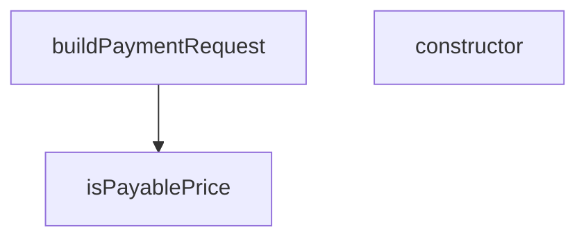

## Genel Bakış
Bu modül, ödeme sürecinde sipariş verilerini harici ödeme servislerinin beklediği formata dönüştürmekten ve ödeme tutarının geçerliliğini doğrulamaktan sorumludur. Ayrıca ödeme akışında ortaya çıkabilecek tutar uyumsuzluğu veya eksik fiyat bilgisi gibi hataları temsil eden özel hata sınıfları tanımlar.

## Fonksiyon Grupları
### Ödeme İsteği Oluşturucu
Sipariş ve müşteri verilerini alarak harici ödeme servisleri için standart bir ödeme talebi yapısı oluşturur.
- buildPaymentRequest

### Fiyat Doğrulama
Verilen bir fiyat değerinin ödeme işlemi için uygun olup olmadığını kontrol eder.
- isPayablePrice

### Hata Sınıfları
Ödeme sürecinde oluşabilecek spesifik hata durumlarını temsil eden sınıfları tanımlar.
- PaymentAmountMismatchError, CartItemPriceMissingError

---

## AXIOMS – Mimari Varsayımlar

[Aksiyom 1]: Eğer ödeme tutarı ile sepet kalemlerinin toplamı eşleşmezse, `PaymentAmountMismatchError` fırlatılır (parametreler: `amount`, `itemsSum`).

[Aksiyom 2]: Eğer sepet kalemlerinden herhangi birinin fiyatı tanımlı değilse, `CartItemPriceMissingError` fırlatılır (parametre: fiyatı eksik ürünlerin `productIds` listesi).

[Aksiyom 3]: Eğer `isPayablePrice` fonksiyonuna `undefined` değer gelirse, fiyat ödenebilir olarak değerlendirilmez — fonksiyon `number | undefined` tipini kabul eder ve undefined durumunu ele alır.

---

## FONKSİYON DETAYLARI

### isPayablePrice
**Ne yapar**: Verilen fiyat değerinin ödeme işlemine uygun olup olmadığını kontrol eder. Sonlu ve pozitif bir sayı olup olmadığını doğrulayan bir type guard fonksiyonudur. 0 değeri "fiyat yok" anlamına gelen eski bir maskeleme olarak kabul edilir ve ödeme için uygun değildir.

**Nasıl yapar**: Gelen değerin önce `number` tipinde olup olmadığını kontrol eder, ardından `Number.isFinite()` ile sonlu (Infinity veya NaN olmayan) olduğunu doğrular ve son olarak 0'dan büyük olup olmadığını denetler. Bu üç koşulun hepsi sağlanırsa `true` döner ve TypeScript'e değerin `number` tipinde olduğunu bildirir.

**Parametreler**:
- value: `number | undefined` — Kontrol edilecek fiyat değeri. undefined olabilir.

**Dönüş**: `value is number` — TypeScript type predicate dönüşü. true dönerse gelen değer `number` tipindedir.

### buildPaymentRequest
**Ne yapar**: VentHub HVAC platformunun ödeme adımında çalışan bu fonksiyon, checkout sürecinde toplanan tüm verilerden geçerli, servisler tarafından kabul edilebilir bir ödeme talebi nesnesi oluşturur. Ödeme işlemlerinin sorunsuz başlatılabilmesi için yerel sistem verilerini harici ödeme sağlayıcılarının standartlarına uygun hale getirme görevini üstlenir. Checkout akışının kritik bir parçası olarak, eksik veya hatalı veri kaynaklı ödeme hatalarının önüne geçmek için standartlaştırılmış bir istek yapısı sunar.
**Nasıl yapar**: Girdi olarak aldığı yapılandırılmış ödeme argümanlarını önce zorunlu alan kontrolünden geçirir, eksik kalan sistem kökenli varsayılan değerleri ilgili boş alanlara ekler. Ardından yerel sistemdeki veri formatları ve isimlerini ödeme servislerinin beklediği standartlara dönüştürerek, tüm alanları dolu tam çalışır durumda bir ödeme talebi nesnesini bir araya getirir. Basit format doğrulamaları yaparak geçersiz verilerin ödeme servislerine iletilmesini engeller.
**Parametreler**:
- name: args, type: BuildPaymentArgs — Ödeme talebi oluşturmak için gereken tüm sipariş, müşteri ve ödeme yöntemi bilgilerini içeren yapılandırılmış girdi nesnesi. Checkout adımında kullanıcıdan ve iç sistemden toplanan sipariş tutarı, teslimat adresi, müşteri kimliği, seçilen taksit planı gibi tüm işlem verilerini barındırır.
**Dönüş**: req türünde ödeme talebi nesnesi döndürür. Bu nesne, tüm zorunlu alanları doldurulmuş, harici ödeme API'lerine gönderilmek üzere standart formatta yapılandırılmıştır, doğrudan ödeme işlemini başlatmak için kullanılır.

### constructor
**Ne yapar**: Geliştirildi ancak detay üretilemedi.

### constructor
**Ne yapar**: Geliştirildi ancak detay üretilemedi.

---

## İTHALATLAR (IMPORTS)
- import: @/lib/images/productImage::resolveProductImageUrl
- import: @/types/ui-models::type { UserAddress }

---

## INTERFACES

### CartItemInput
W4b (T001-VH) · ödeme payload'ı artık YALNIZ doğrulanmış fiyatı taşır. Önceki hâlde kalem fiyatı ham `it.product.price`'tan geliyordu. O kolon Kademe-2'de emekli edildi (374 üründe NULL) → `safeNumber(null)` = 0 → İyzico'ya 0 TL'lik kalemler gidiyor, `amount` ile kalem toplamı tutmuyordu (tutarsız s
- `id: string`
- `quantity: number`
- `unitPrice?: number`
- `product: { id: string; name: string; image_url?: string | null; cover_image_path?: string | null }`

### CustomerInput
- `name?: string`
- `firstName?: string`
- `lastName?: string`
- `email: string`
- `phone: string`

### AddressInput
- `fullAddress?: string`
- `full_address?: string`
- `city: string`
- `district: string`
- `postalCode?: string`
- `postal_code?: string | null`

### LegalConsentsInput
- `kvkk: boolean`
- `distanceSales: boolean`
- `preInfo: boolean`
- `orderConfirm: boolean`
- `marketing?: boolean`

### BuildPaymentArgs
- `amount: number`
- `items: CartItemInput[]`
- `customer: CustomerInput`
- `shipping: AddressInput | UserAddress | null`
- `billing: AddressInput | UserAddress | null`
- `sameAsShipping: boolean`
- `userId?: string | null`
- `invoiceType: InvoiceType`
- `invoiceInfo: InvoiceInfo`
- `legalConsents: LegalConsentsInput | Record<string, boolean>`
- `shippingMethod?: 'standard' | 'express' | string | null`
- `couponCode?: string | null`

---

## TYPE ALIASES

### InvoiceType
```typescript
type InvoiceType = 'individual' | 'corporate'
```

### InvoiceInfo
```typescript
type InvoiceInfo = Partial<{ tckn: string; companyName: string; vkn: string; taxOffice: string; eInvoice?: boolean }>
```

---

## AST POINTERS

### [N1_NASIL] AST Pointer: src/views/checkout/buildPaymentRequest.ts::isPayablePrice
- **params**: `value: number | undefined`
- **ic_degiskenler**: yok
- **Dönüş**: `value is number` (type guard — sayısal, sonlu ve pozitif ise `true`)

### [N2_NASIL] AST Pointer: src/views/checkout/buildPaymentRequest.ts::buildPaymentRequest
- **params**: `args: BuildPaymentArgs`
- **ic_degiskenler**:
  - `amount` — `args.amount`'tan destructure edilen tahsil edilecek toplam tutar
  - `items` — `args.items`'tan destructure edilen sepet kalemleri dizisi
  - `customer` — `args.customer`'dan destructure edilen müşteri bilgisi nesnesi
  - `shipping` — `args.shipping`'ten destructure edilen kargo adresi
  - `billing` — `args.billing`'den destructure edilen fatura adresi
  - `sameAsShipping` — `args.sameAsShipping`'den destructure edilen, fatura adresinin kargo adresiyle aynı olup olmadığını gösteren boolean
  - `userId` — `args.userId`'den destructure edilen kullanıcı kimliği
  - `invoiceType` — `args.invoiceType`'tan destructure edilen fatura tipi
  - `invoiceInfo` — `args.invoiceInfo`'dan destructure edilen fatura bilgisi nesnesi
  - `legalConsents` — `args.legalConsents`'ten destructure edilen yasal onaylar nesnesi
  - `shippingMethod` — `args.shippingMethod`'den destructure edilen kargo yöntemi
  - `cartItems` — fiyatı olan kalemlerin ödeme sunucusuna gönderilecek formata dönüştürülmüş dizisi; her elemanda `product_id`, `quantity`, `price`, `product_name`, `product_image_url` alanları bulunur
  - `unpricedProductIds` — `isPayablePrice` ile fiyatı geçersiz bulunan ürünlerin `product.id` değerlerinin toplandığı dizi; doluysa `CartItemPriceMissingError` fırlatılır
  - `it` — `items` dizisi üzerindeki `for...of` döngüsünde kullanılan geçici değişken; her sepet kalemini temsil eder
  - `itemsSum` — `cartItems` dizisi üzerinde `reduce` ile hesaplanan kalem bazlı toplam tutar (`price * quantity` toplamı)
  - `normalizeAddress` — `addr` parametresini alıp `fullAddress`, `city`, `district`, `postalCode` alanlarına normalize eden iç fonksiyon; `null` gelirse boş değerler döner, aksi halde hem camelCase hem snake_case alan adlarını kontrol eder
  - `addr` — `normalizeAddress` fonksiyonunun parametresi; `AddressInput | UserAddress | null` tipinde adres girdisi
  - `a` — `addr`'ın `Record<string, unknown>` olarak cast edilmiş hali; alan erişimleri için kullanılır
  - `shippingAddress` — `normalizeAddress(shipping)` sonucuna `address_type: 'shipping'` eklenerek oluşan kargo adresi nesnesi
  - `billingAddress` — `sameAsShipping` true ise `shippingAddress`'ın kopyası (`address_type: 'billing'` ile), false ise `normalizeAddress(billing)` sonucu (`address_type: 'billing'` ile)
  - `customerName` — `customer.name` varsa onu kullanır, yoksa `customer.firstName` ve `customer.lastName`'in birleştirilip `trim()` edilmiş hali
  - `consents` — `legalConsents`'in `Record<string, boolean | undefined>` olarak cast edilmiş hali; her bir onay alanının boolean değerine erişim için kullanılır
  - `req` — döndürülecek ödeme isteği nesnesi; `amount`, `cartItems`, `customerInfo`, `shippingAddress`, `billingAddress`, `user_id`, `invoiceType`, `invoiceInfo`, `legalConsents`, `shippingMethod`, `couponCode` alanlarını içerir
- **Dönüş**: `req` — ödeme isteği nesnesi

### [N3_NASIL] AST Pointer: src/views/checkout/buildPaymentRequest.ts::PaymentAmountMismatchError.constructor
- **params**: `amount: number`, `itemsSum: number`
- **ic_degiskenler**: yok
- **Dönüş**: yok (super çağrısı ile hata mesajı oluşturulur, `this.name` atanır)

### [N4_NASIL] AST Pointer: src/views/checkout/buildPaymentRequest.ts::CartItemPriceMissingError.constructor
- **params**: `productIds: string[]`
- **ic_degiskenler**: yok
- **Dönüş**: yok (super çağrısı ile hata mesajı oluşturulur, `this.name` ve `this.productIds` atanır)

---


## MERMAID CALL GRAPH


## NODE ID STANDARD

  file: src\views\checkout\buildPaymentRequest.ts
  function: src\views\checkout\buildPaymentRequest.ts::isPayablePrice
  function: src\views\checkout\buildPaymentRequest.ts::buildPaymentRequest
  class: src\views\checkout\buildPaymentRequest.ts::PaymentAmountMismatchError
  class: src\views\checkout\buildPaymentRequest.ts::CartItemPriceMissingError

---

## DISA AKTARILANLAR (EXPORTS)
  export: AddressInput
  export: BuildPaymentArgs
  export: CartItemInput
  export: CartItemPriceMissingError
  export: CustomerInput
  export: InvoiceInfo
  export: InvoiceType
  export: LegalConsentsInput
  export: PaymentAmountMismatchError
  export: buildPaymentRequest
  export: isPayablePrice

---

## BILEŞIM (CONTAINS)
  contains: string[]