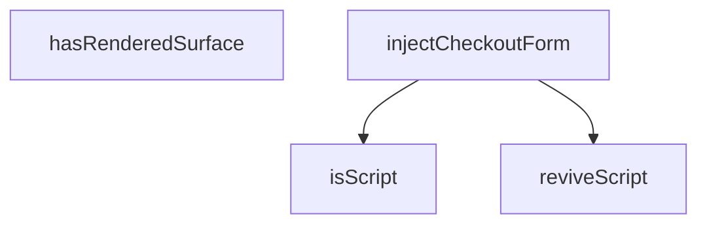

## Genel Bakış
Bu modül, ödeme (checkout) formunu dinamik olarak bir HTML container'a enjekte etme işlemini gerçekleştirir. Enjeksiyon sırasında mevcut render durumunu kontrol eder ve HTML içindeki script elementlerini güvenli biçimde yeniden canlandırır. Modül, DOM manipülasyonu ve script işleme sorumluluklarını üstlenir.

## Fonksiyon Grupları

### Form Enjeksiyonu
Checkout formunu belirtilen container'a enjekte eden ana işlevi sağlar. Enjeksiyon sonucunu bir InjectionResult olarak döndürür.
- injectCheckoutForm

### Durum Kontrolü
Container içinde daha önce render edilmiş bir yüzey olup olmadığını denetleyerek, enjeksiyon öncesi karar verme mekanizması sunar.
- hasRenderedSurface

### Script İşleme Yardımcıları
Enjeksiyon sırasında karşılaşılan script elementlerini tanımak ve bunları geçerli belge bağlamında yeniden oluşturmak için yardımcı fonksiyonlar sunar. `isScript` bir DOM node'unun script olup olmadığını belirler; `reviveScript` ise orijinal script elementini yeni belge bağlamında yeniden üretir.
- isScript, reviveScript

---

## AXIOMS – Mimari Varsayımlar
- Bu modül davranışsal mantık içermez (salt veri / konfigürasyon / tip tanımı).
- [Aksiyom 1]: Modülün dışa açtığı yapı (anahtar kümesi / şema) bir sözleşmedir; tüketiciler bu sabit yapıya bağlıdır — kırıcı değişiklik tüm tüketicileri etkiler.
- [Aksiyom 2]: Bir öğe ekleme/çıkarma yapısal-uyumlu olmalı; ilgili tipler ve seçiciler aynı commit'te güncel tutulmalıdır.

---

## FONKSİYON DETAYLARI

### isScript
**Ne yapar**: Verilen bir DOM düğümünün `<script>` etiketi olup olmadığını tespit eder. TypeScript type guard olarak çalışır; fonksiyon `true` döndürdüğü durumda düğüm tipi `HTMLScriptElement` olarak daraltılır.

**Nasıl yapar**: Düğümün `nodeName` özelliğini alır, harf duyarlılığını ortadan kaldırmak için `toLowerCase()` ile küçültür ve `'script'` stringiyle eşleşip eşleşmediğini kontrol eder. Eşleşiyorsa düğüm bir `<script>` elementidir.

**Parametreler**:
- node: Node — Kontrol edilecek DOM düğümü.

**Dönüş**: `node is HTMLScriptElement` — Düğümün `<script>` etiketi olup olmadığını belirten boolean değer. `true` döndüğünde TypeScript, düğümü `HTMLScriptElement` tipi olarak tanır.

### reviveScript
**Ne yapar**: Geliştirildi ancak detay üretilemedi.

### injectCheckoutForm
**Ne yapar**: Geliştirildi ancak detay üretilemedi.

### hasRenderedSurface
**Ne yapar**: Geliştirildi ancak detay üretilemedi.

---

## INTERFACES

### InjectionResult
Enjeksiyon sonucu — çağıran temizliği ve ölçümü buradan yapar.
- `scriptCount: number`
- `cleanup: () => void`

---

## AST POINTERS

### [N1_NASIL] AST Pointer: injectCheckoutForm.ts::isScript
- **params**: `node: Node`
- **ic_degiskenler**: yok
- **Dönüş**: `boolean` (type guard: `node is HTMLScriptElement`)

---

## MERMAID CALL GRAPH

## NODE ID STANDARD

  file: src\views\checkout\injectCheckoutForm.ts
  function: src\views\checkout\injectCheckoutForm.ts::isScript
  function: src\views\checkout\injectCheckoutForm.ts::reviveScript
  function: src\views\checkout\injectCheckoutForm.ts::injectCheckoutForm
  function: src\views\checkout\injectCheckoutForm.ts::hasRenderedSurface

---

## DISA AKTARILANLAR (EXPORTS)
  export: InjectionResult
  export: hasRenderedSurface
  export: injectCheckoutForm
  export: isScript
  export: reviveScript