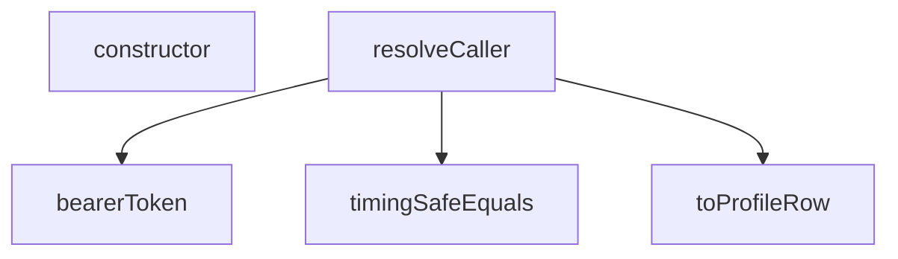

## Genel Bakış
Bu modül, Supabase fonksiyonlarına gelen isteklerden çağrıcı (caller) bağlamını çözümlemek için temel yardımcı fonksiyonları ve hata sınıflarını içerir. Bearer token çıkarma, güvenli string karşılaştırma ve profil satırına dönüştürme gibi işlemleri gerçekleştirir. Modül, çağrıcı kimliğini doğrulama ve yapılandırma hatalarını yönetme süreçlerinde kritik bir rol oynar.

## Fonksiyon Grupları
### Token ve Kimlik Doğrulama
Gelen HTTP isteğinden Bearer token bilgisini çıkarır ve döndürür.
- bearerToken

### Güvenlik ve Karşılaştırma
İki string değerini zamanlama saldırılarına karşı güvenli bir şekilde eşit olup olmadıklarını kontrol eder.
- timingSafeEquals

### Veri Dönüşümü
Bilinmeyen bir değeri `TenantProfileRow` türüne dönüştürmeye çalışar; başarısız olursa `null` döndürür.
- toProfileRow

### Ana Çözümleme
Gelen istekten ve isteğe bağlı olarak ayrıştırılmış gövdeden çağrıcı bağlamını çözümleyerek bir `CallerContext` nesnesi oluşturur.
- resolveCaller

### Hata Sınıfları
Yapılandırma eksikliklerinde ve çağrıcı arama hatalarında fırlatılmak üzere özel hata sınıfları tanımlar.
- CallerConfigError, CallerLookupError

---

## AXIOMS – Mimari Varsayımlar
- Bu modül davranışsal mantık içermez (salt veri / konfigürasyon / tip tanımı).
- [Aksiyom 1]: Modülün dışa açtığı yapı (anahtar kümesi / şema) bir sözleşmedir; tüketiciler bu sabit yapıya bağlıdır — kırıcı değişiklik tüm tüketicileri etkiler.
- [Aksiyom 2]: Bir öğe ekleme/çıkarma yapısal-uyumlu olmalı; ilgili tipler ve seçiciler aynı commit'te güncel tutulmalıdır.

---

## FONKSİYON DETAYLARI

### bearerToken
**Ne yapar**: HTTP isteğinin `Authorization` başlığındaki Bearer token'ı çıkarır. Başlık yoksa veya token boşsa `null` döner. Başlık adı büyük/küçük harf duyarsız olarak aranır.

**Nasıl yapar**: `request.headers.get('Authorization')` ile başlığı okur. Başlık yoksa `null` döner. Başlık varsa, tanımlı `BEARER_PREFIX_RE` düzenli ifadesiyle "Bearer " önekini kaldırır ve kalan kısmı boşluklardan arındırır (`trim`). Elde edilen token'ın uzunluğu sıfırdan büyükse token'ı, değilse `null` döndürür.

**Parametreler**:
- request: Request — HTTP isteği nesnesi. `Authorization` başlığı bu nesne üzerinden okunur.

**Dönüş**: `string | null` — Bulunan token dizesi ya da başlık yoksa/boşsa `null`.

### timingSafeEquals
**Ne yapar**: Geliştirildi ancak detay üretilemedi.

### toProfileRow
**Ne yapar**: Geliştirildi ancak detay üretilemedi.

### resolveCaller
**Ne yapar**: Geliştirildi ancak detay üretilemedi.

### constructor
**Ne yapar**: Geliştirildi ancak detay üretilemedi.

### constructor
**Ne yapar**: Geliştirildi ancak detay üretilemedi.

---

## İTHALATLAR (IMPORTS)
- import: https://esm.sh/@supabase/supabase-js@2.45.4::createClient

---

## INTERFACES

### CallerContext
- `readonly kind: CallerKind`
- `readonly user: VerifiedUser | null`
- `readonly role?: string`
- `readonly tenantId: string`
- `readonly source: TenantSource`

---

## TYPE ALIASES

### CallerKind
Cetvel §2'nin sınıflarının RUNTIME karşılığı: `service_role` → sınıf (b) · `user` → sınıf (a) · `anon` → kanıtsız çağıran. Sınıf (c)/(d) burada YOKTUR: onların kanıtı HMAC imzası/`pg_cron`'dur, `Authorization` başlığı değil. O uçlar `resolveCaller` kullanmaz, `tenantFromRow`'u kullanır.
```typescript
type CallerKind = 'service_role' | 'user' | 'anon'
```

---

## SABİTLER
- **BEARER_PREFIX_RE** (regex) — `/^Bearer\s+/i`
- **ANONYMOUS** (object) — `{
  kind: 'anon',
  user: null,
  tenantId: DEFAULT_TENANT_ID,
  source: ...`

---

## AST POINTERS

### [N1_NASIL] AST Pointer: caller.ts::CallerConfigError.constructor
- **params**: `missing: string`
- **ic_degiskenler**:
  - `missing` — eksik yapılandırma değişken adı; hata mesajında `CONFIG_MISSING:{missing}` biçiminde kullanılır
- **Dönüş**: yok (constructor; `this.name` alanını `'CallerConfigError'` olarak atar)

### [N2_NASIL] AST Pointer: caller.ts::CallerLookupError.constructor
- **params**: `detail: string`
- **ic_degiskenler**:
  - `detail` — profil sorgu hatasının açıklaması; hata mesajında `PROFILE_LOOKUP_FAILED:{detail}` biçiminde kullanılır
- **Dönüş**: yok (constructor; `this.name` alanını `'CallerLookupError'` olarak atar)

### [N3_NASIL] AST Pointer: caller.ts::bearerToken
- **params**: `request: Request`
- **ic_degiskenler**:
  - `header` — `request.headers.get('Authorization')` sonucu; Authorization header değeri, yoksa fonksiyon `null` döner
  - `token` — `header` değerinden `BEARER_PREFIX_RE` regex ile "Bearer " öneki çıkarıldıktan ve `trim()` uygulandıktan sonra kalan string
- **Dönüş**: `string | null` — çıkarılan token boşsa `null`, aksi halde token string'i

### [N4_NASIL] AST Pointer: caller.ts::timingSafeEquals
- **params**: `a: string`, `b: string`
- **ic_degiskenler**:
  - `encoder` — `new TextEncoder()` nesnesi; string'leri `Uint8Array`'e dönüştürmek için kullanılır
  - `left` — `encoder.encode(a)` sonucu; birinci parametrenin byte karşılığı
  - `right` — `encoder.encode(b)` sonucu; ikinci parametrenin byte karşılığı
  - `diff` — `left.length ^ right.length` ile başlatılır; döngüde her byte çifti arasındaki XOR farkları bitwise OR ile eklenir
  - `length` — `Math.max(left.length, right.length)`; döngü üst sınırı
  - `i` — döngü sayacı; `0`'dan `length`'e kadar iterasyon yapar
- **Dönüş**: `boolean` — `diff === 0` ise `true` (eşit), aksi halde `false`

### [N5_NASIL] AST Pointer: caller.ts::toProfileRow
- **params**: `value: unknown`
- **ic_degiskenler**:
  - `record` — `value`'nun `Record<string, unknown>` tipine cast edilmiş hali; `role` ve `tenant_id` alanlarına erişim için kullanılır
- **Dönüş**: `TenantProfileRow | null` — `value` nesne değilse veya `null` ise `null` döner; aksi halde `{ role: string | null, tenant_id: string | null }` nesnesi döner. `record.role` ve `record.tenant_id` string değilse ilgili alan `null` olarak atanır.

### [N6_NASIL] AST Pointer: caller.ts::resolveCaller
- **params**: `request: Request`, `parsedBody?: unknown`
- **ic_degiskenler**:
  - `supabaseUrl` — `Deno.env.get('SUPABASE_URL')` sonucu; boşsa `CallerConfigError('SUPABASE_URL')` fırlatılır
  - `serviceRoleKey` — `Deno.env.get('SUPABASE_SERVICE_ROLE_KEY')` sonucu; boşsa `CallerConfigError('SUPABASE_SERVICE_ROLE_KEY')` fırlatılır
  - `anonKey` — `Deno.env.get('SUPABASE_ANON_KEY')` sonucu; boşsa `CallerConfigError('SUPABASE_ANON_KEY')` fırlatılır
  - `token` — `bearerToken(request)` çağrısının dönüşü; `null` ise fonksiyon `ANONYMOUS` sabitini döner
  - `authClient` — `createClient(supabaseUrl, anonKey, { auth: { persistSession: false } })` ile oluşturulan Supabase istemcisi; JWT doğrulaması için kullanılır
  - `userData` — `authClient.auth.getUser(token)` çağrısının `data` kısmı; kullanıcı bilgisi içerir
  - `userError` — `authClient.auth.getUser(token)` çağrısının `error` kısmı; hata varsa `ANONYMOUS` döner
  - `authUser` — `userData?.user ?? null`; doğrulanmış kullanıcı nesnesi, `null` ise `ANONYMOUS` döner
  - `user` — `{ id: authUser.id, app_metadata: authUser.app_metadata ?? null }` biçimindeki `VerifiedUser` nesnesi
  - `admin` — `createClient(supabaseUrl, serviceRoleKey, { auth: { persistSession: false } })` ile oluşturulan Supabase istemcisi; profil sorgusu için kullanılır
  - `profileData` — `admin.from('user_profiles').select('role, tenant_id').eq('id', user.id).maybeSingle()` sorgusunun `data` kısmı
  - `profileError` — profil sorgusunun `error` kısmı; hata varsa `CallerLookupError(profileError.message)` fırlatılır
  - `profile` — `toProfileRow(profileData)` çağrısının dönüşü; `TenantProfileRow | null`
  - `decision` — service role yolunda `tenantFromServiceBody(parsedBody)`, user yolunda `tenantFromVerifiedUser(user, profile)` çağrısının dönüşü; `tenantId` ve `source` alanlarını içerir
- **Dönüş**: `Promise<CallerContext>` — `{ kind: 'service_role' | 'user', user: VerifiedUser | null, role?: string, tenantId: ..., source: ... }` biçiminde bağlam nesnesi

---


## MERMAID CALL GRAPH


## NODE ID STANDARD

  file: caller.ts
  function: caller.ts::bearerToken
  function: caller.ts::timingSafeEquals
  function: caller.ts::toProfileRow
  function: caller.ts::resolveCaller
  class: caller.ts::CallerConfigError
  class: caller.ts::CallerLookupError

---

## DISA AKTARILANLAR (EXPORTS)
  export: CallerConfigError
  export: CallerContext
  export: CallerKind
  export: CallerLookupError
  export: bearerToken
  export: resolveCaller
  export: timingSafeEquals
  export: toProfileRow