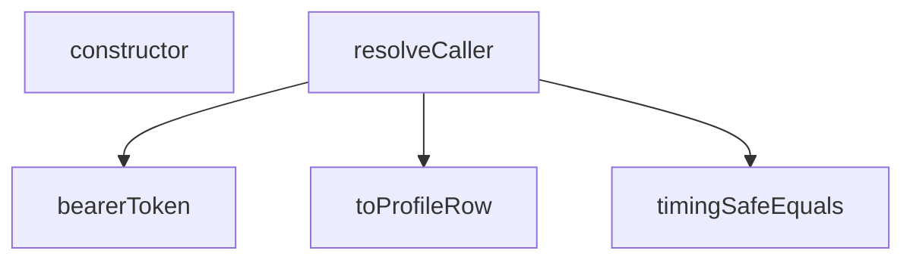

## Genel Bakış
Bu modül, Supabase Edge Functions ortamında HTTP isteklerinden çağrıyı (kullanıcı veya servis) çözmekten sorumlu merkezi bir yardımcı modüldür. Temel olarak kimlik doğrulama token'larını çıkarmak, güvenli karşılaştırmalar yapmak ve çağrı bağlamını oluşturmak için gerekli araçları sağlar. Modül, paylaşılan fonksiyonlar arasında ortak bir sorumluluk olarak kimlik doğrulama ve yetkilendirme süreçlerini merkezileştirir.

## Fonksiyon Grupları
### Token İşlemleri
HTTP isteklerinden kimlik doğrulama token'larını çıkarmak ve güvenli bir şekilde doğrulamak için temel araçları sağlar.
- bearerToken, timingSafeEquals

### Veri Dönüştürme
API'den gelen ham verileri uygulama tarafından tanımlanan tiplere (örneğin profil satırı) dönüştürür ve doğrular.
- toProfileRow

### Çağrı Çözme
Verilen HTTP isteğine göre çağrının kimliğini ve bağlamını çözen ana işlevi yürütür; bu süreç, token çıkarma ve veri dönüştürme gibi alt araçları bir araya getirerek dinamik bir kimlik doğrulama akışı oluşturur.
- resolveCaller

### Hata Yönetimi
Çağrı çözme sürecinde oluşabilecek yapılandırma veya arama hatalarını temsil eden özel hata sınıfları sunarak hatıralama ve hata yayma mekanizmalarını standartlaştırır.
- CallerConfigError, CallerLookupError

---

## AXIOMS – Mimari Varsayımlar

Bu modül, bir istekten (Request) çağrı sahibini (CallerContext) çıkaran paylaşımlı bir yardımcı modüldür.

**[Aksiyom 1]**: Eğer `resolveCaller` için geçerli bir `Request` nesnesi yoksa, `CallerContext` oluşturulamaz.

**[Aksiyom 2]**: Eğer `bearerToken` fonksiyonu bir token çıkaramıyorsa (null dönerse), modül bir yedek mekanizma kullanmalıdır (ANONYMOUS sabiti mevcuttur, bu amaçla kullanılır).

**[Aksiyom 3]**: Eğer `toProfileRow` fonksiyonu geçersiz bir `unknown` değeri alıysa, `TenantProfileRow | null` olarak `null` döner ve profil bilgisi kullanılamaz.

**[Aksiyom 4]**: Eğer `CallerConfigError` fırlatılıyorsa, modülün çalışması için gerekli bir yapılandırma (konfigürasyon) eksiktir ve modül çalışamaz.

**[Aksiyom 5]**: Eğer `CallerLookupError` fırlatılıyorsa, çağrı sahibi arama/çözümleme işleminde bir hata oluşmuştur ve detay bilgisi mevcuttur.

**[Aksiyom 6]**: Eğer `parsedBody` parametresi `resolveCaller`'a verilmezse (undefined), fonksiyon yine de çalışmalıdır (parametre opsiyoneldir).

**[Aksiyom 7]**: Eğer iki string karşılaştırması güvenlikli bir şekilde yapılması gerekiyorsa, `timingSafeEquals` kullanılmalıdır — zamanlama (timing) tabanlı saldırıları önlemek için.

**[Aksiyom 8]**: Eğer Authorization başlığındaki token `BEARER_PREFIX_RE` desenine uymuyorsa, token geçersiz kabul edilmelidir.

---

## FONKSİYON DETAYLARI

### bearerToken
**Ne yapar**: HTTP isteğinin `Authorization` başlığındaki taşıyıcı (bearer) jetonunu çıkarır. Başlık yoksa veya jeton boşsa `null` döner.
**Nasıl yapar**: `Request` nesnesinin başlıklarından `Authorization` başlığını büyük/küçük harf duyarsız olarak alır. Sabit bir regex deseni (`BEARER_PREFIX_RE`) kullanarak "Bearer " ön ekini temizler, kalan metni `trim()` ile boşluklardan arındırır ve uzunluğu sıfırdan büyükse jetonu, değilse `null` döner.
**Parametreler**:
- request: Request — Jetonun çıkarılacağı HTTP isteği nesnesi.
**Dönüş**: string | null — Doğrulanmış ve temizlenmiş jeton dizisi veya bulunamadığında `null`.

### timingSafeEquals
**Ne yapar**: İki dizeyi (string) sabit-zamanlı (timing-safe) bir şekilde karşılaştırır. Bu, zamanlama bilgisinin (örn. ne kadar çabuk farklılaştıkları) dışarı sızmasını engelleyerek hassas veri karşılaştırmalarını koruma altına alır.
**Nasıl yapar**: Her iki girdiyi de `TextEncoder` ile byte dizisine dönüştürür. Başlangıçta `diff` değişkenini iki uzunluğun XOR'una ayarlayarak uzunluk farkını hesaba katar. Daha sonra, her iki dizinin de byte'larını sırayla karşılaştırırken, olası uzunluk farklarını telafi etmek için eksik byte'ları `0` olarak işler. Her karşılaştırmada oluşan farkı `diff` üzerine OR ile biriktirir. Döngü, uzun olan dizinin boyunca çalışarak zamanlama sızıntısını önler. Sonunda `diff` sıfıra eşitse diziler özdeştir.
**Parametreler**:
- a: string — Karşılaştırılacak birinci dize.
- b: string — Karşılaştırılacak ikinci dize.
**Dönüş**: boolean — Diziler özdeş ise `true`, değilse `false`.

### toProfileRow
**Ne yapar**: PostgREST'ten (veya benzeri bir Veritabanı SDK'sından) dönen tipsiz (unknown) veri nesnesini, projenin tanımlı `TenantProfileRow` yapısına daraltır ve doğrular. Proje kuralı gereği tip uyumsuzluğu.runtime'da yakalanır.
**Nasıl yapar**: Girdi değerinin bir `object` olup olmadığını ve `null` olmadığını kontrol eder. Ardından, `role` ve `tenant_id` alanlarının varlığını ve string tipinde olduğunu doğrular. Sadece bu koşullar sağlanırsa ilgili alanları içeren bir nesne döner, aksi halde `null` döner.
**Parametreler**:
- value: unknown — Veritabanı sorgusundan dönen, önceden bilinmeyen (tipsiz) satır verisi.
**Dönüş**: TenantProfileRow | null — Doğrulanmış ve daraltılmış profil satırı nesnesi veya geçersiz veri durumunda `null`.

### resolveCaller
**Ne yapar**: Çağrı yapan (client) tarafın kimliğini, yetkisini ve ait olduğu kiracıyı (tenant) doğrular. Tüm kimlik doğrulama ve yetkilendirme mantığını merkezi olarak yöneten asenkron bir fonksiyondur.
**Nasıl yapar**: Kesin bir sırayla çalışır: 1) Ortam değişkenlerini yükler ve eksiklikler hata fırlatır. 2) `bearerToken` ile jetonu çıkarır, yoksa `anon` döner. 3) Jetonun `service_role` anahtarına sabit-zamanlı eşleşme ile eşleşip eşleşmediğini kontrol eder. Eşleşirse, istek gövdesinden (`parsedBody`) kiracı bilgisini (`tenantFromServiceBody`) çıkararak `service_role` bağlamı döner. 4) Eşleşmezse, `anonKey` ile Supabase Auth istemcisi oluşturup `getUser` ile jetonun geçerliliğini doğrular. Geçersizse yine `anon` döner. 5) Geçerli kullanıcı bulunursa, servis anahtarı ile `admin` istemcisi oluşturarak `user_profiles` tablosundan kullanıcının `role` ve `tenant_id` bilgisini tek bir sorguyla çeker (`toProfileRow` ile doğrular). 6) Son olarak, `tenantFromVerifiedUser` fonksiyonunu kullanarak nihai kiracı kararını verir ve `user` bağlamını döner.
**Parametreler**:
- request: Request — Çağrı yapanın HTTP isteği.
- parsedBody?: unknown — (Opsiyonel) service_role çağrısı için kiracı bilgisini içerebilecek, önceden ayrıştırılmış istek gövdesi.
**Dönüş**: Promise<CallerContext> — Çağrının kimliğini, türünü (`kind`), kullanıcısını (`user`), rolünü (`role`) ve ait olduğu kiracı (`tenantId`) ile kaynağı (`source`) içeren bağlam nesnesi.

### constructor
**Ne yapar**: Geliştirildi ancak detay üretilemedi.

### CallerLookupError.constructor
**Ne yapar**: Aynı `CallerLookupError` sınıfının, farklı bir varyasyonunu veya aynı oluşturucunun tekrarını temsil eder. Belirtilen girdiyle bir hata nesnesi başlatır.
**Nasıl yapar**: Önceki ile aynı mantığı izler: Eksik bilgiyi `CONFIG_MISSING:` formatında bir hata mesajına dönüştürerek üst sınıfa iletir ve sınıf adını ayarlar. Bu, kodda aynı hata sınıfının birden fazla kez (veya farklı bir yerde) kullanıldığını gösterebilir.
**Parametreler**:
- missing: string — Hatanın kaynağını belirten eksik bileşen veya anahtar adı.
**Dönüş**: N/A (Yapıcı fonksiyon).

---

## İTHALATLAR (IMPORTS)
- import: https://esm.sh/@supabase/supabase-js@2.45.4::createClient

---

## INTERFACES

### CallerContext
- `readonly kind: CallerKind`
- `readonly user: VerifiedUser | null`
- `readonly role?: string`
- `readonly tenantId: string`
- `readonly source: TenantSource`

---

## TYPE ALIASES

### CallerKind
Cetvel §2'nin sınıflarının RUNTIME karşılığı: `service_role` → sınıf (b) · `user` → sınıf (a) · `anon` → kanıtsız çağıran. Sınıf (c)/(d) burada YOKTUR: onların kanıtı HMAC imzası/`pg_cron`'dur, `Authorization` başlığı değil. O uçlar `resolveCaller` kullanmaz, `tenantFromRow`'u kullanır.
```typescript
type CallerKind = 'service_role' | 'user' | 'anon'
```

---

## SABİTLER
- **BEARER_PREFIX_RE** (regex) — `/^Bearer\s+/i`
- **ANONYMOUS** (object) — `{
  kind: 'anon',
  user: null,
  tenantId: DEFAULT_TENANT_ID,
  source: 'def...`

---

## AST POINTERS

### [N1_NASIL] AST Pointer: `_shared/caller.ts::CallerConfigError.constructor`
- **params**: `(missing: string)` — eksik olan config anahtarının adı
- **ic_degiskenler**:
  - *(parametre harici iç değişken yok — `this.name` ve `super()` çağrıları mevcut)*
- **Dönüş**: yok (yan etki: `this.name = 'CallerConfigError'` ayarlanır, super'e `CONFIG_MISSING:{missing}` mesajı iletilir)

### [N2_NASIL] AST Pointer: `_shared/caller.ts::CallerLookupError.constructor`
- **params**: `(detail: string)` — profil arama hata detayı
- **ic_degiskenler**:
  - *(parametre harici iç değişken yok — `this.name` ve `super()` çağrıları mevcut)*
- **Dönüş**: yok (yan etki: `this.name = 'CallerLookupError'` ayarlanır, super'e `PROFILE_LOOKUP_FAILED:{detail}` mesajı iletilir)

### [N3_NASIL] AST Pointer: `_shared/caller.ts::bearerToken`
- **params**: `(request: Request)` — HTTP isteği nesnesi
- **ic_degiskenler**:
  - `header` — `request.headers.get('Authorization')` ile alınan Authorization header değeri; yoksa null döner
  - `token` — `header`'dan `BEARER_PREFIX_RE` regex'i ile "Bearer " ön ekini kaldırıp trim edilmiş ham token stringi
- **Dönüş**: `string | null` — token varsa ve boş değilse string, aksi halde null

### [N4_NASIL] AST Pointer: `_shared/caller.ts::timingSafeEquals`
- **params**: `(a: string, b: string)` — karşılaştırılacak iki string (token veya key)
- **ic_degiskenler**:
  - `encoder` — `new TextEncoder()` — stringleri byte dizisine çeviren TextEncoder örneği
  - `left` — `encoder.encode(a)` ile elde edilen `a` string'inin byte dizisi
  - `right` — `encoder.encode(b)` ile elde edilen `b` string'inin byte dizisi
  - `diff` — iki byte dizisi arasındaki XOR fark bitmask'ı; başlangıçta `left.length ^ right.length` ile uzunluk farkını da taşır
  - `length` — `Math.max(left.length, right.length)` — uzun dizenin uzunluğu; döngü üst sınırı
  - `i` — for döngüsü sayacı; her byte pozisyonunu tarar
- **Dönüş**: `boolean` — `diff === 0` ise stringler eşittir (zamanlama-sağlam karşılaştırma)

### [N5_NASIL] AST Pointer: `_shared/caller.ts::toProfileRow`
- **params**: `(value: unknown)` — ham veritabanı satırı (Supabase `maybeSingle()` dönüşü)
- **ic_degiskenler**:
  - `record` — `value`'nin `Record<string, unknown>` olarak tip 캐스팅 hali; `role` ve `tenant_id` alanlarına erişim için kullanılır
- **Dönüş**: `TenantProfileRow | null` — `role` ve `tenant_id` alanlarını içeren obje veya geçersiz girişte null

### [N6_NASIL] AST Pointer: `_shared/caller.ts::resolveCaller`
- **params**: `(request: Request, parsedBody?: unknown)` — HTTP isteği ve opsiyonel parse edilmiş gövde (service_role karar verme için)
- **ic_degiskenler**:
  - `supabaseUrl` — `Deno.env.get('SUPABASE_URL')` ile alınan Supabase proje URL'i; boşsa `CallerConfigError` fırlatılır
  - `serviceRoleKey` — `Deno.env.get('SUPABASE_SERVICE_ROLE_KEY')` ile alınan service role anahtarı; boşsa `CallerConfigError` fırlatılır
  - `anonKey` — `Deno.env.get('SUPABASE_ANON_KEY')` ile alınan anon (public) anahtar; boşsa `CallerConfigError` fırlatılır
  - `token` — `bearerToken(request)` çağrısıyla Authorization header'dan çıkarılan ham JWT token; null ise `ANONYMOUS` döner
  - `authClient` — `createClient(supabaseUrl, anonKey, ...)` ile oluşturulan Supabase istemcisi; `persistSession: false` ile tarayıcı oturumu depolanmaz, sadece token doğrulama (`getUser`) için kullanılır
  - `userData` — `authClient.auth.getUser(token)` destructuring'inden gelen `{ data }` — Supabase auth kullanıcısı bilgisi
  - `userError` — `authClient.auth.getUser(token)` destructuring'inden gelen `{ error }` — auth hata nesnesi (JWT geçersizse dolu)
  - `authUser` — `userData?.user ?? null` ile çıkarılan Supabase AuthUser nesnesi veya null
  - `user` — `{ id: authUser.id, app_metadata: authUser.app_metadata ?? null }` yapısında `VerifiedUser` objesi; doğrulanmış kullanıcının ID ve metadata bilgisi
  - `admin` — `createClient(supabaseUrl, serviceRoleKey, ...)` ile oluşturulan Supabase istemcisi; service role yetkisiyle veritabanı sorguları (rol ve tenant okuma) için kullanılır
  - `profileData` — `admin.from('user_profiles').select('role, tenant_id').eq('id', user.id).maybeSingle()` destructuring'inden gelen `{ data }` — kullanıcının `role` ve `tenant_id` değerlerini içeren satır
  - `profileError` — aynı sorgudan gelen `{ error }` — profil sorgulama hatası; doluysa `CallerLookupError` fırlatılır
  - `profile` — `toProfileRow(profileData)` çağrısıyla dönüştürülmüş `TenantProfileRow | null`; kullanıcının rolü ve tenant ID'si
  - `decision` — iki farklı kolda atanır: service_role kolunda `tenantFromServiceBody(parsedBody)` ile (parsedBody'den tenant ID ve source çıkarılır), user kolunda `tenantFromVerifiedUser(user, profile)` ile (doğrulanmış kullanıcı ve profilden tenant ID ve source çıkarılır)
- **Dönüş**: `Promise<CallerContext>` — `{ kind, user, tenantId, source, role? }` yapısında çağırıcı bağlamı; three possibble kind değeri: `'anonymous'` (ANONYMOUS sabiti), `'service_role'`, `'user'`

---


## MERMAID CALL GRAPH


## NODE ID STANDARD

  file: supabase\functions\_shared\caller.ts
  function: supabase\functions\_shared\caller.ts::bearerToken
  function: supabase\functions\_shared\caller.ts::timingSafeEquals
  function: supabase\functions\_shared\caller.ts::toProfileRow
  function: supabase\functions\_shared\caller.ts::resolveCaller
  class: supabase\functions\_shared\caller.ts::CallerConfigError
  class: supabase\functions\_shared\caller.ts::CallerLookupError

---

## DISA AKTARILANLAR (EXPORTS)
  export: CallerConfigError
  export: CallerContext
  export: CallerKind
  export: CallerLookupError
  export: bearerToken
  export: resolveCaller
  export: timingSafeEquals
  export: toProfileRow