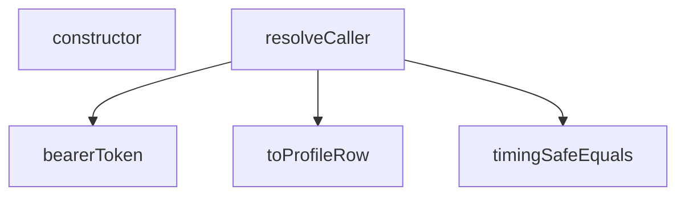

## Genel Bakış
Bu modül, Supabase fonksiyonlarına gelen isteklerden çağrıcı (caller) bağlamını çözümlemek için temel yardımcı fonksiyonları ve hata sınıflarını içerir. Bearer token çıkarma, güvenli string karşılaştırma ve profil satırına dönüştürme gibi işlemleri gerçekleştirir. Modül, çağrıcı kimliğini doğrulama ve yapılandırma hatalarını yönetme süreçlerinde kritik bir rol oynar.

## Fonksiyon Grupları
### Token ve Kimlik Doğrulama
Gelen HTTP isteğinden Bearer token bilgisini çıkarır ve döndürür.
- bearerToken

### Güvenlik ve Karşılaştırma
İki string değerini zamanlama saldırılarına karşı güvenli bir şekilde eşit olup olmadıklarını kontrol eder.
- timingSafeEquals

### Veri Dönüşümü
Bilinmeyen bir değeri `TenantProfileRow` türüne dönüştürmeye çalışar; başarısız olursa `null` döndürür.
- toProfileRow

### Ana Çözümleme
Gelen istekten ve isteğe bağlı olarak ayrıştırılmış gövdeden çağrıcı bağlamını çözümleyerek bir `CallerContext` nesnesi oluşturur.
- resolveCaller

### Hata Sınıfları
Yapılandırma eksikliklerinde ve çağrıcı arama hatalarında fırlatılmak üzere özel hata sınıfları tanımlar.
- CallerConfigError, CallerLookupError

---

## AXIOMS – Mimari Varsayımlar
- Bu modül davranışsal mantık içermez (salt veri / konfigürasyon / tip tanımı).
- [Aksiyom 1]: Modülün dışa açtığı yapı (anahtar kümesi / şema) bir sözleşmedir; tüketiciler bu sabit yapıya bağlıdır — kırıcı değişiklik tüm tüketicileri etkiler.
- [Aksiyom 2]: Bir öğe ekleme/çıkarma yapısal-uyumlu olmalı; ilgili tipler ve seçiciler aynı commit'te güncel tutulmalıdır.

---

## FONKSİYON DETAYLARI

### bearerToken
**Ne yapar**: HTTP isteğinin `Authorization` başlığındaki Bearer token'ı çıkarır. Başlık yoksa veya token boşsa `null` döner. Başlık adı büyük/küçük harf duyarsız olarak aranır.

**Nasıl yapar**: `request.headers.get('Authorization')` ile başlığı okur. Başlık yoksa `null` döner. Başlık varsa, tanımlı `BEARER_PREFIX_RE` düzenli ifadesiyle "Bearer " önekini kaldırır ve kalan kısmı boşluklardan arındırır (`trim`). Elde edilen token'ın uzunluğu sıfırdan büyükse token'ı, değilse `null` döndürür.

**Parametreler**:
- request: Request — HTTP isteği nesnesi. `Authorization` başlığı bu nesne üzerinden okunur.

**Dönüş**: `string | null` — Bulunan token dizesi ya da başlık yoksa/boşsa `null`.

### timingSafeEquals
**Ne yapar**: Geliştirildi ancak detay üretilemedi.

### toProfileRow
**Ne yapar**: Geliştirildi ancak detay üretilemedi.

### resolveCaller
**Ne yapar**: Geliştirildi ancak detay üretilemedi.

### constructor
**Ne yapar**: `CallerLookupError` sınıfının yapıcı metodudur. Yapılandırma bilgisi eksik olduğunda fırlatılacak hata nesnesini başlatır ve hata mesajını standart bir formatta oluşturur.

**Nasıl yapar**: Üst sınıfın (`Error`) yapıcı metodunu `super()` aracılığıyla çağırır ve `CONFIG_MISSING:` öneki ile birlikte eksik yapılandırma bilgisini hata mesajı olarak iletir. Ardından `this.name` özelliğini `'CallerConfigError'` olarak ayarlayarak hatanın türünü tanımlar.

**Parametreler**:
- missing: string — Eksik olan yapılandırma bilgisinin adını veya tanımlayıcısını içerir. Bu değer hata mesajına `CONFIG_MISSING:{missing}` formatında eklenir.

**Dönüş**: void — Yapıcı metodlar bir değer döndürmez, nesne örneğini başlatır.

### constructor
**Ne yapar**: `CallerLookupError` sınıfının yapıcı metodudur. Yapılandırma bilgisi eksik olduğunda fırlatılacak hata nesnesini başlatır ve hata mesajını standart bir formatta oluşturur.

**Nasıl yapar**: Üst sınıfın (`Error`) yapıcı metodunu `super()` aracılığıyla çağırır ve `CONFIG_MISSING:` öneki ile birlikte eksik yapılandırma bilgisini hata mesajı olarak iletir. Ardından `this.name` özelliğini `'CallerConfigError'` olarak ayarlayarak hatanın türünü tanımlar.

**Parametreler**:
- missing: string — Eksik olan yapılandırma bilgisinin adını veya tanımlayıcısını içerir. Bu değer hata mesajına `CONFIG_MISSING:{missing}` formatında eklenir.

**Dönüş**: void — Yapıcı metodlar bir değer döndürmez, nesne örneğini başlatır.

---

## İTHALATLAR (IMPORTS)
- import: https://esm.sh/@supabase/supabase-js@2.45.4::createClient

---

## INTERFACES

### CallerContext
- `readonly kind: CallerKind`
- `readonly user: VerifiedUser | null`
- `readonly role?: string`
- `readonly tenantId: string`
- `readonly source: TenantSource`

---

## TYPE ALIASES

### CallerKind
Cetvel §2'nin sınıflarının RUNTIME karşılığı: `service_role` → sınıf (b) · `user` → sınıf (a) · `anon` → kanıtsız çağıran. Sınıf (c)/(d) burada YOKTUR: onların kanıtı HMAC imzası/`pg_cron`'dur, `Authorization` başlığı değil. O uçlar `resolveCaller` kullanmaz, `tenantFromRow`'u kullanır.
```typescript
type CallerKind = 'service_role' | 'user' | 'anon'
```

---

## SABİTLER
- **BEARER_PREFIX_RE** (regex) — `/^Bearer\s+/i`
- **ANONYMOUS** (object) — `{
  kind: 'anon',
  user: null,
  tenantId: DEFAULT_TENANT_ID,
  source: ...`

---

## AST POINTERS

### [N1_NASIL] AST Pointer: caller.ts::CallerConfigError.constructor
- **params**: `missing: string`
- **ic_degiskenler**: yok
- **Dönüş**: yok (constructor; `this.name` alanını `'CallerConfigError'` olarak atar, üst sınıfa `CONFIG_MISSING:${missing}` mesajı iletir)

### [N2_NASIL] AST Pointer: caller.ts::CallerLookupError.constructor
- **params**: `detail: string`
- **ic_degiskenler**: yok
- **Dönüş**: yok (constructor; `this.name` alanını `'CallerLookupError'` olarak atar, üst sınıfa `PROFILE_LOOKUP_FAILED:${detail}` mesajı iletir)

### [N3_NASIL] AST Pointer: caller.ts::bearerToken
- **params**: `request: Request`
- **ic_degiskenler**:
  - `header` — `request.headers.get('Authorization')` sonucu; Authorization başlığının ham değeri
  - `token` — `header` değerinden `BEARER_PREFIX_RE` ile eşleşen önek çıkarılıp `trim()` uygulanmış hali
- **Dönüş**: `string | null` — başlık yoksa `null`, önek çıkarıldıktan sonra boş string ise `null`, aksi halde token string'i

### [N4_NASIL] AST Pointer: caller.ts::timingSafeEquals
- **params**: `a: string`, `b: string`
- **ic_degiskenler**:
  - `encoder` — `new TextEncoder()` örneği; string'leri byte dizisine dönüştürmek için
  - `left` — `encoder.encode(a)` sonucu; `a` parametresinin Uint8Array karşılığı
  - `right` — `encoder.encode(b)` sonucu; `b` parametresinin Uint8Array karşılığı
  - `diff` — başlangıçta `left.length ^ right.length` (uzunluk farkı XOR); döngüde her byte çiftinin OR birikimli XOR farkı
  - `length` — `Math.max(left.length, right.length)`; döngü üst sınırı
  - `i` — döngü sayacı; `0`'dan `length`'e kadar iterasyon indeksi
- **Dönüş**: `boolean` — `diff === 0` ise `true` (değerler eşit), aksi halde `false`

### [N5_NASIL] AST Pointer: caller.ts::toProfileRow
- **params**: `value: unknown`
- **ic_degiskenler**:
  - `record` — `value`'nun `Record<string, unknown>` olarak cast edilmiş hali; `role` ve `tenant_id` alanlarına erişim için kullanılır
- **Dönüş**: `TenantProfileRow | null` — `value` nesne değilse veya `null` ise `null`; aksi halde `role` (string ise, değilse `null`) ve `tenant_id` (string ise, değilse `null`) alanlarından oluşan nesne

### [N6_NASIL] AST Pointer: caller.ts::resolveCaller
- **params**: `request: Request`, `parsedBody?: unknown`
- **ic_degiskenler**:
  - `supabaseUrl` — `Deno.env.get('SUPABASE_URL') ?? ''` sonucu; boş ise `CallerConfigError` fırlatır
  - `serviceRoleKey` — `Deno.env.get('SUPABASE_SERVICE_ROLE_KEY') ?? ''` sonucu; boş ise `CallerConfigError` fırlatır
  - `anonKey` — `Deno.env.get('SUPABASE_ANON_KEY') ?? ''` sonucu; boş ise `CallerConfigError` fırlatır
  - `token` — `bearerToken(request)` sonucu; `null` ise `ANONYMOUS` döner
  - `authClient` — `createClient(supabaseUrl, anonKey, { auth: { persistSession: false } })` ile oluşturulan Supabase istemcisi; JWT doğrulaması için
  - `userData` — `authClient.auth.getUser(token)` yanıtının `data` kısmı
  - `userError` — `authClient.auth.getUser(token)` yanıtının `error` kısmı; varsa `ANONYMOUS` döner
  - `authUser` — `userData?.user ?? null`; doğrulanmış kullanıcı nesnesi, yoksa `ANONYMOUS` döner
  - `user` — `{ id: authUser.id, app_metadata: authUser.app_metadata ?? null }` biçimindeki `VerifiedUser` nesnesi
  - `admin` — `createClient(supabaseUrl, serviceRoleKey, { auth: { persistSession: false } })` ile oluşturulan Supabase istemcisi; profil sorgusu için
  - `profileData` — `admin.from('user_profiles').select('role, tenant_id').eq('id', user.id).maybeSingle()` sorgusunun `data` kısmı
  - `profileError` — aynı sorgunun `error` kısmı; varsa `CallerLookupError` fırlatır
  - `profile` — `toProfileRow(profileData)` sonucu; `role` ve `tenant_id` alanlarını içeren nesne veya `null`
  - `decision` — service_role yolunda `tenantFromServiceBody(parsedBody)`, user yolunda `tenantFromVerifiedUser(user, profile)` sonucu; `tenantId` ve `source` alanlarını içerir
- **Dönüş**: `Promise<CallerContext>` — `kind` (`'service_role'` veya `'user'`), `user` (service_role'da `null`, user'da `VerifiedUser`), `role` (sadece user yolunda, `profile?.role`), `tenantId`, `source` alanlarından oluşan nesne

---


## MERMAID CALL GRAPH


## NODE ID STANDARD

  file: supabase\functions\_shared\caller.ts
  function: supabase\functions\_shared\caller.ts::bearerToken
  function: supabase\functions\_shared\caller.ts::timingSafeEquals
  function: supabase\functions\_shared\caller.ts::toProfileRow
  function: supabase\functions\_shared\caller.ts::resolveCaller
  class: supabase\functions\_shared\caller.ts::CallerConfigError
  class: supabase\functions\_shared\caller.ts::CallerLookupError

---

## DISA AKTARILANLAR (EXPORTS)
  export: CallerConfigError
  export: CallerContext
  export: CallerKind
  export: CallerLookupError
  export: bearerToken
  export: resolveCaller
  export: timingSafeEquals
  export: toProfileRow

## Tasarım Gerekçeleri (kaynaktan BİREBİR)

> Bu bölüm LLM tarafından **yazılmadı**; kaynaktaki işaretli bloklardan
> birebir kopyalandı. Özetlenmesi veya yeniden ifade edilmesi YASAKTIR —
> gerekçenin değeri tam olarak kelimelerindedir.


```text
NİÇİN BU DOSYA VAR
-----------------
Cetvel §3.2/§3.3'ün kanonik kapısı ("kimlik → yetki → ancak sonra service_role")
bugün 5 bildirim ucunda + 3 admin ucunda KOPYALA-YAPIŞTIR hâlde duruyor ve her kopya
birbirinden biraz farklı: kimi `getUser`'ı tenant çözümünden SONRA çağırıyor, kimi rol
satırını `tenant_id` ile filtreliyor, kimi hata dalında sessizce devam ediyor. Sekiz
kopya = sekiz farklı güvenlik duruşu; birini düzeltmek diğer yediyi düzeltmiyor.
Bu modül o kapıyı TEK yere indirir: `resolveCaller(request, parsedBody)`.

NİÇİN ROL VE TENANT AYNI SORGUDAN
----------------------------------
Eski kod önce tenant'ı çözüyor, sonra profili `id=eq.<x>&tenant_id=eq.<tenant>` ile
filtreliyordu — yani "kullanıcının tenant'ını öğrenmek için tenant'ı bilmek" gerekiyordu.
Bu döngü, tenant'ın istekten okunmasının GEREKÇESİYDİ. Döngüyü kırmanın tek yolu:
filtre YALNIZ doğrulanmış `user.id`, `select` ise `role, tenant_id` — tek satır, tek
round-trip, sıfır ek maliyet. Tenant artık sorgunun GİRDİSİ değil, SONUCU.

NİÇİN `getUser` EN FAZLA BİR KEZ
---------------------------------
12 çağıranın 8'i zaten kendi `getUser`'ını çağırıyor. Tenant modülü kendi başına bir
`getUser` daha yapsaydı o 8 uçta İKİNCİ bir Auth round-trip'i doğardı (performans
regresyonu). Burada tek çağrı var ve sonucu (`user` + `role` + `tenantId`) çağırana
birlikte veriliyor; çağıranın ayrıca `getUser` çağırmasına gerek kalmaz.

NİÇİN SABİT-ZAMANLI ANAHTAR KARŞILAŞTIRMASI
--------------------------------------------
`authHeader === 'Bearer ' + serviceKey` erken çıkışlı bir karşılaştırmadır; teorik
olarak anahtar baytları zamanlamayla sızdırılabilir. Sır karşılaştırmasında sabit-zamanlı
olmak cetvel §3.5'in webhook imzaları için zaten dayattığı disiplin — service_role
anahtarı ondan daha değerli olduğu için aynı disiplin burada da uygulanır.

NE YAPMAZ
---------
Karar VERMEZ, yalnız KANITI TOPLAR. "Bu `kind`/`role` bu ucu çağırabilir mi?" sorusunu
çağıran uç yanıtlar (401/403 onun sorumluluğu) — çünkü cevap uca göre değişir:
sınıf (a) uçları rol ister, sınıf (a+b) uçları service_role'ü de kabul eder.
```
