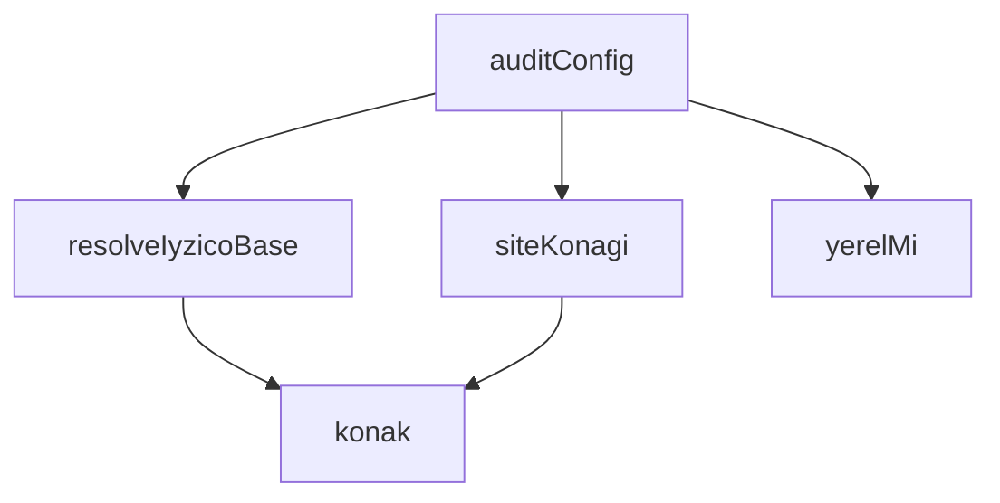

## Genel Bakış
Bu modül, uygulama konfigürasyonunun doğruluğunu ve tutarlılığını denetlemekten sorumludur. Ortam değişkenlerinden hostname çözümleme, yerel ortam tespiti ve Iyzico ödeme altyapısı yapılandırmasının kontrolü gibi işlemleri gerçekleştirir. `auditConfig` fonksiyonu, tüm bu kontrolleri bir araya getirerek kapsamlı bir yapılandırma raporu üretir.

## Fonksiyon Grupları

### Hostname İşleme
Ham hostname verisini çözümlemek, site hostname'ini ortam değişkenlerinden almak ve verilen bir adresin yerel (localhost) ortama ait olup olmadığını tespit etmekle sorumludur.
- `konak`, `siteKonagi`, `yerelMi`

### Ödeme Altyapısı Yapılandırması
Iyzico ödeme sisteminin base URL'ini ve çalışılacak ortamı (prod veya sandbox) ortam değişkenlerine göre çözümlemekten sorumludur.
- `resolveIyzicoBase`

### Konfigürasyon Denetimi
Tüm yapılandırma bileşenlerini (hostname, ödeme altyapısı vb.) denetleyerek bir `ConfigRaporu` üretmekten sorumludur. Bu fonksiyon, modülün ana giriş noktasıdır ve diğer fonksiyonları koordine eder.
- `auditConfig`

---

## AXIOMS – Mimari Varsayımlar
- Bu modül davranışsal mantık içermez (salt veri / konfigürasyon / tip tanımı).
- [Aksiyom 1]: Modülün dışa açtığı yapı (anahtar kümesi / şema) bir sözleşmedir; tüketiciler bu sabit yapıya bağlıdır — kırıcı değişiklik tüm tüketicileri etkiler.
- [Aksiyom 2]: Bir öğe ekleme/çıkarma yapısal-uyumlu olmalı; ilgili tipler ve seçiciler aynı commit'te güncel tutulmalıdır.

---

## FONKSİYON DETAYLARI

### konak
**Ne yapar**: Verilen bir URL dizesinden konak (host) adını çıkarır. Geçerli bir `http:` veya `https:` protokolüne sahip olmayan ya da ayrıştırılamayan değerler için `null` döner.

**Nasıl yapar**: Önce gelen değeri boşluklardan arındırır; boşsa `null` döndürür. Ardından `new URL()` ile dizeyi ayrıştırmaya çalışır. Protokol yalnızca `http:` veya `https:` ise `u.host` değerini döndürür; diğer protokollerde `null` döner. Ayrıştırma hatası oluşursa yakalanır ve `null` döndürülür.

**Parametreler**:
- raw: `string | undefined` — Ayrıştırılacak ham URL dizesi. `undefined` olabilir; bu durumda boş dize olarak ele alınır.

**Dönüş**: `string | null` — Geçerli bir konak adı bulunduysa o dizeyi, aksi halde `null` döndürür.

### resolveIyzicoBase
**Ne yapar**: Geliştirildi ancak detay üretilemedi.

### siteKonagi
**Ne yapar**: Geliştirildi ancak detay üretilemedi.

### yerelMi
**Ne yapar**: Geliştirildi ancak detay üretilemedi.

### auditConfig
**Ne yapar**: Geliştirildi ancak detay üretilemedi.

---

## INTERFACES

### ConfigBulgu
- `ad: string`
- `hukum: Hukum`
- `not: string`

### ConfigRaporu
- `olculdu: boolean`
- `odemeOrtami: 'prod' | 'sandbox' | 'bilinmiyor'`
- `siteOrtami: 'prod' | 'yerel' | 'bilinmiyor'`
- `bulgular: ConfigBulgu[]`
- `saglikli: boolean`

---

## TYPE ALIASES

### Hukum
```typescript
type Hukum = 'ok' | 'eksik' | 'gecersiz' | 'tutarsiz'
```

### Env
```typescript
type Env = Record<string, string | undefined>
```

---

## SABİTLER
- **SANDBOX_IPUCU** (regex) — `/sandbox/i`

---

## AST POINTERS

### [N1_NASIL] AST Pointer: config_audit.ts::konak
- **params**: `raw: string | undefined`
- **ic_degiskenler**:
  - `v` — `raw` parametresinin `??` ile boş string'e düşürülüp `.trim()` ile boşluklardan arındırılmış hali; boşsa fonksiyon `null` döner
  - `u` — `v` string'inden `new URL(v)` ile oluşturulan URL nesnesi; protokol `http:` veya `https:` değilse `null` döner
- **Dönüş**: `string | null` — geçerli bir URL ise `u.host` (protokolsüz alan adı + port), aksi halde `null`

### [N2_NASIL] AST Pointer: config_audit.ts::resolveIyzicoBase
- **params**: `env: Env`
- **ic_degiskenler**:
  - `ham` — `env.IYZICO_BASE_URL` değerinin `??` ile boş string'e düşürülüp `.trim()` edilmiş hali; boşsa fonksiyon `null` döner
  - `h` — `ham` string'inden `konak(ham)` çağrılarak çıkarılan host bilgisi; `null` ise fonksiyon `null` döner
- **Dönüş**: `{ base: string; ortam: 'prod' | 'sandbox' } | null` — `base`: sondaki eğik çizgileri temizlenmiş ham URL (`ham.replace(/\/+$/, '')`); `ortam`: `h` üzerinde `SANDBOX_IPUCU` regex'i test edilerek `'sandbox'` veya `'prod'` belirlenir; geçersizse `null`

### [N3_NASIL] AST Pointer: config_audit.ts::siteKonagi
- **params**: `env: Env`
- **ic_degiskenler**: yok — doğrudan zincirleme `??` operatörleriyle tek ifade döndürülür
- **Dönüş**: `string | null` — `konak(env.PUBLIC_SITE_URL)` başarılıysa onu, değilse `konak(env.FRONTEND_URL)`, o da değilse `konak(env.SITE_URL)` sonucunu döner; üçü de `null` ise `null`

### [N4_NASIL] AST Pointer: config_audit.ts::yerelMi
- **params**: `host: string`
- **ic_degiskenler**: yok — doğrudan regex test sonucu döndürülür
- **Dönüş**: `boolean` — `host` parametresi `localhost`, `127.0.0.1`, `0.0.0.0` veya `[::1]` ile başlayıp opsiyonel `:port` içeriyorsa `true`, aksi halde `false`; büyük/küçük harf duyarsız (`i` flag)

### [N5_NASIL] AST Pointer: config_audit.ts::auditConfig
- **params**: `env: Env`
- **ic_degiskenler**:
  - `bulgular` — `ConfigBulgu[]` tipinde dizi; tüm denetim bulgularını toplar, fonksiyon sonunda `ConfigRaporu.bulgular` olarak döner
  - `iyz` — `resolveIyzicoBase(env)` çağrısının sonucu; ödeme ucu yapılandırmasını temsil eder, `null` ise ödeme ucu çözülememiştir
  - `odemeOrtami` — `ConfigRaporu['odemeOrtami']` tipinde; `iyz` varsa `iyz.ortam` (`'prod'` veya `'sandbox'`), yoksa `'bilinmiyor'`
  - `ad` — `for` döngüsünde `'IYZICO_API_KEY'` ve `'IYZICO_SECRET_KEY'` değerlerini sırayla alan değişken
  - `dolu` — `env[ad]` değerinin `??` ile boş string'e düşürülüp `.trim().length > 0` ile kontrol edilen boolean; anahtarın tanımlı olup olmadığını belirtir
  - `site` — `siteKonagi(env)` çağrısının sonucu; kanonik site host bilgisi
  - `siteOrtami` — `ConfigRaporu['siteOrtami']` tipinde; `site` varsa `yerelMi(site)` sonucuna göre `'yerel'` veya `'prod'`, yoksa `'bilinmiyor'`
  - `origins` — `env.ALLOWED_ORIGINS` değerinin `??` ile boş string'e düşürülüp `.split(',')` ile ayrıştırılması, `.map(s => s.trim())` ile temizlenmesi ve `.filter(Boolean)` ile boş olmayanların filtrelenmesi sonucu oluşan string dizisi
  - `saglikli` — `bulgular.every(b => b.hukum === 'ok')` sonucu; tüm bulgular `'ok'` ise `true`, aksi halde `false`
- **Dönüş**: `ConfigRaporu` — `{ olculdu: true, odemeOrtami, siteOrtami, bulgular, saglikli }` yapısında rapor nesnesi

---


## MERMAID CALL GRAPH


## NODE ID STANDARD

  file: supabase\functions\_shared\config_audit.ts
  function: supabase\functions\_shared\config_audit.ts::konak
  function: supabase\functions\_shared\config_audit.ts::resolveIyzicoBase
  function: supabase\functions\_shared\config_audit.ts::siteKonagi
  function: supabase\functions\_shared\config_audit.ts::yerelMi
  function: supabase\functions\_shared\config_audit.ts::auditConfig

---

## DISA AKTARILANLAR (EXPORTS)
  export: ConfigBulgu
  export: ConfigRaporu
  export: Hukum
  export: auditConfig
  export: konak
  export: resolveIyzicoBase
  export: siteKonagi
  export: yerelMi

## Tasarım Gerekçeleri (kaynaktan BİREBİR)

> Bu bölüm LLM tarafından **yazılmadı**; kaynaktaki işaretli bloklardan
> birebir kopyalandı. Özetlenmesi veya yeniden ifade edilmesi YASAKTIR —
> gerekçenin değeri tam olarak kelimelerindedir.


```text
NİÇİN VAR (T100-VH · 2026-08-19)
--------------------------------
Bu depoda yapılandırma kusurları defalarca **sessizce** yaşadı. Tekrarlayan desen şu:
bir değişken okunur, yoksa "makul bir varsayılan" devreye girer, iş yeşil döner ve
sistem BAŞKA BİR ŞEY YAPMAYA başlar. Kimse bir hata görmediği için kimse bakmaz.

Ölçülen üç somut hâl (hepsi master'dan okundu, tahmin değil):

1. IYZICO_BASE_URL yoksa üç uç birden **sandbox'a** düşüyordu. Hemen alt satırda
IYZICO_API_KEY / IYZICO_SECRET_KEY için fail-CLOSED kontrol vardı: anahtar
eksikse duruyoruz, ama UÇ eksikse başka bir ortama gidiyoruz. iyzico-callback
içindeki T022-VH yorumu tehlikeyi zaten adıyla anlatıyordu ("para çekilir, sipariş
doğrulanamaz"); o düzeltme sabit-kodu env'e taşırken **sandbox varsayılanını
korumuştu**. Sınıf kapanmamış, yalnızca yer değiştirmişti.
2. healthz ölçemediğinde ok:true dönüyordu — "ölçülemedi" yalnızca bir ETİKETTİ.
3. Site adresi dört değişkende yaşıyor; hepsi boşsa ödeme sonrası yönlendirme hiç
yapılmıyor ve bu durum hiçbir yere yazılmıyor.

TASARIM KARARI — "yok" ile "ölçülemedi" ile "yanlış" AYRI ÜÇ CEVAPTIR.
Bu modül hüküm verir, karar vermez: çağıran uç hükme bakıp fail-closed davranır.
Hiçbir sır DEĞERİ döndürülmez — yalnızca varlık/tutarlılık hükmü ve (URL'ler için)
konak adı. Konak adı sır değildir ve teşhisin tamamı ona bağlıdır.
```
