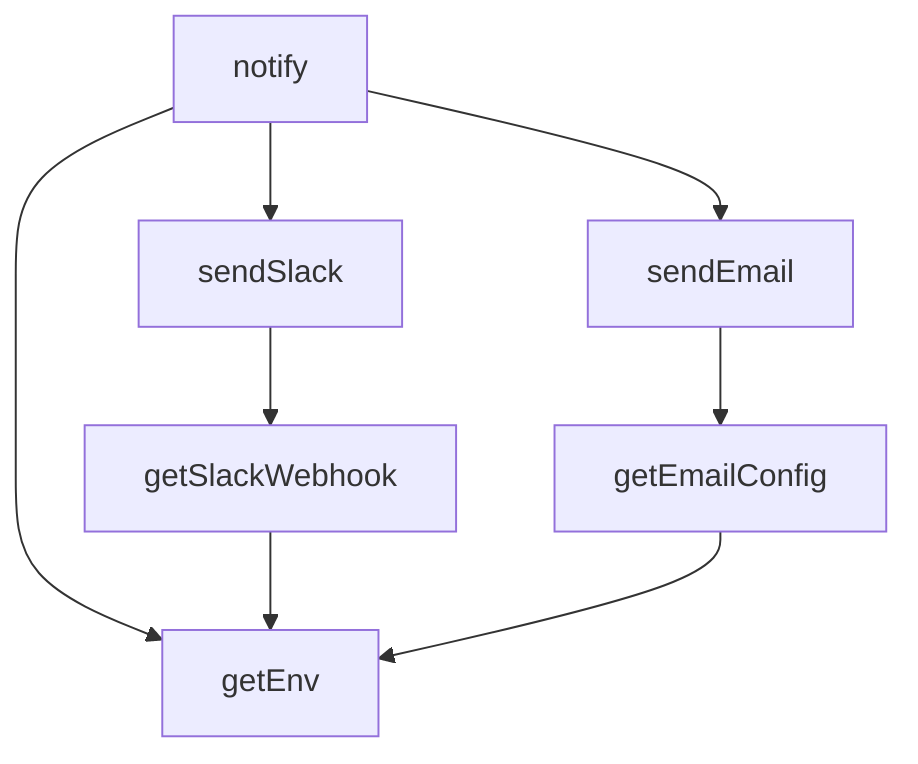

## Genel Bakış

Bu modül, uygulama genelinde bildirim gönderme işlemlerini merkezi olarak yönetir. Slack ve e-posta olmak üzere iki farklı kanal üzerinden bildirim iletimi sağlar. Ortam değişkenlerinden yapılandırma bilgilerini okuyarak ilgili servislere erişim gerçekleştirir.

## Fonksiyon Grupları

### Yapılandırma ve Ortam Değişkeni Okuyucuları
Ortam değişkenlerini ve harici servis bağlantı bilgilerini okuyarak diğer fonksiyonlara temel yapılandırma sağlar.
- getEnv, getSlackWebhook, getEmailConfig

### Kanal Bazlı Gönderim
Belirtilen mesaj ve alan bilgilerini ilgili harici servise (Slack veya e-posta) gönderir. Her biri tek bir iletişim kanalına yönelik çalışır.
- sendSlack, sendEmail

### Ana Bildirim Arayüzü
Üst düzey bir bildirim fonksiyonu olarak, metin ve alan bilgilerini alır ve bildirim gönderimini başlatır. Modülün dış dünyaya açılan ana giriş noktasıdır.
- notify

---

## AXIOMS – Mimari Varsayımlar

[Aksiyom 1]: Eğer `getEnv` fonksiyonuna verilen `key` parametresine karşılık gelen ortam değişkeni tanımlı değilse, fonksiyonun davranışı belirsizdir (dönüş tipi `string` olarak tanımlı, null dönüş izni yok).

[Aksiyom 2]: Eğer Slack webhook yapılandırması mevcut değilse, `getSlackWebhook()` fonksiyonu `null` döner ve Slack bildirimleri gönderilemez.

[Aksiyom 3]: Eğer `sendSlack` fonksiyonuna boş `text` verilirse, Slack API'sinin bu isteği kabul edip etmeyeceği bilinmiyor.

[Aksiyom 4]: Eğer `sendEmail` fonksiyonuna boş `subject` veya boş `text` verilirse, e-posta gönderiminin başarılı olup olmayacağı bilinmiyor.

[Aksiyom 5]: Eğer `notify` fonksiyonu çağrıldığında Slack webhook yapılandırması mevcut değilse, Slack bildirimi gönderilmez (sessizce atlanır mı yoksa hata mı üretir bilinmiyor).

[Aksiyom 6]: Eğer `notify` fonksiyonu çağrıldığında e-posta yapılandırması mevcut değilse, e-posta bildirimi gönderilmez (sessizce atlanır mı yoksa hata mı üretir bilinmiyor).

[Aksiyom 7]: Eğer harici servisler (Slack API, e-posta sunucusu) erişilemezse, ilgili `sendSlack` veya `sendEmail` fonksiyonu başarısız olur.

[Aksiyom 8]: `fields` parametresi opsiyoneldir; verilmediğinde bildirim düz metin olarak gönderilir.

---

## FONKSİYON DETAYLARI

### getEnv
**Ne yapar**: Verilen bir ortam değişkeni anahtarına karşılık gelen değeri döndüren yardımcı fonksiyondur. Fonksiyonun gövdesi bu kaynak dosyada tanımlanmamış olup yalnızca imzası belirtilmiştir.

**Nasıl yapar**: Gövde mevcut olmadığından iç mantık bilinmiyor. Çağrıldığı yerlerden anlaşıldığı kadarıyla ortam değişkenlerini (environment variables) okuyup string olarak döndürmektedir.

**Parametreler**:
- key: string — Okunacak ortam değişkeninin adı

**Dönüş**: string — İlgili ortam değişkeninin değeri

### getSlackWebhook
**Ne yapar**: Geliştirildi ancak detay üretilemedi.

### getEmailConfig
**Ne yapar**: Geliştirildi ancak detay üretilemedi.

### sendSlack
**Ne yapar**: Geliştirildi ancak detay üretilemedi.

### sendEmail
**Ne yapar**: Geliştirildi ancak detay üretilemedi.

### notify
**Ne yapar**: Geliştirildi ancak detay üretilemedi.

---

## TYPE ALIASES

### NotifyField
```typescript
type NotifyField = { title: string; value: string; short?: boolean }
```

---

## SABİTLER
- **notify** (unknown)

---

## AST POINTERS

### [N1_NASIL] AST Pointer: supabase/functions/_shared/notify.ts::getEnv
- **params**: `key: string` — ortam değişkeni adı
- **ic_degiskenler**: yok
- **Dönüş**: `string` — ortam değişkeni değeri; bulunamazsa veya hata oluşursa boş string (`''`)

### [N2_NASIL] AST Pointer: supabase/functions/_shared/notify.ts::getSlackWebhook
- **params**: yok
- **ic_degiskenler**:
  - `url` — `getEnv('SLACK_WEBHOOK_URL')` ile alınan Slack webhook URL değeri
- **Dönüş**: `string | null` — URL `https://` ile başlıyorsa URL, aksi halde `null`

### [N3_NASIL] AST Pointer: supabase/functions/_shared/notify.ts::getEmailConfig
- **params**: yok
- **ic_degiskenler**:
  - `to` — `getEnv('NOTIFY_EMAIL')` ile alınan bildirim e-posta adresi
  - `supabaseUrl` — `getEnv('SUPABASE_URL')` ile alınan Supabase proje URL'i
  - `serviceKey` — `getEnv('SUPABASE_SERVICE_ROLE_KEY')` ile alınan servis rol anahtarı
- **Dönüş**: `{ to, supabaseUrl, serviceKey }` — e-posta gönderimi için gerekli yapılandırma objesi

### [N4_NASIL] AST Pointer: supabase/functions/_shared/notify.ts::sendSlack
- **params**: `text: string`, `fields?: NotifyField[]`
- **ic_degiskenler**:
  - `url` — `getSlackWebhook()` ile alınan Slack webhook URL'i; yoksa fonksiyon `false` döner
  - `payload` — Slack API'ye gönderilecek JSON gövdesi; `text` alanını içerir
  - `payload.attachments` — `fields` dizisi doluysa oluşturulur; her eleman `title` (String), `value` (String), `short` (boolean) alanlarından oluşur; renk `'#e01e5a'`
- **Dönüş**: `boolean` — başarılıysa `true`, URL yoksa veya fetch hatası olursa `false`

### [N5_NASIL] AST Pointer: supabase/functions/_shared/notify.ts::sendEmail
- **params**: `subject: string`, `text: string`, `fields?: NotifyField[]`
- **ic_degiskenler**:
  - `to` — `getEmailConfig()` ile alınan e-posta alıcı adresi; yoksa fonksiyon `false` döner
  - `supabaseUrl` — `getEmailConfig()` ile alınan Supabase URL'i; yoksa fonksiyon `false` döner
  - `serviceKey` — `getEmailConfig()` ile alınan servis anahtarı; yoksa fonksiyon `false` döner
  - `message` — `text` parametresi; `fields` doluysa her elemanın `title` ve `value` alanları `\n` ile eklenerek genişletilir
  - `payload` — notification-service fonksiyonuna gönderilecek JSON gövdesi; `type: 'email'`, `to`, `message`, `priority: 'high'`, `template: undefined`, `data.subject` (`"VentHub Alert: "` + subject) alanlarını içerir
  - `resp` — `fetch` çağrısının yanıt objesi; `resp.ok` durumu kontrol edilir
- **Dönüş**: `boolean` — `resp.ok` ise `true`, hata durumunda `false`

### [N6_NASIL] AST Pointer: supabase/functions/_shared/notify.ts::notify
- **params**: `text: string`, `fields?: NotifyField[]`
- **ic_degiskenler**:
  - `debug` — `getEnv('NOTIFY_DEBUG')` değerinin küçük harfe çevrilip `'true'` olup olmadığının sonucu; konsola uyarı mesajı yazdırma kontrolü
  - `subject` — `text` parametresinin ilk 50 karakteri; e-posta konusu olarak kullanılır
  - `sent` — bildirimin herhangi bir kanaldan gönderilip gönderilmediğini takip eden boolean; başlangıçta `false`
- **Dönüş**: yok — yan etki olarak Slack ve/veya e-posta gönderimi gerçekleştirir; `debug` aktifse konsola uyarı yazar

---


## MERMAID CALL GRAPH


## NODE ID STANDARD

  file: notify.ts
  function: notify.ts::getEnv
  function: notify.ts::getSlackWebhook
  function: notify.ts::getEmailConfig
  function: notify.ts::sendSlack
  function: notify.ts::sendEmail
  function: notify.ts::notify

---

## DISA AKTARILANLAR (EXPORTS)
  export: NotifyField
  export: getEmailConfig
  export: getEnv
  export: getSlackWebhook
  export: notify
  export: sendEmail
  export: sendSlack