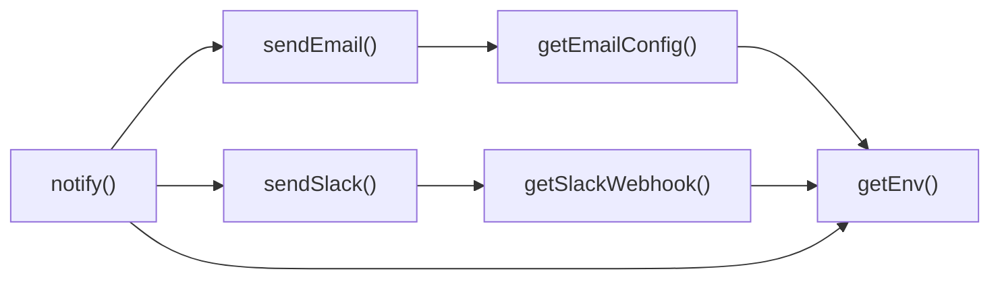

## Genel Bakış
Bu modül, Supabase edge fonksiyonları içinde Slack ve e‑posta gibi dış bildirim kanallarına mesaj göndermek için ortak bir arayüz sağlar. Ortam değişkenlerinden yapılandırma değerlerini okur, gerekli bağlantı bilgilerini hazırlar ve ardından tek bir giriş noktası üzerinden istediği kanallara bildirim yayar.

## Fonksiyon Grupları
### Yapılandırma Yardımcıları
Ortam değişkenlerinden gerekli ayarları çeker ve bunları kullanıma hazır hale getirir.
- getEnv, getSlackWebhook, getEmailConfig

### Bildirim Göndericileri
Slack ve e‑posta gibi belirli kanallara mesajı hazırlayıp iletir.
- sendSlack, sendEmail

### Bildirim Koordinatörü
Tüm yapılandırma ve gönderici işlevlerini birleştirerek, tek bir giriş noktası üzerinden istediği kanallara bildirim yayar.
- notify

---

## AXIOMS – Mimari Varsayımlar

Bu modülün çalışabilmesi için aşağıdaki koşulların sağlanması gerekir. Bir koşul sağlanmadığında belirtilen sonuç ortaya çıkar.

- **getEnv**: Eğer verilen `key` ile eşleşen bir ortam değişkeni tanımlı değilse, fonksiyon `undefined` (veya falsy) değer döndürür; bu durumda çağıran kod bu değeri geçerli bir yapılandırma değeri olarak kullanamaz.
- **getSlackWebhook**: Eğer `SLACK_WEBHOOK_URL` (veya modül tarafından kullanılan ilgili ortam değişkeni) ortamında tanımlı değilse veya boş bir string döndürürse, `sendSlack` fonksiyonu geçerli bir webhook URL’si olmadan çalışmaya çalışır ve bu da HTTP isteğinin gönderilememesini veya hatalı bir yanıta yol açar.
- **getEmailConfig**: Eğer e‑posta bağlantısı için gerekli olan ortam değişkenleri (örn. `SMTP_HOST`, `SMTP_USER`, `SMTP_PASS`, `FROM_ADDRESS` vb.) eksikse veya geçersizse, fonksiyon `null`/`undefined` ya da eksik alanlar içeren bir nesne döndürür; bu durumda `sendEmail` fonksiyonu geçerli bir yapılandırma olmadan çalışmaya çalışır ve bu da e‑posta gönderiminin başarısız olmasına neden olur.
- **sendSlack**: Eğer iç tarafından çağırdığı `getSlackWebhook` fonksiyonu boş veya geçersiz bir URL döndürürse, Slack’a yapılan istek gerçekleşmez ve bildirim Slack kanalına ulaşılamaz.
- **sendEmail**: Eğer iç tarafından çağırdığı `getEmailConfig` fonksiyonu eksik veya geçersiz bir yapılandırma nesnesi döndürürse, e‑posta sunucusuna bağlanma girişimi başarısız olur ve bildirim e‑posta olarak teslim edilemez.
- **notify**: Eğer hem `getSlackWebhook` hem de `getEmailConfig` fonksiyonları boş/geçersiz değer döndürürse (yani hiçbir bildirim kanalı yapılandırılmamışsa), fonksiyon hiçbir mesaj göndermez ve çağrılan kod bildiriminin iletilmediğini fark eder. En az bir kanal (Slack veya e‑posta) yapılandırılmış olmalıdır; aksi takdirde `notify` işlemi etkisiz olur.

---

## FONKSIYON DETAYLARI

### getEnv
**Ne yapar**: Ortam değişkeninin değerini döndürür.  
**Nasıl yapar**: Verilen `key` ile `process.env` üzerinden değeri okur ve string olarak döndürür.  
**Parametreler**:  
- key: string — Ortam değişkeninin adı.  
**Dönüş**: string — Ortam değişkeninin değeri; değişken tanımlı değilse boş string veya `undefined` olabilir (implementation dependent).

### getSlackWebhook
**Ne yapar**: Slack webhook URL'ini ortam değişkeninden alır.  
**Nasıl yapar**: `getEnv` fonksiyonunu kullanarak önceden tanımlanmış bir anahtar (örn. `SLACK_WEBHOOK_URL`) üzerinden webhook URL'ini okur ve döndürür; tanımlı değilse `null` döndürür.  
**Parametreler**: (yok)  
**Dönüş**: string \| null — Webhook URL'si veya ayarlanmamışsa `null`.

### getEmailConfig
**Ne yapar**: E-posta gönderimi için gerekli yapılandırma nesnesini döndürür.  
**Nasıl yapar**: Ortam değişkenlerinden alıcı adresi (`TO`), Supabase URL ve service key gibi bilgileri toplar ve bir nesne olarak döndürür.  
**Parametreler**: (yok)  
**Dönüş**: { to: string, supabaseUrl: string, serviceKey: string } — E-posta yapılandırmasını içeren nesne.

### sendSlack
**Ne yapar**: Belirtilen metni ve opsiyonel alanları Slack kanalına gönderir.  
**Nasıl yapar**: `getSlackWebhook` ile webhook URL'ini alır, ardından HTTP POST isteğiyle Slack API'ye payload (text ve fields) gönderir. Başarısız olursa hata fırlatabilir veya sessizce başarısız olabilir (implementation dependent).  
**Parametreler**:  
- text: string — Gönderilecek ana mesaj.  
- fields?: NotifyField[] — Ekstra alanlar (opsiyonel).  
**Dönüş**: void — Fonksiyon bir değer döndürmez.

### sendEmail
**Ne yapar**: Belirtilen konu ve metni e-posta olarak gönderir.  
**Nasıl yapar**: `getEmailConfig` ile yapılandırmayı alır, ardından Supabase veya SMTP üzerinden e-posta gönderir. `fields` opsiyonel olarak ekstra veri ekleyebilir.  
**Parametreler**:  
- subject: string — E-posta konusu.  
- text: string — E-posta gövdesi.  
- fields?: NotifyField[] — Ekstra alanlar (opsiyonel).  
**Dönüş**: void — Fonksiyon bir değer döndürmez.

### notify
**Ne yapar**: Hem Slack hem de e-posta üzerinden bildirim gönderir.  
**Nasıl yapar**: `sendSlack` ve `sendEmail` fonksiyonlarını sırasıyla çağırarak aynı `text` ve `fields`'i iki kanala iletir. Her iki kanalın yapılandırması eksikse ilgili kanal atlanabilir.  
**Parametreler**:  
- text: string — Bildirilecek mesaj.  
- fields?: NotifyField[] — Ekstra alanlar (opsiyonel).  
**Dönüş**: void — Fonksiyon bir değer döndürmez.

---

## TYPE ALIASES

### NotifyField
```typescript
type NotifyField = { title: string; value: string; short?: boolean }
```

---

## SABİTLER
- **notify** (unknown)

---

## AST POINTERS

### [N1_NASIL] AST Pointer: supabase/functions/_shared/notify.ts::getEnv
- **params**: key (string)
- **ic_degiskenler**: (none)
- **Dönüş**: string

### [N2_NASIL] AST Pointer: supabase/functions/_shared/notify.ts::getSlackWebhook
- **params**: (none)
- **ic_degiskenler**: 
  - `url` — holds the Slack webhook URL retrieved from env, validated to start with https://
- **Dönüş**: string | null

### [N3_NASIL] AST Pointer: supabase/functions/_shared/notify.ts::getEmailConfig
- **params**: (none)
- **ic_degiskenler**: 
  - `to` — recipient email address from NOTIFY_EMAIL env var
  - `supabaseUrl` — Supabase project URL from SUPABASE_URL env var
  - `serviceKey` — Supabase service role key from SUPABASE_SERVICE_ROLE_KEY env var
- **Dönüş**: { to: string, supabaseUrl: string, serviceKey: string }

### [N4_NASIL] AST Pointer: supabase/functions/_shared/notify.ts::sendSlack
- **params**: text (string), fields? (NotifyField[])
- **ic_degiskenler**: 
  - `url` — Slack webhook URL (string | null) obtained from getSlackWebhook
  - `payload` — JSON payload to send, containing text and optionally attachments built from fields
- **Dönüş**: Promise<boolean> (true if message sent, false otherwise)

### [N5_NASIL] AST Pointer: supabase/functions/_shared/notify.ts::sendEmail
- **params**: subject (string), text (string), fields? (NotifyField[])
- **ic_degiskenler**: 
  - `to` — email recipient from getEmailConfig
  - `supabaseUrl` — Supabase URL from getEmailConfig
  - `serviceKey` — service role key from getEmailConfig
  - `message` — final email body, optionally appended with formatted fields
  - `payload` — object posted to notification-service function
  - `resp` — Response from fetch, used to check ok status
- **Dönüş**: Promise<boolean> (true if notification service responded ok, false otherwise)

### [N6_NASIL] AST Pointer: supabase/functions/_shared/notify.ts::notify
- **params**: text (string), fields? (NotifyField[])
- **ic_degiskenler**: 
  - `debug` — boolean flag indicating whether debug logging is enabled (NOTIFY_DEBUG env)
  - `subject` — first 50 characters of text, used as email subject
  - `sent` — tracks whether any notification channel succeeded
- **Dönüş**: yok (function returns undefined)

---

## ÇAĞRI HARİTASI

### Disariya Cagrilar (Outgoing)
- **notify()** → `sendEmail`, `sendSlack`, `getEnv` (bildirimleri başlatmak ve ortam değişkenini almak için)  
- **sendSlack()** → `getSlackWebhook` (Slack webhook URL’sini elde etmek için)  
- **getSlackWebhook()** → `getEnv` (webhook için gerekli ortam değişkenini okumak için)  
- **sendEmail()** → `getEmailConfig` (e‑posta yapılandırmasını almak için)  
- **getEmailConfig()** → `getEnv` (e‑posta ayarları için ortam değişkenini okumak için)  

### Disaridan Cagrilanlar (Incoming)
- Verilen veri setinde bu modülü çağıran dış bir fonksiyon ya da dosya bulunmamaktadır.  

### Ic Ice Fonksiyonlar (Nested)
- Yok (iç içe fonksiyon tanımlanmamıştır).

---

## DOSYA-İÇİ ÇAĞRI GRAFİĞİ
  getEmailConfig() → getEnv()
  getSlackWebhook() → getEnv()
  notify() → getEnv()
  notify() → sendEmail()
  notify() → sendSlack()
  sendEmail() → getEmailConfig()
  sendSlack() → getSlackWebhook()



---

## NODE ID STANDARD

  file: supabase\functions\_shared\notify.ts
  function: supabase\functions\_shared\notify.ts::getEnv
  function: supabase\functions\_shared\notify.ts::getSlackWebhook
  function: supabase\functions\_shared\notify.ts::getEmailConfig
  function: supabase\functions\_shared\notify.ts::sendSlack
  function: supabase\functions\_shared\notify.ts::sendEmail
  function: supabase\functions\_shared\notify.ts::notify

---

## DISA AKTARILANLAR (EXPORTS)
  export: NotifyField
  export: getEmailConfig
  export: getEnv
  export: getSlackWebhook
  export: notify
  export: sendEmail
  export: sendSlack