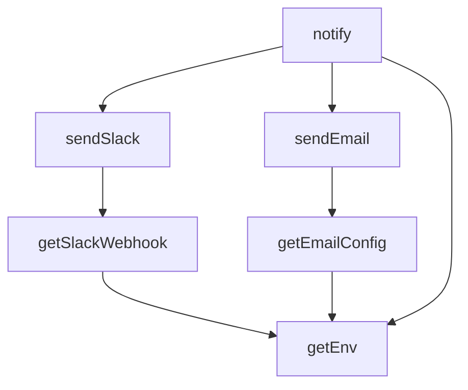

## Genel Bakış
Bu modül, VentHub projesindeki Supabase Edge Fonksiyonları tarafından ortaklaşa kullanılmak üzere geliştirilmiş, merkezi bir bildirim yardımcısıdır. Dış kanallara (Slack ve e-posta) mesaj göndermek için gerekli tüm yapılandırma ve gönderim süreçlerini tek bir arayüzde toplar, kod tekrarını önler ve bildirimlerin güvenli iletimini sağlar.

## Fonksiyon Grupları
### Yapılandırma Yardımcıları
Modülün çalışması için gerekli olan tüm ayarları ve bağlantı bilgilerini ortam değişkenlerinden çekerek kullanıma hazır hale getirir.
- getEnv, getSlackWebhook, getEmailConfig

### Kanala Özel Bildirim Göndericileri
Hazırlanan yapılandırma bilgilerini kullanarak, belirli bir kanalın (Slack veya e-posta) teknik formatına uygun bildirimleri hazırlar ve ilgili servise iletir.
- sendSlack, sendEmail

### Merkezî Bildirim Koordinatörü
Tüm yapılandırma ve gönderim işlevlerini entegre ederek, modülün ana giriş noktasıdır; sadece bildirim içeriği girilerek tüm aktif kanallara eş zamanlı mesaj gönderilmesini koordine eder.
- notify

---

## AXIOMS – Mimari Varsayımlar

Bu modül, Supabase Edge Functions ortamında dış kanallara bildirim göndermek için yapılandırma ve gönderim fonksiyonları sağlar.

**[Aksiyom 1]:** Eğer runtime ortamında Slack webhook URL'i tanımlı değilse, `getSlackWebhook()` fonksiyonu geçerli bir yapılandırma nesni dönemz ve `sendSlack()` fonksiyonu çalışamaz.

**[Aksiyom 2]:** Eğer runtime ortamında e-posta SMTP yapılandırma değişkenleri (host, port, kullanıcı, şifre vb.) tanımlı değilse, `getEmailConfig()` fonksiyonu geçerli bir yapılandırma nesni dönemz ve `sendEmail()` fonksiyonu çalışamaz.

**[Aksiyom 3]:** Eğer `getEnv(key)` fonksiyonuna talep edilen anahtarın karşılığı ortam değişkenlerinde mevcut değilse, fonksiyon `null` veya `undefined` döner (veya hata fırlatır — implementasyona bağlıdır).

**[Aksiyom 4]:** Eğer `notify()` fonksiyonu çağrıldığında hem Slack hem e-posta yapılandırması eksikse, hiçbir kanala bildirim gönderilemez.

**[Aksiyom 5]:** Eğer `sendSlack()` veya `sendEmail()` çağrıldığında dış ağ erişimi (outbound HTTP) engelli ise, bildirim gönderimi başarısız olur.

**[Aksiyom 6]:** `NotifyField[]` parametresi opsiyonel olarak tanımlıdır; eğer verilmezse, bildirim yalnızca düz metin (`text`) içerir.

---

## FONKSİYON DETAYLARI

### getEnv
**Ne yapar**: Verilen anahtar adına sahip ortam değişkeninin değerini字符串 olarak döndürür. Uygulama yapılandırması için merkezi bir erişim noktası sağlar.

**Nasıl yapar**: Fonksiyon gövdesi doğrudan verilmemiş olup, adından ve kullanım bağlamından anlaşılacağı üzere process.env veya benzeri bir ortam kaynağından değer okur. Tip güvenliği için her zaman string dönüşü sağlar; değişken bulunamazsa boş string döndürmesi beklenir.

**Parametreler**:
- `key`: `string` — Okunacak ortam değişkeninin adı (ör. `'SLACK_WEBHOOK_URL'`, `'NOTIFY_EMAIL'`)

**Dönüş**: `string` — Ortam değişkeninin değeri. Değişken tanımsızsa boş string döner.

### getSlackWebhook
**Ne yapar**: Slack bildirimleri için kullanılacak webhook URL’sini ortam değişkenlerinden alır.
**Nasıl yapar**: `SLACK_WEBHOOK_URL` gibi sabit bir anahtarla `getEnv` çağrısı yapar veya doğrudan `Deno.env.get` kullanır. Eğer değişken tanımlanmamışsa `null` döndürür.
**Parametreler**: Yok.
**Dönüş**: `string | null` — Webhook URL’si veya yoksa `null`.

### getEmailConfig
**Ne yapar**: E-posta bildirimi göndermek için gerekli yapılandırma bilgilerini (alıcı adresi, Supabase URL ve hizmet anahtarı) bir nesne olarak döndürür.
**Nasıl yapar**: Ortam değişkenlerinden `NOTIFY_EMAIL_TO`, `SUPABASE_URL` ve `SUPABASE_SERVICE_KEY` değerlerini okuyarak `{ to, supabaseUrl, serviceKey }` şeklinde bir nesne oluşturur. Gerekli değişkenler eksikse hata verebilir.
**Parametreler**: Yok.
**Dönüş**: `{ to: string, supabaseUrl: string, serviceKey: string }` — E-posta bildirimi için gereken konfigürasyon.

### sendSlack
**Ne yapar**: Belirtilen metin ve ek alanları kullanarak bir Slack kanalına bildirim mesajı gönderir.
**Nasıl yapar**: `getSlackWebhook` ile alınan webhook URL’sine HTTP POST isteği yapar. İstek gövdesinde mesaj metni (`text`) ve varsa ek alanlar (`fields`) JSON formatında iletilir.
**Parametreler**:
- `text`: `string` — Gönderilecek mesajın ana metni.
- `fields?`: `NotifyField[]` (opsiyonel) — Mesaja eklenecek ek anahtar-değer çiftleri.
**Dönüş**: Yok (void).

### sendEmail
**Ne yapar**: Belirtilen konu, metin ve ek alanları kullanarak bir e-posta bildirimi gönderir.
**Nasıl yapar**: `getEmailConfig` ile alınan yapılandırmayı kullanarak Supabase’in e-posta gönderme servisini (örneğin `supabase.functions.invoke` veya doğrudan SMTP) çağırır. Mesaj içeriği `subject`, `text` ve varsa `fields` birleştirilerek oluşturulur.
**Parametreler**:
- `subject`: `string` — E-postanın konu satırı.
- `text`: `string` — E-postanın gövde metni.
- `fields?`: `NotifyField[]` (opsiyonel) — E-posta içeriğine eklenecek ek alanlar.
**Dönüş**: Yok (void).

### notify
**Ne yapar**: Merkezi bildirim işlevi; metin ve ek alanları kullanarak hem Slack hem de e-posta üzerinden bildirim gönderilmesini sağlar.
**Nasıl yapar**: Yapılandırmaya bağlı olarak (örneğin `SLACK_WEBHOOK_URL` tanımlıysa) `sendSlack`’i, e-posta ayarları tamamsa `sendEmail`’i çağırır. Oluşan hataları loglar.
**Parametreler**:
- `text`: `string` — Bildirim metni.
- `fields?`: `NotifyField[]` (opsiyonel) — İsteğe bağlı ek alanlar.
**Dönüş**: Yok (void).

---

## TYPE ALIASES

### NotifyField
```typescript
type NotifyField = { title: string; value: string; short?: boolean }
```

---

## SABİTLER
- **notify** (unknown)

---

## AST POINTERS

### [N1_NASIL] AST Pointer: `supabase/functions/_shared/notify.ts`::getEnv
- **params**: `key: string`
- **ic_degiskenler**:
  - (yok — parametre ve Deno.env.get haricinde degisken kullanilmiyor)
- **Dönüş**: `string` — ortam degiskeninin degerini veya bos string dondurur; key mevcut degilse `''` doner

---


## MERMAID CALL GRAPH


## NODE ID STANDARD

  file: supabase\functions\_shared\notify.ts
  function: supabase\functions\_shared\notify.ts::getEnv
  function: supabase\functions\_shared\notify.ts::getSlackWebhook
  function: supabase\functions\_shared\notify.ts::getEmailConfig
  function: supabase\functions\_shared\notify.ts::sendSlack
  function: supabase\functions\_shared\notify.ts::sendEmail
  function: supabase\functions\_shared\notify.ts::notify

---

## DISA AKTARILANLAR (EXPORTS)
  export: NotifyField
  export: getEmailConfig
  export: getEnv
  export: getSlackWebhook
  export: notify
  export: sendEmail
  export: sendSlack