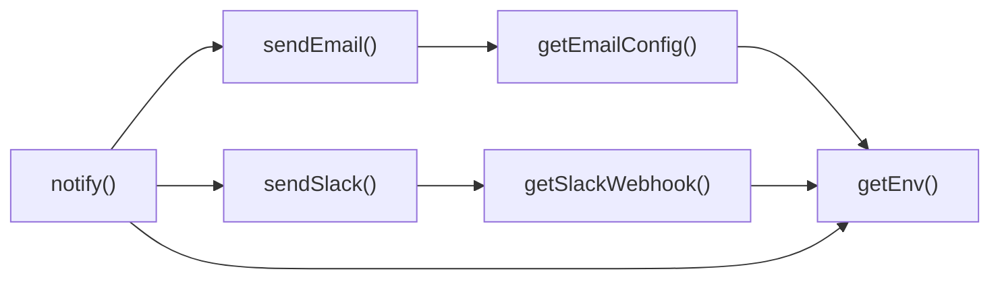

## Genel Bakış
Bu modül, VentHub projesindeki tüm Supabase Edge Fonksiyonları tarafından ortaklaşa kullanılmak üzere geliştirilmiş paylaşımlı bir bildirim yardımcısıdır. Slack ve e-posta gibi dış kanallara mesaj göndermek için tek merkezli bir arayüz sunar, tüm yapılandırma süreçlerini ortam değişkenlerinden yöneterek kod tekrarını ortadan kaldırır. Sadece bildirim içeriğinin girilmesiyle tüm kanallara güvenli şekilde mesaj iletilmesini sağlar.

## Fonksiyon Grupları
### Yapılandırma Yardımcıları
Modülün çalışması için gereken tüm ayarları ortam değişkenlerinden çeker, kanallara özel bağlantı bilgilerini kullanıma hazır hale getirir.
- getEnv, getSlackWebhook, getEmailConfig

### Kanala Özel Bildirim Göndericileri
Hazırlanan yapılandırma verilerini kullanarak, Slack ve e-posta gibi belirli kanallara bildirim mesajlarını formatlayıp iletmekten sorumludur.
- sendSlack, sendEmail

### Merkezî Bildirim Koordinatörü
Tüm yapılandırma ve gönderim işlevlerini birleştirerek, modülün ana giriş noktası olarak tek bir çağrı ile tüm uygun kanallara bildirim gönderilmesini yönetir.
- notify

---

## AXIOMS – Mimari Varsayımlar
Bu modül, Slack ve E-posta bildirimlerini gerçekleştirmek için dış servislerin yapılandırma bilgilerinin (webhook URL'leri, SMTP ayarları vb.) ortam değişkenleri üzerinden erişilebilir olmasına bağımlıdır.

[Aksiyom 1]: Eğer çalışma zamanı ortamında (environment) gerekli yapılandırma değişkenleri tanımlı değilse, getEnv, getSlackWebhook veya getEmailConfig fonksiyonları gerekli bağlantı bilgilerini sağlayamaz.
[Aksiyom 2]: Eğer Slack webhook URL'si geçerli bir formatta değilse, sendSlack fonksiyonu bildirimi iletme girişiminde başarısız olur.
[Aksiyom 3]: Eğer E-posta sunucusu yapılandırma bilgileri (host, port, auth vb.) eksik veya hatalıysa, sendEmail fonksiyonu bildirimi iletme girişiminde başarısız olur.
[Aksiyom 4]: Eğer notify, sendSlack veya sendEmail fonksiyonlarına metin (text) parametresi sağlanmazsa, bildirim içeriği boş olduğu için gönderim işlemi gerçekleştirilemez.

---

## FONKSİYON DETAYLARI

### getEnv
**Ne yapar**: Ortam değişkenlerinden bir değeri okur ve string olarak döndürür.
**Nasıl yapar**: Verilen anahtar (`key`) ile `Deno.env.get()` veya `process.env` kullanarak ilgili ortam değişkenini alır. Değişken tanımlı değilse hata fırlatır.
**Parametreler**:
- `key`: `string` — Okunacak ortam değişkeninin adı.
**Dönüş**: `string` — Ortam değişkeninin değeri.

### getSlackWebhook
**Ne yapar**: Slack bildirimleri için kullanılacak webhook URL’sini ortam değişkenlerinden alır.
**Nasıl yapar**: `SLACK_WEBHOOK_URL` gibi sabit bir anahtarla `getEnv` çağrısı yapar veya doğrudan `Deno.env.get` kullanır. Eğer değişken tanımlanmamışsa `null` döndürür.
**Parametreler**: Yok.
**Dönüş**: `string | null` — Webhook URL’si veya yoksa `null`.

### getEmailConfig
**Ne yapar**: E-posta bildirimi göndermek için gerekli yapılandırma bilgilerini (alıcı adresi, Supabase URL ve hizmet anahtarı) bir nesne olarak döndürür.
**Nasıl yapar**: Ortam değişkenlerinden `NOTIFY_EMAIL_TO`, `SUPABASE_URL` ve `SUPABASE_SERVICE_KEY` değerlerini okuyarak `{ to, supabaseUrl, serviceKey }` şeklinde bir nesne oluşturur. Gerekli değişkenler eksikse hata verebilir.
**Parametreler**: Yok.
**Dönüş**: `{ to: string, supabaseUrl: string, serviceKey: string }` — E-posta bildirimi için gereken konfigürasyon.

### sendSlack
**Ne yapar**: Belirtilen metin ve ek alanları kullanarak bir Slack kanalına bildirim mesajı gönderir.
**Nasıl yapar**: `getSlackWebhook` ile alınan webhook URL’sine HTTP POST isteği yapar. İstek gövdesinde mesaj metni (`text`) ve varsa ek alanlar (`fields`) JSON formatında iletilir.
**Parametreler**:
- `text`: `string` — Gönderilecek mesajın ana metni.
- `fields?`: `NotifyField[]` (opsiyonel) — Mesaja eklenecek ek anahtar-değer çiftleri.
**Dönüş**: Yok (void).

### sendEmail
**Ne yapar**: Belirtilen konu, metin ve ek alanları kullanarak bir e-posta bildirimi gönderir.
**Nasıl yapar**: `getEmailConfig` ile alınan yapılandırmayı kullanarak Supabase’in e-posta gönderme servisini (örneğin `supabase.functions.invoke` veya doğrudan SMTP) çağırır. Mesaj içeriği `subject`, `text` ve varsa `fields` birleştirilerek oluşturulur.
**Parametreler**:
- `subject`: `string` — E-postanın konu satırı.
- `text`: `string` — E-postanın gövde metni.
- `fields?`: `NotifyField[]` (opsiyonel) — E-posta içeriğine eklenecek ek alanlar.
**Dönüş**: Yok (void).

### notify
**Ne yapar**: Merkezi bildirim işlevi; metin ve ek alanları kullanarak hem Slack hem de e-posta üzerinden bildirim gönderilmesini sağlar.
**Nasıl yapar**: Yapılandırmaya bağlı olarak (örneğin `SLACK_WEBHOOK_URL` tanımlıysa) `sendSlack`’i, e-posta ayarları tamamsa `sendEmail`’i çağırır. Oluşan hataları loglar.
**Parametreler**:
- `text`: `string` — Bildirim metni.
- `fields?`: `NotifyField[]` (opsiyonel) — İsteğe bağlı ek alanlar.
**Dönüş**: Yok (void).

---

## TYPE ALIASES

### NotifyField
```typescript
type NotifyField = { title: string; value: string; short?: boolean }
```

---

## SABİTLER
- **notify** (unknown)

---

## AST POINTERS

### [N1_NASIL] AST Pointer: C:\Users\alize\venthub-hvac\supabase\functions\_shared\notify.ts::getEnv
- **params**: (key: string)
- **ic_degiskenler**:
  - `key` — ortam değişkeni adını tutan string parametresi.
- **Dönüş**: string – belirtilen ortam değişkeninin değeri; bulunamazsa boş string döner.

### [N2_NASIL] AST Pointer: C:\Users\alize\venthub-hvac\supabase\functions\_shared\notify.ts::getSlackWebhook
- **params**: (parametre yok)
- **ic_degiskenler**:
  - `url` — `getEnv('SLACK_WEBHOOK_URL')` çağrısının sonucu; Slack webhook URL’si ya da boş string.
- **Dönüş**: string | null – geçerli bir `https://` URL’si ise o URL, aksi takdirde `null`.

### [N3_NASIL] AST Pointer: C:\Users\alize\venthub-hvac\supabase\functions\_shared\notify.ts::getEmailConfig
- **params**: (parametre yok)
- **ic_degiskenler**:
  - `to` — `getEnv('NOTIFY_EMAIL')` sonucunda elde edilen alıcı e‑posta adresi.
  - `supabaseUrl` — `getEnv('SUPABASE_URL')` sonucunda elde edilen Supabase proje URL’si.
  - `serviceKey` — `getEnv('SUPABASE_SERVICE_ROLE_KEY')` sonucunda elde edilen servis rol anahtarı.
- **Dönüş**: object – `{ to, supabaseUrl, serviceKey }` şeklinde yapılandırılmış e‑posta ve Supabase bilgileri.

### [N4_NASIL] AST Pointer: C:\Users\alize\venthub-hvac\supabase\functions\_shared\notify.ts::sendSlack
- **params**: (text: string, fields?: NotifyField[])
- **ic_degiskenler**:
  - `url` — `getSlackWebhook()` çağrısının döndürdüğü webhook URL; yoksa fonksiyon `false` döner.
  - `payload` — Slack mesajı gövdesi; `{ text }` ile başlar, `fields` var ise `attachments` eklenir.
  - `fields` — isteğe bağlı `NotifyField[]`; var ise her alan `title`, `value`, `short` özelliklerine dönüştürülür.
- **Dönüş**: yok (fonksiyon `boolean` döndürür; `true` başarılı gönderim, `false` hata veya yapılandırma eksikliği).

### [N5_NASIL] AST Pointer: C:\Users\alize\venthub-hvac\supabase\functions\_shared\notify.ts::sendEmail
- **params**: (subject: string, text: string, fields?: NotifyField[])
- **ic_degiskenler**:
  - `to` — `getEmailConfig()` sonucundan alınan alıcı e‑posta adresi.
  - `supabaseUrl` — `getEmailConfig()` sonucundan alınan Supabase URL’si.
  - `serviceKey` — `getEmailConfig()` sonucundan alınan servis rol anahtarı.
  - `message` — temel `text` değeri; `fields` varsa ek bilgi satırlarıyla birleştirilir.
  - `payload` — e‑posta gönderim isteği gövdesi; `type`, `to`, `message`, `priority`, `template`, `data` alanlarını içerir.
  - `resp` — `fetch` çağrısının yanıtı; `resp.ok` değeri fonksiyonun dönüş değeri olarak kullanılır.
- **Dönüş**: yok (fonksiyon `boolean` döndürür; `true` e‑posta başarılı gönderildi, `false` hata veya eksik yapılandırma).

### [N6_NASIL] AST Pointer: C:\Users\alize\venthub-hvac\supabase\functions\_shared\notify.ts::notify
- **params**: (text: string, fields?: NotifyField[])
- **ic_degiskenler**:
  - `debug` — `getEnv('NOTIFY_DEBUG')` değerinin `'true'` (küçük harf) olup olmadığını belirten boolean.
  - `subject` — `text`’in ilk 50 karakteri; e‑posta başlığı olarak kullanılır.
  - `sent` — mesajın gönderilip gönderilmediğini izleyen boolean; başlangıçta `false`.
  - `text` — bildirim içeriği (parametre).
  - `fields` — isteğe bağlı ek alanlar (parametre).
- **Dönüş**: yok (fonksiyon yan etki olarak Slack ve/veya Email üzerinden bildirim gönderir; `debug` aktifse konsola uyarı mesajları yazar).

---

## DOSYA-İÇİ ÇAĞRI GRAFİĞİ
  getEmailConfig() → getEnv()
  getSlackWebhook() → getEnv()
  notify() → getEnv()
  notify() → sendEmail()
  notify() → sendSlack()
  sendEmail() → getEmailConfig()
  sendSlack() → getSlackWebhook()



---

## NODE ID STANDARD

  file: supabase\functions\_shared\notify.ts
  function: supabase\functions\_shared\notify.ts::getEnv
  function: supabase\functions\_shared\notify.ts::getSlackWebhook
  function: supabase\functions\_shared\notify.ts::getEmailConfig
  function: supabase\functions\_shared\notify.ts::sendSlack
  function: supabase\functions\_shared\notify.ts::sendEmail
  function: supabase\functions\_shared\notify.ts::notify

---

## DISA AKTARILANLAR (EXPORTS)
  export: NotifyField
  export: getEmailConfig
  export: getEnv
  export: getSlackWebhook
  export: notify
  export: sendEmail
  export: sendSlack