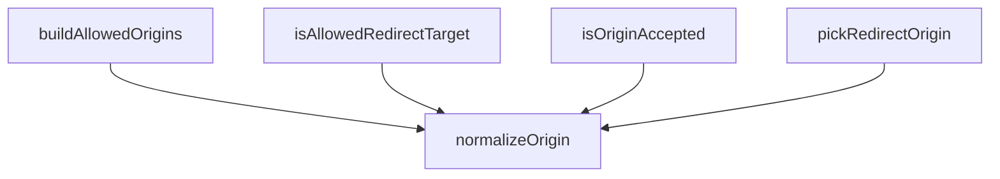

## Genel Bakış

Bu modül, web isteklerinde CORS (Cross-Origin Resource Sharing) ve yönlendirme (redirect) güvenliğini sağlayan yardımcı bir modüldür. Ortam değişkenlerinden izin verilen origin listesini oluşturur, gelen isteklerin origin bilgisini normalize eder ve bu origin'in izin verilen listede olup olmadığını doğrular. Supabase Edge Functions altyapısında paylaşılan (_shared) bir güvenlik katmanı olarak konumlanır.

## Fonksiyon Grupları

### Origin Normalizasyonu
Ham origin değerini standart bir formata dönüştürerek diğer fonksiyonların tutarlı veriyle çalışmasını sağlar.
- normalizeOrigin

### Allowlist Oluşturma
Ortam değişkenlerinden (env) izin verilen origin listesini derleyerek modülün diğer fonksiyonlarına temel girdi sağlar.
- buildAllowedOrigins

### Origin ve Yonlendirme Dogrulama
Gelen isteklerin origin bilgisini ve yönlendirme hedeflerini, önceden oluşturulmuş izin listesiyle karşılaştırarak güvenlik kontrolü yapar. `isOriginAccepted` bir istek origin'inin kabul edilip edilmediğini, `pickRedirectOrigin` izin listeden uygun bir redirect origin seçer, `isAllowedRedirectTarget` ise yönlendirme hedefinin güvenli olup olmadığını belirler.
- isOriginAccepted, pickRedirectOrigin, isAllowedRedirectTarget

---

## AXIOMS – Mimari Varsayımlar

Fonksiyon gövdeleri sağlanmadığından, yalnızca imzalardan çıkarılabilecek varsayımlar belirlenebilir. Gövde bilgisi olmadan kesin aksiyom üretmek mümkün değildir.

[Aksiyom 1]: Eğer `normalizeOrigin` fonksiyonuna `null` veya `undefined` değerli `raw` parametresi verilirse, sonuç `null` olur (dönüş tipi `string | null` olduğundan).

[Aksiyom 2]: Eğer `buildAllowedOrigins` fonksiyonuna sağlanan `env` kaydında ilgili anahtarlar yoksa, boş `string[]` döner (dönüş tipi `string[]` — null veya undefined içermez).

[Aksiyom 3]: Eğer `isOriginAccepted` fonksiyonuna `null` veya `undefined` değerli `requestOrigin` verilirse, fonksiyon `false` döner (parametre `string | null | undefined` kabul eder ancak bir origin eşleşmesi yapılamaz).

[Aksiyom 4]: Eğer `pickRedirectOrigin` fonksiyonunda allowlist içinde uygun bir origin bulunamazsa, sonuç `null` olur (dönüş tipi `string | null`).

[Aksiyom 5]: Eğer `isAllowedRedirectTarget` fonksiyonuna `null` veya `undefined` değerli `target` verilirse, fonksiyon `false` döner (parametre `string | null | undefined` kabul eder ancak bir hedef eşleşmesi yapılamaz).

[Aksiyom 6]: Eğer `isOriginAccepted`, `pickRedirectOrigin` veya `isAllowedRedirectTarget` fonksiyonlarına verilen `allowlist` parametresi `readonly` olarak tanımlanmışsa, bu fonksiyonlar allowlist'i değiştirmez (yalnızca okuma amaçlı kullanır).

---

## FONKSİYON DETAYLARI

### normalizeOrigin
**Ne yapar**: Bir URL veya origin dizesini kanonik `scheme://host[:port]` biçimine indirger. Geçersiz protokollere sahip, boş veya ayrıştırılamayan girdiler için `null` döner.

**Nasıl yapar**: Girdiyi önce boşluklardan arındırır (`trim`). Boş ise `null` döndürür. Ardından `new URL()` ile ayrıştırmaya çalışır. Protokol yalnızca `http:` veya `https:` ise `u.origin` değerini döndürür; diğer protokollerde `null` döner. Ayrıştırma hatası oluşursa yakalanır ve `null` döndürülür.

**Parametreler**:
- `raw`: `string | null | undefined` — Ayrıştırılacak ham URL veya origin dizesi. `null` veya `undefined` olabilir.

**Dönüş**: `string | null` — Başarılı ayrıştırma sonucu elde edilen kanonik origin dizesi (`scheme://host[:port]`). Geçersiz girdi durumunda `null`.

### buildAllowedOrigins
**Ne yapar**: Geliştirildi ancak detay üretilemedi.

### isOriginAccepted
**Ne yapar**: Geliştirildi ancak detay üretilemedi.

### pickRedirectOrigin
**Ne yapar**: Geliştirildi ancak detay üretilemedi.

### isAllowedRedirectTarget
**Ne yapar**: Geliştirildi ancak detay üretilemedi.

---

## AST POINTERS

### [N1_NASIL] AST Pointer: supabase/functions/_shared/origins.ts::normalizeOrigin
- **params**: `raw` — string | null | undefined
- **ic_degiskenler**:
  - `v` — `raw` değerinin nullish coalescing (`??`) ile boş string'e dönüştürülüp `trim()` ile boşluklardan arındırılmış hali; boşsa fonksiyon null döner
  - `u` — `v` string'inden `new URL(v)` ile oluşturulan URL nesnesi; `u.protocol` kontrol edilir, `u.origin` dönüş değeri olarak kullanılır
- **Dönüş**: string | null — geçerli http/https protokolü varsa `u.origin`, aksi halde null

### [N2_NASIL] AST Pointer: supabase/functions/_shared/origins.ts::buildAllowedOrigins
- **params**: `env` — Record<string, string | undefined>
- **ic_degiskenler**:
  - `out` — biriktirilen origin'lerin tutulduğu string dizisi; başlangıçta boş
  - `push` — `candidate` parametresi alan arrow fonksiyon; `normalizeOrigin(candidate)` çağırır, dönen değer null değilse ve `out` içinde yoksa `out.push(n)` ile ekler
  - `candidate` — `push` fonksiyonunun parametresi; string | null | undefined
  - `n` — `push` içinde `normalizeOrigin(candidate)` dönüş değeri
  - `part` — `env.ALLOWED_ORIGINS` değerinin virgülle ayrılmış parçaları; her parça `push(part)` ile işlenir
- **Dönüş**: string[] — normalize edilmiş ve tekrarsız origin listesi; `env.PUBLIC_SITE_URL`, `env.FRONTEND_URL`, `env.SITE_URL` önce, ardından `env.ALLOWED_ORIGINS` virgülle ayrılmış parçaları eklenir

### [N3_NASIL] AST Pointer: supabase/functions/_shared/origins.ts::isOriginAccepted
- **params**: `allowlist` — readonly string[], `requestOrigin` — string | null | undefined
- **ic_degiskenler**:
  - `n` — `normalizeOrigin(requestOrigin)` dönüş değeri; null ise origin reddedilir
- **Dönüş**: boolean — `allowlist` boşsa true döner; aksi halde `n` null değilse ve `allowlist` içinde varsa true

### [N4_NASIL] AST Pointer: supabase/functions/_shared/origins.ts::pickRedirectOrigin
- **params**: `allowlist` — readonly string[], `requestOrigin` — string | null | undefined
- **ic_degiskenler**:
  - `n` — `normalizeOrigin(requestOrigin)` dönüş değeri; null değilse ve `allowlist` içinde varsa bu değer döner
- **Dönüş**: string | null — `n` geçerli ve listedeyse `n`, aksi halde `allowlist[0]` (yoksa null)

### [N5_NASIL] AST Pointer: supabase/functions/_shared/origins.ts::isAllowedRedirectTarget
- **params**: `allowlist` — readonly string[], `target` — string | null | undefined
- **ic_degiskenler**:
  - `n` — `normalizeOrigin(target)` dönüş değeri; null ise hedef reddedilir
- **Dönüş**: boolean — `n` null değilse ve `allowlist` içinde varsa true

---


## MERMAID CALL GRAPH


## NODE ID STANDARD

  file: supabase\functions\_shared\origins.ts
  function: supabase\functions\_shared\origins.ts::normalizeOrigin
  function: supabase\functions\_shared\origins.ts::buildAllowedOrigins
  function: supabase\functions\_shared\origins.ts::isOriginAccepted
  function: supabase\functions\_shared\origins.ts::pickRedirectOrigin
  function: supabase\functions\_shared\origins.ts::isAllowedRedirectTarget

---

## DISA AKTARILANLAR (EXPORTS)
  export: buildAllowedOrigins
  export: isAllowedRedirectTarget
  export: isOriginAccepted
  export: normalizeOrigin
  export: pickRedirectOrigin

## Tasarım Gerekçeleri (kaynaktan BİREBİR)

> Bu bölüm LLM tarafından **yazılmadı**; kaynaktaki işaretli bloklardan
> birebir kopyalandı. Özetlenmesi veya yeniden ifade edilmesi YASAKTIR —
> gerekçenin değeri tam olarak kelimelerindedir.


```text
NİÇİN VAR (T043-VH · 2026-08-15)

Ödeme yolunda köken denetimi iki yerde birden gerekiyordu ve ikisi de eksikti:

1. `iyzico-payment` — `ALLOWED_ORIGINS` boşsa köken denetimi TAMAMEN kapanıyordu
(`allowed.length === 0 || ...` = fail-open).
2. `iyzico-payment` ödeme sonrası dönülecek adresi (`successUrl`) doğrudan isteğin
**`Origin`/`Referer` başlığından** türetip İyzico'ya gönderiyordu; `iyzico-callback`
da o adresi query'den okuyup **hiçbir kontrol yapmadan** `location.replace` ile
açıyordu.

İkisi birleşince şu zincir oluşuyordu: saldırgan `Origin: https://evil.tld` ile ödeme
başlatır → İyzico'ya giden callback URL'ine `successUrl=https://evil.tld/...` gömülür →
**gerçek ödeme tamamlandıktan sonra** müşterinin tarayıcısı saldırganın sayfasına
yönlendirilir. Müşterinin "ödeme başarısız, kartınızı tekrar girin" ekranına en çok
inanacağı an tam olarak orasıdır. Bu, CORS meselesi değil, kimlik avı vektörüdür.

TASARIM KARARI — güvenlik özelliği YAPILANDIRMAYA BAĞLI OLMAMALI.
Hiçbir ortam değişkeni tanımlı değilse bile saldırganın seçtiği adrese yönlendirme
YAPILMAZ: allowlist boşsa istekten gelen aday tamamen yok sayılır ve yalnız ortamdan
türetilen kanonik adres kullanılır (o da yoksa yönlendirme hiç yapılmaz).
Alternatif olan "allowlist boşsa her şeyi reddet" tasarımı, değişken tanımsızsa ödemeyi
tümden kırardı — güvenlik uğruna açığı kapatıp sistemi durdurmak kabul edilebilir bir
takas değil; burada ikisine de gerek yok.
```
