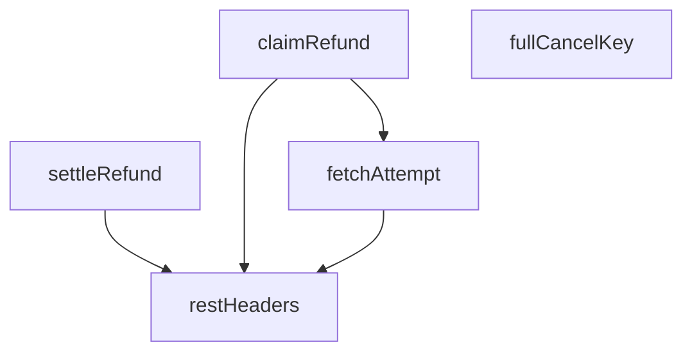

## Genel Bakış

Bu modül, sipariş iade ve iptal işlemlerinin idempotency (aynı işlemin tekrar tekrar güvenle yapılabilirliği) prensibiyle yönetilmesinden sorumludur. İade taleplerinin oluşturulması, mevcut denemelerin sorgulanması ve ödeme servis sağlayıcısından gelen sonuçların kaydedilmesi süreçlerini kapsar. Supabase Edge Functions ortamında paylaşılan (_shared) bir yardımcı modül olarak, diğer fonksiyonlar tarafından çağrılır.

## Fonksiyon Grupları

### Yardımcı ve Altyapı Fonksiyonları
REST istekleri için gerekli HTTP başlıklarının oluşturulması ve sipariş bazlı idempotency anahtarlarının üretilmesi gibi temel yardımcı işlemleri sağlar. Bu fonksiyonlar diğer iade fonksiyonları tarafından dolaylı olarak kullanılır.
- fullCancelKey, restHeaders

### İade Talep ve Takip Yönetimi
İade veya iptal taleplerinin yaşam döngüsünü yönetir: mevcut bir iade denemesinin veritabanından sorgulanması, yeni bir talebin idempotency kontrolüyle birlikte oluşturulması ve ödeme sağlayıcısından dönen sonucun (başarılı veya başarısız) ilgili deneme kaydına yazılması. `claimRefund` fonksiyonu, talep oluşturmadan önce `fetchAttempt` ile mevcut denemeyi kontrol edebilir; `settleRefund` ise sürecin son adımında sonucu kalıcı hale getirir.
- fetchAttempt, claimRefund, settleRefund

---

## AXIOMS – Mimari Varsayımlar
- Bu modül davranışsal mantık içermez (salt veri / konfigürasyon / tip tanımı).
- [Aksiyom 1]: Modülün dışa açtığı yapı (anahtar kümesi / şema) bir sözleşmedir; tüketiciler bu sabit yapıya bağlıdır — kırıcı değişiklik tüm tüketicileri etkiler.
- [Aksiyom 2]: Bir öğe ekleme/çıkarma yapısal-uyumlu olmalı; ilgili tipler ve seçiciler aynı commit'te güncel tutulmalıdır.

---

## FONKSİYON DETAYLARI

### fullCancelKey
**Ne yapar**: Tam iptal (full cancel) işlemi için sunucu tarafından türetilen idempotency anahtarı oluşturur. Bu anahtar, bir siparişin yaşam döngüsü boyunca yalnızca bir kez tam iade yapılabilmesini garanti altına alır. Çift tıklama, sekme yenileme ve ağ tekrar denemeleri aynı anahtara düşer; çağıran tarafın herhangi bir durum bilgisi tutmasına gerek kalmaz. Parçalı iade (partial refund) için bile bu anahtar kullanılır.

**Nasıl yapar**: Verilen sipariş kimliğini (`orderId`) `"full:"` önekiyle birleştirerek deterministik bir string üretir. Herhangi bir hash veya rastgelelik içermez; aynı sipariş kimliği her zaman aynı anahtarı verir.

**Parametreler**:
- `orderId`: `string` — Tam iptal yapılacak siparişin benzersiz kimliği.

**Dönüş**: `string` — `"full:{orderId}"` biçiminde, tam iptal işlemine özel idempotency anahtarı.

### restHeaders
**Ne yapar**: Geliştirildi ancak detay üretilemedi.

### fetchAttempt
**Ne yapar**: Geliştirildi ancak detay üretilemedi.

### claimRefund
**Ne yapar**: Geliştirildi ancak detay üretilemedi.

### settleRefund
**Ne yapar**: Geliştirildi ancak detay üretilemedi.

---

## İTHALATLAR (IMPORTS)
- import: ./tenant.ts::tenantFromRow

---

## TYPE ALIASES

### RefundAttemptState
```typescript
type RefundAttemptState = 'in_flight' | 'succeeded' | 'failed'
```

### RefundAttemptRow
```typescript
type RefundAttemptRow = {
  id: string
  order_id: string
  idempotency_key: string
  kind: 'cancel' | 'refund'
  amount: number
  state: RefundAttemptState
  psp_reference: string | null
  failure_code: string | nul
```

### ClaimResult
```typescript
type ClaimResult = /** Talep bize ait — PSP çağrısı YAPILABİLİR. */
```

### Ctx
```typescript
type Ctx = { supabaseUrl: string; serviceRoleKey: string }
```

---

## AST POINTERS

### [N1_NASIL] AST Pointer: _shared/refund_guard.ts::fullCancelKey
- **params**: `orderId` — iptal edilecek siparişin kimliği
- **ic_degiskenler**: yok
- **Dönüş**: `string` — `"full:{orderId}"` formatında tam iptal anahtarı

### [N2_NASIL] AST Pointer: _shared/refund_guard.ts::restHeaders
- **params**:
  - `serviceRoleKey` — Supabase service_role anahtarı
  - `extra` — üzerine yayılacak ek header'lar (varsayılan: `{}`)
- **ic_degiskenler**: yok
- **Dönüş**: `Record<string, string>` — Authorization, apikey, Content-Type ve extra alanlarını içeren HTTP header objesi

### [N3_NASIL] AST Pointer: _shared/refund_guard.ts::fetchAttempt
- **params**:
  - `ctx` — Supabase bağlantı bilgilerini (`supabaseUrl`, `serviceRoleKey`) taşıyan bağlam nesnesi
  - `orderId` — sorgulanacak sipariş kimliği
  - `key` — sorgulanacak idempotency anahtarı
- **ic_degiskenler**:
  - `url` — `ctx.supabaseUrl` tabanlı Supabase REST endpoint'i; `order_id`, `idempotency_key` filtreleri ve `select` parametresiyle birlikte tam sorgu URL'si
  - `resp` — `restHeaders(ctx.serviceRoleKey)` ile yapılan `fetch` çağrısının yanıtı
  - `rows` — `resp.json()` ile parse edilen yanıt dizisi; JSON parse hatasında boş diziye düşer
- **Dönüş**: `RefundAttemptRow | null` — `resp.ok` değilse `null`; dizi içinde satır varsa ilk satırı `RefundAttemptRow` olarak, yoksa `null`

### [N4_NASIL] AST Pointer: _shared/refund_guard.ts::claimRefund
- **params**:
  - `ctx` — Supabase bağlantı bilgilerini (`supabaseUrl`, `serviceRoleKey`) taşıyan bağlam nesnesi
  - `input.orderId` — refund talep edilen sipariş kimliği
  - `input.idempotencyKey` — tekrar koruması için benzersiz anahtar
  - `input.kind` — `'cancel'` veya `'refund'`
  - `input.amount` — iade tutarı
  - `input.actorUserId` — işlemi yapan kullanıcı kimliği (opsiyonel, null olabilir)
  - `input.reason` — iade nedeni (opsiyonel, null olabilir)
- **ic_degiskenler**:
  - `ordResp` — `venthub_orders` tablosundan `tenant_id` çekmek için yapılan `fetch` yanıtı; hata durumunda `null`'a düşer
  - `ordRows` — `ordResp.json()` ile parse edilen sipariş satırları dizisi; parse hatasında boş dizi
  - `ordRow` — dizideki ilk satır (`{ tenant_id?: string | null }`); yoksa `null`
  - `tenantId` — `tenantFromRow(ordRow)` çağrısından dönen tenant kimliği
  - `tenantSource` — `tenantFromRow(ordRow)` çağrısından dönen kaynak bilgisi (`'resource_row'` ise satırdan türetilmiş)
  - `row` — `refund_attempts` tablosuna INSERT edilecek satır; `order_id`, `idempotency_key`, `kind`, `amount`, `state` (`'in_flight'`), `actor_user_id`, `reason` alanlarını içerir; `tenantSource === 'resource_row'` ise `tenant_id` alanı da eklenir
  - `resp` — `refund_attempts` tablosuna POST yapılan `fetch` yanıtı; `Prefer: 'return=representation'` header'ı ile gönderilir
  - `created` — başarılı POST sonrası parse edilen yanıt dizisinin ilk elemanı; `created?.id` varsa `RefundAttemptRow` olarak kullanılır
  - `bodyText` — başarısız yanıtın metin gövdesi; parse hatasında boş string
  - `existing` — 409 çakışması durumunda `fetchAttempt(ctx, input.orderId, input.idempotencyKey)` ile okunan mevcut satır
- **Dönüş**: `ClaimResult` — duruma göre:
  - `{ outcome: 'claimed', attempt: RefundAttemptRow }` — yeni satır başarıyla oluşturulduysa
  - `{ outcome: 'in_flight', attempt: RefundAttemptRow }` — çakışma var ve mevcut satır `'in_flight'` durumundaysa
  - `{ outcome: 'settled', attempt: RefundAttemptRow }` — çakışma var ve mevcut satır zaten sonuçlanmışsa
  - `{ outcome: 'unavailable', status: number, message: string }` — hata, belirsizlik veya satır okunamama durumunda

### [N5_NASIL] AST Pointer: _shared/refund_guard.ts::settleRefund
- **params**:
  - `ctx` — Supabase bağlantı bilgilerini (`supabaseUrl`, `serviceRoleKey`) taşıyan bağlam nesnesi
  - `attemptId` — sonuçlandırılacak refund denemesinin kimliği
  - `outcome.state` — `'succeeded'` veya `'failed'`
  - `outcome.pspReference` — ödeme sağlayıcı referansı (opsiyonel, null olabilir)
  - `outcome.pspResult` — ödeme sağlayıcı sonuç detayı (opsiyonel, `unknown` tipinde)
  - `outcome.failureCode` — hata kodu (opsiyonel, null olabilir)
- **ic_degiskenler**:
  - `resp` — `refund_attempts` tablosuna PATCH yapılan `fetch` yanıtı; `Prefer: 'return=minimal'` header'ı ile gönderilir; gövde `state`, `psp_reference`, `psp_result`, `failure_code`, `settled_at` alanlarını içerir
  - `detail` — başarısız PATCH yanıtının metin gövdesi; parse hatasında boş string
- **Dönüş**: `{ ok: true } | { ok: false; message: string }` — PATCH başarılıysa `{ ok: true }`; HTTP hatası veya exception durumunda `{ ok: false, message: ... }`

---


## MERMAID CALL GRAPH


## NODE ID STANDARD

  file: supabase\functions\_shared\refund_guard.ts
  function: supabase\functions\_shared\refund_guard.ts::fullCancelKey
  function: supabase\functions\_shared\refund_guard.ts::restHeaders
  function: supabase\functions\_shared\refund_guard.ts::fetchAttempt
  function: supabase\functions\_shared\refund_guard.ts::claimRefund
  function: supabase\functions\_shared\refund_guard.ts::settleRefund

---

## DISA AKTARILANLAR (EXPORTS)
  export: ClaimResult
  export: RefundAttemptRow
  export: RefundAttemptState
  export: claimRefund
  export: fetchAttempt
  export: fullCancelKey
  export: restHeaders
  export: settleRefund

## Tasarım Gerekçeleri (kaynaktan BİREBİR)

> Bu bölüm LLM tarafından **yazılmadı**; kaynaktaki işaretli bloklardan
> birebir kopyalandı. Özetlenmesi veya yeniden ifade edilmesi YASAKTIR —
> gerekçenin değeri tam olarak kelimelerindedir.


```text
NİÇİN VAR (T053-VH · 2026-08-15 operasyon döngüsü denetimi §3)

`iyzico-refund` dosyasının başlığında 2025'ten beri "Idempotent" yazıyordu. Kodda
idempotency YOKTU. Tek koruma şuydu:

if (order.payment_status === 'refunded') return already_refunded

Bu bir **read-then-act**: okuma ile İyzico çağrısı arasındaki pencerede ikinci bir
istek aynı okumayı yapar, aynı guard'ı geçer ve GERÇEK PARA ikinci kez çıkar. Aynı
dosyada `manual_refund_applied` diye bir bayrak yazılıyordu ama **hiçbir yerde
okunmuyordu** — yorum "idempotent by flag" diyordu, bayrak ölüydü.

Daha sinsi ikinci yol: PSP çağrısından SONRAKİ sipariş güncellemesi boş `catch {}`
içindeydi. Yazma düşerse fonksiyon yine `200 {status:'refunded'}` dönüyordu; veritabanı
iadeyi hiç görmüyordu, dolayısıyla bir sonraki çağrı guard'ı geçip parayı TEKRAR iade
ediyordu. Yani "para çıktı ama kayıt düştü" hâli, kendi başına bir çift-iade üreteciydi.

── Çözümün şekli ───────────────────────────────────────────────────────────────
Uygulama katmanında çözülemez: iki ayrı istek arasındaki yarışı ancak ortak bir
serileştirme noktası kapatır. Burada o nokta veritabanının benzersiz indeksidir
(`refund_attempts_key_uniq`). Sıra BİLİNÇLİ olarak şudur:

1. talebi YAZ      → unique çakıştıysa İyzico'ya HİÇ GİTME
2. İyzico'yu çağır
3. sonucu aynı satıra işle

"Önce yaz" kısmı kritiktir. Tersi (önce çağır, sonra yaz) tam olarak bugünkü hatadır:
yazma düşerse para hareketinin hiçbir izi kalmaz.

── Takılı kalan talep OTOMATİK açılmaz ─────────────────────────────────────────
Süreç 1. ve 3. adım arasında ölürse satır `in_flight` kalır. Bu, "para çıktı mı
BİLMİYORUZ" demektir. Zaman aşımıyla otomatik serbest bırakmak, kapatmaya çalıştığımız
çift-iade penceresini geri açar — üstelik en kötü anda, yani PSP'nin yavaş olduğu anda.
Bu yüzden burada fail-closed davranış, İNSAN kararı istemektir: 409 + gelir alarmı.
```
