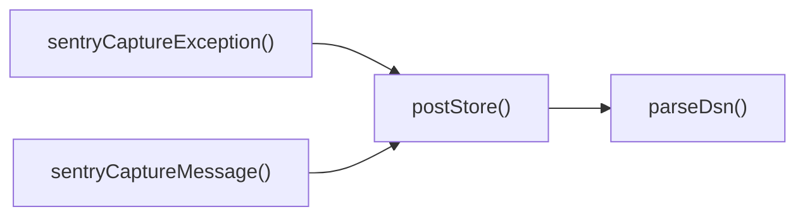

## Genel Bakış
Bu modül, Sentry hata izleme servisiyle iletişimi sağlamak için düşük seviyeli veri gönderimi ve yüksek seviyeli yakalama işlevlerini bir araya getirir. DSN ayrıştırma, veri gönderimi ve mesaj/istisna yakalama fonksiyonları birbirini tamamlayarak uygulama içinde merkezi bir hata raporlama katmanı oluşturur.

## Fonksiyon Grupları
### DSN Ayrıştırma
- Sentry DSN string’ini bileşenlerine (host, public key, project ID) ayırarak sonraki adımlarda gerekli endpoint ve kimlik bilgilerini çıkarır.
- `parseDsn`

### Veri Gönderimi (Transport)
- Ayrıştırılmış DSN bilgilerini kullanarak Sentry’nin store endpoint’ine JSON formatında veri gönderir; bu işlem asenkron olarak gerçekleşir.
- `postStore`

### Yüksek Seviyeli Yakalama API’leri
- Uygulama kodundan mesaj ve istisna yakalamak için kullanıcı dostu arayüzler sunar; içlerinde `parseDsn` ve `postStore` fonksiyonlarını çağırarak raporlama işlemini tamamlar.
- `sentryCaptureMessage`
- `sentryCaptureException`

---

## AXIOMS – Mimari Varsayımlar
Bu modül için özel aksiyom tanımlanmamıştır.

---

## FONKSIYON DETAYLARI

### parseDsn
**Ne yapar**: Verilen Sentry DSN (Data Source Name) string'ini ayrıştırıp, içerdiği host, public key ve proje ID bilgilerini çıkarır.  
**Nasıl yapar**: DSN formatını (`{protocol}://{publicKey}@{host}/{projectId}` gibi) parçalara ayırarak her bileşeni tanımlar; DSN geçersizse veya beklenen parçalar eksikse `null` döner.  
**Parametreler**:
- dsn: string — Ayrıştırılacak Sentry DSN string'i  
**Dönüş**: `{ host: string; publicKey: string; projectId: string }` nesnesi veya `null` (DSN geçersizse)

### postStore
**Ne yapar**: Verilen DSN üzerinden Sentry'nin store endpoint'ine bir olay (event) yükünü gönderir.  
**Nasıl yapar**: `dsn` parametresinden store URL'sini çıkarır, `body` içeriğini JSON olarak HTTP POST isteğiyle gönderir ve işlemin tamamlanmasını bekler; hata durumunda promesse reddedilir.  
**Parametreler**:
- dsn: string — Olayın gönderileceği Sentry DSN'i  
- body: unknown — Gönderilecek olay verisi (genellikle bir event objesi)  
**Dönüş**: `Promise<void>` — İşlem tamamlandığında çözümlenir, herhangi bir değer döndürmez

### sentryCaptureMessage
**Ne yapar**: Belirtilen mesajı ve seviyesini Sentry'ye bir olay olarak kaydeder; isteğe bağlı ek veri ekleyebilir.  
**Nasıl yapar**: `message` ve `level` parametrelerini kullanarak bir Sentry event objesi oluşturur, `extra` varsa bu objede ek alanlar olarak ekler ve ardından iç olarak `postStore` (veya benzeri) fonksiyonunu çağırarak olayı iletir.  
**Parametreler**:
- message: string — Kaydedilecek metin mesajı  
- level: SentryLevel — Mesajın önemi (örn. `info`, `warning`, `error`, `fatal`)  
- extra?: Record<string, unknown> — Olayla birlikte gönderilecek ek anahtar/değer çiftleri (isteğe bağlı)  
**Dönüş**: void — Fonksiyon herhangi bir değer döndürmez

### sentryCaptureException
**Ne yapar**: Yakalanan bir istisnayı (exception) Sentry'ye hata olayı olarak gönderir; isteğe bağlı ek bağlam verisi eklenebilir.  
**Nasıl yapar**: `_e` parametresindeki istisna objesini Sentry'nin beklediği hata formatına dönüştürür, `extra` varsa bu bilgiyi event'e ekler ve ardından olay iletimi için içsel gönderme mekanizmasını tetikler.  
**Parametreler**:
- _e: unknown — Yakalanan istisna nesnesi (tipi bilinmiyor, ancak genellikle `Error` veya benzeri)  
- extra?: Record<string, unknown> — Olayla birlikte gönderilecek ek veri (isteğe bağlı)  
**Dönüş**: void — Fonksiyon herhangi bir değer döndürmez

---

## TYPE ALIASES

### SentryLevel
```typescript
type SentryLevel = 'fatal' | 'error' | 'warning' | 'info' | 'debug' | 'log'
```

---

## AST POINTERS

### [N1_NASIL] AST Pointer: sentry.ts::parseDsn
- **params**: dsn: string
- **ic_degiskenler**:
  - `u` — URL object constructed from the dsn string, used to extract its components.
  - `publicKey` — username portion of the URL after trimming whitespace; represents the Sentry public key.
  - `host` — hostname from the URL; the Sentry endpoint host.
  - `projectId` — pathname of the URL with any leading slash removed; the Sentry project identifier.
- **Dönüş**: { host: string; publicKey: string; projectId: string } | null

### [N2_NASIL] AST Pointer: sentry.ts::postStore
- **params**: dsn: string, body: unknown
- **ic_degiskenler**:
  - `parsed` — result of `parseDsn(dsn)`; contains host, publicKey, and projectId used to build the request.
  - `url` — constructed Sentry store endpoint URL: `https://<host>/api/<projectId>/store/`.
  - `auth` — Sentry auth header string formed by joining `'Sentry sentry_version=7'`, `sentry_key=<publicKey>`, and `sentry_client=venthub-edge/1.0.0` with ', '.
- **Dönüş**: Promise<void> (no explicit return value)

### [N3_NASIL] AST Pointer: sentry.ts::sentryCaptureMessage
- **params**: message: string, level: SentryLevel = 'error', extra?: Record<string, unknown>
- **ic_degiskenler**:
  - `dsn` — Sentry DSN retrieved from `Deno.env.get('SENTRY_DSN')`; if empty the function returns early.
  - `event` — object representing the Sentry event to send, containing platform, logger, timestamp, level, message, extra, environment, and release fields.
- **Dönüş**: Promise<void> (no explicit return value)

### [N4_NASIL] AST Pointer: sentry.ts::sentryCaptureException
- **params**: _e: unknown, extra?: Record<string, unknown>
- **ic_degiskenler**:
  - `dsn` — Sentry DSN retrieved from `Deno.env.get('SENTRY_DSN')`; if empty the function returns early.
  - `isErr` — boolean indicating whether `_e` is an instance of `Error`.
  - `message` — string representation of the exception; uses `_e.message` if it's an Error, otherwise `String(_e)`.
  - `stack` — stack trace string from the Error if `_e` is an Error, otherwise `undefined`.
  - `event` — Sentry event object containing platform, logger, timestamp, level ('error'), message, optional exception (with type, value, and stacktrace), extra, environment, and release.
- **Dönüş**: Promise<void> (no explicit return value)

---

## ÇAĞRI HARİTASI

### Disariya Cagrilar (Outgoing)
- **sentryCaptureMessage()** → `postStore()` fonksiyonunu çağırır (mesajı göndermek için).  
- **sentryCaptureException()** → `postStore()` fonksiyonunu çağırır (istisna bilgisi göndermek için).  
- **postStore()** → `parseDsn()` fonksiyonunu çağırır (DSN ayrıştırması yapmak için).

### Disaridan Cagrilanlar (Incoming)
- Verilen veri setinde bu modülü çağıran dış fonksiyon veya dosya bilgisi bulunmamaktadır; dolayısıyla gelen çağrılar şu anda bilinmiyor.

### Ic Ice Fonksiyonlar (Nested)
- Yok (iç içe fonksiyon tanımlanmamıştır).

---

## DOSYA-İÇİ ÇAĞRI GRAFİĞİ
  postStore() → parseDsn()
  sentryCaptureException() → postStore()
  sentryCaptureMessage() → postStore()



---

## NODE ID STANDARD

  file: supabase\functions\_shared\sentry.ts
  function: supabase\functions\_shared\sentry.ts::parseDsn
  function: supabase\functions\_shared\sentry.ts::postStore
  function: supabase\functions\_shared\sentry.ts::sentryCaptureMessage
  function: supabase\functions\_shared\sentry.ts::sentryCaptureException

---

## DISA AKTARILANLAR (EXPORTS)
  export: SentryLevel
  export: parseDsn
  export: postStore
  export: sentryCaptureException
  export: sentryCaptureMessage