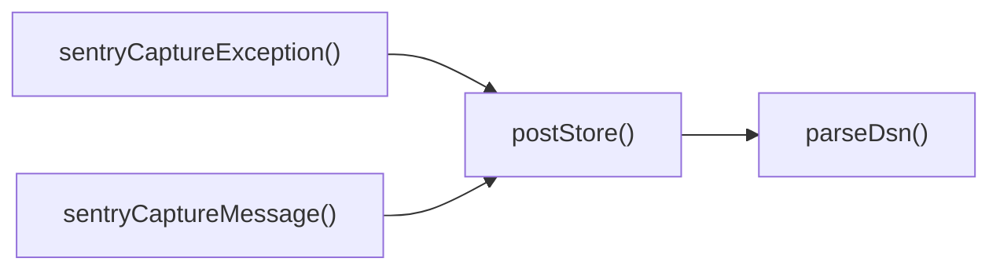

## Genel Bakış
Bu modül, Sentry hata izleme servisiyle iletişimi sağlamak için DSN ayrıştırma, veri gönderimi ve yüksek seviyeli yakalama işlevlerini bir araya getirir. `parseDsn` fonksiyonu DSN’i bileşenlerine ayırırken, `postStore` bu bilgileri kullanarak olay yükünü Sentry’nin store endpoint’ine gönderir. `sentryCaptureMessage` ve `sentryCaptureException` ise uygulama kodundan mesaj ve istisna yakalamak için kullanıcı dostu arayüzler sunar; içlerinde düşük seviyeli fonksiyonları çağırarak tam bir raporlama döngüsü tamamlar.

## Fonksiyon Grupları
### DSN Ayrıştırma
- Sentry DSN string’ini host, public key ve proje ID gibi ayrı parçalara ayırarak sonraki adımlarda gerekli endpoint ve kimlik bilgilerini hazırlar.
- `parseDsn`

### Veri Gönderimi (Transport)
- Ayrıştırılmış DSN bilgilerini kullanarak Sentry’nin store endpoint’ine JSON formatında olay yükünü gönderir; bu işlem asenkron olarak gerçekleşir.
- `postStore`

### Yakalama API’leri
- Uygulama geliştiricilerinin mesaj ve istisna yakalamasını basitleştirir; içlerinde `parseDsn` ve `postStore` fonksiyonlarını çağırarak veri gönderimini gerçekleştirir.
- `sentryCaptureMessage`
- `sentryCaptureException`

---

## AXIOMS – Mimari Varsayımlar
Bu modül için özel aksiyom tanımlanmamıştır.

---

## FONKSIYON DETAYLARI

### parseDsn
**Ne yapar**: Verilen DSN (Data Source Name) stringini ayrıştırarak Sentry sunucusunun host adresi, public anahtarı ve proje kimliğini içeren bir nesne döndürür. Ayrıştırma başarısız olursa `null` döner.  
**Nasıl yapar**: DSN stringi belirli bir formatta (`https://publicKey@host/projectId` gibi) beklenir; bu formatta host, publicKey ve projectId bölümleri regex veya string bölme işlemleriyle çıkarılır ve bir nesneye yerleştirilir.  
**Parametreler**:
- dsn: string — Ayrıştırılacak DSN ifadesi.  
**Dönüş**: `{ host: string; publicKey: string; projectId: string } | null` — Başarılı ayrıştırmada host, publicKey ve projectId alanlarını içeren nesne, aksi takdirde `null`.

### postStore
**Ne yapar**: Sentry’ye veri göndererek bir olay (event) kaydı oluşturur. DSN bilgisiyle hedef sunucu belirlenir ve `body` içeriği HTTP POST isteğiyle gönderilir.  
**Nasıl yapar**: `parseDsn` fonksiyonunu kullanarak DSN’den host ve proje bilgileri elde edilir, ardından uygun Sentry API uç noktasına (`/api/{projectId}/store/`) JSON olarak `body` gönderilir. İstek asenkron olduğundan bir `Promise<void>` döndürür.  
**Parametreler**:
- dsn: string — Sentry projesine ait DSN.  
- body: unknown — Sentry’ye gönderilecek olay verisi; genellikle JSON serileştirilebilir bir nesnedir.  
**Dönüş**: `Promise<void>` — İsteğin tamamlanmasını temsil eden bir promise; hata oluşursa promise reddedilir.

### sentryCaptureMessage
**Ne yapar**: Belirtilen mesajı ve isteğe bağlı ek verileri Sentry’ye göndererek bir mesaj (log) kaydı oluşturur. Mesajın öncelik seviyesi (`level`) de iletilir.  
**Nasıl yapar**: `parseDsn` ile DSN’den alınan bilgilerle `postStore` fonksiyonunu çağırarak mesajı Sentry’nin “store” endpointine paketler; mesaj, seviye ve ek bilgiler bir JSON gövdesi içinde gönderilir.  
**Parametreler**:
- message: string — Kaydedilecek mesaj metni.  
- level: SentryLevel — Mesajın öncelik seviyesi (ör. `error`, `warning`, `info`).  
- extra?: Record<string, unknown> — İsteğe bağlı ek veri; anahtar‑değer çiftleri şeklinde gönderilir.  
**Dönüş**: void — Fonksiyon asenkron bir işlem başlatır ancak geri dönüş değeri yoktur.

### sentryCaptureException
**Ne yapar**: Yakalanan bir istisna nesnesini ve isteğe bağlı ek bilgileri Sentry’ye göndererek hata kaydı oluşturur.  
**Nasıl yapar**: İstisna nesnesi (`_e`) ve ek bilgiler (`extra`) bir JSON yapısına dönüştürülür; ardından `parseDsn` ile elde edilen DSN bilgileriyle `postStore` aracılığıyla Sentry’ye iletilir.  
**Parametreler**:
- _e: unknown — Yakalanan istisna nesnesi; genellikle `Error` tipinde olur.  
- extra?: Record<string, unknown> — İsteğe bağlı ek veri; hata bağlamı hakkında ek bilgiler içerir.  
**Dönüş**: void — İşlem tamamlandığında fonksiyon bir değer döndürmez.

---

## TYPE ALIASES

### SentryLevel
```typescript
type SentryLevel = 'fatal' | 'error' | 'warning' | 'info' | 'debug' | 'log'
```

---

## AST POINTERS

### [N1_NASIL] AST Pointer: C:\Users\alize\venthub-hvac\supabase\functions\_shared\sentry.ts::parseDsn
- **params**: (dsn: string)
- **ic_degiskenler**:
  - `u` — `new URL(dsn)` if `dsn` is a valid URL, used to extract components.
  - `publicKey` — `u.username` trimmed; the public key part of the DSN.
  - `host` — `u.host`; the host part of the DSN.
  - `projectId` — `u.pathname` with leading slash removed; the project identifier.
- **Dönüş**: `{ host: string; publicKey: string; projectId: string } | null` – returns an object with extracted DSN fields or `null` on failure.

### [N2_NASIL] AST Pointer: C:\Users\alize\venthub-hvac\supabase\functions\_shared\sentry.ts::postStore
- **params**: (dsn: string, body: unknown)
- **ic_degiskenler**:
  - `parsed` — result of `parseDsn(dsn)`; contains `host`, `publicKey`, `projectId` or `null`.
  - `url` — constructed store endpoint URL using `parsed.host` and `parsed.projectId`.
  - `auth` — authentication header string composed of Sentry version, key, and client identifier.
- **Dönüş**: `Promise<void>` – performs an HTTP POST to Sentry store endpoint; no value returned.

### [N3_NASIL] AST Pointer: C:\Users\alize\venthub-hvac\supabase\functions\_shared\sentry.ts::sentryCaptureMessage
- **params**: (message: string, level: SentryLevel = 'error', extra?: Record<string, unknown>)
- **ic_degiskenler**:
  - `dsn` — Sentry DSN obtained from `globalThis.Deno?.env?.get('SENTRY_DSN')`; empty string if not set.
  - `event` — object containing Sentry event data: platform, logger, timestamp, level, message, extra, environment, release.
- **Dönüş**: `Promise<void>` – builds an event and forwards it to `postStore`; no value returned.

### [N4_NASIL] AST Pointer: C:\Users\alize\venthub-hvac\supabase\functions\_shared\sentry.ts::sentryCaptureException
- **params**: (_e: unknown, extra?: Record<string, unknown>)
- **ic_degiskenler**:
  - `dsn` — Sentry DSN obtained from `globalThis.Deno?.env?.get('SENTRY_DSN')`; empty string if not set.
  - `isErr` — boolean indicating whether `_e` is an `Error` instance.
  - `message` — error message string derived from `_e`.
  - `stack` — stack trace string if `_e` is an `Error` and has a stack.
  - `event` — Sentry event object containing platform, logger, timestamp, level, message, optional exception details, extra, environment, release.
- **Dönüş**: `Promise<void>` – creates an exception event and forwards it to `postStore`; no value returned.

---

## ÇAĞRI HARİTASI

### Disariya Cagrilar (Outgoing)
- **postStore()** fonksiyonu, DSN (Data Source Name) ayrıştırması yapmak için **parseDsn** fonksiyonunu çağırır.  
- **sentryCaptureMessage()** fonksiyonu, mesajı Sentry’ye göndermek için **postStore** fonksiyonunu çağırır.  
- **sentryCaptureException()** fonksiyonu, istisna bilgisini Sentry’ye iletmek için **postStore** fonksiyonunu çağırır.

### Disaridan Cagrilanlar (Incoming)
- Bu modüle dış dosyalar veya fonksiyonlar tarafından yapılan çağrılar verilmemiştir. → **Yok**

### Ic Ice Fonksiyonlar (Nested)
- **Yok**

---

## DOSYA-İÇİ ÇAĞRI GRAFİĞİ
  postStore() → parseDsn()
  sentryCaptureException() → postStore()
  sentryCaptureMessage() → postStore()



---

## NODE ID STANDARD

  file: supabase\functions\_shared\sentry.ts
  function: supabase\functions\_shared\sentry.ts::parseDsn
  function: supabase\functions\_shared\sentry.ts::postStore
  function: supabase\functions\_shared\sentry.ts::sentryCaptureMessage
  function: supabase\functions\_shared\sentry.ts::sentryCaptureException

---

## DISA AKTARILANLAR (EXPORTS)
  export: SentryLevel
  export: parseDsn
  export: postStore
  export: sentryCaptureException
  export: sentryCaptureMessage