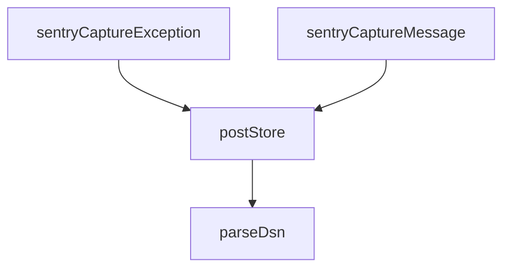

## Genel Bakış
Bu modül, uygulamadan Sentry hata izleme servisine veri göndermek için gerekli temel araçları sağlar. DSN ayrıştırma, ham veri gönderimi ve geliştirici dostu yakalama arayüzlerini içererek hata ve mesaj raporlama döngüsünü tamamlar.

## Fonksiyon Grupları
### DSN İşlemleri
Sentry Data Source Name stringini ayrıştırarak sunucu, kimlik ve proje bilgilerini hazırlar.
- parseDsn

### Transport (Veri Gönderimi)
Ayrıştırılmış DSN bilgilerini kullanarak olay yükünü Sentry'nin alıcı sunucusuna asenkron olarak iletir.
- postStore

### Uygulama Yakalama API'leri
Geliştiricilerin uygulama içinden mesaj veya istisna yakalamasını kolaylaştırır; içlerinde DSN işleme ve veri gönderimini orkestra eder.
- sentryCaptureMessage, sentryCaptureException

---

## AXIOMS – Mimari Varsayımlar

Bu modül, fonksiyon gövdeleri paylaşılmadığı için yalnızca fonksiyon imzalarından ve modülün genel amacından çıkarılabilecek temel mimari varsayımları içerir.

**[Aksiyom 1]:** Eğer `parseDsn`'a verilen `dsn` parametresi geçerli bir Sentry DSN formatında (örn. `https://<public_key>@<host>/<project_id>`) değilse, ayrıştırma sonucu tutarsız veya eksik olur ve `postStore` tarafından gönderilen HTTP isteği hedefe ulaşamaz.

**[Aksiyom 2]:** Eğer `postStore` çağrıldığında ağ (network) bağlantısı mevcut değilse veya Sentry'nin store endpoint'i erişilemez durumda ise, hata raporu sunucuya ulaşamaz ve sessizce başarısız olur.

**[Aksiyom 3]:** Eğer `sentryCaptureMessage` veya `sentryCaptureException` çağrılmadan önce ortam değişkenlerinden veya uygun bir kaynaktan geçerli bir DSN (`dsn`) sağlanamıyorsa, bu fonksiyonlar raporlama yapamaz; çünkü arka planda `parseDsn` ve `postStore` zinciri bu değere bağlıdır.

**[Aksiyom 4]:** Eğer `sentryCaptureMessage` çağrısında `level` parametresi `SentryLevel` tipinin izin verdiği değerlerden biri (örn. `"error"`, `"warning"`, `"info"` vb.) dışındaysa, Sentry tarafında beklenmeyen bir davranış veya reddetme oluşur.

**[Aksiyom 5]:** Eğer `sentryCaptureException` çağrısında `_e` parametresi `null` veya geçersiz bir değer olarak sağlanırsa, modülün hata bilgisini anlamlı bir şekilde serialize edememesi ve raporlanamaması olur.

---

## FONKSİYON DETAYLARI

### parseDsn
**Ne yapar**: Verilen bir Sentry DSN (Data Source Name) dizesini ayrıştırarak bileşenlerine (host, publicKey, projectId) ayırır. Başarısız ayrıştırma durumunda `null` değerini döner.

**Nasıl yapar**: Girdi dizesini bir `URL` nesnesine dönüştürmeye çalışır. Dönüşüm başarılı olursa, URL nesnesinin `username`, `host` ve `pathname` özelliklerinden istenen değerleri çıkarır. `pathname`’den baştaki `/` karakteri kaldırılarak `projectId` elde edilir. Herhangi bir ayrıştırma hatası (geçersiz URL) veya gerekli alanların boş olması durumunda `null` döner.

**Parametreler**:
- `dsn: string` — Sentry projesine ait Data Source Name dizesi. Örnek format: `https://PUBLIC_KEY@o123456.ingest.sentry.io/987654`

**Dönüş**: `{ host: string; publicKey: string; projectId: string } | null` — Ayrıştırma başarılıysa host, anahtar ve proje ID’sini içeren bir nesne; aksi halde `null`.

### postStore
**Ne yapar**: Sağlanan DSN ve olay gövdesi kullanılarak Sentry’ye bir hata veya mesaj kaydı (store) göndermek için asenkron bir HTTP POST isteği başlatır. İletişim hatası durumunda sessizce devam eder.

**Nasıl yapar**: İlk olarak `parseDsn` fonksiyonuyla DSN’yi ayrıştırır. Ayrıştırma başarısız olursa hiçbir şey yapmaz. Başarılıysa, `https://{host}/api/{projectId}/store/` formatında bir endpoint URL’si oluşturur. Gerekli `X-Sentry-Auth` başlığını, Sentry API standardına uygun olarak versiyon, istemci anahtarı ve istemci adı bilgileriyle formatlar. Son olarak, `fetch` API’sini kullanarak JSON formatındaki gövdeyi ilgili URL’ye POST metoduyla gönderir. `try-catch` bloğu, ağ hataları veya diğer istisnaları yakalar ve yok sayar.

**Parametreler**:
- `dsn: string` — İsteğin gönderileceği Sentry projesinin DSN adresi.
- `body: unknown` — Gönderilecek olay verisi (JSON’laştırılabilir bir nesne).

**Dönüş**: `Promise<void>` — Fonksiyon asenkron olup, bir değer dönmez.

### sentryCaptureMessage
**Ne yapar**: Belirtilen metin mesajını ve seviyesini bir Sentry olayı olarak gönderir. Ortam değişkenlerinden DSN ve diğer yapılandırma değerlerini otomatik olarak okur.

**Nasıl yapar**: `globalThis` üzerinden Deno ortam değişkenlerine erişerek `SENTRY_DSN` değerini alır. Eğer DSN yoksa veya boşsa fonksiyon hemen sonlanır. DSN varsa, standart bir Sentry olay nesnesi oluşturur. Bu nesne platform, zaman damgası, seviye, mesaj, ek bilgiler (`extra`) ve opsiyonel olarak ortam ile sürüm bilgilerini içerir. Oluşturulan olay nesnesini `postStore` fonksiyonu aracılığıyla Sentry’ye iletir.

**Parametreler**:
- `message: string` — Raporlanacak hata veya durum mesajı.
- `level: SentryLevel` — Olay ciddiyeti (örn: 'error', 'warning', 'info'). Varsayılan `'error'`.
- `extra?: Record<string, unknown>` — Opsiyonel. Mesajla birlikte gönderilecek ek bağlam bilgileri.

**Dönüş**: `Promise<void>` — Fonksiyon asenkron olup, bir değer dönmez.

### sentryCaptureException
**Ne yapar**: Yakalanan bir hata (Error nesnesi veya bilinmeyen herhangi bir değer) hakkında detaylı bir Sentry olayı oluşturur ve gönderir. Hata istifasını (stack trace) mümkün olduğunca dahil eder.

**Nasıl yapar**: `SENTRY_DSN` ortam değişkenini okur; DSN yoksa hemen çıkılır. Girdi nesnesinin bir `Error` örneği olup olmadığını kontrol eder. Eğer bir `Error` ise, `message` ve `stack` özellikleri alınır; değilse, değer `String()` ile metne dönüştürülür. Sentry’nin beklediği `exception` yapısını oluşturur: hata türü, mesajı ve opsiyonel istifayı (`stacktrace.frames` içinde minimal bir çerçeve yapısıyla) içerir. Tam olay nesnesi, `postStore` ile iletilir.

**Parametreler**:
- `_e: unknown` — Yakalanan hata nesnesi veya herhangi bir değer. Bir `Error` instance’ı ise daha detaylı bilgi çıkarılır.
- `extra?: Record<string, unknown>` — Opsiyonel. İstisnayla ilişkilendirilecek ek bağlam bilgileri.

**Dönüş**: `Promise<void>` — Fonksiyon asenkron olup, bir değer dönmez.

---

## TYPE ALIASES

### SentryLevel
```typescript
type SentryLevel = 'fatal' | 'error' | 'warning' | 'info' | 'debug' | 'log'
```

---

## AST POINTERS

### [N1_NASIL] AST Pointer: _shared/sentry.ts::parseDsn
- **params**: `dsn: string` — Sentry DSN URL'i
- **ic_degiskenler**:
  - `u` — URL nesnesi, dsn string'inden parse edilmiş
  - `publicKey` — URL'den çıkarılan Sentry public key (u.username, trimlenmiş)
  - `host` — URL'den çıkarılan hostname (u.host)
  - `projectId` — URL path'inden çıkarılan proje ID'si (başındaki '/' kaldırılmış)
- **Dönüş**: `{ host: string; publicKey: string; projectId: string } | null` — parse başarılıysa nesne, başarısızsa null

### [N2_NASIL] AST Pointer: _shared/sentry.ts::postStore
- **params**: `dsn: string` — Sentry DSN URL'i, `body: unknown` — gönderilecek event verisi
- **ic_degiskenler**:
  - `parsed` — parseDsn ile parse edilmiş DSN bilgisi (host, publicKey, projectId) veya null
  - `url` — POST isteği yapılacak tam URL (`https://${parsed.host}/api/${parsed.projectId}/store/`)
  - `auth` — X-Sentry-Auth header değeri, virgülle ayrılmış kimlik bilgileri dizisi
- **Dönüş**: `Promise<void>` — yan etki: Sentry store endpoint'ine POST isteği gönderir, hata yutulur

### [N3_NASIL] AST Pointer: _shared/sentry.ts::sentryCaptureMessage
- **params**: `message: string` — yakalanacak mesaj, `level: SentryLevel = 'error'` — mesaj severity seviyesi (varsayılan 'error'), `extra?: Record<string, unknown>` — opsiyonel ek veri
- **ic_degiskenler**:
  - `dsn` — Deno env'den okunan SENTRY_DSN değeri, boş string fallback'li
  - `event` — Sentry'ye gönderilecek event nesnesi (platform, logger, timestamp, level, message, extra, environment, release alanlarını içerir)
- **Dönüş**: `yok` — yan etki: parseDsn ile DSN parse edilip postStore'a event gönderilir; DSN boşsa hiçbir şey yapmaz

### [N4_NASIL] AST Pointer: _shared/sentry.ts::sentryCaptureException
- **params**: `_e: unknown` — yakalanacak istisna/hata nesnesi, `extra?: Record<string, unknown>` — opsiyonel ek veri
- **ic_degiskenler**:
  - `dsn` — Deno env'den okunan SENTRY_DSN değeri, boş string fallback'li
  - `isErr` — _e'nin Error instance olup olmadığının kontrolü (boolean)
  - `message` — hata nesnesinden çıkarılan mesaj string'i (_e.message veya String(_e))
  - `stack` — hata nesnesinin stack trace'i (Error ise _e.stack, değilse undefined)
  - `event` — Sentry'ye gönderilecek event nesnesi (platform, logger, timestamp, level: 'error', message, exception, extra, environment, release alanlarını içerir); exception alanını stack varsa frames dizisi ile birlikte oluşturur
- **Dönüş**: `yok` — yan etki: parseDsn ile DSN parse edip postStore'a hata event'i gönderir; DSN boşsa hiçbir şey yapmaz

---


## MERMAID CALL GRAPH


## NODE ID STANDARD

  file: supabase\functions\_shared\sentry.ts
  function: supabase\functions\_shared\sentry.ts::parseDsn
  function: supabase\functions\_shared\sentry.ts::postStore
  function: supabase\functions\_shared\sentry.ts::sentryCaptureMessage
  function: supabase\functions\_shared\sentry.ts::sentryCaptureException

---

## DISA AKTARILANLAR (EXPORTS)
  export: SentryLevel
  export: parseDsn
  export: postStore
  export: sentryCaptureException
  export: sentryCaptureMessage