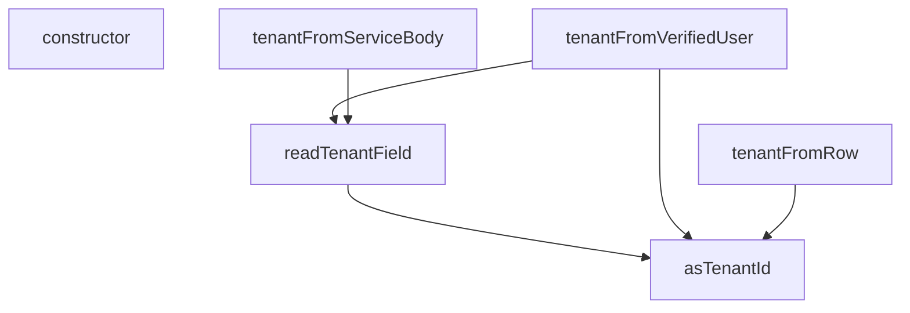

## Genel Bakış
Bu modül, çok kiracılı (multi-tenant) sistemlerde tenant (kiracı) bilgilerini yönetmek için kullanılır. Tenant ID'yi farklı kaynaklardan güvenli bir şekilde çıkarmak, doğrulamak ve tenant ile ilgili hata durumlarını tanımlamak gibi temel sorumlulukları vardır.

## Fonksiyon Grupları
### Tenant ID Çıkarma ve Okuma
Bu grup, ham değerlerden veya veri kaynaklarından tenant ID'yi çıkarmak ve okumak için kullanılır.
- asTenantId, readTenantField

### Tenant Karar Üretme
Bu grup, farklı kaynaklardan (doğrulanmış kullanıcı, servis isteği gövdesi, veritabanı satırı) tenant ile ilgili kararlar üretir.
- tenantFromVerifiedUser, tenantFromServiceBody, tenantFromRow

### Hata Yönetimi
Bu grup, tenant bilgileri arasındaki uyumsuzlukları yakalamak ve bildirmek için özel hata sınıfını tanımlar.
- TenantMismatchError (sınıf ve constructor metodu)

---

## AXIOMS – Mimari Varsayımlar
- Bu modül davranışsal mantık içermez (salt veri / konfigürasyon / tip tanımı).
- [Aksiyom 1]: Modülün dışa açtığı yapı (anahtar kümesi / şema) bir sözleşmedir; tüketiciler bu sabit yapıya bağlıdır — kırıcı değişiklik tüm tüketicileri etkiler.
- [Aksiyom 2]: Bir öğe ekleme/çıkarma yapısal-uyumlu olmalı; ilgili tipler ve seçiciler aynı commit'te güncel tutulmalıdır.

---

## FONKSİYON DETAYLARI

### asTenantId
**Ne yapar**: Verilen değerin geçerli bir tenant UUID'si olup olmadığını kontrol eder. Geçerliyse küçük harflere normalize edilmiş UUID string'ini, geçersizse `null` döndürür.

**Nasıl yapar**: Önce girdinin `string` tipinde olup olmadığını kontrol eder; değilse `null` döner. String ise baştaki ve sondaki boşlukları temizler. Temizlenmiş değer üzerinde `TENANT_UUID_RE` düzenli ifadesiyle eşleşme testi yapar. Eşleşiyorsa değeri `toLowerCase()` ile küçük harfe çevirip döndürür, eşleşmiyorsa `null` döner.

**Parametreler**:
- value: unknown — Kontrol edilecek değer; herhangi bir tipte olabilir.

**Dönüş**: string | null — Geçerli bir UUID ise küçük harf normalize edilmiş hali, aksi takdirde `null`.

### readTenantField
**Ne yapar**: Geliştirildi ancak detay üretilemedi.

### tenantFromVerifiedUser
**Ne yapar**: Geliştirildi ancak detay üretilemedi.

### tenantFromServiceBody
**Ne yapar**: Geliştirildi ancak detay üretilemedi.

### tenantFromRow
**Ne yapar**: Geliştirildi ancak detay üretilemedi.

### constructor
**Ne yapar**: Geliştirildi ancak detay üretilemedi.

---

## INTERFACES

### TenantDecision
- `readonly tenantId: string`
- `readonly source: TenantSource`

### VerifiedUser
`auth.getUser(jwt)`'in döndürdüğü kullanıcının bu modülün ihtiyaç duyduğu dar yüzü. Supabase'in tam `User` tipini import etmiyoruz: bu dosyanın ağ/SDK bağımlılığı olmamalı ki saf kalsın ve testte düz nesneyle çağrılabilsin.
- `readonly id: string`
- `readonly app_metadata?: Record<string, unknown> | null`

### TenantProfileRow
Sınıf (a) rol sorgusunun döndürdüğü satır: `select role, tenant_id`. İkisinin AYNI satırdan gelmesi bilinçli — cetvel §3.2 rolü, §3.9 tenant'ı ister ve eski kod bunları iki ayrı kaynaktan alıp "önce tenant'ı bul ki profili filtreleyeyim" döngüsüne düşüyordu.
- `readonly role?: string | null`
- `readonly tenant_id?: string | null`

---

## TYPE ALIASES

### TenantSource
Kararın NEREDEN geldiği. Log/telemetri için değil, DENETİM için: bir uç beklenmedik bir kaynağa düşüyorsa (ör. sınıf-(a) ucunda `'default'`) bu, kapının çalışmadığının işaretidir ve çağıran bunu görüp reddedebilir.
```typescript
type TenantSource = 'user_profile' | 'service_body' | 'resource_row' | 'default'
```

---

## SABİTLER
- **TENANT_UUID_RE** (regex) — `/^[0-9a-f]{8}-[0-9a-f]{4}-[0-9a-f]{4}-[0-9a-f]{4}-[0-9a-f]{12}$/i`

---

## AST POINTERS

### [N1_NASIL] AST Pointer: supabase/functions/_shared/tenant.ts::constructor
- **params**: `profileTenantId: string | null`, `claimTenantId: string`
- **ic_degiskenler**: yok
- **Dönüş**: yok (constructor — `super('tenant_mismatch')` çağrısı yapar, `this.name` alanını `'TenantMismatchError'` olarak atar, `this.profileTenantId` ve `this.claimTenantId` alanlarını parametre değerlerine atar)

### [N2_NASIL] AST Pointer: supabase/functions/_shared/tenant.ts::asTenantId
- **params**: `value: unknown`
- **ic_degiskenler**:
  - `trimmed` — `value` parametresinin `.trim()` ile boşluklardan arındırılmış hali; `TENANT_UUID_RE` regex'i ile test edilir
- **Dönüş**: `string | null` — `value` string değilse `null`; trim edilmiş değer `TENANT_UUID_RE` regex'ine uymuyorsa `null`; uyuyorsa `trimmed.toLowerCase()` (küçük harfe çevrilmiş UUID)

### [N3_NASIL] AST Pointer: supabase/functions/_shared/tenant.ts::readTenantField
- **params**: `source: unknown`
- **ic_degiskenler**:
  - `record` — `source` parametresinin `Record<string, unknown>` tipine cast edilmiş hali
  - `key` — `TENANT_FIELD_KEYS` dizisi üzerinde döngüdeki her bir anahtar
  - `candidate` — `record[key]` değerinin `asTenantId()` ile doğrulanmış sonucu
- **Dönüş**: `string | null` — `TENANT_FIELD_KEYS` içindeki ilk geçerli UUID bulunursa o değer; bulunamazsa `null`; `source` nesne değilse `null`

### [N4_NASIL] AST Pointer: supabase/functions/_shared/tenant.ts::tenantFromVerifiedUser
- **params**: `user: VerifiedUser`, `profile: TenantProfileRow | null`
- **ic_degiskenler**:
  - `fromProfile` — `profile?.tenant_id ?? null` değerinin `asTenantId()` ile doğrulanmış sonucu
  - `fromClaim` — `user.app_metadata ?? null` değerinin `readTenantField()` ile çıkarılmış tenant ID'si
- **Dönüş**: `TenantDecision` — `fromClaim` ve `fromProfile` farklıysa `TenantMismatchError` fırlatır; `fromProfile` varsa `{ tenantId: fromProfile, source: 'user_profile' }`; yoksa `{ tenantId: DEFAULT_TENANT_ID, source: 'default' }`

### [N5_NASIL] AST Pointer: supabase/functions/_shared/tenant.ts::tenantFromServiceBody
- **params**: `parsedBody: unknown`
- **ic_degiskenler**:
  - `claimed` — `parsedBody` değerinin `readTenantField()` ile çıkarılmış tenant ID'si
- **Dönüş**: `TenantDecision` — `claimed` varsa `{ tenantId: claimed, source: 'service_body' }`; yoksa `{ tenantId: DEFAULT_TENANT_ID, source: 'default' }`

### [N6_NASIL] AST Pointer: supabase/functions/_shared/tenant.ts::tenantFromRow
- **params**: `row: { tenant_id?: string | null } | null`
- **ic_degiskenler**:
  - `fromRow` — `row?.tenant_id ?? null` değerinin `asTenantId()` ile doğrulanmış sonucu
- **Dönüş**: `TenantDecision` — `fromRow` varsa `{ tenantId: fromRow, source: 'resource_row' }`; yoksa `{ tenantId: DEFAULT_TENANT_ID, source: 'default' }`

---


## MERMAID CALL GRAPH


## NODE ID STANDARD

  file: tenant.ts
  function: tenant.ts::asTenantId
  function: tenant.ts::readTenantField
  function: tenant.ts::tenantFromVerifiedUser
  function: tenant.ts::tenantFromServiceBody
  function: tenant.ts::tenantFromRow
  class: tenant.ts::TenantMismatchError

---

## DISA AKTARILANLAR (EXPORTS)
  export: TenantDecision
  export: TenantMismatchError
  export: TenantProfileRow
  export: TenantSource
  export: VerifiedUser
  export: asTenantId
  export: readTenantField
  export: tenantFromRow
  export: tenantFromServiceBody
  export: tenantFromVerifiedUser

---

## BILEŞIM (CONTAINS)
  contains: string
  contains: string | null