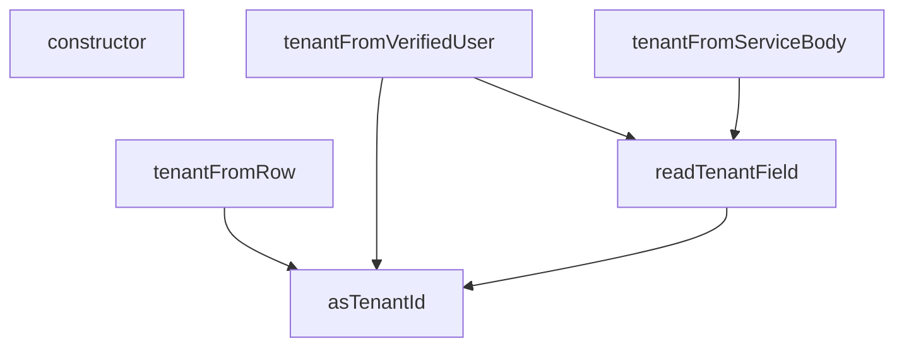

## Genel Bakış
Bu modül, çok kiracılı (multi-tenant) sistemlerde tenant (kiracı) bilgilerini yönetmek için kullanılır. Tenant ID'yi farklı kaynaklardan güvenli bir şekilde çıkarmak, doğrulamak ve tenant ile ilgili hata durumlarını tanımlamak gibi temel sorumlulukları vardır.

## Fonksiyon Grupları
### Tenant ID Çıkarma ve Okuma
Bu grup, ham değerlerden veya veri kaynaklarından tenant ID'yi çıkarmak ve okumak için kullanılır.
- asTenantId, readTenantField

### Tenant Karar Üretme
Bu grup, farklı kaynaklardan (doğrulanmış kullanıcı, servis isteği gövdesi, veritabanı satırı) tenant ile ilgili kararlar üretir.
- tenantFromVerifiedUser, tenantFromServiceBody, tenantFromRow

### Hata Yönetimi
Bu grup, tenant bilgileri arasındaki uyumsuzlukları yakalamak ve bildirmek için özel hata sınıfını tanımlar.
- TenantMismatchError (sınıf ve constructor metodu)

---

## AXIOMS – Mimari Varsayımlar
- Bu modül davranışsal mantık içermez (salt veri / konfigürasyon / tip tanımı).
- [Aksiyom 1]: Modülün dışa açtığı yapı (anahtar kümesi / şema) bir sözleşmedir; tüketiciler bu sabit yapıya bağlıdır — kırıcı değişiklik tüm tüketicileri etkiler.
- [Aksiyom 2]: Bir öğe ekleme/çıkarma yapısal-uyumlu olmalı; ilgili tipler ve seçiciler aynı commit'te güncel tutulmalıdır.

---

## FONKSİYON DETAYLARI

### asTenantId
**Ne yapar**: Verilen değerin geçerli bir tenant UUID'si olup olmadığını kontrol eder. Geçerliyse küçük harflere normalize edilmiş UUID string'ini, geçersizse `null` döndürür.

**Nasıl yapar**: Önce girdinin `string` tipinde olup olmadığını kontrol eder; değilse `null` döner. String ise baştaki ve sondaki boşlukları temizler. Temizlenmiş değer üzerinde `TENANT_UUID_RE` düzenli ifadesiyle eşleşme testi yapar. Eşleşiyorsa değeri `toLowerCase()` ile küçük harfe çevirip döndürür, eşleşmiyorsa `null` döner.

**Parametreler**:
- value: unknown — Kontrol edilecek değer; herhangi bir tipte olabilir.

**Dönüş**: string | null — Geçerli bir UUID ise küçük harf normalize edilmiş hali, aksi takdirde `null`.

### readTenantField
**Ne yapar**: Geliştirildi ancak detay üretilemedi.

### tenantFromVerifiedUser
**Ne yapar**: Geliştirildi ancak detay üretilemedi.

### tenantFromServiceBody
**Ne yapar**: Geliştirildi ancak detay üretilemedi.

### tenantFromRow
**Ne yapar**: Geliştirildi ancak detay üretilemedi.

### constructor
**Ne yapar**: `TenantMismatchError` sınıfının yapıcı metodudur. Tenant (kiracı) uyumsuzluğu durumunda fırlatılacak hata nesnesini başlatır ve ilgili tenant kimlik bilgilerini hata nesnesine kaydeder.

**Nasıl yapar**: Üst sınıfın constructor'ını `super('tenant_mismatch')` çağrısıyla başlatır; bu sayede hata mesajı olarak `'tenant_mismatch'` değerini kullanır. Ardından `this.name` özelliğini `'TenantMismatchError'` olarak ayarlayarak hata türünü tanımlar. Son olarak gelen `profileTenantId` ve `claimTenantId` parametrelerini ilgili örnek özelliklerine atar, böylece hata yakalandığında hangi tenant kimliklerinin uyuşmadığı bilgisine erişilebilir.

**Parametreler**:
- `profileTenantId`: `string | null` — Profil kaydındaki tenant kimliğini temsil eder. Profil kaydı bulunamadığında `null` olabilir.
- `claimTenantId`: `string` — JWT claim'lerindeki tenant kimliğini temsil eder. Bu değer her zaman bir string olarak beklenir.

**Dönüş**: Bilinmiyor. Constructor metotlarının dönüş tipi kaynak kodda belirtilmemiştir.

---

## INTERFACES

### TenantDecision
- `readonly tenantId: string`
- `readonly source: TenantSource`

### VerifiedUser
`auth.getUser(jwt)`'in döndürdüğü kullanıcının bu modülün ihtiyaç duyduğu dar yüzü. Supabase'in tam `User` tipini import etmiyoruz: bu dosyanın ağ/SDK bağımlılığı olmamalı ki saf kalsın ve testte düz nesneyle çağrılabilsin.
- `readonly id: string`
- `readonly app_metadata?: Record<string, unknown> | null`

### TenantProfileRow
Sınıf (a) rol sorgusunun döndürdüğü satır: `select role, tenant_id`. İkisinin AYNI satırdan gelmesi bilinçli — cetvel §3.2 rolü, §3.9 tenant'ı ister ve eski kod bunları iki ayrı kaynaktan alıp "önce tenant'ı bul ki profili filtreleyeyim" döngüsüne düşüyordu.
- `readonly role?: string | null`
- `readonly tenant_id?: string | null`

---

## TYPE ALIASES

### TenantSource
Kararın NEREDEN geldiği. Log/telemetri için değil, DENETİM için: bir uç beklenmedik bir kaynağa düşüyorsa (ör. sınıf-(a) ucunda `'default'`) bu, kapının çalışmadığının işaretidir ve çağıran bunu görüp reddedebilir.
```typescript
type TenantSource = 'user_profile' | 'service_body' | 'resource_row' | 'default'
```

---

## SABİTLER
- **TENANT_UUID_RE** (regex) — `/^[0-9a-f]{8}-[0-9a-f]{4}-[0-9a-f]{4}-[0-9a-f]{4}-[0-9a-f]{12}$/i`

---

## AST POINTERS

### [N1_NASIL] AST Pointer: tenant.ts::TenantMismatchError.constructor
- **params**: `profileTenantId: string | null`, `claimTenantId: string`
- **ic_degiskenler**: yok
- **Dönüş**: yok (constructor; `super('tenant_mismatch')` çağrısı yapar, `this.name` alanını `'TenantMismatchError'` olarak atar, `this.profileTenantId` ve `this.claimTenantId` alanlarını parametrelerden doldurur)

### [N2_NASIL] AST Pointer: tenant.ts::asTenantId
- **params**: `value: unknown`
- **ic_degiskenler**:
  - `trimmed` — `value` string ise `value.trim()` sonucu; UUID regex testine sokulan temizlenmiş değer
- **Dönüş**: `string | null` — `value` string değilse `null`; `trimmed` `TENANT_UUID_RE` regex'ine uymuyorsa `null`; uyuyorsa `trimmed.toLowerCase()` (küçük harfe çevrilmiş UUID)

### [N3_NASIL] AST Pointer: tenant.ts::readTenantField
- **params**: `source: unknown`
- **ic_degiskenler**:
  - `record` — `source` object ve null değilse `source as Record<string, unknown>` ile dönüştürülen kayıt
  - `key` — `TENANT_FIELD_KEYS` dizisi üzerinde döngüdeki mevcut anahtar
  - `candidate` — `asTenantId(record[key])` çağrısının dönüş değeri; her anahtar için kontrol edilen tenant ID adayı
- **Dönüş**: `string | null` — `source` object değilse `null`; `TENANT_FIELD_KEYS` içindeki anahtarlardan biri geçerli bir tenant ID döndürüyorsa o değer; hiçbiri bulamazsa `null`

### [N4_NASIL] AST Pointer: tenant.ts::tenantFromVerifiedUser
- **params**: `user: VerifiedUser`, `profile: TenantProfileRow | null`
- **ic_degiskenler**:
  - `fromProfile` — `asTenantId(profile?.tenant_id ?? null)` çağrısının dönüş değeri; profilden okunan tenant ID
  - `fromClaim` — `readTenantField(user.app_metadata ?? null)` çağrısının dönüş değeri; kullanıcı claim'inden okunan tenant ID
- **Dönüş**: `TenantDecision` — `fromClaim` ve `fromProfile` farklı ve ikisi de null değilse `TenantMismatchError` fırlatır; `fromProfile` null değilse `{ tenantId: fromProfile, source: 'user_profile' }`; aksi halde `{ tenantId: DEFAULT_TENANT_ID, source: 'default' }`

### [N5_NASIL] AST Pointer: tenant.ts::tenantFromServiceBody
- **params**: `parsedBody: unknown`
- **ic_degiskenler**:
  - `claimed` — `readTenantField(parsedBody)` çağrısının dönüş değeri; servis gövdesinden okunan tenant ID
- **Dönüş**: `TenantDecision` — `claimed` null değilse `{ tenantId: claimed, source: 'service_body' }`; aksi halde `{ tenantId: DEFAULT_TENANT_ID, source: 'default' }`

### [N6_NASIL] AST Pointer: tenant.ts::tenantFromRow
- **params**: `row: { tenant_id?: string | null } | null`
- **ic_degiskenler**:
  - `fromRow` — `asTenantId(row?.tenant_id ?? null)` çağrısının dönüş değeri; satırdan okunan tenant ID
- **Dönüş**: `TenantDecision` — `fromRow` null değilse `{ tenantId: fromRow, source: 'resource_row' }`; aksi halde `{ tenantId: DEFAULT_TENANT_ID, source: 'default' }`

---


## MERMAID CALL GRAPH


## NODE ID STANDARD

  file: supabase\functions\_shared\tenant.ts
  function: supabase\functions\_shared\tenant.ts::asTenantId
  function: supabase\functions\_shared\tenant.ts::readTenantField
  function: supabase\functions\_shared\tenant.ts::tenantFromVerifiedUser
  function: supabase\functions\_shared\tenant.ts::tenantFromServiceBody
  function: supabase\functions\_shared\tenant.ts::tenantFromRow
  class: supabase\functions\_shared\tenant.ts::TenantMismatchError

---

## DISA AKTARILANLAR (EXPORTS)
  export: TenantDecision
  export: TenantMismatchError
  export: TenantProfileRow
  export: TenantSource
  export: VerifiedUser
  export: asTenantId
  export: readTenantField
  export: tenantFromRow
  export: tenantFromServiceBody
  export: tenantFromVerifiedUser

---

## BILEŞIM (CONTAINS)
  contains: string
  contains: string | null

## Tasarım Gerekçeleri (kaynaktan BİREBİR)

> Bu bölüm LLM tarafından **yazılmadı**; kaynaktaki işaretli bloklardan
> birebir kopyalandı. Özetlenmesi veya yeniden ifade edilmesi YASAKTIR —
> gerekçenin değeri tam olarak kelimelerindedir.


```text
NİÇİN BU DOSYA VAR
-----------------
Eski `_shared/tenant_config.ts::resolveTenantId` tenant sınırını ÜÇ ayrı istek
alanından çiziyordu: `?tenant_id=` query'si (her şeyden önce), imzası hiç
doğrulanmadan elle çözülmüş JWT payload'ı, ve gövde. Üçü de saldırganın yazdığı yerler
— yani tenant sınırı pratikte YOKTU. Fonksiyonlar bu değeri PostgREST filtresine
(`tenant_id=eq.${tenantId}`) koyduğu için etki "başka tenant'ın satırını oku/yaz"a
kadar gidiyordu (cetvel §3.9 · CLAUDE.md §12 "data bleeding = felaket").

NİÇİN HTTP İSTEK NESNESİNİ HİÇ GÖRMÜYOR (stil tercihi DEĞİL, yapısal kilit)
---------------------------------------------------------------------------
Kök sebep "sıra yanlıştı" değil, **tenant modülünün istek nesnesine erişebilmesiydi**.
Erişim durdukça birileri er ya da geç yeniden "hızlıca şu query'yi de okuyalım" der.
Bu yüzden dosya SAF tutulur: istek nesnesi, istek başlıkları, query parametreleri ve
elle JWT çözme bu dosyada GEÇMEZ — hiçbiri, yorum içinde bile. Karar verirken elde
yalnız ÇAĞIRANIN ZATEN DOĞRULADIĞI girdiler olur; doğrulamak çağıranın işidir
(bkz. `_shared/caller.ts`).
(`tenant-id-hardening-2026-08-15.md` §7-B bunu ileride statik kural olarak bağlayacak;
kural ham dosyayı tarasa bile bu dosya temiz kalsın diye yasak diziler yazılmadı.)

NİÇİN SINIF BAŞINA AYRI FONKSİYON ("JWT kazanır" tek başına yetmez)
-------------------------------------------------------------------
Cetvel §2'deki çağıran sınıflarının kanıtı FARKLIDIR, dolayısıyla tenant kaynağı da
farklı olmak zorundadır:
(a) oturumlu kullanıcı  → `user_profiles.tenant_id` (rol ile AYNI sorgudan)
(b) service_role        → anahtar doğrulandıktan SONRA gövdedeki alan
(c) harici sistem       → imza doğrulandıktan SONRA kaynağın KENDİ satırından
Tek bir `resolveTenantId` bu üçünü aynı kaba koyduğu için en zayıf halka (query)
hepsinin duruşunu belirliyordu. Üç ayrı fonksiyon, çağıranı sınıfını beyan etmeye
zorlar; yanlış sınıfı kullanmak kodda görünür hâle gelir.

NİÇİN "claim YOKSA hata değil" (ölçüme dayanır, tercihe değil)
---------------------------------------------------------------
2026-08-15 prod ölçümü: `auth.users` = 2 kullanıcı, İKİSİNİN DE
`raw_app_meta_data->>'tenant_id'` alanı NULL; `user_profiles` = 2 satır, distinct
tenant = 1. Yani `app_metadata.tenant_id` bugün HİÇBİR kullanıcıda yok. "Claim yoksa
reddet" deseydik bugün canlı iki kullanıcının ikisi de kilitlenirdi. Bu yüzden claim
bir OTORİTE değil, bir ÇAPRAZ KONTROLdür: yoksa profil kazanır, varsa profille
UYUŞMAK ZORUNDADIR (plan R5).
```
