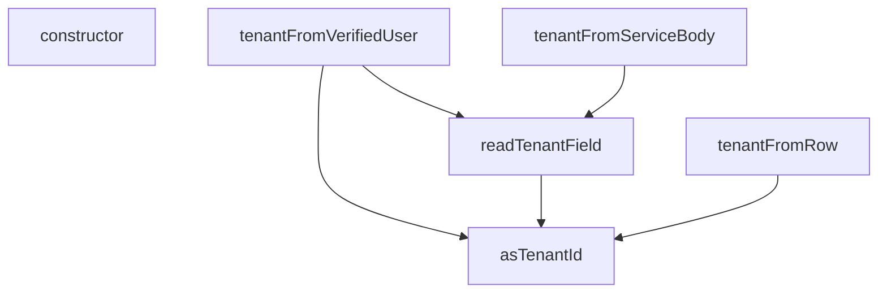

## Genel Bakış
Bu modül, çok kiracılı bir Supabase Edge Functions yapısında kiracı (tenant) kararlarının alınması için merkezi yardımcı işlevleri sunar. Farklı kaynaklardan (doğrulanmış kullanıcı profilleri, HTTP istek gövdeleri veya veritabanı satırları) gelen kiracı bilgisini standart bir `TenantDecision` formatına dönüştürerek tutarlı bir karar üretmeyi ve kiracı eşleşmeyen durumlarda hata yönetimi sağlamayı amaçlar.

## Fonksiyon Grupları
### Temel Dönüştürücü ve Yardımcılar
Bu grup, ham veya değişken tipteki girdileri geçerli bir kiracı tanımlayıcısına (tenant ID) dönüştüren ve kaynak nesnelerden kiracı alanlarını okuyan düşük seviyeli yardımcı fonksiyonları içerir.
- asTenantId, readTenantField

### Karar Üreticileri
Bu grup, farklı kaynaklardan (doğrulanmış kullanıcı, servis gövdesi veya veritabanı satırı) kiracı bilgisini çıkararak standart bir karar nesnesi üreten ana mantık fonksiyonlarını barındırır.
- tenantFromVerifiedUser, tenantFromServiceBody, tenantFromRow

### Hata ve Uyumsuzluk Yönetimi
Bu grup, kiracı kimlikleri arasındaki tutarsızlıkları yakalamak ve bağlam hakkında bilgi veren anlamlı hata mesajları üretmek için özel bir hata sınıfını tanımlar.
- TenantMismatchError (sınıf ve yapılandırıcısı)

---

## AXIOMS – Mimari Varsayımlar

Bu modül, çoklu kiracılı (multi-tenant) sistemlerde kiracılık (tenant) kimliğini doğrulamak ve karar üretmek için kullanılır.

[Aksiyom 1]: Eğer `TENANT_UUID_RE` regex sabiti tanımlı değilse veya geçerli bir UUID deseni içermiyorsa, `asTenantId` fonksiyonu hiçbir zaman geçerli bir tenant ID döndüremez.

[Aksiyom 2]: Eğer `user` parametresi `VerifiedUser` tipinde değilse veya `profile` parametresi `null` ise, `tenantFromVerifiedUser` fonksiyonunun tenant kararını doğru üretmesi garanti edilemez.

[Aksiyom 3]: Eğer `parsedBody` parametresi `tenant_id` alanı içermeyen bir yapıda ise, `tenantFromServiceBody` fonksiyonu `TenantDecision`'da tenant bilgisini `null` olarak döndürür.

[Aksiyom 4]: Eğer `row` parametresi `null` ise veya `row.tenant_id` alanı mevcut değilse, `tenantFromRow` fonksiyonu tenant bilgisi içermeyen bir `TenantDecision` döndürür.

[Aksiyom 5]: Eğer `profileTenantId` ile `claimTenantId` değerleri birbirinden farklı ise, `TenantMismatchError` hatası fırlatılır — bu, profil ile doğrulanmış kullanıcı arasındaki tenant uyumsuzluğunu işaret eder.

[Aksiyom 6]: Eğer `tenantFromVerifiedUser` fonksiyonu hem `user`'da hem `profile`'da tenant bilgisi bulursa ve ikisi farklı ise, bu durum bir uyumsuzluk (mismatch) olarak işlenir ve muhtemelen hata fırlatılır.

[Aksiyom 7]: Eğer `asTenantId` fonksiyonuna verilen `value` parametresi `TENANT_UUID_RE` regex deseniyle eşleşmiyorsa, fonksiyon `null` döndürür.

[Aksiyom 8]: Eğer `TenantMismatchError` constructor'ına `profileTenantId` olarak `null` değer verilir ve `claimTenantId` geçerli bir UUID ise, hata yine de fırlatılır çünkü claim edilen tenant ile profil tenantı eşleşmemektedir.

---

## FONKSİYON DETAYLARI

### asTenantId
**Ne yapar**: Verilen değerin geçerli bir tenant UUID'si olup olmadığını kontrol eder ve geçerliyse normalize eder.
**Nasıl yapar**: Değerin bir string olup olmadığını kontrol eder, değiliyse `null` döner. String ise başındaki ve sonundaki boşlukları temizledikten sonra `TENANT_UUID_RE`正则 ifadesiyle eşleşip eşleşmediğini test eder. Eşleşiyorsa küçük harflere dönüştürerek normalize edilmiş UUID'yi, eşleşmiyorsa `null` döner.
**Parametreler**:
- `value`: `unknown` — Değerlendirilecek herhangi bir tipteki girdi.
**Dönüş**: `string | null` — Geçerli ve normalize edilmiş (küçük harf) UUID stringi veya geçersiz değer için `null`.

### readTenantField
**Ne yapar**: Serbest biçimli bir nesneden, önceden tanımlı alan anahtarları (`TENANT_FIELD_KEYS`) arasında dolaşarak geçerli bir tenant alanını okur.
**Nasıl yapar**: Girdi bir nesne veya null ise doğrudan `null` döner. Nesneyi `Record<string, unknown>` tipine daraltarak (proje kuralı gereği `any` kullanılmaz), `TENANT_FIELD_KEYS` dizisi üzerinde döngü başlatır. Her bir anahtar için değeri `asTenantId` fonksiyonuyla doğrular. İlk geçerli tenant alanını bulduğunda onu döndürür, hiçbirini bulamazsa `null` döner.
**Parametreler**:
- `source`: `unknown` — Tenant alanının aranacağı nesne. Nesne dışı değerler için `null` döner.
**Dönüş**: `string | null` — Bulunan geçerli tenant ID'si veya hiçbir alan geçerli değilse `null`.

### tenantFromVerifiedUser
**Ne yapar**: Doğrulanmış bir kullanıcı ve profili için tenant kararını (ID ve kaynağı) belirler.
**Nasıl yapar**: Kullanıcının `app_metadata` alanından (`fromClaim`) ve profil satırından (`fromProfile`) olası tenant değerlerini okur. Eğer claim mevcutsa ve profille eşleşmiyorsa, bir `TenantMismatchError` fırlatır (uyumsuzluk durumu). Profilden geçerli bir tenant ID okunabildiyse onu ve kaynağını (`user_profile`) döndürür. Hiçbiri yoksa varsayılan tenant ID'sini ve kaynağını (`default`) döndürür. Bu fonksiyon, otorite olarak `user_profiles.tenant_id`'yi kabul eder.
**Parametreler**:
- `user`: `VerifiedUser` — Kimliği doğrulanmış kullanıcı nesnesi. `app_metadata` alanı içerebilir.
- `profile`: `TenantProfileRow | null` — Kullanıcının `user_profiles` tablosundaki satırı veya null olabilir.
**Dönüş**: `TenantDecision` — `{ tenantId: string, source: 'user_profile' | 'default' }` formatında bir nesne. Tenant ID ve bu kararın hangi kaynaktan geldiği bilgisini içerir.

### tenantFromServiceBody
**Ne yapar**: service_role ile çağrılan bir fonksiyonun, doğrulama sonrası istek gövdesinden tenant kararını belirler.
**Nasıl yapar**: ÖN KOŞUL: Bu fonksiyon çağrılmadan önce, `Authorization` başlığının service_role anahtarı olduğu sabit-zamanlı karşılaştırmayla doğrulanmış olmalıdır. `parsedBody` üzerinden `readTenantField` ile bir tenant ID arar. Bulursa onu ve kaynağını (`service_body`) döndürür, bulamazsa varsayılan tenant ID'sini ve kaynağını (`default`) döndürür. Anahtarın kendisi tenant bilgisi içermez; bu nedenle gövdeden okuma yapılır.
**Parametreler**:
- `parsedBody`: `unknown` — service_role çağrısının istek gövdesi (parsed JSON).
**Dönüş**: `TenantDecision` — `{ tenantId: string, source: 'service_body' | 'default' }` formatında bir nesne.

### tenantFromRow
**Ne yapar**: HMAC imzası doğrulanmış bir isteğin işaret ettiği veritabanı satırından (örn. sipariş veya iade satırı) tenant kararını belirler.
**Nasıl yapar**: Harici bir sağlayıcı (kargo/ödeme) bizim tenant UUID'lerimizi bilmez, bu yüzden istekten tenant okumak yerine, imzalı istein işaret ettiği (`order_id`, `tracking_number` vb.) satırın kendi `tenant_id` alanını kullanır. `asTenantId` ile satırdaki `tenant_id` alanını doğrular. Geçerliyse onu ve kaynağını (`resource_row`) döndürür, değilse varsayılan tenant ID'sini ve kaynağını (`default`) döndürür.
**Parametreler**:
- `row`: `{ tenant_id?: string | null } | null` — `venthub_orders` veya `venthub_returns` gibi tablolardan gelen, `tenant_id` alanı opsiyonel olabilen satır nesnesi veya null.
**Dönüş**: `TenantDecision` — `{ tenantId: string, source: 'resource_row' | 'default' }` formatında bir nesne.

### TenantMismatchError.constructor
**Ne yapar**: Tenant uyuşmazlığı hata nesnesini başlatır ve hata detaylarını saklar.
**Nasıl yapar**: `super('tenant_mismatch')` çağrısıyla üst sınıf (Error) constructor'ını çalıştırarak hata mesajını ayarlar. Hata adını (`name`) 'TenantMismatchError' olarak belirler. Profilden gelen (`profileTenantId`) ve claim'den gelen (`claimTenantId`) tenant ID'lerini nesne özellikleri olarak saklar, bu da hata ayıklama ve loglama için faydalı bilgiler sağlar.
**Parametreler**:
- `profileTenantId`: `string | null` — Profil tablosundan (`user_profiles.tenant_id`) okunan tenant ID'si veya null.
- `claimTenantId`: `string` — Kullanıcı claim'inden (`app_metadata`) okunan ve profille uyuşmayan tenant ID'si.
**Dönüş**: `TenantMismatchError` — Bu bir constructor olduğu için dönüş tipi doğrudan nesnenin kendisidir. Önceden tanımlanmış `tenant_mismatch` mesajı ve her iki tenant ID'sini içeren bir Error nesnesi oluşturur.

---

## INTERFACES

### TenantDecision
- `readonly tenantId: string`
- `readonly source: TenantSource`

### VerifiedUser
`auth.getUser(jwt)`'in döndürdüğü kullanıcının bu modülün ihtiyaç duyduğu dar yüzü. Supabase'in tam `User` tipini import etmiyoruz: bu dosyanın ağ/SDK bağımlılığı olmamalı ki saf kalsın ve testte düz nesneyle çağrılabilsin.
- `readonly id: string`
- `readonly app_metadata?: Record<string, unknown> | null`

### TenantProfileRow
Sınıf (a) rol sorgusunun döndürdüğü satır: `select role, tenant_id`. İkisinin AYNI satırdan gelmesi bilinçli — cetvel §3.2 rolü, §3.9 tenant'ı ister ve eski kod bunları iki ayrı kaynaktan alıp "önce tenant'ı bul ki profili filtreleyeyim" döngüsüne düşüyordu.
- `readonly role?: string | null`
- `readonly tenant_id?: string | null`

---

## TYPE ALIASES

### TenantSource
Kararın NEREDEN geldiği. Log/telemetri için değil, DENETİM için: bir uç beklenmedik bir kaynağa düşüyorsa (ör. sınıf-(a) ucunda `'default'`) bu, kapının çalışmadığının işaretidir ve çağıran bunu görüp reddedebilir.
```typescript
type TenantSource = 'user_profile' | 'service_body' | 'resource_row' | 'default'
```

---

## SABİTLER
- **TENANT_UUID_RE** (regex) — `/^[0-9a-f]{8}-[0-9a-f]{4}-[0-9a-f]{4}-[0-9a-f]{4}-[0-9a-f]{12}$/i`

---

## AST POINTERS

### [N1_NASIL] AST Pointer: supabase\functions\_shared\tenant.ts::TenantMismatchError.constructor
- **params**: (profileTenantId: string | null, claimTenantId: string)
- **ic_degiskenler**: (yok — parametreler doğrudan atanır)
- **Dönüş**: yok — class instance başlatır

### [N2_NASIL] AST Pointer: supabase\functions\_shared\tenant.ts::asTenantId
- **params**: (value: unknown)
- **ic_degiskenler**:
  - `trimmed` — value'nun boşlukları temizlenmiş hali
- **Dönüş**: string | null

### [N3_NASIL] AST Pointer: supabase\functions\_shared\tenant.ts::readTenantField
- **params**: (source: unknown)
- **ic_degiskenler**:
  - `record` — source'un Record<string, unknown> tipine dönüştürülmüş hali
  - `key` — TENANT_FIELD_KEYS dizisindeki her bir alan adı
  - `candidate` — record[key] değerinin asTenantId ile işlenmiş hali
- **Dönüş**: string | null

### [N4_NASIL] AST Pointer: supabase\functions\_shared\tenant.ts::tenantFromVerifiedUser
- **params**: (user: VerifiedUser, profile: TenantProfileRow | null)
- **ic_degiskenler**:
  - `fromProfile` — profile.tenant_id değerinin asTenantId ile işlenmiş hali
  - `fromClaim` — user.app_metadata değerinin readTenantField ile işlenmiş hali
- **Dönüş**: TenantDecision object

### [N5_NASIL] AST Pointer: supabase\functions\_shared\tenant.ts::tenantFromServiceBody
- **params**: (parsedBody: unknown)
- **ic_degiskenler**:
  - `claimed` — parsedBody değerinin readTenantField ile işlenmiş hali
- **Dönüş**: TenantDecision object

### [N6_NASIL] AST Pointer: supabase\functions\_shared\tenant.ts::tenantFromRow
- **params**: (row: { tenant_id?: string | null } | null)
- **ic_degiskenler**:
  - `fromRow` — row?.tenant_id değerinin asTenantId ile işlenmiş hali
- **Dönüş**: TenantDecision object

---


## MERMAID CALL GRAPH


## NODE ID STANDARD

  file: supabase\functions\_shared\tenant.ts
  function: supabase\functions\_shared\tenant.ts::asTenantId
  function: supabase\functions\_shared\tenant.ts::readTenantField
  function: supabase\functions\_shared\tenant.ts::tenantFromVerifiedUser
  function: supabase\functions\_shared\tenant.ts::tenantFromServiceBody
  function: supabase\functions\_shared\tenant.ts::tenantFromRow
  class: supabase\functions\_shared\tenant.ts::TenantMismatchError

---

## DISA AKTARILANLAR (EXPORTS)
  export: TenantDecision
  export: TenantMismatchError
  export: TenantProfileRow
  export: TenantSource
  export: VerifiedUser
  export: asTenantId
  export: readTenantField
  export: tenantFromRow
  export: tenantFromServiceBody
  export: tenantFromVerifiedUser

---

## BILEŞIM (CONTAINS)
  contains: string
  contains: string | null