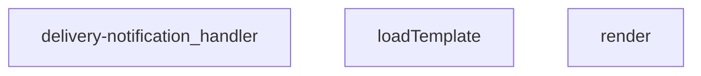

## Genel Bakış
Bu modül, bir Supabase Edge Function olarak teslimat tamamlandığında müşterilere otomatik e‑posta bildirimi gönderir. Sipariş verilerini veritabanından çeker, önceden hazırlanmış şablonları doldurur ve harici bir e‑posta servisi üzerinden mesajı iletir; işlem sonucu ise denetim amaçlı kaydedilir.

## Fonksiyon Grupları
### Şablon İşleme
E‑posta şablonlarının dosya sisteminden okunmasını ve sipariş bilgileriyle dinamik olarak doldurulmasını sağlar.
- loadTemplate, render

### Ana İstek İşleyici
Gelen HTTP isteklerini alır, yetkilendirmeyi kontrol eder, sipariş verilerini veritabanından çeker, şablon doldurma ve e‑posta gönderimi adımlarını koordine eder ve işlem sonuçlarını loglar.
- delivery-notification_handler

---

## AXIOMS – Mimari Varsayımlar
Bu modülün doğru çalışması için veritabanı bağlantısı, harici e-posta servisi yapılandırması ve dosya sistemi üzerinde şablon dosyasının varlığı gereklidir.

[Veritabanı Bağlantısı]: Eğer veritabanı erişimi yoksa, sipariş bilgileri çekilemez ve işlem denetim kaydı oluşturulamaz.
[E-posta Servisi]: Eğer harici e-posta servisi yapılandırması (API anahtarı vb.) yoksa, müşteriye bildirim gönderilemez.
[Şablon Dosyası]: Eğer `loadTemplate` fonksiyonu tarafından hedeflenen şablon dosyası yoksa, e-posta içeriği oluşturulamaz.
[İstek Nesnesi]: Eğer `delivery-notification_handler` fonksiyonuna geçerli bir istek nesnesi (`req`) sağlanmazsa, işlem başlatılamaz.

---

## FONKSIYON DETAYLARI

### render
**Ne yapar**: Dinamik içerikli metin şablonlarındaki placeholder'ları verilen veri nesnesindeki değerlerle değiştirerek, kullanıma hazır işlenmiş bir metin oluşturur. Temel olarak bildirim e-postası gibi dinamik içeriklerin üretilmesi için geliştirilmiş küçük şablon motorudur.
**Nasıl yapar**: JavaScript'in yerel replace metodu ve `/{{(\w+)}}/g` regex'i ile şablon metnindeki tüm `{{anahtar}}` formatındaki placeholder'ları bulur. Her eşleşen anahtar için veri nesnesindeki karşılığı alır, eğer veri nesnesinde ilgili anahtar yoksa varsayılan olarak boş string kullanır. Orijinal şablon metnini değiştirmeden yeni bir işlenmiş string döndürür.
**Parametreler**:
- name: tpl — type: string — İşlenecek placeholder'ları içeren ham şablon metni, içeriğinde `{{ornek_anahtar}}` formatında dinamik alanlar barındırır
- name: _data — type: Record<string, unknown> — Şablondaki placeholder anahtarlarının değerlerini tutan nesne, şablondaki her kelime anahtarı bu nesnede karşılık bir değere sahip olmalıdır
**Dönüş**: string — Tüm placeholder'ları veri nesnesindeki değerlerle değiştirilmiş, kullanıma hazır işlenmiş şablon metni

### loadTemplate
**Ne yapar**: Proje dizininde yer alan teslimat bildirimi e-posta şablonunu dosya sisteminden okuyup ham metin olarak döndürür, şablonun render fonksiyonu tarafından işlenmeden önce yüklenmesini sağlar. Sadece proje içindeki sabit e-posta şablonunu okumak için tasarlanmıştır.
**Nasıl yapar**: `import.meta.url` referansını kullanarak şablon dosyasının proje içindeki konumunu doğru bir şekilde çözümler, `./templates/email/delivered.html` yolunu mutlak URL'ye dönüştürür. Deno çalışma zamanının `readTextFile` metodu ile dosya içeriğini asenkron olarak okur, herhangi bir okuma hatası veya dosyanın bulunamaması durumunda hata fırlatmak yerine null döndürerek hata durumunu yönetir.
**Parametreler**: Bu fonksiyonun herhangi bir parametresi bulunmamaktadır
**Dönüş**: Promise<string | null> — Başarılı dosya okuma işlemi sonucunda şablonun ham metin içeriğini içeren string, herhangi bir hatada null döndüren asenkron promise nesnesi

### delivery-notification_handler
**Ne yapar**: Supabase Edge Function olarak çalışan teslimat bildirimi servisinin ana giriş noktasıdır, servise gelen tüm HTTP isteklerini alır, iş akışını yönetir ve kullanıcıya uygun bir HTTP yanıtı döndürür. Tüm bildirim gönderimi sürecinin merkezi yönetim fonksiyonudur.
**Nasıl yapar**: Gelen isteği alarak gerekli doğrulamaları yapar, ardından bildirim için gerekli kullanıcı ve teslimat verilerini toplar, loadTemplate fonksiyonu ile e-posta şablonunu yükler, render fonksiyonu ile şablonu dinamik verilerle işler, son olarak bildirimin ilgili kanallardan gönderilmesini sağlar. Tüm iş akışı sırasında oluşabilecek hataları yakalayıp uygun HTTP durum kodlarıyla yanıt döndürerek hata yönetimini gerçekleştirir.
**Parametreler**:
- name: req — type: Request — Servise gelen HTTP isteği nesnesi, isteğin metodu, başlıkları, gövdesi ve kaynak bilgileri gibi tüm isteğe ait verileri içerir
**Dönüş**: Response — İsteğin işlenme sonucunu içeren HTTP yanıtı nesnesi, başarılı işlemde 200 gibi başarı durum kodlarıyla, oluşan hatalarda ise uygun hata durum kodlarıyla yanıt döndürür

---

## INTERFACES

### DeliveryRequest
- `order_id: string`
- `customer_email?: string`
- `customer_name?: string`
- `order_number?: string`

---

## AST POINTERS

### [N1_NASIL] AST Pointer: C:\Users\alize\venthub-hvac\supabase\functions\delivery-notification\index.ts::render
- **params**: (tpl: string, _data: Record<string, unknown>)
- **ic_degiskenler**:
  - `tpl` — şablon metni, içinde `{{key}}` biçiminde yer tutucular bulunur.
  - `_data` — yer tutucuların değerlerini sağlayan `Record<string, unknown>` nesnesi.
- **Dönüş**: string (yer tutucular doldurulmuş şablon).

### [N2_NASIL] AST Pointer: C:\Users\alize\venthub-hvac\supabase\functions\delivery-notification\index.ts::loadTemplate
- **params**: ()
- **ic_degiskenler**:
  - `url` — `new URL('./templates/email/delivered.html', import.meta.url)` ifadesiyle oluşturulan, şablon dosyasının konumunu gösteren `URL` nesnesi.
- **Dönüş**: string | null (başarılıysa şablon içeriği, hata durumunda `null`).

### [N3_NASIL] AST Pointer: C:\Users\alize\venthub-hvac\supabase\functions\delivery-notification\index.ts::delivery-notification_handler
- **params**: (req)
- **ic_degiskenler**:
  - `origin` — `req.headers.get('origin') ?? '*'` ifadesiyle alınan istek kaynağı, CORS başlığında kullanılır.
  - `corsHeaders` — CORS yanıt başlıklarını içeren nesne.
  - `supabaseUrl` — `Deno.env.get('SUPABASE_URL') || ''` ifadesiyle ortam değişkeninden okunan Supabase URL’si.
  - `serviceKey` — `Deno.env.get('SUPABASE_SERVICE_ROLE_KEY') || ''` ifadesiyle ortam değişkeninden okunan servis rol anahtarı.
  - `authHeader` — `req.headers.get('Authorization')` ile alınan yetkilendirme başlığı.
  - `isAuthorized` — isteğin yetkilendirilip yetkilendirilmediğini gösteren boolean flag.
  - `anonKey` — `Deno.env.get('SUPABASE_ANON_KEY') || ''` ifadesiyle okunan anonim anahtar.
  - `createClient` — `await import('https://esm.sh/@supabase/supabase-js@2.45.4')` sonucundan alınan Supabase istemci oluşturma fonksiyonu.
  - `authClient` — `createClient(supabaseUrl, anonKey, { global: { headers: { Authorization: authHeader } } })` ile oluşturulan Supabase istemcisi.
  - `user` — `await authClient.auth.getUser()` sonucundan elde edilen oturum kullanıcısı.
  - `roleCheck` — Kullanıcının rolünü sorgulamak için yapılan `fetch` isteği.
  - `arr` — `await roleCheck.json().catch(() => [])` ile elde edilen JSON dizi yanıtı.
  - `role` — `arr[0]?.role` ifadesiyle elde edilen kullanıcı rolü.
  - `resendApiKey` — `Deno.env.get('RESEND_API_KEY') || ''` ifadesiyle okunan Resend API anahtarı.
  - `emailFrom` — `Deno.env.get('EMAIL_FROM') || 'VentHub <onboarding@resend.dev>'` ifadesiyle okunan gönderen e‑posta adresi.
  - `body` — `await req.json().catch(()=>({})) as DeliveryRequest` ifadesiyle istek gövdesinin `DeliveryRequest` tipine dönüştürülmüş hali.
  - `order_id` — `body.order_id`; sipariş kimliği.
  - `customer_email` — `body.customer_email`; alıcı e‑posta adresi (değiştirilebilir).
  - `customer_name` — `body.customer_name`; alıcı adı (değiştirilebilir).
  - `order_number` — `body.order_number`; sipariş numarası (değiştirilebilir).
  - `o` — Supabase üzerinden sipariş detaylarını çekmek için yapılan `fetch` isteği.
  - `row` — `Array.isArray(arr) ? arr[0] : null` ifadesiyle elde edilen sipariş kaydı nesnesi.
  - `prettyOrderNo` — Sipariş numarasının okunabilir hâli (`#${order_number.split('-')[1]}` veya `#${order_id.slice(-8).toUpperCase()}`).
  - `subject` — E‑posta konu satırı, `Siparişiniz teslim edildi - ${prettyOrderNo}`.
  - `html` — E‑posta içeriği; şablon dosyasından (`loadTemplate`) ya da varsayılan HTML dizisinden oluşturulur.
  - `resp` — Resend API’ye gönderilen e‑posta isteğinin `fetch` yanıtı.
  - `t` — `await resp._text().catch(()=> '')` ile alınan hata metni (başarısız gönderimde).
  - `result` — `await resp.json().catch(()=>({}))` ile alınan Resend API yanıtı.
  - `msg` — Yakalanan istisna durumunda hata mesajı.
- **Dönüş**: Response (HTTP yanıtı, başarılı, hata veya yetkilendirme durumuna göre farklı içerik ve durum kodları).

---

---

## MERMAID CALL GRAPH

## NODE ID STANDARD

  file: supabase\functions\delivery-notification\index.ts
  function: supabase\functions\delivery-notification\index.ts::render
  function: supabase\functions\delivery-notification\index.ts::loadTemplate
  function: supabase\functions\delivery-notification\index.ts::delivery-notification_handler

---

## DISA AKTARILANLAR (EXPORTS)
  export: delivery-notification_handler
  export: loadTemplate
  export: render