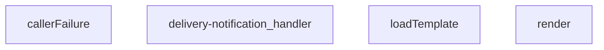

## Genel Bakış
Bu modül, Supabase Edge Function olarak sipariş teslimatı tamamlandığında müşteriye otomatik e-posta bildirimi göndermekle yükümlüdür. Dosya tabanlı bir e-posta şablonunu yükleyip dinamik verilerle doldurarak harici e-posta servisi aracılığıyla iletir. Modül, hata yönetimi ve istek akışı kontrolü için yardımcı fonksiyonlar içerir.

## Fonksiyon Grupları
### Hata Yönetimi
İşlem sırasında oluşabilecek beklenmeyen hataları yakalayan ve tutarlı hata yanıtları üreten yardımcı fonksiyonları barındırır. Bu grup, üst düzey işleyicilerin hata senaryolarını merkezi olarak ele almasını sağlar.
- callerFailure

### Şablon İşleme
E-posta içeriğinin dinamik olarak hazırlanmasıyla ilgili işlevleri kapsar. Dosya sisteminden gerekli HTML şablonunun asenkron yüklenmesini ve bu şablonun sipariş verisiyle birleştirilerek son metnin elde edilmesini sağlar.
- render, loadTemplate

### Ana İstek İşleyici
Modülün dışarıya açılan tek giriş noktasıdır. Gelen HTTP isteğini alarak tüm iş akışını yönetir: veritabanından sipariş bilgilerini çeker, şablon hazırlama ve e-posta gönderimi adımlarını orkestra eder, sürecin başarı/hata durumuna göre HTTP yanıtı döner.
- delivery-notification_handler

---

## AXIOMS – Mimari Varsayımlar
- Bu modül davranışsal mantık içermez (salt veri / konfigürasyon / tip tanımı).
- [Aksiyom 1]: Modülün dışa açtığı yapı (anahtar kümesi / şema) bir sözleşmedir; tüketiciler bu sabit yapıya bağlıdır — kırıcı değişiklik tüm tüketicileri etkiler.
- [Aksiyom 2]: Bir öğe ekleme/çıkarma yapısal-uyumlu olmalı; ilgili tipler ve seçiciler aynı commit'te güncel tutulmalıdır.

---

## FONKSİYON DETAYLARI

### callerFailure

**Ne yapar**: Bu fonksiyon, kapı (gateway) katmanında oluşan hataları HTTP uyumlu durum kodlarına ve hata mesajlarına dönüştürür. Belirli hata sınıflarını tanımlayarak, istemciye anlamlı ve standart HTTP yanıt kodları göndermeyi sağlar. Tanınmayan hatalar için null dönerek üst katmanın kendi hata yönetimini sürdürmesine olanak tanır.

**Nasıl yapar**: Fonksiyon, `instanceof` operatörünü kullanarak gelen `error` parametresinin türünü sırasıyla `TenantMismatchError`, `CallerConfigError` ve `CallerLookupError` sınıflarıyla kontrol eder. Her bir eşleşme durumunda, belirli bir HTTP durum kodu ve standart bir hata mesajı içeren bir nesne döndürür. Hiçbir sınıfla eşleşmeyen durumlarda `null` değeri döner, bu da çağrı yapan kodun hatayı kendi mantığında işlemesine olanak tanır.

**Parametreler**:
- `error`: `unknown` — İşlenmesi gereken hata nesnesi. Bu parametre `unknown` tipindedir çünkü herhangi bir yerden gelen hataları kabul edebilir; fonksiyon内部inde belirli hata sınıflarına dönüştürme işlemi yapılır.

**Dönüş**: `{ status: number; error: string } | null`

Geriye dönüş değeri iki olasılıktan biridir:

- `{ status: number; error: string }` nesnesi: Tanınan bir hata durumunda döner.
  - `status`: HTTP durum kodunu temsil eder (403, 500 veya 503).
  - `error`: Hata durumunu tanımlayan standart bir metin dizesi.
- `null`: Fonksiyonun tanımadığı bir hata türü geldiğinde döner.

Dönüş değerinin yapısal tanımı: `TenantMismatchError` için `{ status: 403, error: 'tenant_mismatch' }`, `CallerConfigError` için `{ status: 500, error: 'CONFIG_MISSING' }`, `CallerLookupError` için `{ status: 503, error: 'profile_lookup_failed' }` şeklindedir.

### render

**Ne yapar**: Verilen string template içindeki `{{key}}` şeklindeki placeholder'ları, sağlanan veri objesindeki karşılık gelen değerlerle değiştirerek dinamik bir metin üretir. Bu fonksiyon, HTML e-posta şablonları gibi template dosyalarında değişken değerlerin yerleştirilmesi için kullanılır.

**Nasıl yapar**: JavaScript'in `String.prototype.replace` metodunu ve bir regular expression (`/{{(\w+)}}/g`) kullanır. Regex, iki küme içine alınmış herhangi bir kelime karakteri grubunu yakalar. Eşleşen her placeholder için `_data` objesinde ilgili anahtarı arar; değer varsa `String()` ile string'e çevirerek yerine koyar, yoksa boş string (`''`) kullanır. `g` flag'i sayesinde template içindeki tüm eşleşmeler tek seferde değiştirilir.

**Parametreler**:
- `tpl: string` — Değiştirme işleminin yapılacağı şablon metni. İçinde `{{anahtar}}` formatında placeholder'lar barındırır.
- `_data: Record<string, unknown>` — Placeholder'ların yerine koyulacak değerleri içeren anahtar-değer çiftlerinden oluşan obje. Değerler `unknown` tipinde olduğu için fonksiyon herhangi bir veri tipini kabul eder.

**Dönüş**: `string` — Placeholder'ların değerlerle değiştirildiği, hazır metin döndürür. Eşleşme bulunamayan placeholder'lar boş string ile değiştirilir.

### loadTemplate
**Ne yapar**: E-posta bildirimi için kullanılacak HTML şablonunu dosya sisteminden asenkron olarak yükler.
**Nasıl yapar**: `import.meta.url` referansını kullanarak `./templates/email/delivered.html` dosyasının tam yolunu bir `URL` nesnesine dönüştürür. Ardından Deno ortamının `readTextFile` fonksiyonu ile bu dosyanın içeriğini okur. Dosya bulunamazsa veya herhangi bir hata oluşursa, bir hata yakalama bloğu ile `null` değeri döndürerek uygulamanın çökmesini önler.
**Parametreler**: Parametre almaz.
**Dönüş**: Promise<string | null> — Başarılı olursa HTML şablonunun içeriğini, başarısız olursa `null` değerini döndürür.

### delivery-notification_handler
**Ne yapar**: Bir HTTP POST isteğini alır, istemciden gelen e-posta ve teslimat bilgilerini doğrular, şablonu doldurarak bir e-posta bildirim e-postası gönderir ve sonucu istemciye JSON yanıtı olarak döndürür.
**Nasıl yapar**: İsteğin gövdesini JSON olarak ayrıştırır ve `to` alanının varlığını kontrol eder. Eksikse 400 Bad Request yanıtı döner. `loadTemplate` ile şablonu yükleyemezse 500 Internal Server Error yanıtı döner. Şablonu `render` fonksiyonu ile gönderilen verilerle doldurur ve bir e-posta gönderimi için gerekli veri yapısını oluşturur (gerçek gönderim mantığı bu örnek kodda yer almaz). Son olarak, istemciye başarılı veya başarısız olduğu bilgisini içeren bir JSON yanıtı gönderir.
**Parametreler**:
- `req`: Request — Gelen HTTP istek nesnesi. Gövdesinde `to` (alıcı e-posta adresi), `subject` (konu) ve `data` (şablona eklenecek değişkenler) alanlarını içeren bir JSON nesnesi beklenir.
**Dönüş**: Promise<Response> — İşlem sonucuna göre farklı HTTP durum kodları ve JSON gövdeli bir Response nesnesi. Başarılı olursa `{ success: true, to: string, subject: string }`, başarısız olursa `{ success: false, error: string }` yapısında bir yanıt döner.

---

## İTHALATLAR (IMPORTS)
- import: ../_shared/cors.ts::getCorsHeaders
- import: ../_shared/tenant_config.ts::getTenantBranding
- import: https://deno.land/std@0.168.0/http/server.ts::serve

---

## INTERFACES

### DeliveryRequest
- `order_id: string`
- `customer_email?: string`
- `customer_name?: string`
- `order_number?: string`
- `tenant_id?: string`

---

## AST POINTERS

### [N1_NASIL] AST Pointer: supabase/functions/delivery-notification/index.ts::callerFailure
- **params**: `(error: unknown)`
- **ic_degiskenler**: (yok — sadece parametre ve koşullu return)
- **Dönüş**: `{ status: number; error: string } | null` — TenantMismatchError için 403, CallerConfigError için 500, CallerLookupError için 503 döner; diğer hatalar için null döner

---

## MERMAID CALL GRAPH

## NODE ID STANDARD

  file: supabase\functions\delivery-notification\index.ts
  function: supabase\functions\delivery-notification\index.ts::callerFailure
  function: supabase\functions\delivery-notification\index.ts::render
  function: supabase\functions\delivery-notification\index.ts::loadTemplate
  function: supabase\functions\delivery-notification\index.ts::delivery-notification_handler

---

## DISA AKTARILANLAR (EXPORTS)
  export: callerFailure
  export: delivery-notification_handler
  export: loadTemplate
  export: render