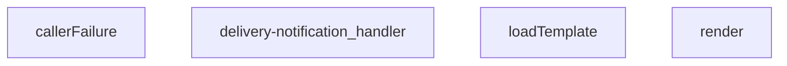

## Genel Bakış
Bu modül, Supabase Edge Function altyapısı üzerinde çalışan bir teslimat bildirim servisidir. Gelen HTTP isteklerini işleyerek e-posta veya bildirim şablonlarını yükler, veriyle birleştirip render eder ve sonucu istemciye döndürür. Hata durumlarında ise standart bir hata yanıtı üretir.

## Fonksiyon Grupları

### Ana İstek İşleyici
Gelen HTTP isteğini karşılayan ve tüm işlem akışını yöneten giriş noktasıdır. Şablon yükleme, render ve hata yakalama adımlarını sırayla çalıştırarak sonucu Response olarak döndürür.
- delivery-notification_handler

### Şablon Yönetimi
Bildirim şablonunu dosya sisteminden yükler ve verilen veriyle birleştirerek çıktı üretir. Bu iki fonksiyon birlikte çalışarak dinamik içerik oluşturma sorumluluğunu üstlenir.
- loadTemplate, render

### Hata Yönetimi
İşlem sırasında oluşan hataları yakalayarak standart bir HTTP durum kodu ve hata mesajı içeren yanıt nesnesi üretir. Başarısız durumların tutarlı biçimde raporlanmasını sağlar.
- callerFailure

---

## AXIOMS – Mimari Varsayımlar
- Bu modül davranışsal mantık içermez (salt veri / konfigürasyon / tip tanımı).
- [Aksiyom 1]: Modülün dışa açtığı yapı (anahtar kümesi / şema) bir sözleşmedir; tüketiciler bu sabit yapıya bağlıdır — kırıcı değişiklik tüm tüketicileri etkiler.
- [Aksiyom 2]: Bir öğe ekleme/çıkarma yapısal-uyumlu olmalı; ilgili tipler ve seçiciler aynı commit'te güncel tutulmalıdır.

---

## FONKSİYON DETAYLARI

### callerFailure
**Ne yapar**: Verilen hata nesnesinin türüne göre karşılık gelen HTTP durum kodu ve hata tanımlayıcısını içeren bir nesne döndürür. Bilinen hata türlerinden biriyle eşleşmeyen durumlarda `null` döndürür. Docstring'e göre bu eşleme, beş bildirim ucunda birebir aynı şekilde kullanılmaktadır.

**Nasıl yapar**: Gelen `error` parametresinin `instanceof` operatörüyle türü kontrol edilir. Sırasıyla `TenantMismatchError`, `CallerConfigError` ve `CallerLookupError` sınıfları denenir. İlk eşleşen hata türüne göre sabit bir HTTP durum kodu ve hata dizesi içeren nesne döndürülür. Hiçbiri eşleşmezse `null` döndürülür. Docstring'te belirtilen eşleme şeması şöyledir: `TenantMismatchError` → 403 (claim ile profil çelişiyor; kullanıcı o tenant'a ait değil), `CallerConfigError` → 500 (ortam değişkeni eksik — çağıranın değil, uygulamanın hatası), `CallerLookupError` → 503 (profil sorgulama başarısız).

**Parametreler**:
- error: unknown — eşleştirilecek hata nesnesi. Türü bilinmediğinden `unknown` olarak belirtilmiştir.

**Dönüş**: `{ status: number; error: string } | null` — Eşleşen hata türü varsa HTTP durum kodu ve hata tanımlayıcısı içeren nesne; yoksa `null`.

### render
**Ne yapar**: Geliştirildi ancak detay üretilemedi.

### loadTemplate
**Ne yapar**: Geliştirildi ancak detay üretilemedi.

### delivery-notification_handler
**Ne yapar**: Geliştirildi ancak detay üretilemedi.

---

## İTHALATLAR (IMPORTS)
- import: ../_shared/cors.ts::getCorsHeaders
- import: ../_shared/tenant_config.ts::getTenantBranding
- import: https://deno.land/std@0.168.0/http/server.ts::serve

---

## INTERFACES

### DeliveryRequest
- `order_id: string`
- `customer_email?: string`
- `customer_name?: string`
- `order_number?: string`
- `tenant_id?: string`

---

## AST POINTERS

### [N1_NASIL] AST Pointer: supabase/functions/delivery-notification/index.ts::callerFailure
- **params**: `error: unknown`
- **ic_degiskenler**: yok
- **Dönüş**: `{ status: number; error: string } | null` — `error` bir `TenantMismatchError` ise `{ status: 403, error: 'tenant_mismatch' }`, `CallerConfigError` ise `{ status: 500, error: 'CONFIG_MISSING' }`, `CallerLookupError` ise `{ status: 503, error: 'profile_lookup_failed' }`, diğer durumlarda `null` döner

### [N2_NASIL] AST Pointer: supabase/functions/delivery-notification/index.ts::render
- **params**: `tpl: string`, `_data: Record<string, unknown>`
- **ic_degiskenler**: yok
- **Dönüş**: `string` — `tpl` içindeki `{{anahtar}}` kalıplarını `_data[anahtar]` değeriyle değiştirir; eşleşen değer yoksa boş dize kullanır

### [N3_NASIL] AST Pointer: supabase/functions/delivery-notification/index.ts::loadTemplate
- **params**: yok
- **ic_degiskenler**:
  - `url` — `new URL('./templates/email/delivered.html', import.meta.url)` ile oluşturulan dosya yolu; `Deno.readTextFile` ile okunur
- **Dönüş**: `string | null` — dosya başarıyla okunursa içerik dizesi, hata olursa `null`

### [N4_NASIL] AST Pointer: supabase/functions/delivery-notification/index.ts::delivery-notification_handler
- **params**: `req`
- **ic_degiskenler**:
  - `corsHeaders` — `getCorsHeaders(req)` çağrısının dönüşü; tüm yanıtlarda başlık olarak kullanılır
  - `supabaseUrl` — `Deno.env.get('SUPABASE_URL')` ortam değişkeni; boş ise `''` atanır
  - `serviceKey` — `Deno.env.get('SUPABASE_SERVICE_ROLE_KEY')` ortam değişkeni; boş ise `''` atanır
  - `body` — `await req.json().catch(()=>({}))` ile çözümlenen istek gövdesi; `DeliveryRequest` tipine cast edilir
  - `order_id` — `body.order_id`; sipariş kimliği
  - `customer_email` — `body.customer_email`; müşteri e-posta adresi, eksikse veritabanından türetilir
  - `customer_name` — `body.customer_name`; müşteri adı, eksikse veritabanından türetilir
  - `order_number` — `body.order_number`; sipariş numarası, eksikse veritabanından türetilir
  - `ctx` — `await resolveCaller(req, body)` çağrısının dönüşü olan `CallerContext`; çağıranın türünü (`kind`), rolünü (`role`) ve kiracı kimliğini (`tenantId`) içerir
  - `failure` — `callerFailure(err)` çağrısının dönüşü; `null` değilse hata durumunu ve HTTP durum kodunu barındırır
  - `tenantId` — `ctx.tenantId`; doğrulanmış çağırandan gelen kiracı kimliği
  - `branding` — `await getTenantBranding(tenantId)` çağrısının dönüşü; kiracıya özgü marka bilgilerini içerir
  - `resendApiKey` — `Deno.env.get('RESEND_API_KEY')` ortam değişkeni; boş ise `''` atanır
  - `emailFrom` — `branding.emailFrom`; gönderici e-posta adresi
  - `o` — `venthub_orders` tablosuna yapılan REST sorgusunun yanıt nesnesi (`fetch` dönüşü)
  - `arr` — `await o.json().catch(()=>[])` ile çözümlenen yanıt dizisi
  - `row` — `Array.isArray(arr) ? arr[0] : null`; sorgu sonucunun ilk satırı
  - `brandName` — `branding.brandName`; marka adı
  - `brandPrimary` — `branding.brandPrimaryColor`; marka birincil rengi
  - `brandLogoUrl` — `branding.brandLogoUrl`; marka logosu URL'si
  - `prettyOrderNo` — `order_number` varsa `#${order_number.split('-')[1]}`, yoksa `#${order_id.slice(-8).toUpperCase()}` ile biçimlendirilmiş sipariş numarası
  - `subject` — `${brandName} | Siparişiniz teslim edildi - ${prettyOrderNo}` formatında e-posta konu satırı
  - `html` — `loadTemplate()` dönüşü; boş ise varsayılan HTML dizesi oluşturulur, dolu ise `render` ile işlenir
  - `resp` — `https://api.resend.com/emails` adresine yapılan POST isteğinin yanıt nesnesi
  - `t` — `await resp.text().catch(()=> '')`; gönderim başarısız olduğunda yanıt gövdesi
  - `result` — `await resp.json().catch(()=>({}))`; başarılı gönderim sonrası Resend yanıt nesnesi
  - `msg` — `_e instanceof Error ? _e.message : String(_e)`; yakalanan hata mesajı
- **Dönüş**: `Response` — OPTIONS isteğine `200`, POST dışındaki yöntemlere `405`, anonim çağıranlara `401`, yetkisiz çağıranlara `403`, eksik alanlara `400`, müşteri bilgisi eksikliğine `400`, `RESEND_API_KEY` yoksa `{ disabled: true }` ile `200`, gönderim hatasına `500`, genel hatalara `500`, başarılı gönderime `{ ok: true, order_id, subject, result }` ile `200` döner; her durumda `corsHeaders` ve uygun `Content-Type` başlıkları eklenir

---

## MERMAID CALL GRAPH

## NODE ID STANDARD

  file: index.ts
  function: index.ts::callerFailure
  function: index.ts::render
  function: index.ts::loadTemplate
  function: index.ts::delivery-notification_handler

---

## DISA AKTARILANLAR (EXPORTS)
  export: callerFailure
  export: delivery-notification_handler
  export: loadTemplate
  export: render