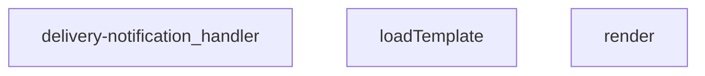

## Genel Bakış
Bu modül, bir Supabase Edge Function olarak sipariş teslimatı tamamlandığında müşteriye otomatik e-posta bildirimi göndermekle yükümlüdür. Sipariş bilgilerini veritabanından çeker, dinamik bir şablonla e-posta içeriğini oluşturur ve harici bir e-posta servisi aracılığıyla mesajı iletir; süreç boyunca hata yönetimi ve loglama gerçekleştirilir.

## Fonksiyon Grupları
### Şablon İşleme
E-posta içeriğinin hazırlanmasıyla ilgili yardımcı işlevleri barındırır. Dosya sisteminden gerekli şablonun yüklenmesini ve bu şablonun sipariş verisiyle birleştirilerek son metnin elde edilmesini sağlar.
- render, loadTemplate

### Ana İstek İşleyici
Modülün dışarıya açılan ana giriş noktasıdır. Gelen HTTP isteğini alarak tüm iş akışını (veritabanı sorgulama, şablon hazırlama, e-posta gönderimi ve loglama) yönetir ve sonuç olarak bir HTTP yanıtı döner.
- delivery-notification_handler

---

## AXIOMS – Mimari Varsayımlar
Bu modül, bir Supabase Edge Function olarak teslimat tamamlandığında otomatik e-posta bildirimi göndermek için tasarlanmıştır. Aşağıdaki mimari varsayımlar, fonksiyon imzaları ve modülün temel amacına dayanarak tanımlanmıştır.

[Aksiyom 1]: Eğer `render` fonksiyonuna geçerli bir şablon string'i (`tpl`) ve veri sözlüğü (`_data`) sağlanmazsa, şablon işleme başarısız olur.
[Aksiyom 2]: Eğer `loadTemplate` fonksiyonu dosya sisteminden gerekli şablon dosyasını bulamazsa veya okuyamazsa, şablon yükleme hatası oluşur.
[Aksiyom 3]: Eğer `

---

## FONKSİYON DETAYLARI

### render
**Ne yapar**: Verilen bir şablon dizesindeki `{{anahtar}}` yapısındaki yer tutucuları, sağlanan veri nesnesindeki karşılıkları ile değiştirerek dinamik bir çıktı oluşturur.
**Nasıl yapar**: `String.prototype.replace` metodunu bir regex ile kullanarak `{{(\w+)}}` kalıplarını tespit eder. Eşleşen anahtarın (`k`) veri nesnesinde (`_data`) karşılığını arar ve bulamazsa boş bir dize kullanarak değişikliği uygular. Bu işlem, şablon motorları için basit bir değişken ekleme (interpolation) mekanizması sağlar.
**Parametreler**:
- `tpl`: string — Değiştirilecek şablon dizesi. İçerisinde `{{değişken_adı}}` formatında yer tutucular bulunmalıdır.
- `_data`: Record<string, unknown> — Şablondaki yer tutucuların değerlerini içeren nesne. Anahtarlar yer tutucu adlarıyla, değerler ise yerine konacak verilerle eşleşmelidir.
**Dönüş**: string — Yer tutucuların veri ile değiştirildiği yeni şablon dizesi.

### loadTemplate
**Ne yapar**: E-posta bildirimi için kullanılacak HTML şablonunu dosya sisteminden asenkron olarak yükler.
**Nasıl yapar**: `import.meta.url` referansını kullanarak `./templates/email/delivered.html` dosyasının tam yolunu bir `URL` nesnesine dönüştürür. Ardından Deno ortamının `readTextFile` fonksiyonu ile bu dosyanın içeriğini okur. Dosya bulunamazsa veya herhangi bir hata oluşursa, bir hata yakalama bloğu ile `null` değeri döndürerek uygulamanın çökmesini önler.
**Parametreler**: Parametre almaz.
**Dönüş**: Promise<string | null> — Başarılı olursa HTML şablonunun içeriğini, başarısız olursa `null` değerini döndürür.

### delivery-notification_handler
**Ne yapar**: Bir HTTP POST isteğini alır, istemciden gelen e-posta ve teslimat bilgilerini doğrular, şablonu doldurarak bir e-posta bildirim e-postası gönderir ve sonucu istemciye JSON yanıtı olarak döndürür.
**Nasıl yapar**: İsteğin gövdesini JSON olarak ayrıştırır ve `to` alanının varlığını kontrol eder. Eksikse 400 Bad Request yanıtı döner. `loadTemplate` ile şablonu yükleyemezse 500 Internal Server Error yanıtı döner. Şablonu `render` fonksiyonu ile gönderilen verilerle doldurur ve bir e-posta gönderimi için gerekli veri yapısını oluşturur (gerçek gönderim mantığı bu örnek kodda yer almaz). Son olarak, istemciye başarılı veya başarısız olduğu bilgisini içeren bir JSON yanıtı gönderir.
**Parametreler**:
- `req`: Request — Gelen HTTP istek nesnesi. Gövdesinde `to` (alıcı e-posta adresi), `subject` (konu) ve `data` (şablona eklenecek değişkenler) alanlarını içeren bir JSON nesnesi beklenir.
**Dönüş**: Promise<Response> — İşlem sonucuna göre farklı HTTP durum kodları ve JSON gövdeli bir Response nesnesi. Başarılı olursa `{ success: true, to: string, subject: string }`, başarısız olursa `{ success: false, error: string }` yapısında bir yanıt döner.

---

## INTERFACES

### DeliveryRequest
- `order_id: string`
- `customer_email?: string`
- `customer_name?: string`
- `order_number?: string`
- `tenant_id?: string`

---

## AST POINTERS

### [N1_NASIL] AST Pointer: supabase/functions/delivery-notification/index.ts::render
- **params**: `(tpl: string, _data: Record<string, unknown>)`
- **ic_degiskenler**:
  - `_m` — regex eşleşmesi için kullanılan geçici match nesnesi (fonksiyonda kullanılmıyor)
  - `k` — regex tarafından yakalanan anahtar adı (template içindeki `{{k}}` yapısındaki anahtar)
- **Dönüş**: Template string içindeki `{{anahtar}}` işaretlerinin `_data` sözlüğündeki değerlerle değiştirilmiş hali.

### [N2_NASIL] AST Pointer: supabase/functions/delivery-notification/index.ts::loadTemplate
- **params**: `(parametre yok)`
- **ic_degiskenler**:
  - `url` — `templates/email/delivered.html` dosyasının modül göreli yolunu temsil eden URL nesnesi
- **Dönüş**: Async, başarıyla okunursa HTML template string, hata olursa `null`.

### [N3_NASIL] AST Pointer: supabase/functions/delivery-notification/index.ts::delivery-notification_handler
- **params**: `(req)`
- **ic_degiskenler**:
  - `origin` — İsteğin `origin` başlığı, yoksa `'*'` kullanılır
  - `corsHeaders` — CORS ile ilgili HTTP başlıklarını tutar (Access-Control-Allow-*)
  - `supabaseUrl` — Ortam değişkeninden alınan Supabase URL'i
  - `serviceKey` — Ortam değişkeninden alınan Supabase servis rolü anahtarı
  - `body` — İstek gövdesinden parse edilen `DeliveryRequest` nesnesi
  - `order_id` — `body.order_id` değerinden alınan sipariş kimliği
  - `customer_email` — Müşteri e-posta adresi (istek gövdesinden veya DB'den)
  - `customer_name` — Müşteri adı (istek gövdesinden veya DB'den)
  - `order_number` — Sipariş numarası (istek gövdesinden veya DB'den)
  - `tenantId` — `resolveTenantId(req, body)` çağrısı ile elde edilen kiracı kimliği
  - `branding` — `getTenantBranding(tenantId)` çağrısı ile elde edilen marka bilgileri nesnesi (brandName, brandPrimaryColor, brandLogoUrl, emailFrom içerir)
  - `authHeader` — İstekten alınan `Authorization` başlığı
  - `isAuthorized` — Yetkilendirme durumunu tutan boolean bayrak (başlangıçta false)
  - `anonKey` — Ortam değişkeninden alınan Supabase anonim anahtarı
  - `authClient` — `authHeader` ile başlatılan Supabase istemcisi (anonim anahtar ve yetkilendirme başlığı ile)
  - `user` — `authClient.auth.getUser()` sonucundan alınan kullanıcı nesnesi
  - `roleCheck` — Kullanıcının rolünü kontrol etmek için yapılan REST isteğinin sonucu
  - `arr` — `roleCheck` yanıtından parse edilen JSON dizisi
  - `role` — `arr[0]?.role` ifadesinden alınan kullanıcı rolü ('admin' veya 'superadmin' ise yetkili)
  - `resendApiKey` — Ortam değişkeninden alınan Resend API anahtarı
  - `emailFrom` — `branding.emailFrom` değerinden alınan e-posta gönderici adresi
  - `o` — Eksik müşteri bilgilerini almak için Supabase REST API'ye yapılan istek sonucu
  - `arr` — `o` yanıtından parse edilen JSON dizisi
  - `arr[0]` — Sipariş satırı (order_number, customer_name, customer_email alanlarını içerir)
  - `brandName` — `branding.brandName` değerinden alınan marka adı
  - `brandPrimary` — `branding.brandPrimaryColor` değerinden alınan marka ana rengi
  - `brandLogoUrl` — `branding.brandLogoUrl` değerinden alınan marka logo URL'i
  - `prettyOrderNo` — Düzenlenmiş sipariş numarası (ör: `#123456` formatında)
  - `subject` — E-posta konu satırı (marka adı ve sipariş numarası ile)
  - `html` — `loadTemplate()` ile yüklenen veya fallback olarak oluşturulan HTML e-posta gövdesi
  - `resp` — Resend API'ye e-posta göndermek için yapılan POST isteği sonucu
  - `t` — `resp` yanıtının metin gövdesi (hata durumunda loglama için)
  - `result` — Resend API yanıtının JSON parse edilmiş hali (başarı durumunda `id` içerir)
- **Dönüş**: `Response` nesnesi. Başarı durumunda `{ ok: true, order_id, subject, result }`, hata durumunda uygun HTTP durum kodu ve hata mesajı ile JSON yanıtı.

---

## MERMAID CALL GRAPH

## NODE ID STANDARD

  file: supabase\functions\delivery-notification\index.ts
  function: supabase\functions\delivery-notification\index.ts::render
  function: supabase\functions\delivery-notification\index.ts::loadTemplate
  function: supabase\functions\delivery-notification\index.ts::delivery-notification_handler

---

## DISA AKTARILANLAR (EXPORTS)
  export: delivery-notification_handler
  export: loadTemplate
  export: render