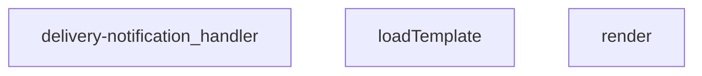

## Genel Bakış
Bu modül, bir teslimat işlemi tamamlandığında müşteriye e-posta bildirimi göndermekten sorumlu Supabase Edge Function'dır. Sipariş bilgilerini veritabanından alır, HTML şablonu işler ve Resend API aracılığıyla e-posta gönderir. Gönderim sonrası denetim kaydı da oluşturur.

## Fonksiyon Grupları
### Şablon İşleme
HTML şablonlarının dosyadan yüklenmesi ve dinamik verilerle doldurulmasını sağlar.
- render, loadTemplate

### Ana Handler
Gelen POST isteklerini karşılar, yetkilendirme kontrolü yapar, sipariş bilgilerini çeker, e-posta gönderimini gerçekleştirir ve işlem sonucunu loglar.
- delivery-notification_handler

---

## AXIOMS – Mimari Varsayımlar
Bu modülün çalışması için dosya sisteminde belirli bir şablon dosyasının varlığı, veritabanı bağlantısının aktifliği ve harici e-posta servisine (Resend) erişimin sağlanması gereklidir.

[Aksiyom 1]: Eğer `templates/email/delivered.html` dosyası dosya sisteminde mevcut değilse, `loadTemplate` fonksiyonu `null` döner ve e-posta içeriği oluşturulamaz.
[Aksiyom 2]: Eğer Resend API yapılandırması veya yetkilendirme anahtarı (API key) yoksa, e-posta gönderme işlemi başarısız olur.
[Aksiyom 3]: Eğer `shipping_email_events` tablosu veritabanında mevcut değilse, gönderim işlemi sonrası audit kaydı (log) yazılamaz.
[Aksiyom 4]: Eğer sipariş bilgilerini içeren veritabanı tablosuna erişim yoksa, müşteriye gönderilecek e-posta verileriyle doldurulamaz.

---

## FONKSIYON DETAYLARI

### render
**Ne yapar**: Bir şablon metninde `{{anahtar}}` kalıbıyla belirtilen yerleri, `_data` nesnesindeki karşılık gelen değerlerle değiştirerek dinamik metin oluşturur.
**Nasıl yapar**: `String.prototype.replace` metodunu `{{(\w+)}}` düzenli ifadesiyle kullanır. Her eşleşmede yakalanan anahtarı `_data` üzerinde arar, değer varsa string'e çevirip yerleştirir, yoksa boş string kullanır.
**Parametreler**:
- `tpl`: `string` — İçinde `{{...}}` kalıpları bulunan şablon metni.
- `_data`: `Record<string, unknown>` — Şablondaki anahtarlara karşılık gelen değerleri tutan nesne.
**Dönüş**: `string` — Tüm kalıpların karşılık gelen değerlerle değiştirilmiş hali.

### loadTemplate
**Ne yapar**: Kaynak kod içeriği verilmediğinden fonksiyonun amacı kesin olarak bilinmemektedir. Yalnızca imzası (parametresiz, dönüş tipi belirtilmemiş) tanımlanmıştır.
**Nasıl yapar**: Kod gövdesi sunulmadığı için iç mantığı hakkında yorum yapılamaz.
**Parametreler**: Bu fonksiyon hiçbir parametre almaz.
**Dönüş**: Belirtilmemiştir. Kaynakta `void` olarak işaretlenmiş veya bilinmiyor olarak not edilmiştir.

### delivery-notification_handler
**Ne yapar**: Bir HTTP isteğini (`req`) işleyerek yanıt (`Response`) döndüren handler fonksiyonudur. `delivery-notification` uç noktasına gelen talepleri karşılamak üzere tasarlandığı anlaşılmaktadır.
**Nasıl yapar**: İç işleyişi verilen kod parçasında bulunmamaktadır. Standart bir Edge Function handler'ı olarak `req` üzerinden gelen veriyi işler ve uygun bir HTTP yanıtı oluşturur.
**Parametreler**:
- `req`: `Request` — Gelen HTTP isteğini temsil eden nesne.
**Dönüş**: `Response` — İsteğe karşılık oluşturulan HTTP yanıtı.

---

## INTERFACES

### DeliveryRequest
- `order_id: string`
- `customer_email?: string`
- `customer_name?: string`
- `order_number?: string`

---

## AST POINTERS

### [N1_NASIL] AST Pointer: C:\Users\alize\venthub-hvac\supabase\functions\delivery-notification\index.ts::render
- **params**: tpl: string, _data: Record<string, unknown>
- **ic_degiskenler**: 
  - `_m` — String.replace metodu tarafından yakalanan tam regex eşleşme metni, şablon değiştirme işleminde kullanılır
  - `k` — regex tarafından yakalanan şablon anahtarı, _data nesnesinden ilgili değeri çekmek için kullanılır
- **Dönüş**: string

### [N2_NASIL] AST Pointer: C:\Users\alize\venthub-hvac\supabase\functions\delivery-notification\index.ts::loadTemplate
- **params**: parametre yok
- **ic_degiskenler**: 
  - `url` — Email şablonu dosyasının tam yolunu tutan URL nesnesi, Deno.readTextFile ile dosya okumak için kullanılır
- **Dönüş**: Promise<string | null>

### [N3_NASIL] AST Pointer: C:\Users\alize\venthub-hvac\supabase\functions\delivery-notification\index.ts::delivery-notification_handler
- **params**: req: Request
- **ic_degiskenler**:
  - `origin` — İsteğin Origin header değeri, tanımsızsa '*' olarak atanır, CORS ayarlarında kullanılır
  - `corsHeaders` — Tüm response'larda kullanılacak CORS ayarlarını içeren nesne
  - `req.headers.get('access-control-request-headers')` — İsteğin CORS istek başlığı, izin verilen header listesi oluşturmak için kullanılır
  - `req.headers.get('access-control-request-method')` — İsteğin CORS istek metodu, izin verilen metot listesi oluşturmak için kullanılır
  - `supabaseUrl` — Ortam değişkeninden alınan Supabase proje URL'si, tüm Supabase isteklerinde kullanılır
  - `serviceKey` — Ortam değişkeninden alınan Supabase servis rolü anahtarı, yetkilendirme ve veri çekme işlemlerinde kullanılır
  - `authHeader` — İsteğin Authorization header'ı, kullanıcı yetkisini doğrulamak için alınır
  - `isAuthorized` — İsteğin yetkili olup olmadığını tutan boolean değeri, tüm yetki kontrollerinden sonra ayarlanır
  - `anonKey` — Ortam değişkeninden alınan Supabase anonim anahtarı, auth client oluşturmak için kullanılır
  - `createClient` — Supabase'den import edilen istemci oluşturma fonksiyonu
  - `authClient` — Oluşturulan Supabase auth istemcisi, mevcut kullanıcıyı getirmek için kullanılır
  - `user` — Auth isteğinden dönen kullanıcı nesnesi, rol kontrolü için kullanılır
  - `roleCheck` — Kullanıcının profilini çekmek için yapılan fetch isteğinin yanıt nesnesi
  - `arr[0]` — Rol kontrolü yanıtından dönen json dizisinin ilk elemanı, kullanıcı rolünü almak için kullanılır
  - `role` — arr[0] nesnesinden alınan kullanıcı rolü, admin/süperadmin olup olmadığını kontrol etmek için kullanılır
  - `err` — Yetki kontrolü sırasında oluşan hata nesnesi, konsola yazdırılmak için kullanılır
  - `resendApiKey` — Ortam değişkeninden alınan Resend email servisi API anahtarı, email göndermek için kullanılır
  - `emailFrom` — Giden emaillerin gönderici adresi, ortam değişkeninden alınır
  - `body` — İsteğin json olarak parse edilmiş gövdesi, sipariş ve müşteri bilgilerini içerir
  - `order_id` — Body'den alınan sipariş ID'si, tüm işlem akışında anahtar değer olarak kullanılır
  - `customer_email` — Body'den veya Supabase'den alınan müşteri email adresi, alıcı olarak email gönderiminde kullanılır
  - `customer_name` — Body'den veya Supabase'den alınan müşteri adı, email içeriğinde kullanılır
  - `order_number` — Body'den veya Supabase'den alınan sipariş numarası, formatlanarak email içeriğinde kullanılır
  - `o` — Eksik sipariş bilgilerini Supabase'den çekmek için yapılan fetch isteğinin yanıt nesnesi
  - `arr` — Sipariş bilgisi isteğinden dönen json dizisi, ilk eleman olarak sipariş satırını içerir
  - `row` — arr dizisinin ilk elemanı olan sipariş satırı, eksik müşteri bilgilerini doldurmak için kullanılır
  - `row.order_number` — Satırdaki sipariş numarası, local order_number boşsa atanır
  - `row.customer_name` — Satırdaki müşteri adı, local customer_name boşsa atanır
  - `row.customer_email` — Satırdaki müşteri email'i, local customer_email boşsa atanır
  - `prettyOrderNo` - Formatlanmış, kullanıcı dostu sipariş numarası, email konusu ve içeriğinde kullanılır
  - `subject` — Gönderilecek emailin konusu
  - `html` — Gönderilecek emailin HTML içeriği, şablondan yüklenir veya varsayılan olarak oluşturulur
  - `resp` — Resend API'ye yapılan email gönderimi isteğinin yanıt nesnesi
  - `t` — Email gönderimi başarısız olursa yanıtın içeriği, hata olarak döndürülmek için kullanılır
  - `result` — Resend API'den dönen başarılı yanıt nesnesi, email ID'sini içerir
  - `_e` — Genel try bloğunda yakalanan hata nesnesi
  - `msg` — Formatlanmış hata mesajı, 500 yanıtında döndürülmek için kullanılır
- **Dönüş**: Promise<Response>

---

## MERMAID CALL GRAPH

## NODE ID STANDARD

  file: supabase\functions\delivery-notification\index.ts
  function: supabase\functions\delivery-notification\index.ts::render
  function: supabase\functions\delivery-notification\index.ts::loadTemplate
  function: supabase\functions\delivery-notification\index.ts::delivery-notification_handler

---

## DISA AKTARILANLAR (EXPORTS)
  export: delivery-notification_handler
  export: loadTemplate
  export: render