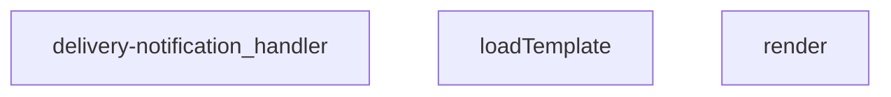

## Genel Bakış
Bu modül, teslimat işlemleri tamamlandığında müşterilere e-posta bildirimi göndermek üzere geliştirilmiş bir Supabase Edge Function'dır. Sipariş bilgilerini veritabanından alır, dinamik e-posta şablonları işler, harici e-posta servisi aracılığıyla gönderim sağlar ve işlem sonrası denetim kayıtları oluşturur.

## Fonksiyon Grupları
### Şablon İşleme
E-posta şablonlarının dosya sisteminden yüklenmesini ve sipariş verileriyle dinamik olarak doldurulmasını sağlar.
- loadTemplate, render

### Ana İstek İşleyici
Gelen HTTP isteklerini karşılar, yetkilendirme kontrolleri yapar, sipariş verilerini veritabanından çeker, e-posta gönderimini koordine eder ve işlem sonuçlarını kaydeder.
- delivery-notification_handler

---

## AXIOMS – Mimari Varsayımlar
Bu modül için özel aksiyom tanımlanmamıştır.

---

## FONKSIYON DETAYLARI

### render
**Ne yapar**: Bir metin şablonundaki çift süslü parantezle sarılmış yer tutucuları, verilen veri nesnesindeki karşılık gelen değerlerle değiştirerek şablonu işleyen basit bir yardımcı fonksiyondur. Genellikle e-posta veya metin bildirimleri için dinamik içerik oluşturmak amacıyla kullanılır.
**Nasıl yapar**: Tüm {{anahtar}} formatındaki yer tutucuları bulmak için global bir düzenli ifade kullanır. Her bulunan yer tutucunun anahtarını alır, bu anahtarın veri nesnesindeki değerini string tipine çevirir. Eğer anahtar veri nesnede mevcut değilse boş string ile değiştirir.
**Parametreler**:
- tpl: string — İçerisinde dinamik yer tutucular barındıran orijinal şablon metni
- _data: Record<string, unknown> — Yer tutucuların yerine geçecek değerleri içeren anahtar-değer çiftleri nesnesi
**Dönüş**: string — Tüm yer tutucuları ilgili değerlerle değiştirilmiş son hali olan şablon metni, eksik anahtarlar için boş string ile doldurulmuş hali

### loadTemplate
**Ne yapar**: Proje içindeki e-posta şablon dizininde saklanan teslimat bildirimi HTML şablon dosyasının içeriğini asenkron olarak okuyan ve döndüren fonksiyondur. Şablon dosyasının bulunamaması veya okuma hatası durumunda hatayı sessizce ele alır.
**Nasıl yapar**: import.meta.url değeri kullanarak şablon dosyasının göreli yolundan tam URL'sini oluşturur. Oluşturulan URL üzerinden Deno'nun yerleşik readTextFile metodunu kullanarak dosyanın metin içeriğini okur. Herhangi bir okuma hatası oluştuğunda hatayı yakalar ve yerine null değeri döndürür.
**Parametreler**: Bu fonksiyon herhangi bir dış parametre almaz, sabit olarak ./templates/email/delivered.html yolundaki dosyayı hedefler.
**Dönüş**: Promise<string | null> — Başarılı bir şekilde şablon dosyası okunduysa dosyanın metin içeriğini, okuma sırasında hata oluşursa null değerini döndüren bir söz (promise) nesnesi

### delivery-notification_handler
**Ne yapar**: Supabase Edge Fonksiyonu olarak çalışan teslimat bildirimi servisinin ana istek işleyicisidir. Gelen HTTP isteklerini alır, gerekli bildirim gönderme adımlarını yürütür ve sonucuna uygun bir HTTP yanıtı döndürür.
**Nasıl yapar**: Standart Edge Function istek modeline göre gelen Request nesnesini alır. İç iş mantığı için loadTemplate ve render fonksiyonlarını kullanarak e-posta şablonunu yükler ve dinamik içerikle doldurur. Oluşturulan e-posta içeriğini alıcıya gönderme işlemlerini gerçekleştirir ve sonucuna uygun durum kodu ve içerik içeren bir Response nesnesi oluşturarak döndürür.
**Parametreler**:
- req: Request — Fonksiyona gönderilen gelen HTTP istek nesnesi, isteğin başlıkları, gövdesi ve diğer meta verilerini içerir
**Dönüş**: Response — İşlem sonucuna göre yapılandırılmış standart HTTP yanıt nesnesi, başarılı veya başarısız durum kodları ve gerekli yanıt içeriği barındırır

---

## INTERFACES

### DeliveryRequest
- `order_id: string`
- `customer_email?: string`
- `customer_name?: string`
- `order_number?: string`

---

## AST POINTERS

### [N1_NASIL] AST Pointer: C:\Users\alize\venthub-hvac\supabase\functions\delivery-notification\index.ts::render
- **params**: (tpl: string, _data: Record<string, unknown>)
- **ic_degiskenler**:
  - `tpl` — şablon metni, içinde `{{key}}` biçiminde yer tutucular bulunur.
  - `_data` — yer tutucuların değerlerini sağlayan `Record<string, unknown>` nesnesi.
- **Dönüş**: string (yer tutucular doldurulmuş şablon).

### [N2_NASIL] AST Pointer: C:\Users\alize\venthub-hvac\supabase\functions\delivery-notification\index.ts::loadTemplate
- **params**: ()
- **ic_degiskenler**:
  - `url` — `new URL('./templates/email/delivered.html', import.meta.url)` ifadesiyle oluşturulan, şablon dosyasının konumunu gösteren `URL` nesnesi.
- **Dönüş**: string | null (başarılıysa şablon içeriği, hata durumunda `null`).

### [N3_NASIL] AST Pointer: C:\Users\alize\venthub-hvac\supabase\functions\delivery-notification\index.ts::delivery-notification_handler
- **params**: (req)
- **ic_degiskenler**:
  - `origin` — `req.headers.get('origin') ?? '*'` ifadesiyle alınan istek kaynağı, CORS başlığında kullanılır.
  - `corsHeaders` — CORS yanıt başlıklarını içeren nesne.
  - `supabaseUrl` — `Deno.env.get('SUPABASE_URL') || ''` ifadesiyle ortam değişkeninden okunan Supabase URL’si.
  - `serviceKey` — `Deno.env.get('SUPABASE_SERVICE_ROLE_KEY') || ''` ifadesiyle ortam değişkeninden okunan servis rol anahtarı.
  - `authHeader` — `req.headers.get('Authorization')` ile alınan yetkilendirme başlığı.
  - `isAuthorized` — isteğin yetkilendirilip yetkilendirilmediğini gösteren boolean flag.
  - `anonKey` — `Deno.env.get('SUPABASE_ANON_KEY') || ''` ifadesiyle okunan anonim anahtar.
  - `createClient` — `await import('https://esm.sh/@supabase/supabase-js@2.45.4')` sonucundan alınan Supabase istemci oluşturma fonksiyonu.
  - `authClient` — `createClient(supabaseUrl, anonKey, { global: { headers: { Authorization: authHeader } } })` ile oluşturulan Supabase istemcisi.
  - `user` — `await authClient.auth.getUser()` sonucundan elde edilen oturum kullanıcısı.
  - `roleCheck` — Kullanıcının rolünü sorgulamak için yapılan `fetch` isteği.
  - `arr` — `await roleCheck.json().catch(() => [])` ile elde edilen JSON dizi yanıtı.
  - `role` — `arr[0]?.role` ifadesiyle elde edilen kullanıcı rolü.
  - `resendApiKey` — `Deno.env.get('RESEND_API_KEY') || ''` ifadesiyle okunan Resend API anahtarı.
  - `emailFrom` — `Deno.env.get('EMAIL_FROM') || 'VentHub <onboarding@resend.dev>'` ifadesiyle okunan gönderen e‑posta adresi.
  - `body` — `await req.json().catch(()=>({})) as DeliveryRequest` ifadesiyle istek gövdesinin `DeliveryRequest` tipine dönüştürülmüş hali.
  - `order_id` — `body.order_id`; sipariş kimliği.
  - `customer_email` — `body.customer_email`; alıcı e‑posta adresi (değiştirilebilir).
  - `customer_name` — `body.customer_name`; alıcı adı (değiştirilebilir).
  - `order_number` — `body.order_number`; sipariş numarası (değiştirilebilir).
  - `o` — Supabase üzerinden sipariş detaylarını çekmek için yapılan `fetch` isteği.
  - `row` — `Array.isArray(arr) ? arr[0] : null` ifadesiyle elde edilen sipariş kaydı nesnesi.
  - `prettyOrderNo` — Sipariş numarasının okunabilir hâli (`#${order_number.split('-')[1]}` veya `#${order_id.slice(-8).toUpperCase()}`).
  - `subject` — E‑posta konu satırı, `Siparişiniz teslim edildi - ${prettyOrderNo}`.
  - `html` — E‑posta içeriği; şablon dosyasından (`loadTemplate`) ya da varsayılan HTML dizisinden oluşturulur.
  - `resp` — Resend API’ye gönderilen e‑posta isteğinin `fetch` yanıtı.
  - `t` — `await resp._text().catch(()=> '')` ile alınan hata metni (başarısız gönderimde).
  - `result` — `await resp.json().catch(()=>({}))` ile alınan Resend API yanıtı.
  - `msg` — Yakalanan istisna durumunda hata mesajı.
- **Dönüş**: Response (HTTP yanıtı, başarılı, hata veya yetkilendirme durumuna göre farklı içerik ve durum kodları).

---

## MERMAID CALL GRAPH

## NODE ID STANDARD

  file: supabase\functions\delivery-notification\index.ts
  function: supabase\functions\delivery-notification\index.ts::render
  function: supabase\functions\delivery-notification\index.ts::loadTemplate
  function: supabase\functions\delivery-notification\index.ts::delivery-notification_handler

---

## DISA AKTARILANLAR (EXPORTS)
  export: delivery-notification_handler
  export: loadTemplate
  export: render