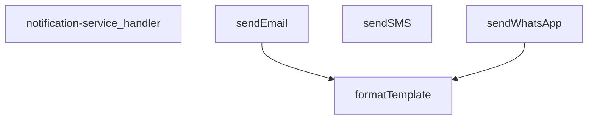

## Genel Bakış
Bu modül, bir Supabase edge function olarak HTTP isteklerini karşılayan merkezi bir bildirim servisidir. Tek bir giriş noktası üzerinden WhatsApp, SMS ve e-posta olmak üzere üç farklı iletişim kanalına mesaj gönderimi sağlar. Gelen isteklere göre uygun kanalı seçer, içerik şablonlarını dinamik verilerle doldurur ve mesajları ilgili harici servis sağlayıcıya iletir.

## Fonksiyon Grupları
### İstek Yönetimi ve Yönlendirme
Modülün dışarıya açılan tek giriş noktasıdır. Gelen HTTP isteğinin gövdesini okuyarak hedef kanalı ve mesaj bilgilerini ayrıştırır, ardından işlmeyi ilgili gönderim fonksiyonuna devreder.
- notification-service_handler

### Kanal Bazlı Mesaj Gönderimi
Her biri farklı bir iletişim protokolü ve harici servis (Twilio, SendGrid vb.) ile entegre çalışan gönderim fonksiyonlarıdır. Kullanıcıya ait hedef bilgiyi ve mesaj içeriğini alarak doğrudan ilgili kanal üzerinden iletir.
- sendWhatsApp, sendSMS, sendEmail

### İçerik Hazırlama
Bildirim metinlerindeki dinamik yer tutucuları, gelen veri nesnesindeki değerlerle değiştirerek kişiselleştirilmiş mesajlar oluşturan yardımcı fonksiyondur. Kanal gönderim fonksiyonları tarafından mesaj iletimi öncesinde iç调用 olarak kullanılır.
- formatTemplate

---

## AXIOMS – Mimari Varsayımlar
- Bu modül davranışsal mantık içermez (salt veri / konfigürasyon / tip tanımı).
- [Aksiyom 1]: Modülün dışa açtığı yapı (anahtar kümesi / şema) bir sözleşmedir; tüketiciler bu sabit yapıya bağlıdır — kırıcı değişiklik tüm tüketicileri etkiler.
- [Aksiyom 2]: Bir öğe ekleme/çıkarma yapısal-uyumlu olmalı; ilgili tipler ve seçiciler aynı commit'te güncel tutulmalıdır.

---

## FONKSİYON DETAYLARI

### notification-service_handler
**Ne yapar**: Bu fonksiyon, HTTP isteklerini alarak bildirim servisinin ana işleyişini yöneten giriş noktasıdır (handler). Gelen isteğe göre doğru bildirim kanalını (WhatsApp, SMS veya e-posta) seçip ilgili gönderim fonksiyonunu çağırarak işlemi koordine eder.
**Nasıl yapar**: Fonksiyon, gelen HTTP isteğinin gövdesini (body) analiz eder, istenen bildirim türünü belirler ve gerekli parametreleri (alıcı, mesaj, şablon, yapılandırma bilgileri) çıkarır. Ardından, `sendWhatsApp`, `sendSMS` veya `sendEmail` fonksiyonlarından uygun olanını asenkron olarak çağırır ve sonucu döndürür. Hata yönetimi ve doğrulama mantığını içerir.
**Parametreler**:
- `req`: Request (veya benzeri bir nesne) — Gelen HTTP isteği nesnesi. Bildirim talebini ve gerekli tüm parametreleri taşır.
**Dönüş**: Response — İşlemin sonucunu (başarı/hata durumu) içeren HTTP yanıt nesnesi.

### sendWhatsApp
**Ne yapar**: Twilio API kullanarak belirli bir telefon numarasına WhatsApp mesajı gönderir.
**Nasıl yapar**: Fonksiyon, Twilio API'sine HTTP POST isteği göndererek mesajı iletir. İlk olarak yapılandırma (config) nesnesinde accountSid, authToken ve fromNumber alanlarının varlığını kontrol eder, eksiklik varsa hata fırlatır. Mesaj bir şablondan oluşturulacaksa `formatTemplate` fonksiyonu ile veri birleştirilir, aksi halde doğrudan message parametresi kullanılır. Hedef telefon numarası 'whatsapp:' ön ekini içermiyorsa eklenerek formatlanır. Twilio'nun Basic Auth mekanizması kullanılarak Base64 kodlanmış kimlik bilgileri Authorization başlığına eklenir. İstek gövdesi URLSearchParams formatında hazırlanır. Yanıt başarısız ise (response.ok false) hata mesajı ile birlikte exception fırlatılır.
**Parametreler**:
- `to`: string — Mesaj gönderilecek hedef telefon numarası (whatsapp: ön eki içerebilir).
- `message`: string — Gönderilecek ham metin mesajı (şablon kullanılmıyorsa doğrudan gönderilir).
- `template`: string (isteğe bağlı) — Mesaj içeriği için kullanılacak şablon stringi. `{{değişken}}` formatında yer tutucular içerebilir.
- `data`: TemplateData (isteğe bağlı) — Şablondaki yer tutucuların değerlerini içeren nesne. Anahtar-değer çiftlerinden oluşur.
- `config`: TwilioConfig (isteğe bağlı) — Twilio API kimlik bilgilerini ve gönderici numarasını içeren yapılandırma nesnesi. accountSid, authToken ve fromNumber alanlarını içermelidir.
**Dönüş**: Promise<any> — Twilio API'sinden dönen ham JSON yanıtını (başarılı mesaj gönderimi detaylarını) içerir.

### sendSMS
**Ne yapar**: Twilio API kullanarak belirli bir telefon numarasına standart SMS metin mesajı gönderir.
**Nasıl yapar**: Fonksiyon, Twilio API'sine HTTP POST isteği göndererek SMS'i iletir. İlk olarak yapılandırma (config) nesnesinde accountSid, authToken ve fromNumber alanlarının varlığını kontrol eder, eksiklik varsa hata fırlatır. Twilio'nun Basic Auth mekanizması kullanılarak Base64 kodlanmış kimlik bilgileri Authorization başlığına eklenir. İstek gövdesi URLSearchParams formatında hazırlanır. Yanıt başarısız ise (response.ok false) hata mesajı ile birlikte exception fırlatılır. Bu fonksiyon şablon desteği içermez, doğrudan message parametresini gönderir.
**Parametreler**:
- `to`: string — SMS gönderilecek hedef telefon numarası.
- `message`: string — Gönderilecek metin mesajı.
- `config`: TwilioConfig — Twilio API kimlik bilgilerini ve gönderici numarasını içeren yapılandırma nesnesi. accountSid, authToken ve fromNumber alanlarını içermelidir.
**Dönüş**: Promise<any> — Twilio API'sinden dönen ham JSON yanıtını (başarılı SMS gönderimi detaylarını) içerir.

### sendEmail
**Ne yapar**: Resend API kullanarak belirli bir e-posta adresine e-posta gönderir.
**Nasıl yapar**: Fonksiyon, Resend API'sine HTTP POST isteği göndererek e-postayı iletir. İlk olarak yapılandırma (config) nesnesinde apiKey alanının varlığını kontrol eder, eksiklik varsa hata fırlatır. Konu (subject) olarak veri nesnesindeki subject alanı veya varsayılan 'VentHub Bildirim' kullanılır. Mesaj bir şablondan oluşturulacaksa `formatTemplate` fonksiyonu ile veri birleştirilir, aksi halde doğrudan message parametresi kullanılır. Gönderici adresi (from) olarak öncelikle config.from, ardından data.emailFrom ve son olarak varsayılan 'VentHub <noreply@venthub.com>' kullanılır. Gövde JSON formatında oluşturulur, metin içeriği hem text hem de HTML (satır başları `<br>` ile değiştirilerek) olarak gönderilir. Yanıt başarısız ise (response.ok false) hata mesajı ile birlikte exception fırlatılır.
**Parametreler**:
- `to`: string — E-posta gönderilecek hedef e-posta adresi.
- `message`: string — Gönderilecek ham metin mesajı (şablon kullanılmıyorsa doğrudan gönderilir).
- `template`: string (isteğe bağlı) — E-posta içeriği için kullanılacak şablon stringi. `{{değişken}}` formatında yer tutucular içerebilir.
- `data`: TemplateData (isteğe bağlı) — Şablondaki yer tutucuların değerlerini ve e-posta konusu gibi ek alanları içeren nesne. subject ve emailFrom anahtarlarını içerebilir.
- `config`: { apiKey: string; from?: string } (isteğe bağlı) — Resend API anahtarını ve isteğe bağlı olarak gönderici e-posta adresini içeren yapılandırma nesnesi.
**Dönüş**: Promise<any> — Resend API'sinden dönen ham JSON yanıtını (başarılı e-posta gönderimi detaylarını) içerir.

### formatTemplate
**Ne yapar**: Verilen bir şablon string'indeki `{{anahtar}}` formatındaki yer tutucuları, sağlanan veri nesnesindeki karşılık gelen değerlerle değiştirerek formatlanmış bir metin döndürür.
**Nasıl yapar**: Fonksiyon, veri (data) nesnesi sağlanmamışsa veya boşsa şablonu olduğu gibi döndürür. Aksi halde, her bir veri anahtarı için bir RegExp nesnesi oluşturarak (`{{anahtar}}` formatında, 'g' bayrağı ile tüm eşleşmeleri bulacak şekilde) şablondaki yer tutucuları bulur ve String(data[key]) ile elde edilen değere dönüştürerek replace işlemi yaparak tüm eşleşmeleri değiştirir. Düzenlenmiş string'i döndürür.
**Parametreler**:
- `template`: string — Yer tutucular içeren şablon metni.
- `data`: TemplateData (isteğe bağlı) — Yer tutucuların değerlerini içeren nesne. Anahtarları `{{...}}` içindeki isimlere karşılık gelmelidir.
**Dönüş**: string — Yer tutucuların değerlerle değiştirildiği formatlanmış metin.

---

## İTHALATLAR (IMPORTS)
- import: ../_shared/cors.ts::getCorsHeaders
- import: ../_shared/tenant_config.ts::getTenantBranding
- import: ../_shared/tenant_config.ts::resolveTenantId
- import: https://deno.land/std@0.168.0/http/server.ts::serve
- import: https://esm.sh/@supabase/supabase-js@2.39.3::createClient

---

## INTERFACES

### NotificationRequest
- `type: 'whatsapp' | 'sms' | 'email'`
- `to: string`
- `message: string`
- `priority: 'low' | 'medium' | 'high' | 'critical'`
- `template?: string`
- `data?: TemplateData`
- `tenant_id?: string`

### _StockAlertData
- `productName: string`
- `currentStock: number`
- `threshold: number`
- `_productId: string`

### TwilioConfig
- `accountSid: string`
- `authToken: string`
- `fromNumber: string`

---

## TYPE ALIASES

### TemplateData
```typescript
type TemplateData = Record<string, string | number | boolean>
```

---

## SABİTLER
- **_stockAlertTemplates** (object) — `{
  whatsapp: {
    low_stock: `🚨 STOK UYARISI 🚨
    
📦 Ürün: {{productName}}...`

---

## AST POINTERS

### [N1_NASIL] AST Pointer: supabase/functions/notification-service/index.ts::notification-service_handler
- **params**: `req` — HTTP isteği nesnesi
- **ic_degiskenler**:
  - `corsHeaders` — getCorsHeaders ile elde edilen CORS başlıkları
  - `supabaseUrl` — Deno.env.get('SUPABASE_URL') ile alınan Supabase URL'i
  - `serviceRoleKey` — Deno.env.get('SUPABASE_SERVICE_ROLE_KEY') ile alınan servis rol anahtarı
  - `anonKey` — Deno.env.get('SUPABASE_ANON_KEY') ile alınan anonim anahtar
  - `body` — req.json() ile parse edilen NotificationRequest nesnesi
  - `type` — body.type, bildirim türü (whatsapp/sms/email)
  - `to` — body.to, hedef alıcı
  - `message` — body.message, mesaj içeriği
  - `priority` — body.priority, öncelik seviyesi
  - `template` — body.template, optional şablon adı
  - `data` — body.data, optional şablon verileri
  - `tenantId` — resolveTenantId ile çözümlenen kiracı ID'si
  - `branding` — getTenantBranding ile alınan marka bilgileri (emailFrom, brandName, brandPrimaryColor)
  - `authHeader` — req.headers.get('Authorization') ile alınan yetkilendirme başlığı
  - `authClient` — createClient ile oluşturulan Supabase istemcisi (anonim anahtar ile)
  - `user` — authClient.auth.getUser() sonucu alınan kullanıcı nesnesi
  - `authErr` — auth.getUser() hatası
  - `roleCheck` — fetch ile user_profiles tablosundan rol kontrolü sonucu
  - `arr` — roleCheck.json() parse edilmiş array
  - `role` — arr[0]?.role, kullanıcının rolü
  - `twilioAccountSid` — Deno.env.get('TWILIO_ACCOUNT_SID') ile alınan Twilio hesap SID'i
  - `twilioAuthToken` — Deno.env.get('TWILIO_AUTH_TOKEN') ile alınan Twilio auth token'ı
  - `twilioWhatsAppNumber` — Deno.env.get('TWILIO_WHATSAPP_NUMBER') ile alınan WhatsApp numarası
  - `twilioPhoneNumber` — Deno.env.get('TWILIO_PHONE_NUMBER') ile alınan SMS numarası
  - `resendApiKey` — Deno.env.get('RESEND_API_KEY') ile alınan Resend API anahtarı
  - `emailFrom` — branding.emailFrom değerinden türetilen gönderen e-posta adresi
  - `notifyDebug` — Deno.env.get('NOTIFY_DEBUG') === 'true' ile debug modu kontrolü
  - `result` — bildirim gönderme sonucu
  - `isWhatsAppEnabled` — WhatsApp kanalının aktif olup olmadığını belirleyen boolean
  - `isSmsEnabled` — SMS kanalının aktif olup olmadığını belirleyen boolean
  - `isEmailEnabled` — E-posta kanalının aktif olup olmadığını belirleyen boolean
- **Dönüş**: Response (JSON: success, result, type, priority, timestamp veya hata)

### [N2_NASIL] AST Pointer: supabase/functions/notification-service/index.ts::sendWhatsApp
- **params**:
  - `to` — string, hedef WhatsApp numarası
  - `message` — string, gönderilecek mesaj
  - `template` — string (optional), kullanılacak şablon
  - `data` — TemplateData (optional), şablon değişkenleri
  - `config` — TwilioConfig (optional), accountSid, authToken, fromNumber
- **ic_degiskenler**:
  - `finalMessage` — template varsa formatTemplate(template, data), yoksa message
  - `formattedTo` — WhatsApp formatında numara (whatsapp: prefix eklenmiş)
  - `twilioUrl` — Twilio API endpoint URL'i
  - `credentials` — btoa ile Base64 kodlanmış accountSid:authToken
  - `response` — fetch ile Twilio API'ye yapılan POST isteği sonucu
  - `error` — response.ok false ise response.text() ile hata mesajı
- **Dönüş**: Twilio API response JSON'u

### [N3_NASIL] AST Pointer: supabase/functions/notification-service/index.ts::sendSMS
- **params**:
  - `to` — string, hedef telefon numarası
  - `message` — string, gönderilecek SMS mesajı
  - `config` — TwilioConfig, accountSid, authToken, fromNumber
- **ic_degiskenler**:
  - `twilioUrl` — Twilio API endpoint URL'i
  - `credentials` — btoa ile Base64 kodlanmış accountSid:authToken
  - `response` — fetch ile Twilio API'ye yapılan POST isteği sonucu
  - `error` — response.ok false ise response.text() ile hata mesajı
- **Dönüş**: Twilio API response JSON'u

### [N4_NASIL] AST Pointer: supabase/functions/notification-service/index.ts::sendEmail
- **params**:
  - `to` — string, hedef e-posta adresi
  - `message` — string, gönderilecek mesaj
  - `template` — string (optional), kullanılacak şablon
  - `data` — TemplateData (optional), şablon değişkenleri
  - `config` — { apiKey: string; from?: string } (optional), Resend API yapılandırması
- **ic_degiskenler**:
  - `subject` — data?.subject || 'VentHub Bildirim', e-posta konusu
  - `finalMessage` — template varsa formatTemplate(template, data), yoksa message
  - `from` — config?.from || data?.emailFrom || 'VentHub <noreply@venthub.com>'
  - `response` — fetch ile Resend API'ye yapılan POST isteği sonucu
  - `error` — response.ok false ise response.text() ile hata mesajı
- **Dönüş**: Resend API response JSON'u

### [N5_NASIL] AST Pointer: supabase/functions/notification-service/index.ts::formatTemplate
- **params**:
  - `template` — string, {{key}} placeholder'ları içeren şablon
  - `data` — TemplateData (optional), placeholder değerleri sözlüğü
- **ic_degiskenler**:
  - `formatted` — template değerinin kopyası, replace ile değiştirilecek
- **Dönüş**: string, placeholder'ları değerlerle değiştirilmiş şablon

---


## MERMAID CALL GRAPH


## NODE ID STANDARD

  file: supabase\functions\notification-service\index.ts
  function: supabase\functions\notification-service\index.ts::notification-service_handler
  function: supabase\functions\notification-service\index.ts::sendWhatsApp
  function: supabase\functions\notification-service\index.ts::sendSMS
  function: supabase\functions\notification-service\index.ts::sendEmail
  function: supabase\functions\notification-service\index.ts::formatTemplate

---

## DISA AKTARILANLAR (EXPORTS)
  export: formatTemplate
  export: notification-service_handler
  export: sendEmail
  export: sendSMS
  export: sendWhatsApp