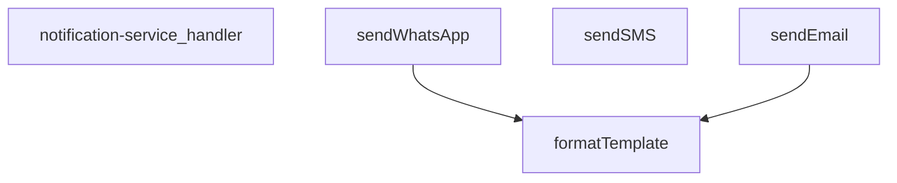

## Genel Bakış
Bu modül, bir Supabase edge function olarak HTTP isteklerini karşılayan bildirim servisidir. WhatsApp, SMS ve e-posta olmak üzere üç farklı kanal üzerinden mesaj gönderimi yapar. İstek parametrelerine göre uygun kanalı seçer, gerekirse şablonları dinamik verilerle doldurur ve ilgili servis sağlayıcıya iletir.

## Fonksiyon Grupları
### İstek Yönetimi
Gelen HTTP isteklerini işleyen ana giriş noktasıdır. İstek içeriğini ayrıştırarak hangi bildirim kanalının kullanılacağını belirler ve ilgili gönderme fonksiyonunu çağırır.
- notification-service_handler

### Kanal Bazlı Bildirim Gönderimi
Farklı iletişim kanalları üzerinden mesaj iletmekten sorumlu fonksiyonlardır. Her biri ilgili servis sağlayıcıya (Twilio WhatsApp/SMS, e-posta API'si) bağlanarak mesajı hedef kullanıcıya iletir.
- sendWhatsApp, sendSMS, sendEmail

### Şablon Doldurma
Bildirim içeriklerindeki yer tutucuları gerçek verilerle değiştiren yardımcı fonksiyondur. Kişiselleştirilmiş mesajlar hazırlanırken gönderme fonksiyonları tarafından kullanılır.
- formatTemplate

---

## AXIOMS – Mimari Varsayımlar

Bu modül, HTTP istekleri alarak WhatsApp, SMS ve e-posta kanalları üzerinden bildirim gönderen bir Supabase fonksiyon servisidir. Aşağıdaki varsayımlar fonksiyon imzalarından türetilmiştir.

**[Aksiyom 1]:** Eğer `sendSMS` çağrısında `config: TwilioConfig` parametresi sağlanmamış veya geçersizse, SMS gönderimi başarısız olur.

**[Aksiyom 2]:** Eğer `sendEmail` çağrısında `config` parametresi içinde `apiKey` alanı boş veya geçersizse, e-posta gönderimi başarısız olur.

**[Aksiyom 3]:** Eğer `formatTemplate` çağrısında `template` parametresi boş string veya geçersiz bir şablon ise, `_data` ile birleştirme yapılamaz ve hata üretilir.

**[Aksiyom 4]:** Eğer `formatTemplate` çağrısında `_data: TemplateData` parametresi sağlanmamışsa, şablondaki dinamik alanlar doldurulamaz ve formatlanmamış ham şablon döner veya hata oluşur.

**[Aksiyom 5]:** Eğer `_stockAlertTemplates` sabiti boş bir nesne veya tanımsız ise, stok alert ile ilgili bildirim şablonları kullanılamaz; `formatTemplate` çağrısında ilgili şablon anahtarı bulunamaz.

**[Aksiyom 6]:** Eğer `sendWhatsApp` çağrısında `config?: TwilioConfig` parametresi sağlanmamışsa, fonksiyonun varsayılan bir Twilio yapılandırması kullanması beklenir; böyle bir varsayılan yapılandırma tanımlı değilse WhatsApp gönderimi başarısız olur.

**[Aksiyom 7]:** Eğer `notification-service_handler` çağrısında `req` parametresi geçerli bir HTTP request nesnesi değilse (örn: method, body, headers eksikse), istek işlenemez ve uygun hata yanıtı döner.

**[Aksiyom 8]:** Eğer `sendWhatsApp` çağrısında hem `message` hem `template` parametreleri sağlanmamışsa, gönderilecek içerik belirsiz olacağından WhatsApp mesajı gönderilemez.

---

## FONKSİYON DETAYLARI

### notification-service_handler
**Ne yapar**: Bu fonksiyon, HTTP isteklerini alarak bildirim servisinin ana işleyişini yöneten giriş noktasıdır (handler). Gelen isteğe göre doğru bildirim kanalını (WhatsApp, SMS veya e-posta) seçip ilgili gönderim fonksiyonunu çağırarak işlemi koordine eder.
**Nasıl yapar**: Fonksiyon, gelen HTTP isteğinin gövdesini (body) analiz eder, istenen bildirim türünü belirler ve gerekli parametreleri (alıcı, mesaj, şablon, yapılandırma bilgileri) çıkarır. Ardından, `sendWhatsApp`, `sendSMS` veya `sendEmail` fonksiyonlarından uygun olanını asenkron olarak çağırır ve sonucu döndürür. Hata yönetimi ve doğrulama mantığını içerir.
**Parametreler**:
- `req`: Request (veya benzeri bir nesne) — Gelen HTTP isteği nesnesi. Bildirim talebini ve gerekli tüm parametreleri taşır.
**Dönüş**: Response — İşlemin sonucunu (başarı/hata durumu) içeren HTTP yanıt nesnesi.

### sendWhatsApp
**Ne yapar**: Belirtilen alıcıya Twilio API'si üzerinden bir WhatsApp mesajı gönderir. İsteğe bağlı olarak bir mesaj şablonunu ve değişken verilerini kullanarak kişiselleştirilmiş mesajlar oluşturabilir.
**Nasıl yapar**: Fonksiyon, yapılandırma nesnesindeki (config) Twilio hesap bilgileriyle (accountSid, authToken, fromNumber) bir Basic Auth başlığı oluşturur. Alıcı numarasını `whatsapp:` önekine sahip olacak şekilde formatlar. Eğer bir şablon ve veri sağlandıysa, `formatTemplate` fonksiyonunu kullanarak son mesajı oluşturur. Ardından, Twilio'nun Messages endpoint'ine POST isteği göndererek mesajı iletir ve API yanıtını döndürür.
**Parametreler**:
- `to`: string — Mesajın gönderileceği alıcının WhatsApp numarası (örn: `+1234567890`).
- `message`: string — Gönderilecek düz metin mesajı. Şablon kullanılmadığında doğrudan gönderilir.
- `template?`: string (isteğe bağlı) — Değişken içeren mesaj şablonu (örn: `Merhaba {{name}}, durumunuz: {{status}}`).
- `_data?`: TemplateData (isteğe bağlı) — Şablondaki `{{değişken}}` alanlarını doldurmak için kullanılacak anahtar-değer çiftlerini içeren nesne.
- `config?`: TwilioConfig (isteğe bağlı) — Twilio API kimlik bilgilerini (`accountSid`, `authToken`, `fromNumber`) içeren yapılandırma nesnesi.
**Dönüş**: Promise<any> — Twilio API'sinden dönen JSON yanıtını çözer ve döndürür. Başarılı gönderimde mesaj bilgilerini içerir.

### sendSMS
**Ne yapar**: Twilio API'si kullanarak belirli bir alıcıya bir Short Message Service (SMS) metni gönderir.
**Nasıl yapar**: `sendWhatsApp` fonksiyonuna çok benzer bir mantıkla çalışır, ancak alıcı numarasına `whatsapp:` eki eklemez ve Twilio'nun SMS endpoint'ine doğrudan POST isteği gönderir. Yapılandırma nesnesindeki Twilio bilgilerini kullanarak Basic Auth ile kimlik doğrulaması yapar ve mesajı iletir.
**Parametreler**:
- `to`: string — SMS'in gönderileceği alıcının telefon numarası (örn: `+1234567890`).
- `message`: string — Gönderilecek metin mesajı.
- `config`: TwilioConfig — Twilio API kimlik bilgilerini (`accountSid`, `authToken`, `fromNumber`) içeren zorunlu yapılandırma nesnesi.
**Dönüş**: Promise<any> — Twilio API'sinden dönen JSON yanıtını çözer ve döndürür. Gönderilen mesajın SID'si gibi bilgileri içerir.

### sendEmail
**Ne yapar**: Resend API'si kullanarak belirtilen alıcıya bir e-posta gönderir. Düz metin veya HTML formatında mesaj gönderebilir ve isteğe bağlı olarak değişken içeren bir şablon kullanabilir.
**Nasıl yapar**: Fonksiyon, Resend API'sinin `/emails` endpoint'ine POST isteği gönderir. İstek gövdesini oluştururken, sağlanan şablonu `_data` nesnesiyle formatlayarak (`formatTemplate` kullanarak) final mesajını oluşturur. Bu mesajı hem `_text` (düz metin) hem de `html` (basit paragraf etiketleriyle) alanlarına yerleştirir. Varsayılan olarak "VentHub Bildirim" konu satırı ve `noreply@venthub.com` adresini kullanır, ancak bunlar `_data` veya `config` içindeki değerlerle değiştirilebilir.
**Parametreler**:
- `to`: string — E-postanın gönderileceği alıcının e-posta adresi.
- `message`: string — Gönderilecek düz metin mesajı. Şablon kullanılmadığında doğrudan gönderilir.
- `template?`: string (isteğe bağlı) — Değişken içeren e-posta şablonu.
- `_data?`: TemplateData (isteğe bağlı) — Şablondaki `{{değişken}}` alanlarını doldurmak için veri. Ek olarak `subject` ve `emailFrom` alanlarını da içerebilir.
- `config?`: { apiKey: string; from?: string } (isteğe bağlı) — Resend API anahtarını (`apiKey`) ve isteğe bağlı olarak gönderici adresini (`from`) içeren yapılandırma nesnesi.
**Dönüş**: Promise<any> — Resend API'sinden dönen JSON yanıtını çözer ve döndürür. Başarılı gönderimde e-posta ID'si gibi bilgileri içerir.

### formatTemplate
**Ne yapar**: Bir metin şablonunu, sağlanan veri nesnesindeki değerlerle eşleştirerek kişiselleştirilmiş bir metin dizesi oluşturur. `{{anahtar}}` biçimindeki yer tutucuları gerçek değerlerle değiştirir.
**Nasıl yapar**: Fonksiyon, `_data` nesnesinin tüm anahtarları üzerinde döngüye girer. Her anahtar için, şablon içindeki `{{anahtar}}` kalıbını (RegExp kullanarak, `g` flag'i ile tüm eşleşmeleri bulacak şekilde) bulur ve ilgili değerin string karşılığıyla değiştirir. Değerleri zorunlu olarak string'e dönüştürerek (String(_data[key])) tutarlılık sağlar.
**Parametreler**:
- `template`: string — Değişkenler içeren ham şablon metni (örn: `Sayın {{name}}, talebiniz {{status}} durumundadır.`).
- `_data`: TemplateData — Şablondaki yer tutuculara karşılık gelecek anahtar-değer çiftlerini içeren nesne (örn: `{ name: 'Ahmet', status: 'inceleniyor' }`).
**Dönüş**: string — Yer tutucuların değerlerle değiştirildiği, kullanıma hazır son metin dizesi.

---

## INTERFACES

### NotificationRequest
- `type: 'whatsapp' | 'sms' | 'email'`
- `to: string`
- `message: string`
- `priority: 'low' | 'medium' | 'high' | 'critical'`
- `template?: string`
- `_data?: TemplateData`

### _StockAlertData
- `productName: string`
- `currentStock: number`
- `threshold: number`
- `_productId: string`

### TwilioConfig
- `accountS_id: string`
- `authToken: string`
- `fromNumber: string`

---

## TYPE ALIASES

### TemplateData
```typescript
type TemplateData = Record<string, string | number | boolean>
```

---

## SABİTLER
- **_stockAlertTemplates** (object) — `{

  whatsapp: {

    low_stock: `🚨 STOK UYARISI 🚨

    

📦 Ürün: {{productNa...`

---

## AST POINTERS

### [N1_NASIL] AST Pointer: supabase/functions/notification-service/index.ts::notification-service_handler
- **params**: `req` — gelen HTTP isteği (Request nesnesi)
- **ic_degiskenler**:
  - `corsHeaders` — CORS başlık nesnesi, tüm yanıtlarda gönderilir
  - `supabaseUrl` — `Deno.env.get('SUPABASE_URL')` ile alınan Supabase proje URL'i
  - `serviceRoleKey` — `Deno.env.get('SUPABASE_SERVICE_ROLE_KEY')` ile alınan servis rolü anahtarı
  - `anonKey` — `Deno.env.get('SUPABASE_ANON_KEY')` ile alınan anonim anahtar
  - `authHeader` — `req.headers.get('Authorization')` ile alınan yetkilendirme header'ı
  - `authClient` — `createClient(supabaseUrl, anonKey, ...)` ile oluşturulan yetkilendirme istemcisi (sadece serviceRoleKey eşleşmediğinde)
  - `user` — `authClient.auth.getUser()` ile dönen kullanıcı nesnesi
  - `authErr` — `getUser()` çağrısından dönen hata nesnesi
  - `roleCheck` — `fetch(...)` ile `user_profiles` tablosundan rol sorgulama sonucu (Response)
  - `arr` — `roleCheck.json()` ile parse edilen rol yanıtı dizisi
  - `role` — `arr[0]?.role` ile alınan kullanıcının rolü (admin/superadmin kontrolü)
  - `body` — `req.json()` ile parse edilen istek gövdesi (NotificationRequest tipi)
  - `type` — `body.type` alanından gelen bildirim kanalı türü (whatsapp/sms/email)
  - `to` — `body.to` alanından gelen alıcı bilgisi
  - `message` — `body.message` alanından gelen mesaj içeriği
  - `priority` — `body.priority` alanından gelen öncelik seviyesi
  - `template` — `body.template` alanından gelen şablon adı
  - `_data` — `body._data` alanından gelen şablon değişken verileri
  - `twilioAccountSid` — `Deno.env.get('TWILIO_ACCOUNT_SID')` ile alınan Twilio hesap SID'i
  - `twilioAuthToken` — `Deno.env.get('TWILIO_AUTH_TOKEN')` ile alınan Twilio auth token'ı
  - `twilioWhatsAppNumber` — `Deno.env.get('TWILIO_WHATSAPP_NUMBER')` ile alınan Twilio WhatsApp numarası
  - `twilioPhoneNumber` — `Deno.env.get('TWILIO_PHONE_NUMBER')` ile alınan Twilio SMS numarası
  - `resendApiKey` — `Deno.env.get('RESEND_API_KEY')` ile alınan Resend API anahtarı
  - `emailFrom` — `Deno.env.get('EMAIL_FROM')` ile alınan veya varsayılan e-posta gönderici adresi
  - `notifyDebug` — `Deno.env.get('NOTIFY_DEBUG')` kontrolünden gelen debug bayrağı
  - `result` — bildirim gönderme işleminin sonucu (switch-case içinde atanır)
  - `isWhatsAppEnabled` — WhatsApp kanalının yapılandırma ile etkin olup olmadığı (boolean)
  - `isSmsEnabled` — SMS kanalının yapılandırma ile etkin olup olmadığı (boolean)
  - `isEmailEnabled` — Email kanalının yapılandırma ile etkin olup olmadığı (boolean)
  - `msg` — catch bloğunda `error instanceof Error` kontrolü ile elde edilen hata mesajı
- **Dönüş**: `Response` — JSON başarılı yanıt veya hata yanıtı

---

### [N2_NASIL] AST Pointer: supabase/functions/notification-service/index.ts::sendWhatsApp
- **params**: `to` (string) — alıcı telefon numarası; `message` (string) — gönderilecek mesaj; `template?` (string) — opsiyonel şablon adı; `_data?` (TemplateData) — opsiyonel şablon değişkenleri; `config?` (TwilioConfig) — Twilio yapılandırma nesnesi
- **ic_degiskenler**:
  - `finalMessage` — `template` varsa `formatTemplate(template, _data)` ile formatlanmış mesaj; yoksa doğrudan `message`
  - `formattedTo` — alıcı numarası `whatsapp:` prefix'i ile formatlanmış (zaten varsa tekrar eklenmez)
  - `twilioUrl` — Twilio Messages API endpoint URL'i (hesap SID ile dinamik)
  - `credentials` — `btoa(accountSid:authToken)` ile Base64 kodlanmış kimlik bilgileri
  - `response` — Twilio API'sine POST isteğiyle dönen fetch sonucu (Response)
  - `error` — `response._text()` ile alınan hata metni (response.ok false ise)
- **Dönüş**: Twilio API yanıt JSON'u

---

### [N3_NASIL] AST Pointer: supabase/functions/notification-service/index.ts::sendSMS
- **params**: `to` (string) — alıcı telefon numarası; `message` (string) — gönderilecek SMS mesajı; `config` (TwilioConfig) — Twilio yapılandırma nesnesi
- **ic_degiskenler**:
  - `twilioUrl` — Twilio Messages API endpoint URL'i (hesap SID ile dinamik)
  - `credentials` — `btoa(accountSid:authToken)` ile Base64 kodlanmış kimlik bilgileri
  - `response` — Twilio API'sine POST isteğiyle dönen fetch sonucu (Response)
  - `error` — `response._text()` ile alınan hata metni (response.ok false ise)
- **Dönüş**: Twilio API yanıt JSON'u

---

### [N4_NASIL] AST Pointer: supabase/functions/notification-service/index.ts::sendEmail
- **params**: `to` (string) — alıcı e-posta adresi; `message` (string) — gönderilecek mesaj; `template?` (string) — opsiyonel şablon adı; `_data?` (TemplateData) — opsiyonel şablon değişkenleri; `config?` (`{ apiKey: string; from?: string }`) — Resend API yapılandırması
- **ic_degiskenler**:
  - `subject` — `_data?.subject` varsa onu alır, yoksa `'VentHub Bildirim'` varsayılır
  - `finalMessage` — `template` varsa `formatTemplate(template, _data)` ile formatlanmış mesaj; yoksa doğrudan `message`
  - `from` — `config.from`, `_data.emailFrom` veya varsayılan `'VentHub <noreply@venthub.com>'` sırasıyla kontrol edilir
  - `response` — Resend API'sine POST isteğiyle dönen fetch sonucu (Response)
  - `error` — `response._text()` ile alınan hata metni (response.ok false ise)
- **Dönüş**: Resend API yanıt JSON'u

---

### [N5_NASIL] AST Pointer: supabase/functions/notification-service/index.ts::formatTemplate
- **params**: `template` (string) — `{{key}}` placeholder'ları içeren şablon metni; `_data` (TemplateData) — placeholder değerlerini içeren anahtar-değer nesnesi
- **ic_degiskenler**:
  - `formatted` — `template`'in `let` ile kopyası; her döngüde placeholder'lar değiştirilerek güncellenir
  - `key` — `Object.keys(_data).forEach` callback'indeki mevcut anahtar
  - `placeholder` — `new RegExp(\`{{${key}}}\`, 'g')` ile oluşturulan ve eşleşen placeholder'ı bulan regex nesnesi
  - `value` — `String(_data[key])` ile `_data[key]` değerinin string karşılığı
- **Dönüş**: `string` — placeholder'ların değerlerle değiştirilmiş nihai şablon metni

---


## MERMAID CALL GRAPH


## NODE ID STANDARD

  file: supabase\functions\notification-service\index.ts
  function: supabase\functions\notification-service\index.ts::notification-service_handler
  function: supabase\functions\notification-service\index.ts::sendWhatsApp
  function: supabase\functions\notification-service\index.ts::sendSMS
  function: supabase\functions\notification-service\index.ts::sendEmail
  function: supabase\functions\notification-service\index.ts::formatTemplate

---

## DISA AKTARILANLAR (EXPORTS)
  export: formatTemplate
  export: notification-service_handler
  export: sendEmail
  export: sendSMS
  export: sendWhatsApp