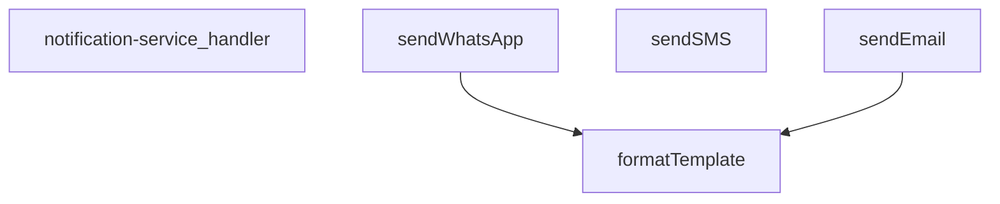

## Genel Bakış
Bu modül, bir Supabase edge function olarak HTTP isteklerini karşılayan bildirim servisidir. WhatsApp, SMS ve e-posta olmak üzere üç farklı kanal üzerinden mesaj gönderimi sunar. İstek parametrelerine göre uygun kanalı seçer, gerekirse şablonları dinamik verilerle doldurur ve ilgili servis sağlayıcıya iletir.

## Fonksiyon Grupları
### İstek Yönetimi
Gelen HTTP isteklerini işleyen ana giriş noktasıdır. İstek içeriğini ayrıştırarak hangi bildirim kanalının kullanılacağını belirler ve ilgili gönderme fonksiyonunu çağırır.
- notification-service_handler

### Kanal Bazlı Bildirim Gönderimi
Farklı iletişim kanalları üzerinden mesaj iletmekten sorumlu fonksiyonlardır. Her biri ilgili servis sağlayıcıya bağlanarak mesajı hedef kullanıcıya iletir.
- sendWhatsApp, sendSMS, sendEmail

### Şablon Doldurma
Bildirim içeriklerindeki yer tutucuları gerçek verilerle değiştiren yardımcı fonksiyondur. Kişiselleştirilmiş mesajlar hazırlanırken gönderme fonksiyonları tarafından iç çağrı olarak kullanılır.
- formatTemplate

---

## AXIOMS – Mimari Varsayımlar

Bu modül için varsayımlar, fonksiyon imzaları ve modül sabitlerinden yola çıkılarak çıkarılmıştır.

**[Aksiyom 1]:** Eğer `notification-service_handler` fonksiyonuna geçilen `req` nesnesi geçerli bir HTTP isteği (Request) nesnesi değilse (örn. `null`, `undefined` veya yanlış tipteyse), istek ayrıştırılamaz ve modül temel işlevini yerine getiremez; bu durumda istemciye hata yanıtı dönmelidir.

**[Aksiyom 2]:** Eğer `sendWhatsApp`, `sendSMS` veya `sendEmail` fonksiyonlarından herhangi biri çağrıldığında `to` parametresi boş bir string (`""`) veya `undefined` ise, mesaj hedeflenen kişiye ulaştırılamaz ve ilgili servis sağlayıcı tarafında hata oluşur.

**[Aksiyom 3]:** Eğer `sendWhatsApp` fonksiyonu `template` parametresi ile çağrılıyorsa, `_data` parametresinin (eğer sağlanmışsa) şablondaki değişken alanlarıyla uyumlu olması gerekir; aksi halde `formatTemplate` fonksiyonu beklenmeyen bir çıktı üretebilir veya şablon düzgün doldurulamaz.

**[Aksiyom 4]:** Eğer `sendEmail` fonksiyonu `config` parametresi ile çağrılıyorsa, `config.apiKey` alanının sağlanması zorunludur; aksi halde e-posta servis sağlayıcısına (örn. SendGrid, Mailgun vb.) kimlik doğrulama yapılamaz ve e-posta gönderimi başarısız olur.

**[Aksiyom 5]:** Eğer `sendWhatsApp` veya `sendSMS` fonksiyonu `config` (TwilioConfig) parametresi olmadan çağrılıyorsa (varsayılan değer `undefined` ise), Twilio API凭据ları dış bir kaynaktan (örn. ortam değişkenleri) sağlanmalıdır; aksi halde Twilio servisine bağlanılamaz ve mesaj gönderilemez.

**[Aksiyom 6]:** Eğer `notification-service_handler` isteği işlerken geçersiz bir `channel` değeri (örn. `sendWhatsApp`, `sendSMS`, `sendEmail` dışında bir değer) alıysa, modül tanımsız bir kanal için işlem yapamaz ve hata döndürmelidir.

**[Aksiyom 7]:** Eğer `_stockAlertTemplates` modül sabiti bir sözlük (object) olarak tanımlı değilse veya beklenen şablon anahtarlarını içermiyorsa, `formatTemplate` fonksiyonu stok uyarı şablonlarını bulamaz ve formatlama işlemi başarısız olur

---

## FONKSİYON DETAYLARI

### notification-service_handler
**Ne yapar**: Bu fonksiyon, HTTP isteklerini alarak bildirim servisinin ana işleyişini yöneten giriş noktasıdır (handler). Gelen isteğe göre doğru bildirim kanalını (WhatsApp, SMS veya e-posta) seçip ilgili gönderim fonksiyonunu çağırarak işlemi koordine eder.
**Nasıl yapar**: Fonksiyon, gelen HTTP isteğinin gövdesini (body) analiz eder, istenen bildirim türünü belirler ve gerekli parametreleri (alıcı, mesaj, şablon, yapılandırma bilgileri) çıkarır. Ardından, `sendWhatsApp`, `sendSMS` veya `sendEmail` fonksiyonlarından uygun olanını asenkron olarak çağırır ve sonucu döndürür. Hata yönetimi ve doğrulama mantığını içerir.
**Parametreler**:
- `req`: Request (veya benzeri bir nesne) — Gelen HTTP isteği nesnesi. Bildirim talebini ve gerekli tüm parametreleri taşır.
**Dönüş**: Response — İşlemin sonucunu (başarı/hata durumu) içeren HTTP yanıt nesnesi.

### sendWhatsApp
**Ne yapar**: Belirtilen alıcıya Twilio API'si üzerinden bir WhatsApp mesajı gönderir. İsteğe bağlı olarak bir mesaj şablonunu ve değişken verilerini kullanarak kişiselleştirilmiş mesajlar oluşturabilir.
**Nasıl yapar**: Fonksiyon, yapılandırma nesnesindeki (config) Twilio hesap bilgileriyle (accountSid, authToken, fromNumber) bir Basic Auth başlığı oluşturur. Alıcı numarasını `whatsapp:` önekine sahip olacak şekilde formatlar. Eğer bir şablon ve veri sağlandıysa, `formatTemplate` fonksiyonunu kullanarak son mesajı oluşturur. Ardından, Twilio'nun Messages endpoint'ine POST isteği göndererek mesajı iletir ve API yanıtını döndürür.
**Parametreler**:
- `to`: string — Mesajın gönderileceği alıcının WhatsApp numarası (örn: `+1234567890`).
- `message`: string — Gönderilecek düz metin mesajı. Şablon kullanılmadığında doğrudan gönderilir.
- `template?`: string (isteğe bağlı) — Değişken içeren mesaj şablonu (örn: `Merhaba {{name}}, durumunuz: {{status}}`).
- `_data?`: TemplateData (isteğe bağlı) — Şablondaki `{{değişken}}` alanlarını doldurmak için kullanılacak anahtar-değer çiftlerini içeren nesne.
- `config?`: TwilioConfig (isteğe bağlı) — Twilio API kimlik bilgilerini (`accountSid`, `authToken`, `fromNumber`) içeren yapılandırma nesnesi.
**Dönüş**: Promise<any> — Twilio API'sinden dönen JSON yanıtını çözer ve döndürür. Başarılı gönderimde mesaj bilgilerini içerir.

### sendSMS
**Ne yapar**: Twilio API'si kullanarak belirli bir alıcıya bir Short Message Service (SMS) metni gönderir.
**Nasıl yapar**: `sendWhatsApp` fonksiyonuna çok benzer bir mantıkla çalışır, ancak alıcı numarasına `whatsapp:` eki eklemez ve Twilio'nun SMS endpoint'ine doğrudan POST isteği gönderir. Yapılandırma nesnesindeki Twilio bilgilerini kullanarak Basic Auth ile kimlik doğrulaması yapar ve mesajı iletir.
**Parametreler**:
- `to`: string — SMS'in gönderileceği alıcının telefon numarası (örn: `+1234567890`).
- `message`: string — Gönderilecek metin mesajı.
- `config`: TwilioConfig — Twilio API kimlik bilgilerini (`accountSid`, `authToken`, `fromNumber`) içeren zorunlu yapılandırma nesnesi.
**Dönüş**: Promise<any> — Twilio API'sinden dönen JSON yanıtını çözer ve döndürür. Gönderilen mesajın SID'si gibi bilgileri içerir.

### sendEmail
**Ne yapar**: Resend API'si kullanarak belirtilen alıcıya bir e-posta gönderir. Düz metin veya HTML formatında mesaj gönderebilir ve isteğe bağlı olarak değişken içeren bir şablon kullanabilir.
**Nasıl yapar**: Fonksiyon, Resend API'sinin `/emails` endpoint'ine POST isteği gönderir. İstek gövdesini oluştururken, sağlanan şablonu `_data` nesnesiyle formatlayarak (`formatTemplate` kullanarak) final mesajını oluşturur. Bu mesajı hem `_text` (düz metin) hem de `html` (basit paragraf etiketleriyle) alanlarına yerleştirir. Varsayılan olarak "VentHub Bildirim" konu satırı ve `noreply@venthub.com` adresini kullanır, ancak bunlar `_data` veya `config` içindeki değerlerle değiştirilebilir.
**Parametreler**:
- `to`: string — E-postanın gönderileceği alıcının e-posta adresi.
- `message`: string — Gönderilecek düz metin mesajı. Şablon kullanılmadığında doğrudan gönderilir.
- `template?`: string (isteğe bağlı) — Değişken içeren e-posta şablonu.
- `_data?`: TemplateData (isteğe bağlı) — Şablondaki `{{değişken}}` alanlarını doldurmak için veri. Ek olarak `subject` ve `emailFrom` alanlarını da içerebilir.
- `config?`: { apiKey: string; from?: string } (isteğe bağlı) — Resend API anahtarını (`apiKey`) ve isteğe bağlı olarak gönderici adresini (`from`) içeren yapılandırma nesnesi.
**Dönüş**: Promise<any> — Resend API'sinden dönen JSON yanıtını çözer ve döndürür. Başarılı gönderimde e-posta ID'si gibi bilgileri içerir.

### formatTemplate
**Ne yapar**: Bir metin şablonunu, sağlanan veri nesnesindeki değerlerle eşleştirerek kişiselleştirilmiş bir metin dizesi oluşturur. `{{anahtar}}` biçimindeki yer tutucuları gerçek değerlerle değiştirir.
**Nasıl yapar**: Fonksiyon, `_data` nesnesinin tüm anahtarları üzerinde döngüye girer. Her anahtar için, şablon içindeki `{{anahtar}}` kalıbını (RegExp kullanarak, `g` flag'i ile tüm eşleşmeleri bulacak şekilde) bulur ve ilgili değerin string karşılığıyla değiştirir. Değerleri zorunlu olarak string'e dönüştürerek (String(_data[key])) tutarlılık sağlar.
**Parametreler**:
- `template`: string — Değişkenler içeren ham şablon metni (örn: `Sayın {{name}}, talebiniz {{status}} durumundadır.`).
- `_data`: TemplateData — Şablondaki yer tutuculara karşılık gelecek anahtar-değer çiftlerini içeren nesne (örn: `{ name: 'Ahmet', status: 'inceleniyor' }`).
**Dönüş**: string — Yer tutucuların değerlerle değiştirildiği, kullanıma hazır son metin dizesi.

---

## İTHALATLAR (IMPORTS)
- import: ../_shared/cors.ts::getCorsHeaders
- import: ../_shared/tenant_config.ts::getTenantBranding
- import: ../_shared/tenant_config.ts::resolveTenantId
- import: https://deno.land/std@0.168.0/http/server.ts::serve
- import: https://esm.sh/@supabase/supabase-js@2.39.3::createClient

---

## INTERFACES

### NotificationRequest
- `type: 'whatsapp' | 'sms' | 'email'`
- `to: string`
- `message: string`
- `priority: 'low' | 'medium' | 'high' | 'critical'`
- `template?: string`
- `_data?: TemplateData`
- `tenant_id?: string`

### _StockAlertData
- `productName: string`
- `currentStock: number`
- `threshold: number`
- `_productId: string`

### TwilioConfig
- `accountS_id: string`
- `authToken: string`
- `fromNumber: string`

---

## TYPE ALIASES

### TemplateData
```typescript
type TemplateData = Record<string, string | number | boolean>
```

---

## SABİTLER
- **_stockAlertTemplates** (object) — `{
  whatsapp: {
    low_stock: `🚨 STOK UYARISI 🚨
    
📦 Ürün: {{productNa...`

---

## AST POINTERS

### [N1_NASIL] AST Pointer: supabase/functions/notification-service/index.ts::notification-service_handler
- **params**: `(req)`
- **ic_degiskenler**:
  - `corsHeaders` — Tüm yanıtlara eklenen CORS başlık nesnesi (Allow-Headers, Allow-Methods)
  - `supabaseUrl` — `Deno.env.get('SUPABASE_URL')` ile okunan Supabase proje URL'i
  - `serviceRoleKey` — `Deno.env.get('SUPABASE_SERVICE_ROLE_KEY')` ile okunan servis rol anahtarı, yetkilendirmede ve rol kontrolünde kullanılır
  - `anonKey` — `Deno.env.get('SUPABASE_ANON_KEY')` ile okunan anonim anahtar, auth client oluşturulurken kullanılır
  - `body` — `req.json()` ile parse edilen istek gövdesi, `NotificationRequest` tipinde
  - `type` — `body` destructuring ile alınan bildirim türü (whatsapp/sms/email)
  - `to` — `body` destructuring ile alınan alıcı iletişim bilgisi
  - `message` — `body` destructuring ile alınan mesaj içeriği
  - `priority` — `body` destructuring ile alınan bildirim öncelik seviyesi
  - `template` — `body` destructuring ile alınan opsiyonel şablon string'i
  - `_data` — `body` destructuring ile alınan opsiyonel şablon veri sözlüğü
  - `tenantId` — `resolveTenantId(req, body)` çağrısı ile elde edilen kiracı kimliği
  - `branding` — `await getTenantBranding(tenantId)` ile elde edilen kiracı marka bilgileri (emailFrom, brandName, brandPrimaryColor içerir)
  - `authHeader` — `req.headers.get('Authorization')` ile alınan yetkilendirme başlığı
  - `authClient` — `createClient(supabaseUrl, anonKey, {...})` ile oluşturulan yetkilendirme istemcisi
  - `user` — `await authClient.auth.getUser()` destructuring ile alınan authenticated kullanıcı nesnesi
  - `authErr` — `await authClient.auth.getUser()` destructuring ile alınan kimlik doğrulama hatası
  - `roleCheck` — `fetch(...)` ile yapılan `user_profiles` tablosundan rol sorgulama yanıt nesnesi
  - `arr` — `roleCheck.json()` ile parse edilen rol kontrol sonucu dizi
  - `role` — `arr[0]?.role` erişimi ile alınan kullanıcının rolü (admin/superadmin beklenir)
  - `twilioAccountSid` — `Deno.env.get('TWILIO_ACCOUNT_SID')` ile okunan Twilio hesap SID'i
  - `twilioAuthToken` — `Deno.env.get('TWILIO_AUTH_TOKEN')` ile okunan Twilio yetki token'ı
  - `twilioWhatsAppNumber` — `Deno.env.get('TWILIO_WHATSAPP_NUMBER')` ile okunan Twilio WhatsApp numarası
  - `twilioPhoneNumber` — `Deno.env.get('TWILIO_PHONE_NUMBER')` ile okunan Twilio SMS numarası
  - `resendApiKey` — `Deno.env.get('RESEND_API_KEY')` ile okunan Resend e-posta API anahtarı
  - `emailFrom` — `branding.emailFrom` değerinden atanan gönderici e-posta adresi
  - `notifyDebug` — `Deno.env.get('NOTIFY_DEBUG')` karşılaştırması ile belirlenen hata ayıklama modu bayrağı
  - `result` — switch-case bloğunda hangi kanal seçilirse seçilsin bildirim gönderme sonucu
  - `isWhatsAppEnabled` — Twilio WhatsApp ortam değişkenlerinin tamamının mevcut olup olmadığını gösteren boolean
  - `isSmsEnabled` — Twilio SMS ortam değişkenlerinin tamamının mevcut olup olmadığını gösteren boolean
  - `isEmailEnabled` — Resend API anahtarının mevcut olup olmadığını gösteren boolean
  - `error` — catch bloğunda yakalanan hata nesnesi
  - `msg` — `error instanceof Error ? error.message : 'Unknown error'` ile elde edilen hata mesajı string'i
- **Dönüş**: `Response` — başarılıysa JSON `{success, result, type, priority, timestamp}`, hata durumunda JSON `{error, success: false}` veya HTTP hata yanıtı

---


## MERMAID CALL GRAPH


## NODE ID STANDARD

  file: supabase\functions\notification-service\index.ts
  function: supabase\functions\notification-service\index.ts::notification-service_handler
  function: supabase\functions\notification-service\index.ts::sendWhatsApp
  function: supabase\functions\notification-service\index.ts::sendSMS
  function: supabase\functions\notification-service\index.ts::sendEmail
  function: supabase\functions\notification-service\index.ts::formatTemplate

---

## DISA AKTARILANLAR (EXPORTS)
  export: formatTemplate
  export: notification-service_handler
  export: sendEmail
  export: sendSMS
  export: sendWhatsApp