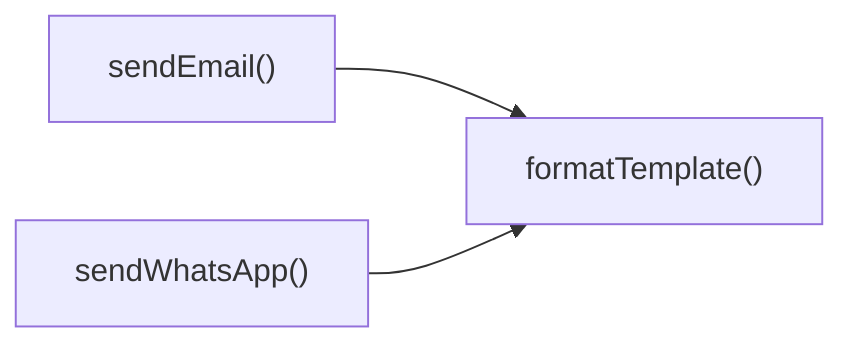

## Genel Bakış
Bu modül, bir Supabase fonksiyonu olarak gelen istekleri alıp, belirtilen kanallar üzerinden (WhatsApp, SMS, e‑posta) bildirim gönderme işlemini yürütür. İstek içeriğine göre uygun gönderme fonksiyonunu seçer, gerekirse şablonları doldurur ve yanıt döndürür.

## Fonksiyon Grupları
### Ana İşlem Kontrolü
Modülün giriş noktası olan fonksiyon, gelen HTTP isteklerini işler, hangi bildirim kanalının kullanılacağını belirler ve ilgili gönderme işlemini tetikler.
- notification-service_handler

### Bildirim Gönderme İşlemleri
Farklı iletişim kanallarına mesaj göndermekten sorumlu fonksiyonlar bulunur. Her biri, ilgili servise (Twilio için WhatsApp ve SMS, özel sağlayıcı için e‑posta) gerekli parametreleri hazırlayıp gönderimi gerçekleştirir.
- sendWhatsApp
- sendSMS
- sendEmail

### Şablon Hazırlama
Metin şablonlarının dinamik verilerle doldurulmasını sağlayan yardımcı fonksiyondur. Bildirim gönderme fonksiyonları, içerik kişiselleştirmesi gerektiğinde bu fonksiyonu kullanır.
- formatTemplate

---

## AXIOMS – Mimari Varsayımlar
Bu modülün fonksiyonları doğru çalışabilmesi için aşağıdaki koşulların sağlanması gerekir.

- **sendWhatsApp**: Eğer `config` parametresi tanımlı değilse, Twilio istemcisi oluşturulamadığı için WhatsApp mesajı gönderilemez.
- **sendSMS**: Eğer `config` parametresi tanımlı değilse, Twilio yapılandırması eksik olduğu için SMS gönderimi gerçekleşemez.
- **sendEmail**: Eğer `config` parametresi tanımlı değilse veya `config.apiKey` eksikse, e-posta servisi kimlik doğrulamasını yapamadığı için e-posta gönderilemez.
- **formatTemplate**: Eğer `template` parametresi boş bir string değilse ve `_data` parametresi geçerli bir `TemplateData` nesnesi ise, şablon doldurma işlemi başarılı olur; aksi takdirde formatlama hatası oluşur.
- **_stockAlertTemplates**: Bu sabit bir nesne olmalı ve içindeki anahtarlar (şablon tanımları) `formatTemplate` fonksiyonuna geçirilecek `template` değerleriyle eşleşmelidir; eşleşmeyen bir anahtar için şablon bulunamadığından bildirim içeriği üretilemez.

---

## FONKSIYON DETAYLARI

### notification-service_handler
**Ne yapar**: Gelen HTTP isteğini işler ve uygun bir yanıt üretir.  
**Nasıl yapar**: Fonksiyon, `req` parametresi olarak alınan isteği değerlendirir, gerekli bildirim işlemlerini tetikler ve sonucunu bir `Response` nesnesi olarak döndürür.  
**Parametreler**:
- req: any — İşlenecek HTTP isteği nesnesi (detaylı tip belirtilmemiş).  
**Dönüş**: Response — İşlem sonucunu temsil eden HTTP yanıt nesnesi.

### sendWhatsApp
**Ne yapar**: Belirtilen alıcıya WhatsApp üzerinden mesaj gönderir.  
**Nasıl yapar**: `to`, `message` zorunlu alanlarıyla birlikte isteğe bağlı `template`, `_data` ve `config` parametrelerini kullanarak Twilio API’sine bir istek yapar ve gelen yanıtın JSON biçimini döndürür.  
**Parametreler**:
- to: string — Mesajın gönderilecek alıcı telefon numarası.  
- message: string — Gönderilecek mesaj içeriği.  
- template: string (opsiyonel) — Kullanılacak WhatsApp şablonu adı.  
- _data: TemplateData (opsiyonel) — Şablon içinde yer değiştirilecek veri nesnesi.  
- config: TwilioConfig (opsiyonel) — Twilio enteasyonu için gerekli yapılandırma bilgileri.  
**Dönüş**: any — Twilio API’sinden dönen JSON yanıtının ayrıştırılmış hali (Promise üzerinden beklenir).

### sendSMS
**Ne yapar**: Belirtilen alıcıya SMS gönderir.  
**Nasıl yapar**: `to` ve `message` zorunlu parametreleriyle birlikte `config` nesnesini kullanarak Twilio SMS API’sine istek gönderir ve yanıtın JSON biçimini döndürür.  
**Parametreler**:
- to: string — Mesajın gönderilecek alıcı telefon numarası.  
- message: string — Gönderilecek SMS içeriği.  
- config: TwilioConfig — Twilio SMS hizmeti için gerekli yapılandırma bilgileri.  
**Dönüş**: any — Twilio API’sinden dönen JSON yanıtının ayrıştırılmış hali (Promise üzerinden beklenir).

### sendEmail
**Ne yapar**: Belirtilen alıcıya e‑posta gönderir.  
**Nasıl yapar**: `to` ve `message` zorunlu alanlarıyla birlikte isteğe bağlı `template`, `_data` ve `config` parametrelerini kullanarak e‑posta servisine istek gönderir ve yanıtın JSON biçimini döndürür.  
**Parametreler**:
- to: string — E‑postanın gönderilecek alıcı adresi.  
- message: string — Gönderilecek e‑posta içeriği.  
- template: string (opsiyonel) — Kullanılacak e‑posta şablonu adı.  
- _data: TemplateData (opsiyonel) — Şablon içinde yer değiştirilecek veri nesnesi.  
- config: { apiKey: string; from?: string } (opsiyonel) — E‑posta servisi için API anahtarı ve opsiyonel gönderici adresi.  
**Dönüş**: any — E‑posta servisinden dönen JSON yanıtının ayrıştırılmış hali (Promise üzerinden beklenir).

### formatTemplate
**Ne yapar**: Verilen şablon stringini, sağlanan veri ile doldurur ve sonucu döndürür.  
**Nasıl yapar**: `template` parametresindeki yer tutucuları, `_data` nesnesindeki anahtar‑değer çiftleriyle değiştirerek最终的字符串 üretir.  
**Parametreler**:
- template: string — Yer tutucular içeren şablon metni.  
- _data: TemplateData — Şablon içindeki yer tutucuları değiştirmek için kullanılan veri nesnesi.  
**Dönüş**: string — Veri ile doldurulmuş final şablon stringi.

---

## INTERFACES

### NotificationRequest
- `type: 'whatsapp' | 'sms' | 'email'`
- `to: string`
- `message: string`
- `priority: 'low' | 'medium' | 'high' | 'critical'`
- `template?: string`
- `_data?: TemplateData`

### _StockAlertData
- `productName: string`
- `currentStock: number`
- `threshold: number`
- `_productId: string`

### TwilioConfig
- `accountS_id: string`
- `authToken: string`
- `fromNumber: string`

---

## TYPE ALIASES

### TemplateData
```typescript
type TemplateData = Record<string, string | number | boolean>
```

---

## SABİTLER
- **_stockAlertTemplates** (object) — `{
  whatsapp: {
    low_stock: `🚨 STOK UYARISI 🚨
    
📦 Ürün: {{productNa...`

---

## AST POINTERS

### [N1_NASIL] AST Pointer: C:\Users\alize\venthub-hvac\supabase\functions\notification-service\index.ts::notification-service_handler
- **params**: req
- **ic_degiskenler**:
  - `corsHeaders` — CORS önceden tanımlı başlıkları içeren nesne, tüm yanıtlara eklenir
  - `supabaseUrl` — Supabase proje URL’si, ortam değişkeninden okunur (boş string varsayılan)
  - `serviceRoleKey` — Supabase service role anahtarı, ortam değişkeninden okunur (boş string varsayılan)
  - `anonKey` — Supabase anon anahtarı, ortam değişkeninden okunur (boş string varsayılan)
  - `authHeader` — İstekten gelen Authorization başlığı değeri
  - `authClient` — Supabase istemcisi, anonKey ve authHeader ile oluşturulur
  - `user` — authClient.auth.getUser() çağrısıyla elde edilen kullanıcı nesnesi (data.user)
  - `authErr` — Kullanıcı kimlik doğrulama sırasında oluşan hata nesnesi
  - `roleCheck` — Kullanıcının rolünü kontrol etmek için supabase üzerindeki user_profiles tablosuna yapılan HTTP isteği
  - `arr` — roleCheck yanıtının JSON olarak ayrıştırılmış hali (boş dizi varsayılan)
  - `role` — arr[0].role üzerinden elde edilen kullanıcı rolü
  - `body` — İstek gövdesinin JSON olarak ayrıştırılmış hali, NotificationRequest tipinde
  - `type` — Bildirim türü (whatsapp, sms, email vb.) body’den destructure ile alınan alan
  - `to` — Alıcı adresi/numarası, body’den alınan
  - `message` — İletilecek mesaj metni, body’den alınan
  - `priority` — Bildirim önceliği, body’den alınan
  - `template` — Şablon adı (opsiyonel), body’den alınan
  - `_data` — Şablon içinde değiştirilecek değişkenler (opsiyonel), body’den alınan
  - `twilioAccountSid` — Twilio Account SID, ortam değişkeninden okunur
  - `twilioAuthToken` — Twilio Auth Token, ortam değişkeninden okunur
  - `twilioWhatsAppNumber` — Twilio WhatsApp gönderen numarası, ortam değişkeninden okunur
  - `twilioPhoneNumber` — Twilio SMS gönderen numarası, ortam değişkeninden okunur
  - `resendApiKey` — Resend e‑mail servisi API anahtarı, ortam değişkeninden okunur
  - `emailFrom` — Gönderen e‑mail adresi, ortam değişkeninden okunur veya varsayılan değer kullanılır
  - `notifyDebug` — Debug modunun aktif olup olmadığını gösteren boolean (NOTIFY_DEBUG === 'true')
  - `result` — İşlem sonucunu tutan geçici değişken, başlangıçta { success: false, note: undefined } olarak ayarlanır
  - `isWhatsAppEnabled` — Twilio WhatsApp için gerekli tüm ortam değişkenlerinin dolu olup olmadığını gösteren boolean
  - `isSmsEnabled` — Twilio SMS için gerekli tüm ortam değişkenlerinin dolu olup olmadığını gösteren boolean
  - `isEmailEnabled` — Resend API anahtarının varlığını gösteren boolean
  - `msg` — Yakalanan hatanın mesajı (Error ise error.message, değilse 'Unknown error')
- **Dönüş**: Response (HTTP 200/401/403/405/500 gibi durum kodları ve JSON gövdesi)

### [N2_NASIL] AST Pointer: C:\Users\alize\venthub-hvac\supabase\functions\notification-service\index.ts::sendWhatsApp
- **params**: to, message, template?, _data?, config?
- **ic_degiskenler**:
  - `finalMessage` — Şablon varsa formatTemplate ile doldurulmuş mesaj, yoksa doğrudan message
  - `formattedTo` — Alıcı numarası, whatsapp: önekiyle başlatılmış (zaten varsa ekleme yapmaz)
  - `twilioUrl` — Twilio Messages API endpoint URL’si, config.accountSid kullanılarak oluşturulur
  - `credentials` — Base64 kodlanmış "accountSid:authToken" stringi, HTTP Basic auth için
  - `response` — Twilio API’ye yapılan fetch isteğinin yanıtı
  - `error` — response.ok false olduğunda response._text() ile elde edilen hata metni
- **Dönüş**: yok (fonksiyon Twilio API yanıtını JSON olarak döndürür, ancak tip annotation yok)

### [N3_NASIL] AST Pointer: C:\Users\alize\venthub-hvac\supabase\functions\notification-service\index.ts::sendSMS
- **params**: to, message, config
- **ic_degiskenler**:
  - `twilioUrl` — Twilio Messages API endpoint URL’si, config.accountSid kullanılarak oluşturulur
  - `credentials` — Base64 kodlanmış "accountSid:authToken" stringi
  - `response` — Twilio API’ye yapılan fetch isteğinin yanıtı
  - `error` — response.ok false olduğunda response._text() ile elde edilen hata metni
- **Dönüş**: yok (fonksiyon Twilio API yanıtını JSON olarak döndürür)

### [N4_NASIL] AST Pointer: C:\Users\alize\venthub-hvac\supabase\functions\notification-service\index.ts::sendEmail
- **params**: to, message, template?, _data?, config?
- **ic_degiskenler**:
  - `subject` — E‑mail konusu, _data?.subject varsa onu, yoksa varsayılan 'VentHub Bildirim'
  - `finalMessage` — Şablon varsa formatTemplate ile doldurulmuş mesaj, yoksa doğrudan message
  - `from` — Gönderen adresi, config?.from, _data?.emailFrom veya varsayılan 'VentHub <noreply@venthub.com>' öncelikle sırayla
  - `response` — Resend /emails endpoint’ine yapılan fetch isteğinin yanıtı
  - `error` — response.ok false olduğunda response._text() ile elde edilen hata metni
- **Dönüş**: yok (fonksiyon Resend API yanıtını JSON olarak döndürür)

### [N5_NASIL] AST Pointer: C:\Users\alize\venthub-hvac\supabase\functions\notification-service\index.ts::formatTemplate
- **params**: template, _data
- **ic_degiskenler**:
  - `formatted` — Şablonun başlangıç hali, _data yoksa doğrudan döndürülür; varsa placeholder’lar değerlerle değiştirilir
  - `placeholder` — Her _data anahtarı için oluşturulan RegExp, {{key}} globale eşleşir
  - `value` — _data[key] değerinin string hali, placeholder ile değiştirmek için kullanılır
- **Dönüş**: string (placeholder’lar değerlerle değiştirilmiş şablon)

---

## Çağrı Haritası

### Disariya Çağrılar (Outgoing)
- `sendEmail()` fonksiyonu, şablonu hazırlamak için `formatTemplate()` fonksiyonunu çağırır.  
- `sendWhatsApp()` fonksiyonu, aynı şekilde şablonu hazırlamak için `formatTemplate()` fonksiyonunu çağırır.

### Disarından Çağrılanlar (Incoming)
- Verilen veri setinde bu modülü çağıran dış bir fonksiyon veya modül belirtilmemiştir; dolayısıyla dışarıdan çağrılanlar bilgisi yoktur.

### İç İçe Fonksiyonlar (Nested)
- Bu dosyada iç içe (nested) fonksiyon tanımlanmamıştır; dolayısıyla "Yok".

---

## DOSYA-İÇİ ÇAĞRI GRAFİĞİ
  sendEmail() → formatTemplate()
  sendWhatsApp() → formatTemplate()



---

## NODE ID STANDARD

  file: supabase\functions\notification-service\index.ts
  function: supabase\functions\notification-service\index.ts::notification-service_handler
  function: supabase\functions\notification-service\index.ts::sendWhatsApp
  function: supabase\functions\notification-service\index.ts::sendSMS
  function: supabase\functions\notification-service\index.ts::sendEmail
  function: supabase\functions\notification-service\index.ts::formatTemplate

---

## DISA AKTARILANLAR (EXPORTS)
  export: formatTemplate
  export: notification-service_handler
  export: sendEmail
  export: sendSMS
  export: sendWhatsApp