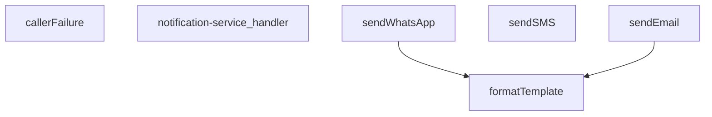

## Genel Bakış
Bu modül, bir Supabase edge function olarak HTTP isteklerini karşılayan merkezi bir bildirim servisidir. Tek bir giriş noktası üzerinden WhatsApp, SMS ve e-posta olmak üzere üç farklı iletişim kanalına mesaj gönderimi sağlar. Gelen isteklere göre uygun kanalı seçer, içerik şablonlarını dinamik verilerle doldurur ve mesajları ilgili harici servis sağlayıcıya iletir.

## Fonksiyon Grupları
### İstek Yönetimi ve Hata İşleme
Gelen HTTP isteklerini karşılayan ve işleyen ana modül giriş noktasıdır. İstek gövdesinden verileri çıkarır, kanal seçimini yapar ve hata durumlarında standart bir hata nesnesi döndürerek hata yönetimini sağlar.
- notification-service_handler, callerFailure

### Kanal Bazlı Mesaj Gönderimi
Her biri farklı bir iletişim protokolü ve harici servis entegrasyonu ile çalışan gönderim fonksiyonlarıdır. Kullanıcıya ait hedef numara/adresi ve mesaj içeriğini alarak doğrudan ilgili kanal üzerinden iletir,Opsiyonel olarak şablon ve yapılandırma alabilir.
- sendWhatsApp, sendSMS, sendEmail

### İçerik Hazırlama
Bildirim metinlerindeki dinamik yer tutucuları, gelen veri nesnesindeki değerlerle değiştirerek kişiselleştirilmiş mesajlar oluşturan yardımcı fonksiyondur. Mesaj gönderimi öncesinde iç调用 olarak kullanılır.
- formatTemplate

---

## AXIOMS – Mimari Varsayımlar

Bu modül, bildirim gönderimi için外部 servis sağlayıcılarına ve doğru yapılandırmaya bağımlıdır.

[Aksiyom 1]: Eğer `TwilioConfig` yapılandırması (`accountSid`, `authToken` vb.) sağlanmamışsa veya geçersizse, SMS mesajları gönderilemez ve `sendSMS` fonksiyonu hata fırlatır.

[Aksiyom 2]: Eğer e-posta için `config.apiKey` değeri sağlanmamışsa, `sendEmail` fonksiyonu e-posta gönderimi gerçekleştiremez.

[Aksiyom 3]: Eğer `_stockAlertTemplates` nesnesinde ilgili şablon anahtarı (key) tanımlı değilse, stok uyarısı bildirimi için formatlanacak geçerli bir şablon bulunamaz.

[Aksiyom 4]: Eğer `formatTemplate` fonksiyonuna verilen `template` dizgesinde `data` nesnesindeki anahtarlar ile eşleşen yer tutucu (placeholder) bulunmazsa, doldurulmamış yer tutucular metin olarak kalır (hata fırlatmaz ancak eksik bilgi iletilir).

[Aksiyom 5]: Eğer `notification-service_handler` fonksiyonuna geçerli bir HTTP istek nesnesi (`req`) iletilmemişse, modül geçerli bir `Response` üretemez.

[Aksiyom 6]: Eğer Twilio servisi (WhatsApp ve SMS için ortak yapılandırıcı) erişilebilir durumda değilse, hem `sendWhatsApp` hem de `sendSMS` fonksiyonları başarısız olur.

[Aksiyom 7]: Eğer `sendWhatsApp` fonksiyonunda `config` parametresi sağlanmamışsa (opsiyonel), varsayılan Twilio yapılandırmasının mevcut olması beklenir; aksi halde WhatsApp mesajı gönderilemez.

---

## FONKSİYON DETAYLARI

### callerFailure
**Ne yapar**: Bu fonksiyon, `notification-service` içindeki çağrıcı katmanlardan (örn. `serve` dekoratörü ile çağrılmış bir endpoint) fırlatılabilecek belirli hata türlerini, uygun HTTP durum kodlarına ve standart bir hata mesajı dizgesine dönüştürür. Amacı, düşük seviyeli hataları (örn. yanlış yapılandırma, profillerin bulunamaması) sunucunun dışarıya vereceği standart HTTP hatalarına haritalandırarak arayüzün tutarlı olmasını sağlamaktır.

**Nasıl yapar**: Fonksiyon, girdi olarak `unknown` tipinde bir hata nesnesi alır ve bu nesnenin `instanceof` kontrolüyle özel hata sınıflarına (`TenantMismatchError`, `CallerConfigError`, `CallerLookupError`) ait olup olmadığını test eder. Eşleşme sağlanırsa, o hataya karşılık gelen predefined bir `{ status, error }` objesini döndürür. Hiçbir sınıfla eşleşmeyen (tanınmayan) hatalar için `null` dönerek çağrıcının hata yönetiminin devam etmesine izin verir. Bu fonksiyon, T026-VH Adım 3'te belirtilen beş farklı bildirim ucunda birebir aynı mantıkla kullanılır.

**Parametreler**:
- error: unknown — Fonksiyona fırlatılmış olan hata nesnesi. Fonksiyon, bu nesnenin belirli hata sınıflarına (`TenantMismatchError`, `CallerConfigError`, `CallerLookupError`) ait olup olmadığını `instanceof` ile kontrol ederek işler.

**Dönüş**: { status: number; error: string } | null — Eğer hata, işlenen bir hata türüne aitse, `status` alanı HTTP durum kodunu (403, 500 veya 503), `error` alanı ise sabit bir hata mesajı dizgesini (`tenant_mismatch`, `CONFIG_MISSING` veya `profile_lookup_failed`) tutan bir nesne döner. İşlenemeyen veya tanımlanmayan hatalar için `null` döner.

### notification-service_handler
**Ne yapar**: Bu fonksiyon, HTTP isteklerini alarak bildirim servisinin ana işleyişini yöneten giriş noktasıdır (handler). Gelen isteğe göre doğru bildirim kanalını (WhatsApp, SMS veya e-posta) seçip ilgili gönderim fonksiyonunu çağırarak işlemi koordine eder.
**Nasıl yapar**: Fonksiyon, gelen HTTP isteğinin gövdesini (body) analiz eder, istenen bildirim türünü belirler ve gerekli parametreleri (alıcı, mesaj, şablon, yapılandırma bilgileri) çıkarır. Ardından, `sendWhatsApp`, `sendSMS` veya `sendEmail` fonksiyonlarından uygun olanını asenkron olarak çağırır ve sonucu döndürür. Hata yönetimi ve doğrulama mantığını içerir.
**Parametreler**:
- `req`: Request (veya benzeri bir nesne) — Gelen HTTP isteği nesnesi. Bildirim talebini ve gerekli tüm parametreleri taşır.
**Dönüş**: Response — İşlemin sonucunu (başarı/hata durumu) içeren HTTP yanıt nesnesi.

### sendWhatsApp
**Ne yapar**: Twilio API kullanarak belirli bir telefon numarasına WhatsApp mesajı gönderir.
**Nasıl yapar**: Fonksiyon, Twilio API'sine HTTP POST isteği göndererek mesajı iletir. İlk olarak yapılandırma (config) nesnesinde accountSid, authToken ve fromNumber alanlarının varlığını kontrol eder, eksiklik varsa hata fırlatır. Mesaj bir şablondan oluşturulacaksa `formatTemplate` fonksiyonu ile veri birleştirilir, aksi halde doğrudan message parametresi kullanılır. Hedef telefon numarası 'whatsapp:' ön ekini içermiyorsa eklenerek formatlanır. Twilio'nun Basic Auth mekanizması kullanılarak Base64 kodlanmış kimlik bilgileri Authorization başlığına eklenir. İstek gövdesi URLSearchParams formatında hazırlanır. Yanıt başarısız ise (response.ok false) hata mesajı ile birlikte exception fırlatılır.
**Parametreler**:
- `to`: string — Mesaj gönderilecek hedef telefon numarası (whatsapp: ön eki içerebilir).
- `message`: string — Gönderilecek ham metin mesajı (şablon kullanılmıyorsa doğrudan gönderilir).
- `template`: string (isteğe bağlı) — Mesaj içeriği için kullanılacak şablon stringi. `{{değişken}}` formatında yer tutucular içerebilir.
- `data`: TemplateData (isteğe bağlı) — Şablondaki yer tutucuların değerlerini içeren nesne. Anahtar-değer çiftlerinden oluşur.
- `config`: TwilioConfig (isteğe bağlı) — Twilio API kimlik bilgilerini ve gönderici numarasını içeren yapılandırma nesnesi. accountSid, authToken ve fromNumber alanlarını içermelidir.
**Dönüş**: Promise<any> — Twilio API'sinden dönen ham JSON yanıtını (başarılı mesaj gönderimi detaylarını) içerir.

### sendSMS
**Ne yapar**: Twilio API kullanarak belirli bir telefon numarasına standart SMS metin mesajı gönderir.
**Nasıl yapar**: Fonksiyon, Twilio API'sine HTTP POST isteği göndererek SMS'i iletir. İlk olarak yapılandırma (config) nesnesinde accountSid, authToken ve fromNumber alanlarının varlığını kontrol eder, eksiklik varsa hata fırlatır. Twilio'nun Basic Auth mekanizması kullanılarak Base64 kodlanmış kimlik bilgileri Authorization başlığına eklenir. İstek gövdesi URLSearchParams formatında hazırlanır. Yanıt başarısız ise (response.ok false) hata mesajı ile birlikte exception fırlatılır. Bu fonksiyon şablon desteği içermez, doğrudan message parametresini gönderir.
**Parametreler**:
- `to`: string — SMS gönderilecek hedef telefon numarası.
- `message`: string — Gönderilecek metin mesajı.
- `config`: TwilioConfig — Twilio API kimlik bilgilerini ve gönderici numarasını içeren yapılandırma nesnesi. accountSid, authToken ve fromNumber alanlarını içermelidir.
**Dönüş**: Promise<any> — Twilio API'sinden dönen ham JSON yanıtını (başarılı SMS gönderimi detaylarını) içerir.

### sendEmail
**Ne yapar**: Resend API kullanarak belirli bir e-posta adresine e-posta gönderir.
**Nasıl yapar**: Fonksiyon, Resend API'sine HTTP POST isteği göndererek e-postayı iletir. İlk olarak yapılandırma (config) nesnesinde apiKey alanının varlığını kontrol eder, eksiklik varsa hata fırlatır. Konu (subject) olarak veri nesnesindeki subject alanı veya varsayılan 'VentHub Bildirim' kullanılır. Mesaj bir şablondan oluşturulacaksa `formatTemplate` fonksiyonu ile veri birleştirilir, aksi halde doğrudan message parametresi kullanılır. Gönderici adresi (from) olarak öncelikle config.from, ardından data.emailFrom ve son olarak varsayılan 'VentHub <noreply@venthub.com>' kullanılır. Gövde JSON formatında oluşturulur, metin içeriği hem text hem de HTML (satır başları `<br>` ile değiştirilerek) olarak gönderilir. Yanıt başarısız ise (response.ok false) hata mesajı ile birlikte exception fırlatılır.
**Parametreler**:
- `to`: string — E-posta gönderilecek hedef e-posta adresi.
- `message`: string — Gönderilecek ham metin mesajı (şablon kullanılmıyorsa doğrudan gönderilir).
- `template`: string (isteğe bağlı) — E-posta içeriği için kullanılacak şablon stringi. `{{değişken}}` formatında yer tutucular içerebilir.
- `data`: TemplateData (isteğe bağlı) — Şablondaki yer tutucuların değerlerini ve e-posta konusu gibi ek alanları içeren nesne. subject ve emailFrom anahtarlarını içerebilir.
- `config`: { apiKey: string; from?: string } (isteğe bağlı) — Resend API anahtarını ve isteğe bağlı olarak gönderici e-posta adresini içeren yapılandırma nesnesi.
**Dönüş**: Promise<any> — Resend API'sinden dönen ham JSON yanıtını (başarılı e-posta gönderimi detaylarını) içerir.

### formatTemplate
**Ne yapar**: Verilen bir şablon string'indeki `{{anahtar}}` formatındaki yer tutucuları, sağlanan veri nesnesindeki karşılık gelen değerlerle değiştirerek formatlanmış bir metin döndürür.
**Nasıl yapar**: Fonksiyon, veri (data) nesnesi sağlanmamışsa veya boşsa şablonu olduğu gibi döndürür. Aksi halde, her bir veri anahtarı için bir RegExp nesnesi oluşturarak (`{{anahtar}}` formatında, 'g' bayrağı ile tüm eşleşmeleri bulacak şekilde) şablondaki yer tutucuları bulur ve String(data[key]) ile elde edilen değere dönüştürerek replace işlemi yaparak tüm eşleşmeleri değiştirir. Düzenlenmiş string'i döndürür.
**Parametreler**:
- `template`: string — Yer tutucular içeren şablon metni.
- `data`: TemplateData (isteğe bağlı) — Yer tutucuların değerlerini içeren nesne. Anahtarları `{{...}}` içindeki isimlere karşılık gelmelidir.
**Dönüş**: string — Yer tutucuların değerlerle değiştirildiği formatlanmış metin.

---

## İTHALATLAR (IMPORTS)
- import: ../_shared/cors.ts::getCorsHeaders
- import: ../_shared/tenant_config.ts::getTenantBranding
- import: https://deno.land/std@0.168.0/http/server.ts::serve

---

## INTERFACES

### NotificationRequest
- `type: 'whatsapp' | 'sms' | 'email'`
- `to: string`
- `message: string`
- `priority: 'low' | 'medium' | 'high' | 'critical'`
- `template?: string`
- `data?: TemplateData`
- `tenant_id?: string`

### _StockAlertData
- `productName: string`
- `currentStock: number`
- `threshold: number`
- `_productId: string`

### TwilioConfig
- `accountSid: string`
- `authToken: string`
- `fromNumber: string`

---

## TYPE ALIASES

### TemplateData
```typescript
type TemplateData = Record<string, string | number | boolean>
```

---

## SABİTLER
- **_stockAlertTemplates** (object) — `{
  whatsapp: {
    low_stock: `🚨 STOK UYARISI 🚨
    
📦 Ürün: {{productName}}...`

---

## AST POINTERS

### [N1_NASIL] AST Pointer: supabase/functions/notification-service/index.ts::callerFailure
- **params**: `(error: unknown)`
- **ic_degiskenler**: (yok — sadece parametre ve literal dönüşler kullanılır)
- **Dönüş**: `{ status: number; error: string } | null` — hatanın türüne göre HTTP status kodu ve hata mesajı döner; tanınamayan hatalarda `null` döner

---


## MERMAID CALL GRAPH


## NODE ID STANDARD

  file: supabase\functions\notification-service\index.ts
  function: supabase\functions\notification-service\index.ts::callerFailure
  function: supabase\functions\notification-service\index.ts::notification-service_handler
  function: supabase\functions\notification-service\index.ts::sendWhatsApp
  function: supabase\functions\notification-service\index.ts::sendSMS
  function: supabase\functions\notification-service\index.ts::sendEmail
  function: supabase\functions\notification-service\index.ts::formatTemplate

---

## DISA AKTARILANLAR (EXPORTS)
  export: callerFailure
  export: formatTemplate
  export: notification-service_handler
  export: sendEmail
  export: sendSMS
  export: sendWhatsApp