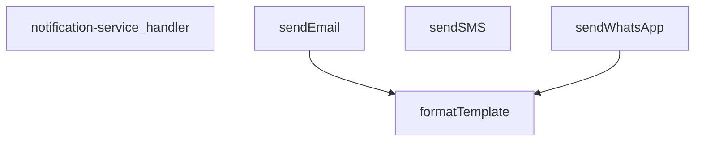

## Genel Bakış
Bu modül, bir Supabase edge function olarak HTTP isteklerini karşılayan merkezi bir bildirim servisidir. Tek bir giriş noktası üzerinden WhatsApp, SMS ve e-posta olmak üzere üç farklı iletişim kanalına mesaj gönderimi sağlar. Gelen isteklere göre uygun kanalı seçer, içerik şablonlarını dinamik verilerle doldurur ve mesajları ilgili harici servis sağlayıcıya (örn. Twilio) iletir.

## Fonksiyon Grupları
### İstek Yönetimi ve Yönlendirme
Modülün dışarıya açılan tek HTTP giriş noktasıdır. Gelen isteğin gövdesini okuyarak hedef kanalı, mesaj bilgilerini ve yapılandırma parametrelerini ayrıştırır, ardından işlmeyi ilgili gönderim fonksiyonuna devreder.
- notification-service_handler

### Kanal Bazlı Mesaj Gönderimi
Her biri farklı bir iletişim protokolü ve harici servis (Twilio, SendGrid vb.) ile entegre çalışan gönderim fonksiyonlarıdır. Kullanıcıya ait hedef numara/adresi ve mesaj içeriğini alarak doğrudan ilgili kanal üzerinden iletir. Opsiyonel olarak şablon ve yapılandırma alabilir.
- sendWhatsApp, sendSMS, sendEmail

### İçerik Hazırlama
Bildirim metinlerindeki dinamik yer tutucuları, gelen veri nesnesindeki değerlerle değiştirerek kişiselleştirilmiş mesajlar oluşturan yardımcı fonksiyondur. Kanal gönderim fonksiyonları tarafından mesaj iletimi öncesinde iç调用 olarak kullanılır.
- formatTemplate

---

## AXIOMS – Mimari Varsayımlar

Bu modül, merkezi bir bildirim servisi olarak çalışır ve üç farklı iletişim kanalına (WhatsApp, SMS, E-posta) mesaj yönlendirir. Doğru çalışması için aşağıdaki koşulların karşılanması gerekir.

---

**[Aksiyom 1]:** Eğer `sendSMS` çağrısında `config` (TwilioConfig) parametresi sağlanmazsa, SMS gönderimi başarısız olur.
> *Gerekçe:* Fonksiyon imzasında `config: TwilioConfig` zorunlu parametre olarak tanımlıdır (`?` işareti yoktur).

**[Aksiyom 2]:** Eğer `sendEmail` çağrısında `config` parametresi (`{ apiKey: string; from?: string }`) sağlanmazsa, e-posta gönderimi başarısız olur.
> *Gerekçe:* Fonksiyon imzasında `config` opsiyonel olarak işaretlenmemiştir; API key zorunludur.

**[Aksiyom 3]:** Eğer `sendEmail` çağrısında `config` içinde `apiKey` alanı verilmezse, e-posta servis sağlayıcıyaYetkilendirme yapılamaz ve gönderim başarısız olur.
> *Gerekçe:* `config` nesnesinde `from` opsiyonel (`?`) iken `apiKey` zorunludur.

**[Aksiyom 4]:** Eğer `sendWhatsApp`, `sendSMS` veya `sendEmail` fonksiyonlarından herhangi birine `to` parametresi verilmezse, ilgili kanal üzerinden mesaj gönderilemez.
> *Gerekçe:* Üç send fonksiyonunun da imzasında `to: string` zorunlu parametre olarak tanımlıdır.

**[Aksiyom 5]:** Eğer `sendWhatsApp`, `sendSMS` veya `sendEmail` fonksiyonlarından herhangi birine `message` parametresi verilmezse, ilgili kanal üzerinden mesaj gönderilemez.
> *Gerekçe:* Üç send fonksiyonunun da imzasında `message: string` zorunlu parametre olarak tanımlıdır.

**[Aksiyom 6]:** Eğer `formatTemplate` fonksiyonuna `data` parametresi verilmezse, şablon içinde dinamik alanlar (`{{değişken}}` benzeri) değişmeden olduğu gibi döner.
> *Gerekçe:* `data?: TemplateData` opsiyonel parametre olarak tanımlıdır; verilmediğinde değiştirilecek alan yoktur.

**[Aksiyom 7]:** Eğer `_stockAlertTemplates` nesnesi modül kapsamında tanımlı değilse (boşsa veya erişilemezse), stok alert ile ilgili şablon tabanlı bildirimler oluşturulamaz.
> *Gerekçe:* `_stockAlertTemplates` modül sabiti olarak tanımlıdır ve bildirim şablonları bu nesneden referansla beklenir.

**[Aksiyom 8]:** Eğer `notification-service_handler` fonksiyonuna geçilen `req` (HTTP Request) nesnesi geçersiz veya boşsa, handler fonksiyonu çalışamaz ve yanıt üretilmez.
> *Gerekçe:* Handler fonksiyonu tek giriş noktasıdır; istek gövdesi okunarak yönlendirme yapıldığından, geçerli bir request nesnesi şarttır.

**[Aksiyom 9]:** Eğer `sendWhatsApp` çağrısında `config` parametresi sağlanmazsa (opsiyonel olduğu için), varsayılan Twilio yapılandırması kullanılmalıdır; aksi halde WhatsApp gönderimi başarısız olur.
> *Gerekçe:* `config?: TwilioConfig` opsiyoneldir, ancak Twilio servis bağlantısı için bir config'e ihtiyaç vardır; modül içinde varsayılan bir config sunulmuyorsa gönderim yapılamaz.

---

## FONKSİYON DETAYLARI

### notification-service_handler
**Ne yapar**: Bu fonksiyon, HTTP isteklerini alarak bildirim servisinin ana işleyişini yöneten giriş noktasıdır (handler). Gelen isteğe göre doğru bildirim kanalını (WhatsApp, SMS veya e-posta) seçip ilgili gönderim fonksiyonunu çağırarak işlemi koordine eder.
**Nasıl yapar**: Fonksiyon, gelen HTTP isteğinin gövdesini (body) analiz eder, istenen bildirim türünü belirler ve gerekli parametreleri (alıcı, mesaj, şablon, yapılandırma bilgileri) çıkarır. Ardından, `sendWhatsApp`, `sendSMS` veya `sendEmail` fonksiyonlarından uygun olanını asenkron olarak çağırır ve sonucu döndürür. Hata yönetimi ve doğrulama mantığını içerir.
**Parametreler**:
- `req`: Request (veya benzeri bir nesne) — Gelen HTTP isteği nesnesi. Bildirim talebini ve gerekli tüm parametreleri taşır.
**Dönüş**: Response — İşlemin sonucunu (başarı/hata durumu) içeren HTTP yanıt nesnesi.

### sendWhatsApp
**Ne yapar**: Twilio API kullanarak belirli bir telefon numarasına WhatsApp mesajı gönderir.
**Nasıl yapar**: Fonksiyon, Twilio API'sine HTTP POST isteği göndererek mesajı iletir. İlk olarak yapılandırma (config) nesnesinde accountSid, authToken ve fromNumber alanlarının varlığını kontrol eder, eksiklik varsa hata fırlatır. Mesaj bir şablondan oluşturulacaksa `formatTemplate` fonksiyonu ile veri birleştirilir, aksi halde doğrudan message parametresi kullanılır. Hedef telefon numarası 'whatsapp:' ön ekini içermiyorsa eklenerek formatlanır. Twilio'nun Basic Auth mekanizması kullanılarak Base64 kodlanmış kimlik bilgileri Authorization başlığına eklenir. İstek gövdesi URLSearchParams formatında hazırlanır. Yanıt başarısız ise (response.ok false) hata mesajı ile birlikte exception fırlatılır.
**Parametreler**:
- `to`: string — Mesaj gönderilecek hedef telefon numarası (whatsapp: ön eki içerebilir).
- `message`: string — Gönderilecek ham metin mesajı (şablon kullanılmıyorsa doğrudan gönderilir).
- `template`: string (isteğe bağlı) — Mesaj içeriği için kullanılacak şablon stringi. `{{değişken}}` formatında yer tutucular içerebilir.
- `data`: TemplateData (isteğe bağlı) — Şablondaki yer tutucuların değerlerini içeren nesne. Anahtar-değer çiftlerinden oluşur.
- `config`: TwilioConfig (isteğe bağlı) — Twilio API kimlik bilgilerini ve gönderici numarasını içeren yapılandırma nesnesi. accountSid, authToken ve fromNumber alanlarını içermelidir.
**Dönüş**: Promise<any> — Twilio API'sinden dönen ham JSON yanıtını (başarılı mesaj gönderimi detaylarını) içerir.

### sendSMS
**Ne yapar**: Twilio API kullanarak belirli bir telefon numarasına standart SMS metin mesajı gönderir.
**Nasıl yapar**: Fonksiyon, Twilio API'sine HTTP POST isteği göndererek SMS'i iletir. İlk olarak yapılandırma (config) nesnesinde accountSid, authToken ve fromNumber alanlarının varlığını kontrol eder, eksiklik varsa hata fırlatır. Twilio'nun Basic Auth mekanizması kullanılarak Base64 kodlanmış kimlik bilgileri Authorization başlığına eklenir. İstek gövdesi URLSearchParams formatında hazırlanır. Yanıt başarısız ise (response.ok false) hata mesajı ile birlikte exception fırlatılır. Bu fonksiyon şablon desteği içermez, doğrudan message parametresini gönderir.
**Parametreler**:
- `to`: string — SMS gönderilecek hedef telefon numarası.
- `message`: string — Gönderilecek metin mesajı.
- `config`: TwilioConfig — Twilio API kimlik bilgilerini ve gönderici numarasını içeren yapılandırma nesnesi. accountSid, authToken ve fromNumber alanlarını içermelidir.
**Dönüş**: Promise<any> — Twilio API'sinden dönen ham JSON yanıtını (başarılı SMS gönderimi detaylarını) içerir.

### sendEmail
**Ne yapar**: Resend API kullanarak belirli bir e-posta adresine e-posta gönderir.
**Nasıl yapar**: Fonksiyon, Resend API'sine HTTP POST isteği göndererek e-postayı iletir. İlk olarak yapılandırma (config) nesnesinde apiKey alanının varlığını kontrol eder, eksiklik varsa hata fırlatır. Konu (subject) olarak veri nesnesindeki subject alanı veya varsayılan 'VentHub Bildirim' kullanılır. Mesaj bir şablondan oluşturulacaksa `formatTemplate` fonksiyonu ile veri birleştirilir, aksi halde doğrudan message parametresi kullanılır. Gönderici adresi (from) olarak öncelikle config.from, ardından data.emailFrom ve son olarak varsayılan 'VentHub <noreply@venthub.com>' kullanılır. Gövde JSON formatında oluşturulur, metin içeriği hem text hem de HTML (satır başları `<br>` ile değiştirilerek) olarak gönderilir. Yanıt başarısız ise (response.ok false) hata mesajı ile birlikte exception fırlatılır.
**Parametreler**:
- `to`: string — E-posta gönderilecek hedef e-posta adresi.
- `message`: string — Gönderilecek ham metin mesajı (şablon kullanılmıyorsa doğrudan gönderilir).
- `template`: string (isteğe bağlı) — E-posta içeriği için kullanılacak şablon stringi. `{{değişken}}` formatında yer tutucular içerebilir.
- `data`: TemplateData (isteğe bağlı) — Şablondaki yer tutucuların değerlerini ve e-posta konusu gibi ek alanları içeren nesne. subject ve emailFrom anahtarlarını içerebilir.
- `config`: { apiKey: string; from?: string } (isteğe bağlı) — Resend API anahtarını ve isteğe bağlı olarak gönderici e-posta adresini içeren yapılandırma nesnesi.
**Dönüş**: Promise<any> — Resend API'sinden dönen ham JSON yanıtını (başarılı e-posta gönderimi detaylarını) içerir.

### formatTemplate
**Ne yapar**: Verilen bir şablon string'indeki `{{anahtar}}` formatındaki yer tutucuları, sağlanan veri nesnesindeki karşılık gelen değerlerle değiştirerek formatlanmış bir metin döndürür.
**Nasıl yapar**: Fonksiyon, veri (data) nesnesi sağlanmamışsa veya boşsa şablonu olduğu gibi döndürür. Aksi halde, her bir veri anahtarı için bir RegExp nesnesi oluşturarak (`{{anahtar}}` formatında, 'g' bayrağı ile tüm eşleşmeleri bulacak şekilde) şablondaki yer tutucuları bulur ve String(data[key]) ile elde edilen değere dönüştürerek replace işlemi yaparak tüm eşleşmeleri değiştirir. Düzenlenmiş string'i döndürür.
**Parametreler**:
- `template`: string — Yer tutucular içeren şablon metni.
- `data`: TemplateData (isteğe bağlı) — Yer tutucuların değerlerini içeren nesne. Anahtarları `{{...}}` içindeki isimlere karşılık gelmelidir.
**Dönüş**: string — Yer tutucuların değerlerle değiştirildiği formatlanmış metin.

---

## İTHALATLAR (IMPORTS)
- import: ../_shared/cors.ts::getCorsHeaders
- import: ../_shared/tenant_config.ts::getTenantBranding
- import: ../_shared/tenant_config.ts::resolveTenantId
- import: https://deno.land/std@0.168.0/http/server.ts::serve
- import: https://esm.sh/@supabase/supabase-js@2.45.4::createClient

---

## INTERFACES

### NotificationRequest
- `type: 'whatsapp' | 'sms' | 'email'`
- `to: string`
- `message: string`
- `priority: 'low' | 'medium' | 'high' | 'critical'`
- `template?: string`
- `data?: TemplateData`
- `tenant_id?: string`

### _StockAlertData
- `productName: string`
- `currentStock: number`
- `threshold: number`
- `_productId: string`

### TwilioConfig
- `accountSid: string`
- `authToken: string`
- `fromNumber: string`

---

## TYPE ALIASES

### TemplateData
```typescript
type TemplateData = Record<string, string | number | boolean>
```

---

## SABİTLER
- **_stockAlertTemplates** (object) — `{
  whatsapp: {
    low_stock: `🚨 STOK UYARISI 🚨
    
📦 Ürün: {{productName}}...`

---

## AST POINTERS

### [N1_NASIL] AST Pointer: supabase/functions/notification-service/index.ts::notification-service_handler
- **params**: `(req)`
- **ic_degiskenler**:
  - `corsHeaders` — `getCorsHeaders(req)` çağrısıyla elde edilen CORS başlıkları nesnesi, tüm Response'lara eklenir
  - `supabaseUrl` — `Deno.env.get('SUPABASE_URL')` ile alınan Supabase proje URL'i
  - `serviceRoleKey` — `Deno.env.get('SUPABASE_SERVICE_ROLE_KEY')` ile alınan servis rol anahtarı, yetkilendirme ve rolleri kontrol etmek için kullanılır
  - `anonKey` — `Deno.env.get('SUPABASE_ANON_KEY')` ile alınan anonim istemci anahtarı, authClient oluşturmak için kullanılır
  - `body` — `req.json()` ile parse edilen request gövdesi, `NotificationRequest` tipinde
  - `type` — `body` destructuring'inden alınan bildirim kanalı tipi (whatsapp/sms/email)
  - `to` — `body` destructuring'inden alınan alıcı bilgisi
  - `message` — `body` destructuring'inden alınan mesaj içeriği
  - `priority` — `body` destructuring'inden alınan bildirim önceliği
  - `template` — `body` destructuring'inden alınan opsiyonel şablon adı
  - `data` — `body` destructuring'inden alınan opsiyonal şablon verileri
  - `tenantId` — `resolveTenantId(req, body)` ile çözümlenen kiracı ID'si
  - `branding` — `await getTenantBranding(tenantId)` ile asenkron olarak alınan kiracı marka bilgileri (emailFrom, brandName, brandPrimaryColor içerir)
  - `authHeader` — `req.headers.get('Authorization')` ile alınan yetkilendirme başlığı
  - `authClient` — `createClient(supabaseUrl, anonKey, { global: { headers: { Authorization: authHeader } } })` ile oluşturulan Supabase auth istemcisi
  - `user` — `await authClient.auth.getUser()` sonucundan alınan authenticate edilmiş kullanıcı nesnesi
  - `authErr` — `authClient.auth.getUser()` sonucundaki hata nesnesi
  - `roleCheck` — `fetch(...)` ile `user_profiles` tablosundan rol kontrolü yapan HTTP yanıt nesnesi
  - `arr` — `roleCheck.json()` ile parse edilen rol sorgusu sonucu dizisi
  - `role` — `arr[0]?.role` ile alınan kullanıcının rolü (admin veya superadmin olmalı)
  - `twilioAccountSid` — `Deno.env.get('TWILIO_ACCOUNT_SID')` ile alınan Twilio hesap SID'i
  - `twilioAuthToken` — `Deno.env.get('TWILIO_AUTH_TOKEN')` ile alınan Twilio auth token'ı
  - `twilioWhatsAppNumber` — `Deno.env.get('TWILIO_WHATSAPP_NUMBER')` ile alınan Twilio WhatsApp gönderici numarası
  - `twilioPhoneNumber` — `Deno.env.get('TWILIO_PHONE_NUMBER')` ile alınan Twilio SMS gönderici numarası
  - `resendApiKey` — `Deno.env.get('RESEND_API_KEY')` ile alınan Resend e-posta API anahtarı
  - `emailFrom` — `branding.emailFrom` değerinden alınan e-posta gönderici adresi
  - `notifyDebug` — `Deno.env.get('NOTIFY_DEBUG') === 'true'` kontrolü ile belirlenen debug modu bayrağı
  - `result` — `let` ile tanımlı, bildirim gönderme sonucunu tutan değişken
  - `isWhatsAppEnabled` — WhatsApp kanalının yapılandırma ile etkin olup olmadığını belirleyen boolean
  - `isSmsEnabled` — SMS kanalının yapılandırma ile etkin olup olmadığını belirleyen boolean
  - `isEmailEnabled` — E-posta kanalının yapılandırma ile etkin olup olmadığını belirleyen boolean
  - `error` — `catch` bloğunda yakalanan hata nesnesi
  - `msg` — `error instanceof Error` kontrolü ile çıkarılan hata mesajı stringi
- **Dönüş**: `Response` (başarılı Response veya hata Response'u)

---

### [N2_NASIL] AST Pointer: supabase/functions/notification-service/index.ts::sendWhatsApp
- **params**: `(to: string, message: string, template?: string, data?: TemplateData, config?: TwilioConfig)`
- **ic_degiskenler**:
  - `finalMessage` — `template` mevcutsa `formatTemplate(template, data)` ile formatlanmış mesaj; yoksa doğrudan `message` parametresi
  - `formattedTo` — `to`数値ının `whatsapp:` prefix ile formatlanmış hali; zaten `whatsapp:` ile başlıyorsa olduğu gibi bırakılır
  - `twilioUrl` — Twilio Messages API endpoint URL'i, `${config.accountSid}` ile dinamik oluşturulur
  - `credentials` — `${config.accountSid}:${config.authToken}` birleşiminin Base64 (`btoa`) ile kodlanmış hali, Basic Auth header'ı için kullanılır
  - `response` — Twilio API'ye POST isteği yapan `fetch` sonucu
  - `error` — `response.ok` false ise `response.text()` ile alınan hata metni stringi
- **Dönüş**: `response.json()` — Twilio API yanıt nesnesi

---

### [N3_NASIL] AST Pointer: supabase/functions/notification-service/index.ts::sendSMS
- **params**: `(to: string, message: string, config: TwilioConfig)`
- **ic_degiskenler**:
  - `twilioUrl` — Twilio Messages API endpoint URL'i, `${config.accountSid}` ile dinamik oluşturulur
  - `credentials` — `${config.accountSid}:${config.authToken}` birleşiminin Base64 (`btoa`) ile kodlanmış hali, Basic Auth header'ı için kullanılır
  - `response` — Twilio API'ye POST isteği yapan `fetch` sonucu
  - `error` — `response.ok` false ise `response.text()` ile alınan hata metni stringi
- **Dönüş**: `response.json()` — Twilio API yanıt nesnesi

---

### [N4_NASIL] AST Pointer: supabase/functions/notification-service/index.ts::sendEmail
- **params**: `(to: string, message: string, template?: string, data?: TemplateData, config?: { apiKey: string; from?: string })`
- **ic_degiskenler**:
  - `subject` — `data?.subject` varsa onu kullanır, yoksa varsayılan `'VentHub Bildirim'` stringi
  - `finalMessage` — `template` mevcutsa `formatTemplate(template, data)` ile formatlanmış mesaj; yoksa doğrudan `message` parametresi
  - `from` — Gönderici adresi; sırasıyla `config?.from`, `data?.emailFrom` veya varsayılan `'VentHub <noreply@venthub.com>'` değerini alır
  - `response` — Resend API'ye (`https://api.resend.com/emails`) POST isteği yapan `fetch` sonucu
  - `error` — `response.ok` false ise `response.text()` ile alınan hata metni stringi
- **Dönüş**: `response.json()` — Resend API yanıt nesnesi

---

### [N5_NASIL] AST Pointer: supabase/functions/notification-service/index.ts::formatTemplate
- **params**: `(template: string, data?: TemplateData)`
- **ic_degiskenler**:
  - `formatted` — `template`'in kopyası; `data` mevcutsa her bir placeholder `{{key}}` yerine gerçek değerlerle değiştirilerek oluşturulmuş formatlanmış string
  - `key` — `Object.keys(data)` döngüsündeki her bir anahtar, `forEach` callback parametresi olarak kullanılır
  - `placeholder` — `{{${key}}}` pattern'ini eşleştiren `RegExp` nesnesi, global flag ile tüm eşleşmeleri bulur
  - `value` — `String(data[key])` ile elde edilen, placeholder'ın yerine konacak değer stringi
- **Dönüş**: `string` — placeholder'ları gerçek değerlerle değiştirilmiş şablon stringi

---


## MERMAID CALL GRAPH


## NODE ID STANDARD

  file: supabase\functions\notification-service\index.ts
  function: supabase\functions\notification-service\index.ts::notification-service_handler
  function: supabase\functions\notification-service\index.ts::sendWhatsApp
  function: supabase\functions\notification-service\index.ts::sendSMS
  function: supabase\functions\notification-service\index.ts::sendEmail
  function: supabase\functions\notification-service\index.ts::formatTemplate

---

## DISA AKTARILANLAR (EXPORTS)
  export: formatTemplate
  export: notification-service_handler
  export: sendEmail
  export: sendSMS
  export: sendWhatsApp