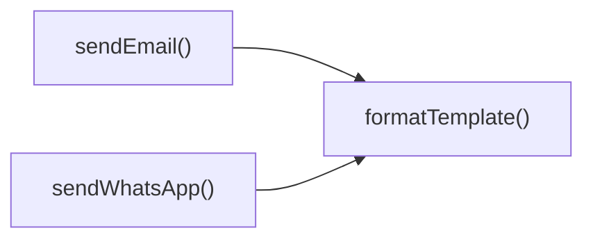

## Genel Bakış
Bu modül, bir Supabase fonksiyonu olarak gelen istekleri alıp, belirtilen kanallar üzerinden (WhatsApp, SMS, e‑posta) bildirim gönderme işlemini yürütür. İstek içeriğine göre uygun gönderme fonksiyonunu seçer, gerekirse şablonları doldurur ve yanıt döndürür.

## Fonksiyon Grupları
### Ana İşlem Kontrolü
Modülün giriş noktası olan fonksiyon, gelen HTTP isteklerini işler, hangi bildirim kanalının kullanılacağını belirler ve ilgili gönderme işlemini tetikler.
- notification-service_handler

### Bildirim Gönderme İşlemleri
Farklı iletişim kanallarına mesaj göndermekten sorumlu fonksiyonlar bulunur. Her biri, ilgili servise (Twilio için WhatsApp ve SMS, özel sağlayıcı için e‑posta) gerekli parametreleri hazırlayıp gönderimi gerçekleştirir.
- sendWhatsApp
- sendSMS
- sendEmail

### Şablon Hazırlama
Metin şablonlarının dinamik verilerle doldurulmasını sağlayan yardımcı fonksiyondur. Bildirim gönderme fonksiyonları, içerik kişiselleştirmesi gerektiğinde bu fonksiyonu kullanır.
- formatTemplate

---

## AXIOMS – Mimari Varsayımlar
Bu modülün doğru çalışması için harici iletişim servislerine (Twilio, E-posta sağlayıcısı) ait yapılandırma bilgilerinin ve geçerli istek parametrelerinin varlığı gereklidir.

[Aksiyom 1]: Eğer `notification-service_handler` fonksiyonuna geçerli bir istek (req) nesnesi sağlanmazsa, bildirim süreci başlatılamaz.
[Aksiyom 2]: Eğer `sendWhatsApp` veya `sendSMS` fonksiyonlarına geçerli bir `TwilioConfig` nesnesi (kimlik bilgilerini içeren) iletilmezse, ilgili mesaj gönderilemez.
[Aksiyom 3]: Eğer `sendEmail` fonksiyonunun `config` parametresi içinde `apiKey` değeri bulunamazsa, e-posta gönderimi gerçekleştirilemez.
[Aksiyom 4]: Eğer `formatTemplate` fonksiyonu için istenen şablon tanımlı kaynaklarda (örn: `_stockAlertTemplates`) mevcut değilse, mesaj formatlaması başarısız olur.

---

## FONKSIYON DETAYLARI

### notification-service_handler  
**Ne yapar**: Supabase Edge Function için ana giriş noktasıdır. Gelen HTTP isteğini alır, kanalına (WhatsApp, SMS, e-posta) göre yönlendirir ve ilgili servisi çağırır.  
**Nasıl yapar**: İstekteki `channel` veya `type` alanını analiz ederek uygun gönderme fonksiyonunu (`sendWhatsApp`, `sendSMS`, `sendEmail`) seçer; şablonlu mesajları `formatTemplate` ile işler. Hata durumlarını yakalayarak uygun HTTP yanıtı döndürür.  
**Parametreler**:  
- `req: Request` — Gelen HTTP isteği; body’sinde `to`, `message`, `template`, `data` gibi alanlar bulunur.  
**Dönüş**: `Response` — Başarılı durumda mesajın JSON çıktısını, hata durumunda ise hatayı içeren bir HTTP yanıtı.

### sendWhatsApp  
**Ne yapar**: Twilio API üzerinden WhatsApp mesajı gönderir. İsteğe bağlı şablon desteği sunar.  
**Nasıl yapar**: Sağlanan `config` ile Twilio istemcisi oluşturur; `template` varsa `formatTemplate` ile mesajı biçimlendirir. POST isteğiyle Twilio’nun WhatsApp mesajlaşma uç noktasına gönderir ve JSON yanıtını döndürür.  
**Parametreler**:  
- `to: string` — Alıcı numarası (uluslararası format, “whatsapp:+90…” gibi).  
- `message: string` — Düz metin mesaj içeriği (şablon kullanılmazsa gönderilir).  
- `template?: string` — Kullanılacak şablonun adı; belirtilirse `_data` ile birleşir.  
- `_data?: TemplateData` — Şablon değişkenlerini içeren sözlük; `template` ile birlikte kullanılır.  
- `config?: TwilioConfig` — Twilio hesap bilgileri (`accountSid`, `authToken`, `from`).  
**Dönüş**: `Promise<any>` — Twilio API’sinden gelen JSON yanıtı (başarılıysa mesaj SID’si vb.).

### sendSMS  
**Ne yapar**: Twilio API aracılığıyla SMS gönderir.  
**Nasıl yapar**: `config` bilgileriyle Twilio istemcisini yapılandırır; mesajı metin olarak alır ve SMS uç noktasına POST eder. Yanıtın JSON hâlini döndürür.  
**Parametreler**:  
- `to: string` — Alıcı telefon numarası (ör. “+905551234567”).  
- `message: string` — Gönderilecek SMS metni.  
- `config: TwilioConfig` — Twilio kimlik bilgileri (`accountSid`, `authToken`, `from`).  
**Dönüş**: `Promise<any>` — Twilio API yanıtının JSON nesnesi.

### sendEmail  
**Ne yapar**: Bir e-posta servisi (ör. SendGrid, SMTP) üzerinden e-posta gönderir.  
**Nasıl yapar**: `config` içinde belirtilen API anahtarı ve gönderici adresini kullanarak bir HTTP POST isteği hazırlar; `template` varsa `formatTemplate` ile içerik oluşturulur. E-posta servisinin ilgili uç noktasına gönderir ve sonucu JSON olarak alır.  
**Parametreler**:  
- `to: string` — Alıcı e-posta adresi.  
- `message: string` — E-posta gövdesi (düz metin veya HTML).  
- `template?: string` — Kullanılacak şablon adı (isteğe bağlı).  
- `_data?: TemplateData` — Şablona eklenecek değişken değerleri.  
- `config?: { apiKey: string; from?: string }` — E-posta servisinin API anahtarı ve isteğe bağlı gönderici adresi.  
**Dönüş**: `Promise<any>` — E-posta servisinden dönen JSON yanıtı.

### formatTemplate  
**Ne yapar**: Bir şablon dizisi içindeki `{{değişken}}` yer tutucularını `_data` sözlüğündeki değerlerle değiştirir.  
**Nasıl yapar**: `template` üzerinde düzenli ifade veya string replace ile her anahtarı `_data`’daki karşılığıyla değiştirir. Şablonda tanımlı olmayan anahtarlar boş bırakılır.  
**Parametreler**:  
- `template: string` — Değişken yer tutucuları içeren şablon metni.  
- `_data: TemplateData` — Anahtar-değer çiftlerinden oluşan veri sözlüğü.  
**Dönüş**: `string` — Değişkenlerin doldurulmuş hâliyle oluşan son metin.

---

## INTERFACES

### NotificationRequest
- `type: 'whatsapp' | 'sms' | 'email'`
- `to: string`
- `message: string`
- `priority: 'low' | 'medium' | 'high' | 'critical'`
- `template?: string`
- `_data?: TemplateData`

### _StockAlertData
- `productName: string`
- `currentStock: number`
- `threshold: number`
- `_productId: string`

### TwilioConfig
- `accountS_id: string`
- `authToken: string`
- `fromNumber: string`

---

## TYPE ALIASES

### TemplateData
```typescript
type TemplateData = Record<string, string | number | boolean>
```

---

## SABİTLER
- **_stockAlertTemplates** (object) — `{
  whatsapp: {
    low_stock: `🚨 STOK UYARISI 🚨
    
📦 Ürün: {{productNa...`

---

## AST POINTERS

### [N1_NASIL] AST Pointer: C:\Users\alize\venthub-hvac\supabase\functions\notification-service\index.ts::notification-service_handler
- **params**: req — Gelen HTTP istek nesnesi
- **ic_degiskenler**:
  - `corsHeaders` — CORS politikası tanımlayan header nesnesi, tüm cevaplara eklenir
  - `supabaseUrl` — Ortam değişkeninden alınan Supabase proje URL'si
  - `serviceRoleKey` — Ortam değişkeninden alınan Supabase servis rolü yetki anahtarı
  - `anonKey` — Ortam değişkeninden alınan Supabase anonim kullanıcı anahtarı
  - `authHeader` — İstekten alınan Authorization başlığı, yetki doğrulama için kullanılır
  - `authClient` — Kullanıcı kimlik doğrulaması için oluşturulan Supabase istemcisi
  - `user` — Kimliği doğrulanan oturum açmış kullanıcı nesnesi
  - `authErr` — Kullanıcı doğrulaması sırasında oluşabilecek hata nesnesi
  - `roleCheck` - Kullanıcının admin rolü olup olmadığını kontrol etmek için yapılan fetch isteği cevabı
  - `arr` — roleCheck cevabından dönen JSON verisi, kullanıcı profilini içerir
  - `arr[0]` — Kullanıcının profil verisini içeren ilk dizi elemanı
  - `role` — Kullanıcının sistemdeki rolü (admin/superadmin/diğer)
  - `body` — İstekten alınan JSON formatında bildirim isteği nesnesi
  - `type` — Bildirim kanalı türü (whatsapp/sms/email)
  - `to` — Bildirimin gönderileceği alıcı adresi/numarası
  - `message` — Gönderilecek ham bildirim metni
  - `priority` — Bildirimin öncelik seviyesi
  - `template` — Kullanılacak şablon metni, varsa
  - `_data` — Şablon doldurulacak veriler nesnesi
  - `twilioAccountSid` — Ortam değişkeninden alınan Twilio hesap kimliği
  - `twilioAuthToken` — Ortam değişkeninden alınan Twilio yetkilendirme anahtarı
  - `twilioWhatsAppNumber` — Ortam değişkeninden alınan Twilio WhatsApp gönderim numarası
  - `twilioPhoneNumber` — Ortam değişkeninden alınan Twilio SMS gönderim numarası
  - `resendApiKey` — Ortam değişkeninden alınan Resend e-posta servisi API anahtarı
  - `emailFrom` — E-postaların gönderileceği varsayılan adres, ortam değişkeninden alınır
  - `notifyDebug` — Hata ayıklama modu durumu, ortam değişkeninden alınan boolean değer
  - `result` — Bildirim gönderim işleminin sonucunu saklayan nesne
  - `isWhatsAppEnabled` — WhatsApp kanalının kullanılabilir olup olmadığını belirten bayrak
  - `isSmsEnabled` — SMS kanalının kullanılabilir olup olmadığını belirten bayrak
  - `isEmailEnabled` — E-posta kanalının kullanılabilir olup olmadığını belirten bayrak
  - `error` — try bloğu içinde oluşan tüm hataları yakalayan hata nesnesi
  - `msg` — Yakalanan hatanın okunabilir mesajı
- **Dönüş**: HTTP Response nesnesi, başarı/hata durumu ve JSON verisi içerir

### [N2_NASIL] AST Pointer: C:\Users\alize\venthub-hvac\supabase\functions\notification-service\index.ts::sendWhatsApp
- **params**: to (alıcı WhatsApp numarası), message (gönderilecek mesaj), template (şablon metni, opsiyonel), _data (şablon verileri, opsiyonel), config (Twilio yapılandırma nesnesi, opsiyonel)
- **ic_degiskenler**:
  - `config?.accountSid` — Twilio hesap kimliği, yapılandırma nesnesinden alınır
  - `config?.authToken` — Twilio yetki anahtarı, yapılandırma nesnesinden alınır
  - `config?.fromNumber` — Gönderici WhatsApp numarası, yapılandırma nesnesinden alınır
  - `finalMessage` — Şablon işlendikten sonra oluşan son gönderilecek mesaj
  - `formattedTo` — WhatsApp formatına uygun hale getirilmiş alıcı numarası (whatsapp: öneki eklenmiş)
  - `twilioUrl` — Twilio Mesajlar API'sinin tam adresi
  - `credentials` — Base64 kodlu Twilio hesap kimliği ve yetki anahtarı, temel yetkilendirme için kullanılır
  - `response` — Twilio API'ye yapılan fetch isteğinin cevap nesnesi
  - `error` — API isteği başarısız olursa döndürülen hata metni
- **Dönüş**: Twilio API'den dönen JSON cevabı

### [N3_NASIL] AST Pointer: C:\Users\alize\venthub-hvac\supabase\functions\notification-service\index.ts::sendSMS
- **params**: to (alıcı telefon numarası), message (gönderilecek SMS metni), config (Twilio yapılandırma nesnesi)
- **ic_degiskenler**:
  - `config?.accountSid` — Twilio hesap kimliği, yapılandırma nesnesinden alınır
  - `config?.authToken` — Twilio yetki anahtarı, yapılandırma nesnesinden alınır
  - `config?.fromNumber` — Gönderici telefon numarası, yapılandırma nesnesinden alınır
  - `twilioUrl` — Twilio Mesajlar API'sinin tam adresi
  - `credentials` — Base64 kodlu Twilio hesap kimliği ve yetki anahtarı, temel yetkilendirme için kullanılır
  - `response` — Twilio API'ye yapılan fetch isteğinin cevap nesnesi
  - `error` — API isteği başarısız olursa döndürülen hata metni
- **Dönüş**: Twilio API'den dönen JSON cevabı

### [N4_NASIL] AST Pointer: C:\Users\alize\venthub-hvac\supabase\functions\notification-service\index.ts::sendEmail
- **params**: to (alıcı e-posta adresi), message (gönderilecek e-posta metni), template (şablon metni, opsiyonel), _data (şablon verileri, opsiyonel), config (Resend e-posta servisi yapılandırma nesnesi, opsiyonel)
- **ic_degiskenler**:
  - `config?.apiKey` — Resend servisi API anahtarı, yapılandırma nesnesinden alınır
  - `subject` — E-postanın konu başlığı, _data'den alınır veya varsayılan değer kullanılır
  - `finalMessage` — Şablon işlendikten sonra oluşan son gönderilecek e-posta metni
  - `from` — Gönderici e-posta adresi, yapılandırma veya varsayılan değerden alınır
  - `_data?.emailFrom` — Gönderici adresi, istek verisinden alınabilir
  - `response` — Resend API'ye yapılan fetch isteğinin cevap nesnesi
  - `error` — API isteği başarısız olursa döndürülen hata metni
- **Dönüş**: Resend API'den dönen JSON cevabı

### [N5_NASIL] AST Pointer: C:\Users\alize\venthub-hvac\supabase\functions\notification-service\index.ts::formatTemplate
- **params**: template (işlenecek şablon metni), _data (şablon içindeki yer tutucuları dolduracak veriler nesnesi)
- **ic_degiskenler**:
  - `formatted` — Şablonun tüm yer tutucuları doldurulduktan sonra oluşan son metin
  - `key` — _data nesnesinin her bir anahtarı, döngü içinde işlenir
  - `placeholder` — Şablon içindeki {{anahtar}} desenini eşleştiren regex nesnesi
  - `value` — Yer tutucunun yerine yazılacak string'e çevrilmiş veri değeri
- **Dönüş**: Tüm yer tutucuları doldurulmuş son string metin

---

## Çağrı Haritası

### Dışarıya Çağrılar (Outgoing)
- `sendWhatsApp()` fonksiyonu, şablonu hazırlamak için `formatTemplate()` fonksiyonunu çağırır.  
- `sendEmail()` fonksiyonu, aynı şekilde şablonu hazırlamak için `formatTemplate()` fonksiyonunu çağırır.

### Dışarıdan Çağrılanlar (Incoming)
- Verilen veri setinde bu modülü çağıran dış bir fonksiyon veya modül bulunmamaktadır.

### İç İçe Fonksiyonlar (Nested)
- Yok

---

## DOSYA-İÇİ ÇAĞRI GRAFİĞİ
  sendEmail() → formatTemplate()
  sendWhatsApp() → formatTemplate()



---

## NODE ID STANDARD

  file: supabase\functions\notification-service\index.ts
  function: supabase\functions\notification-service\index.ts::notification-service_handler
  function: supabase\functions\notification-service\index.ts::sendWhatsApp
  function: supabase\functions\notification-service\index.ts::sendSMS
  function: supabase\functions\notification-service\index.ts::sendEmail
  function: supabase\functions\notification-service\index.ts::formatTemplate

---

## DISA AKTARILANLAR (EXPORTS)
  export: formatTemplate
  export: notification-service_handler
  export: sendEmail
  export: sendSMS
  export: sendWhatsApp