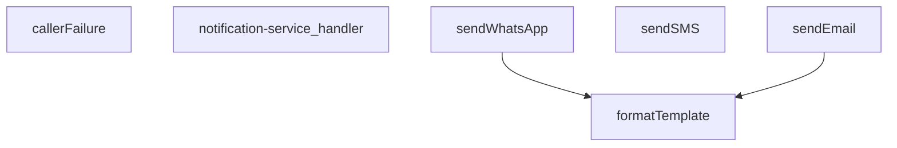

## Genel Bakış

Bu modül, Supabase Edge Function olarak çalışan bir bildirim servisidir. Gelen HTTP isteklerini işleyerek WhatsApp, SMS ve e-posta olmak üzere üç farklı kanal üzerinden bildirim gönderimini yönetir. Şablon tabanlı mesaj oluşturma ve hata yönetimi gibi yardımcı işlevler de içerir.

## Fonksiyon Grupları

### Ana İşlemci

Gelen HTTP isteklerini karşılayan ve uygun bildirim kanalına yönlendiren giriş noktasıdır. Supabase'in `serve` dekoratörü ile tanımlanmış tek handler fonksiyonu içerir.

- notification-service_handler

### Bildirim Göndericileri

Farklı iletişim kanalları üzerinden mesaj gönderimini gerçekleştiren fonksiyonlardır. Her biri kendi kanalına özgü yapılandırma parametreleri alır; WhatsApp ve SMS TwilioConfig kullanırken e-posta kendi apiKey yapılandırmasını gerektirir. Şablon ve veri parametreleri opsiyoneldir.

- sendWhatsApp, sendSMS, sendEmail

### Yardımcı İşlevler

Şablon formatlama ve hata işleme gibi destekleyici görevleri yerine getirir. `formatTemplate`, şablon dizgisi içindeki yer tutucuları veri ile doldurur; `callerFailure` ise hata durumlarını standart bir yanıt yapısına dönüştürür.

- formatTemplate, callerFailure

---

## AXIOMS – Mimari Varsayımlar
- Bu modül davranışsal mantık içermez (salt veri / konfigürasyon / tip tanımı).
- [Aksiyom 1]: Modülün dışa açtığı yapı (anahtar kümesi / şema) bir sözleşmedir; tüketiciler bu sabit yapıya bağlıdır — kırıcı değişiklik tüm tüketicileri etkiler.
- [Aksiyom 2]: Bir öğe ekleme/çıkarma yapısal-uyumlu olmalı; ilgili tipler ve seçiciler aynı commit'te güncel tutulmalıdır.

---

## FONKSİYON DETAYLARI

### callerFailure
**Ne yapar**: Kapı hatalarını (gateway errors) HTTP durum kodlarına eşleyen bir hata haritalama fonksiyonudur. Üç farklı hata türünü birebir karşılık gelen HTTP durum kodlarına dönüştürür ve tanımlanmamış hatalar için `null` döndürür.

**Nasıl yapar**: Gelen `error` parametresinin `instanceof` kontrolü ile türünü belirler. `TenantMismatchError` durumunda 403, `CallerConfigError` durumunda 500, `CallerLookupError` durumunda 503 HTTP durum kodu ve karşılık gelen hata mesajı içeren bir nesne döndürür. Bu hata sınıflarından hiçbiri eşleşmezse `null` döner; bu durum çağırıcının hatayı kendi başına ele alması gerektiği anlamına gelir.

**Parametreler**:
- error: unknown — eşlenecek hata nesnesi. Türü bilinmediği için `unknown` olarak tanımlanmıştır.

**Dönüş**: `{ status: number; error: string } | null` — Eşleşme varsa HTTP durum kodu ve hata tanımlayıcısı içeren nesne; eşleşme yoksa `null`.

### notification-service_handler
**Ne yapar**: Geliştirildi ancak detay üretilemedi.

### sendWhatsApp
**Ne yapar**: Geliştirildi ancak detay üretilemedi.

### sendSMS
**Ne yapar**: Geliştirildi ancak detay üretilemedi.

### sendEmail
**Ne yapar**: Geliştirildi ancak detay üretilemedi.

### formatTemplate
**Ne yapar**: Geliştirildi ancak detay üretilemedi.

---

## İTHALATLAR (IMPORTS)
- import: ../_shared/cors.ts::getCorsHeaders
- import: ../_shared/tenant_config.ts::getTenantBranding
- import: https://deno.land/std@0.168.0/http/server.ts::serve

---

## INTERFACES

### NotificationRequest
- `type: 'whatsapp' | 'sms' | 'email'`
- `to: string`
- `message: string`
- `priority: 'low' | 'medium' | 'high' | 'critical'`
- `template?: string`
- `data?: TemplateData`
- `tenant_id?: string`

### _StockAlertData
- `productName: string`
- `currentStock: number`
- `threshold: number`
- `_productId: string`

### TwilioConfig
- `accountSid: string`
- `authToken: string`
- `fromNumber: string`

---

## TYPE ALIASES

### TemplateData
```typescript
type TemplateData = Record<string, string | number | boolean>
```

---

## SABİTLER
- **_stockAlertTemplates** (object) — `{
  whatsapp: {
    low_stock: `🚨 STOK UYARISI 🚨
    
📦 Ürün: {{productNa...`

---

## AST POINTERS

### [N1_NASIL] AST Pointer: supabase/functions/notification-service/index.ts::callerFailure
- **params**: `error: unknown`
- **ic_degiskenler**: yok
- **Dönüş**: `{ status: number; error: string } | null` — `error` bir `TenantMismatchError` ise `{ status: 403, error: 'tenant_mismatch' }`, `CallerConfigError` ise `{ status: 500, error: 'CONFIG_MISSING' }`, `CallerLookupError` ise `{ status: 503, error: 'profile_lookup_failed' }`, diğer durumlarda `null` döner

### [N2_NASIL] AST Pointer: supabase/functions/notification-service/index.ts::notification-service_handler
- **params**: `req`
- **ic_degiskenler**:
  - `corsHeaders` — `getCorsHeaders(req)` ile elde edilen CORS başlıkları nesnesi
  - `body` — `req.json().catch(()=>({}))` ile parse edilen istek gövdesi, `NotificationRequest` tipinde
  - `type` — `body`'den destructure edilen bildirim kanalı türü (`'whatsapp'`, `'sms'`, `'email'`)
  - `to` — `body`'den destructure edilen alıcı adresi/numarası
  - `message` — `body`'den destructure edilen bildirim mesajı
  - `priority` — `body`'den destructure edilen öncelik değeri
  - `template` — `body`'den destructure edilen opsiyonel şablon dizesi
  - `data` — `body`'den destructure edilen opsiyonel şablon verisi (`TemplateData`)
  - `ctx` — `resolveCaller(req, body)` ile elde edilen `CallerContext` nesnesi; çağıranın türünü (`kind`), rolünü (`role`) ve kiracı kimliğini (`tenantId`) içerir
  - `failure` — `callerFailure(err)` ile elde edilen hata sınıflandırma sonucu; `null` ise hata bilinmiyor demektir
  - `tenantId` — `ctx.tenantId`'den alınan doğrulanmış kiracı kimliği
  - `branding` — `getTenantBranding(tenantId)` ile elde edilen kiracı marka bilgileri nesnesi; `emailFrom`, `brandName`, `brandPrimaryColor` alanlarını içerir
  - `twilioAccountSid` — `Deno.env.get('TWILIO_ACCOUNT_SID')` ile alınan Twilio hesap SID'si
  - `twilioAuthToken` — `Deno.env.get('TWILIO_AUTH_TOKEN')` ile alınan Twilio kimlik doğrulama token'ı
  - `twilioWhatsAppNumber` — `Deno.env.get('TWILIO_WHATSAPP_NUMBER')` ile alınan WhatsApp gönderici numarası
  - `twilioPhoneNumber` — `Deno.env.get('TWILIO_PHONE_NUMBER')` ile alınan SMS gönderici numarası
  - `resendApiKey` — `Deno.env.get('RESEND_API_KEY')` ile alınan Resend e-posta servisi API anahtarı
  - `emailFrom` — `branding.emailFrom`'dan alınan e-posta gönderici adresi
  - `notifyDebug` — `Deno.env.get('NOTIFY_DEBUG') === 'true'` kontrolü; `true` ise hata ayıklama uyarıları konsola yazılır
  - `result` — bildirim gönderme işleminin sonucu; varsayılan `{ success: false, note: undefined }`, switch bloğunda her kanal için güncellenir
  - `isWhatsAppEnabled` — `twilioAccountSid`, `twilioAuthToken` ve `twilioWhatsAppNumber` üçünün de varlığını kontrol eden boolean
  - `isSmsEnabled` — `twilioAccountSid`, `twilioAuthToken` ve `twilioPhoneNumber` üçünün de varlığını kontrol eden boolean
  - `isEmailEnabled` — `resendApiKey` varlığını kontrol eden boolean
  - `msg` — catch bloğunda `error instanceof Error ? error.message : 'Unknown error'` ile elde edilen hata mesajı dizesi
- **Dönüş**: `Response` — başarılıysa 200 ve `{ success, result, type, priority, timestamp }` JSON gövdesi; yetki reddedilirse 401/403; yöntem uyumsuzsa 405; hata durumunda 500

### [N3_NASIL] AST Pointer: supabase/functions/notification-service/index.ts::sendWhatsApp
- **params**: `to: string`, `message: string`, `template?: string`, `data?: TemplateData`, `config?: TwilioConfig`
- **ic_degiskenler**:
  - `finalMessage` — `template` varsa `formatTemplate(template, data)` ile üretilen dize, yoksa doğrudan `message`
  - `formattedTo` — `to`'nun `whatsapp:` ön eki içerip içermediğine göre düzenlenen alıcı numarası; içermiyorsa `whatsapp:${to}` eklenir
  - `twilioUrl` — `config.accountSid` ile oluşturulan Twilio Messages API URL'si
  - `credentials` — `btoa(`${config.accountSid}:${config.authToken}`)` ile oluşturulan Base64 kimlik bilgisi dizesi
  - `response` — `fetch` ile Twilio API'ye yapılan POST isteğinin yanıtı
  - `error` — `response.text()` ile alınan hata mesajı; `response.ok` false ise fırlatılır
- **Dönüş**: `Promise<any>` — Twilio API yanıtının JSON.parse edilmiş hali

### [N4_NASIL] AST Pointer: supabase/functions/notification-service/index.ts::sendSMS
- **params**: `to: string`, `message: string`, `config: TwilioConfig`
- **ic_degiskenler**:
  - `twilioUrl` — `config.accountSid` ile oluşturulan Twilio Messages API URL'si
  - `credentials` — `btoa(`${config.accountSid}:${config.authToken}`)` ile oluşturulan Base64 kimlik bilgisi dizesi
  - `response` — `fetch` ile Twilio API'ye yapılan POST isteğinin yanıtı
  - `error` — `response.text()` ile alınan hata mesajı; `response.ok` false ise fırlatılır
- **Dönüş**: `Promise<any>` — Twilio API yanıtının JSON.parse edilmiş hali

### [N5_NASIL] AST Pointer: supabase/functions/notification-service/index.ts::sendEmail
- **params**: `to: string`, `message: string`, `template?: string`, `data?: TemplateData`, `config?: { apiKey: string; from?: string }`
- **ic_degiskenler**:
  - `subject` — `data?.subject` varsa onu kullanır, yoksa `'VentHub Bildirim'` varsayılan değerini alır
  - `finalMessage` — `template` varsa `formatTemplate(template, data)` ile üretilen dize, yoksa doğrudan `message`
  - `from` — `config?.from` varsa onu kullanır, yoksa `data?.emailFrom`, o da yoksa `'VentHub <noreply@venthub.com>'` varsayılan değerini alır
  - `response` — `fetch` ile Resend API'ye (`https://api.resend.com/emails`) yapılan POST isteğinin yanıtı
  - `error` — `response.text()` ile alınan hata mesajı; `response.ok` false ise fırlatılır
- **Dönüş**: `Promise<any>` — Resend API yanıtının JSON.parse edilmiş hali

### [N6_NASIL] AST Pointer: supabase/functions/notification-service/index.ts::formatTemplate
- **params**: `template: string`, `data?: TemplateData`
- **ic_degiskenler**:
  - `formatted` — `template`'in kopyası; `data` içindeki her anahtar için `{{anahtar}}` yer tutucuları ilgili değerle değiştirilir
  - `key` — `Object.keys(data)` ile elde edilen dizi üzerinde döngüdeki mevcut anahtar dizesi
  - `placeholder` — `` new RegExp(`{{${key}}}`, 'g') `` ile oluşturulan global RegExp nesnesi; `{{key}}` kalıbını eşleştirir
  - `value` — `String(data[key])` ile elde edilen, mevcut anahtara karşılık gelen değerin dize temsili
- **Dönüş**: `string` — tüm yer tutucuları değiştirilmiş nihai dize

---


## MERMAID CALL GRAPH


## NODE ID STANDARD

  file: index.ts
  function: index.ts::callerFailure
  function: index.ts::notification-service_handler
  function: index.ts::sendWhatsApp
  function: index.ts::sendSMS
  function: index.ts::sendEmail
  function: index.ts::formatTemplate

---

## DISA AKTARILANLAR (EXPORTS)
  export: callerFailure
  export: formatTemplate
  export: notification-service_handler
  export: sendEmail
  export: sendSMS
  export: sendWhatsApp