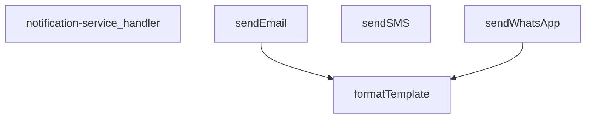

## Genel Bakış
Bu modül, bir Supabase fonksiyonu olarak dışarıdan gelen HTTP isteklerini karşılar ve belirtilen kanallar (WhatsApp, SMS, e‑posta) üzerinden bildirim gönderilmesini sağlar. İstek parametrelerine göre uygun iletişim kanalını seçer, gerekirse şablonları dinamik verilerle doldurur ve ilgili servisi çağırarak mesajı iletir.

## Fonksiyon Grupları
### Ana İşlem Kontrolü
Gelen HTTP isteklerini işleyen giriş noktasıdır. İstek içeriğini analiz ederek hangi bildirim kanalının kullanılacağını belirler ve ilgili gönderme fonksiyonunu çağırır.
- notification-service_handler

### Bildirim Gönderme İşlemleri
Farklı iletişim kanalları üzerinden mesaj göndermekten sorumlu fonksiyonlardır. Her biri ilgili servis sağlayıcısına (Twilio WhatsApp/SMS, e‑posta API'si) istenen parametreleri ileterek gönderimi gerçekleştirir.
- sendWhatsApp, sendSMS, sendEmail

### Şablon Hazırlama
Metin şablonlarının dinamik verilerle doldurulmasını sağlayan yardımcı fonksiyondur. Bildirim içerikleri kişiselleştirilmesi gerektiğinde gönderme fonksiyonları tarafından kullanılır.
- formatTemplate

---

## AXIOMS – Mimari Varsayımlar

Bu modül, Twilio tabanlı WhatsApp/SMS ve özel servisli e-posta gönderimi yapan bir Supabase fonksiyonudur. Aşağıdaki varsayımlar fonksiyon imzalarından türetilmiştir.

---

**[Aksiyom 1]:** Eğer `sendSMS` çağrısında `config` parametresi (TwilioConfig) sağlanmazsa, SMS gönderimi başarısız olur.

*Gerekçe:* `sendSMS` imzasında `config?:` değil, `config: TwilioConfig` olarak zorunlu tanımlanmıştır.

---

**[Aksiyom 2]:** Eğer `sendEmail` çağrısında `config` parametresi sağlanmazsa ve modül içinde varsayılan bir e-posta yapılandırması mevcut değilse, e-posta gönderimi başarısız olur.

*Gerekçe:* `config` opsiyonel (`?`) olarak tanımlanmıştır, ancak içindeki `apiKey` alanı zorunludur. Varsayılan bir yapılandırma olup olmadığı fonksiyon gövdesinden bilinmemektedir.

---

**[Aksiyom 3]:** Eğer `sendWhatsApp` çağrısında `config` parametresi sağlanmazsa, modülün çalışması için varsayılan bir `TwilioConfig` yapılandırmasının mevcut olması gerekir, aksi takdirde WhatsApp gönderimi başarısız olur.

*Gerekçe:* `config` opsiyonel (`?`) olarak tanımlanmıştır. Varsayılan config'in nereden geldiği (modül sabiti, ortam değişkeni vb.) fonksiyon imzasından bilinmemektedir.

---

**[Aksiyom 4]:** Eğer `formatTemplate` fonksiyonu `_data` parametresi olmadan çağrılırsa, şablon değişkenleri dolmayacak veya fonksiyon hata verecektir.

*Gerekçe:* `_data: TemplateData` parametresi zorunludur (opsiyonel `?` işareti yoktur).

---

**[Aksiyom 5]:** Eğer `notification-service_handler`'a gelen `req` nesnesi geçerli bir bildirim kanalı bilgisi (WhatsApp, SMS veya e-posta) içermiyorsa, hangi gönderme fonksiyonunun çağrılacağı belirsiz kalır ve işlenemeyen bir istek oluşur.

*Gerekçe:* Handler'ın hangi kanalı seçeceğine dair zorunlu alan adları ve yapıları fonksiyon imzasından bilinmemektedir; sadece `req` parametresi alınmaktadır.

---

**[Aksiyom 6]:** Eğer `sendWhatsApp` veya `sendEmail` fonksiyonunda `template` parametresi sağlanırsa, `formatTemplate` fonksiyonunun çağrılabilmesi için `formatTemplate`'in `template` ve `_data` parametreleriyle uyumlu olması gerekir; aksi takdirde şablon doldurma hatası oluşur.

*Gerekçe:* Hem `sendWhatsApp` hem `sendEmail`'de `template?: string` ve `_data?: TemplateData` opsiyoneldir; `formatTemplate(template: string, _data: TemplateData)` ise her iki parametreyi de zorunlu olarak bekler.

---

**[Aksiyom 7]:** `_stockAlertTemplates` sabitinin anahtarları ile `sendWhatsApp`/`sendEmail`'e geçirilebilecek `template` değerleri arasında eşleşme olmalıdır; eşleşmeyen bir template anahtarı kullanılırsa şablon bulunamaz ve hata oluşur.

*Gerekçe:* `_stockAlertTemplates` bir nesne olarak tanımlıdır; hangi anahtarlara sahip olduğu ve formatTemplate ile nasıl eşleştiği fonksiyon gövdesinden bilinmemektedir.

---

## FONKSİYON DETAYLARI

### notification-service_handler
**Ne yapar**: Bu fonksiyon, HTTP isteklerini alarak bildirim servisinin ana işleyişini yöneten giriş noktasıdır (handler). Gelen isteğe göre doğru bildirim kanalını (WhatsApp, SMS veya e-posta) seçip ilgili gönderim fonksiyonunu çağırarak işlemi koordine eder.
**Nasıl yapar**: Fonksiyon, gelen HTTP isteğinin gövdesini (body) analiz eder, istenen bildirim türünü belirler ve gerekli parametreleri (alıcı, mesaj, şablon, yapılandırma bilgileri) çıkarır. Ardından, `sendWhatsApp`, `sendSMS` veya `sendEmail` fonksiyonlarından uygun olanını asenkron olarak çağırır ve sonucu döndürür. Hata yönetimi ve doğrulama mantığını içerir.
**Parametreler**:
- `req`: Request (veya benzeri bir nesne) — Gelen HTTP isteği nesnesi. Bildirim talebini ve gerekli tüm parametreleri taşır.
**Dönüş**: Response — İşlemin sonucunu (başarı/hata durumu) içeren HTTP yanıt nesnesi.

### sendWhatsApp
**Ne yapar**: Belirtilen alıcıya Twilio API'si üzerinden bir WhatsApp mesajı gönderir. İsteğe bağlı olarak bir mesaj şablonunu ve değişken verilerini kullanarak kişiselleştirilmiş mesajlar oluşturabilir.
**Nasıl yapar**: Fonksiyon, yapılandırma nesnesindeki (config) Twilio hesap bilgileriyle (accountSid, authToken, fromNumber) bir Basic Auth başlığı oluşturur. Alıcı numarasını `whatsapp:` önekine sahip olacak şekilde formatlar. Eğer bir şablon ve veri sağlandıysa, `formatTemplate` fonksiyonunu kullanarak son mesajı oluşturur. Ardından, Twilio'nun Messages endpoint'ine POST isteği göndererek mesajı iletir ve API yanıtını döndürür.
**Parametreler**:
- `to`: string — Mesajın gönderileceği alıcının WhatsApp numarası (örn: `+1234567890`).
- `message`: string — Gönderilecek düz metin mesajı. Şablon kullanılmadığında doğrudan gönderilir.
- `template?`: string (isteğe bağlı) — Değişken içeren mesaj şablonu (örn: `Merhaba {{name}}, durumunuz: {{status}}`).
- `_data?`: TemplateData (isteğe bağlı) — Şablondaki `{{değişken}}` alanlarını doldurmak için kullanılacak anahtar-değer çiftlerini içeren nesne.
- `config?`: TwilioConfig (isteğe bağlı) — Twilio API kimlik bilgilerini (`accountSid`, `authToken`, `fromNumber`) içeren yapılandırma nesnesi.
**Dönüş**: Promise<any> — Twilio API'sinden dönen JSON yanıtını çözer ve döndürür. Başarılı gönderimde mesaj bilgilerini içerir.

### sendSMS
**Ne yapar**: Twilio API'si kullanarak belirli bir alıcıya bir Short Message Service (SMS) metni gönderir.
**Nasıl yapar**: `sendWhatsApp` fonksiyonuna çok benzer bir mantıkla çalışır, ancak alıcı numarasına `whatsapp:` eki eklemez ve Twilio'nun SMS endpoint'ine doğrudan POST isteği gönderir. Yapılandırma nesnesindeki Twilio bilgilerini kullanarak Basic Auth ile kimlik doğrulaması yapar ve mesajı iletir.
**Parametreler**:
- `to`: string — SMS'in gönderileceği alıcının telefon numarası (örn: `+1234567890`).
- `message`: string — Gönderilecek metin mesajı.
- `config`: TwilioConfig — Twilio API kimlik bilgilerini (`accountSid`, `authToken`, `fromNumber`) içeren zorunlu yapılandırma nesnesi.
**Dönüş**: Promise<any> — Twilio API'sinden dönen JSON yanıtını çözer ve döndürür. Gönderilen mesajın SID'si gibi bilgileri içerir.

### sendEmail
**Ne yapar**: Resend API'si kullanarak belirtilen alıcıya bir e-posta gönderir. Düz metin veya HTML formatında mesaj gönderebilir ve isteğe bağlı olarak değişken içeren bir şablon kullanabilir.
**Nasıl yapar**: Fonksiyon, Resend API'sinin `/emails` endpoint'ine POST isteği gönderir. İstek gövdesini oluştururken, sağlanan şablonu `_data` nesnesiyle formatlayarak (`formatTemplate` kullanarak) final mesajını oluşturur. Bu mesajı hem `_text` (düz metin) hem de `html` (basit paragraf etiketleriyle) alanlarına yerleştirir. Varsayılan olarak "VentHub Bildirim" konu satırı ve `noreply@venthub.com` adresini kullanır, ancak bunlar `_data` veya `config` içindeki değerlerle değiştirilebilir.
**Parametreler**:
- `to`: string — E-postanın gönderileceği alıcının e-posta adresi.
- `message`: string — Gönderilecek düz metin mesajı. Şablon kullanılmadığında doğrudan gönderilir.
- `template?`: string (isteğe bağlı) — Değişken içeren e-posta şablonu.
- `_data?`: TemplateData (isteğe bağlı) — Şablondaki `{{değişken}}` alanlarını doldurmak için veri. Ek olarak `subject` ve `emailFrom` alanlarını da içerebilir.
- `config?`: { apiKey: string; from?: string } (isteğe bağlı) — Resend API anahtarını (`apiKey`) ve isteğe bağlı olarak gönderici adresini (`from`) içeren yapılandırma nesnesi.
**Dönüş**: Promise<any> — Resend API'sinden dönen JSON yanıtını çözer ve döndürür. Başarılı gönderimde e-posta ID'si gibi bilgileri içerir.

### formatTemplate
**Ne yapar**: Bir metin şablonunu, sağlanan veri nesnesindeki değerlerle eşleştirerek kişiselleştirilmiş bir metin dizesi oluşturur. `{{anahtar}}` biçimindeki yer tutucuları gerçek değerlerle değiştirir.
**Nasıl yapar**: Fonksiyon, `_data` nesnesinin tüm anahtarları üzerinde döngüye girer. Her anahtar için, şablon içindeki `{{anahtar}}` kalıbını (RegExp kullanarak, `g` flag'i ile tüm eşleşmeleri bulacak şekilde) bulur ve ilgili değerin string karşılığıyla değiştirir. Değerleri zorunlu olarak string'e dönüştürerek (String(_data[key])) tutarlılık sağlar.
**Parametreler**:
- `template`: string — Değişkenler içeren ham şablon metni (örn: `Sayın {{name}}, talebiniz {{status}} durumundadır.`).
- `_data`: TemplateData — Şablondaki yer tutuculara karşılık gelecek anahtar-değer çiftlerini içeren nesne (örn: `{ name: 'Ahmet', status: 'inceleniyor' }`).
**Dönüş**: string — Yer tutucuların değerlerle değiştirildiği, kullanıma hazır son metin dizesi.

---

## INTERFACES

### NotificationRequest
- `type: 'whatsapp' | 'sms' | 'email'`
- `to: string`
- `message: string`
- `priority: 'low' | 'medium' | 'high' | 'critical'`
- `template?: string`
- `_data?: TemplateData`

### _StockAlertData
- `productName: string`
- `currentStock: number`
- `threshold: number`
- `_productId: string`

### TwilioConfig
- `accountS_id: string`
- `authToken: string`
- `fromNumber: string`

---

## TYPE ALIASES

### TemplateData
```typescript
type TemplateData = Record<string, string | number | boolean>
```

---

## SABİTLER
- **_stockAlertTemplates** (object) — `{

  whatsapp: {

    low_stock: `🚨 STOK UYARISI 🚨

    

📦 Ürün: {{productNa...`

---

## AST POINTERS

### [N1_NASIL] AST Pointer: supabase/functions/notification-service/index.ts::notification-service_handler
- **params**: `(req)` — HTTP Request nesnesi, gelen istek
- **ic_degiskenler**:
  - `corsHeaders` — CORS başlık nesnesi, tüm response'larda erişim izinleri tanımlar
  - `supabaseUrl` — `Deno.env.get('SUPABASE_URL') || ''` ile alınan Supabase URL'i
  - `serviceRoleKey` — `Deno.env.get('SUPABASE_SERVICE_ROLE_KEY') || ''` ile alınan service role anahtarı
  - `anonKey` — `Deno.env.get('SUPABASE_ANON_KEY') || ''` ile alınan anon anahtar
  - `authHeader` — `req.headers.get('Authorization')` ile gelen yetkilendirme başlığı
  - `authClient` — `createClient(supabaseUrl, anonKey, { global: { headers: { Authorization: authHeader } } })` ile oluşturulan yetkilendirme istemcisi
  - `user` — `authClient.auth.getUser()` sonucundaki kullanıcı nesnesi (`{ data: { user } }` destructuring)
  - `authErr` — `authClient.auth.getUser()` sonucundaki hata nesnesi
  - `roleCheck` — `fetch` ile `user_profiles` tablosundan rol sorgulama sonucu (HTTP Response)
  - `arr` — `roleCheck.json()` sonucu, rol array'i
  - `role` — `arr[0]?.role` ile çekilen kullanıcı rolü string'i
  - `body` — `req.json()` ile parse edilen `NotificationRequest` gövdesi
  - `type` — `body.type`, bildirim türü (whatsapp/sms/email)
  - `to` — `body.to`, alıcı iletişim bilgisi
  - `message` — `body.message`, gönderilecek mesaj içeriği
  - `priority` — `body.priority`, bildirim önceliği
  - `template` — `body.template`, opsiyonel mesaj şablonu
  - `_data` — `body._data`, opsiyonel şablon veri sözlüğü
  - `twilioAccountSid` — `Deno.env.get('TWILIO_ACCOUNT_SID')`, Twilio hesap SID'i
  - `twilioAuthToken` — `Deno.env.get('TWILIO_AUTH_TOKEN')`, Twilio auth token'ı
  - `twilioWhatsAppNumber` — `Deno.env.get('TWILIO_WHATSAPP_NUMBER')`, Twilio WhatsApp gönderici numarası
  - `twilioPhoneNumber` — `Deno.env.get('TWILIO_PHONE_NUMBER')`, Twilio SMS gönderici numarası
  - `resendApiKey` — `Deno.env.get('RESEND_API_KEY')`, Resend e-posta API anahtarı
  - `emailFrom` — `Deno.env.get('EMAIL_FROM') || 'VentHub <noreply@venthub.com>'`, e-posta gönderici adresi
  - `notifyDebug` — `Deno.env.get('NOTIFY_DEBUG') === 'true'`, debug modu bayrağı
  - `result` — bildirim gönderme sonucu (başlangıç: `{ success: false, note: undefined }`)
  - `isWhatsAppEnabled` — WhatsApp kanalının aktif olup olmadığını belirleyen boolean (`!!(twilioAccountSid && twilioAuthToken && twilioWhatsAppNumber)`)
  - `isSmsEnabled` — SMS kanalının aktif olup olmadığını belirleyen boolean (`!!(twilioAccountSid && twilioAuthToken && twilioPhoneNumber)`)
  - `isEmailEnabled` — Email kanalının aktif olup olmadığını belirleyen boolean (`!!resendApiKey`)
  - `error` — catch bloğundaki yakalanan hata nesnesi
  - `msg` — `error instanceof Error ? error.message : 'Unknown error'` ile elde edilen hata mesajı string'i
- **Dönüş**: `Response` — JSON body `{ success, result, type, priority, timestamp }` veya hata Response'u

---

### [N2_NASIL] AST Pointer: supabase/functions/notification-service/index.ts::sendWhatsApp
- **params**: `(to: string, message: string, template?: string, _data?: TemplateData, config?: TwilioConfig)` — alıcı, mesaj, opsiyonel şablon, opsiyonel veri, opsiyonel Twilio yapılandırması
- **ic_degiskenler**:
  - `finalMessage` — `template ? formatTemplate(template, _data) : message`, şablon varsa formatlanmış mesaj yoksa ham mesaj
  - `formattedTo` — `to.startsWith('whatsapp:') ? to : 'whatsapp:${to}'`, WhatsApp formatına dönüştürülmüş alıcı numarası
  - `twilioUrl` — `https://api.twilio.com/2010-04-01/Accounts/${config.accountSid}/Messages.json`, Twilio Messages API endpoint'i
  - `credentials` — `btoa(${config.accountSid}:${config.authToken})`, Base64编码lenmiş Basic Auth credential'ı
  - `response` — `fetch(twilioUrl, ...)` ile Twilio API'ye POST isteği sonucu gelen Response nesnesi
  - `error` — `response.text()` ile okunan hata gövdesi (response.ok false ise)
- **Dönüş**: `response.json()` — Twilio API yanıt nesnesi

---

### [N3_NASIL] AST Pointer: supabase/functions/notification-service/index.ts::sendSMS
- **params**: `(to: string, message: string, config: TwilioConfig)` — alıcı, mesaj, Twilio yapılandırması
- **ic_degiskenler**:
  - `twilioUrl` — `https://api.twilio.com/2010-04-01/Accounts/${config.accountSid}/Messages.json`, Twilio Messages API endpoint'i
  - `credentials` — `btoa(${config.accountSid}:${config.authToken})`, Base64编码lenmiş Basic Auth credential'ı
  - `response` — `fetch(twilioUrl, ...)` ile Twilio API'ye POST isteği sonucu gelen Response nesnesi
  - `error` — `response.text()` ile okunan hata gövdesi (response.ok false ise)
- **Dönüş**: `response.json()` — Twilio API yanıt nesnesi

---

### [N4_NASIL] AST Pointer: supabase/functions/notification-service/index.ts::sendEmail
- **params**: `(to: string, message: string, template?: string, _data?: TemplateData, config?: { apiKey: string; from?: string })` — alıcı, mesaj, opsiyonel şablon, opsiyonel veri, opsiyonel Resend yapılandırması
- **ic_degiskenler**:
  - `subject` — `_data?.subject || 'VentHub Bildirim'`, e-posta konu satırı
  - `finalMessage` — `template ? formatTemplate(template, _data) : message`, şablon varsa formatlanmış mesaj yoksa ham mesaj
  - `from` — `config?.from || _data?.emailFrom || 'VentHub <noreply@venthub.com>'`, e-posta gönderici adresi
  - `response` — `fetch('https://api.resend.com/emails', ...)` ile Resend API'ye POST isteği sonucu gelen Response nesnesi
  - `error` — `response.text()` ile okunan hata gövdesi (response.ok false ise)
- **Dönüş**: `response.json()` — Resend API yanıt nesnesi

---

### [N5_NASIL] AST Pointer: supabase/functions/notification-service/index.ts::formatTemplate
- **params**: `(template: string, _data: TemplateData)` — ham şablon string'i ve placeholder verileri sözlüğü
- **ic_degiskenler**:
  - `formatted` — `template`'ten başlayarak her döngüde güncellenen formatlanmış sonuç string'i
  - `key` — `Object.keys(_data).forEach` callback parametresi, mevcut placeholder anahtarı
  - `placeholder` — `` new RegExp(`{{${key}}}`, 'g') `` ile oluşturulan Regex nesnesi, `{{key}}` pattern'ini eşler
  - `value` — `String(_data[key])`, placeholder'ın yerine konacak string değer
- **Dönüş**: `string` — placeholder'ların değerlerle değiştirilmiş nihai şablon metni

---


## MERMAID CALL GRAPH


## NODE ID STANDARD

  file: supabase\functions\notification-service\index.ts
  function: supabase\functions\notification-service\index.ts::notification-service_handler
  function: supabase\functions\notification-service\index.ts::sendWhatsApp
  function: supabase\functions\notification-service\index.ts::sendSMS
  function: supabase\functions\notification-service\index.ts::sendEmail
  function: supabase\functions\notification-service\index.ts::formatTemplate

---

## DISA AKTARILANLAR (EXPORTS)
  export: formatTemplate
  export: notification-service_handler
  export: sendEmail
  export: sendSMS
  export: sendWhatsApp