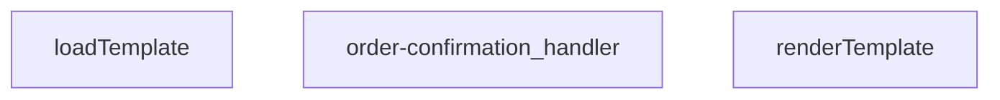

## Genel Bakış
Bu modül, bir Supabase Edge Function olarak sipariş onayı e-postası gönderiminden sorumludur. Gelen HTTP isteklerini alır, sipariş bilgileriyle dinamik HTML e-posta şablonlarını doldurur ve sonuç olarak bir HTTP yanıtı döner.

## Fonksiyon Grupları
### Şablon İşleme
Bu grup, HTML e-posta şablonlarını yöneten yardımcı fonksiyonları kapsar. Şablonu dosya sisteminden yükler ve içindeki dinamik veri alanlarını doldurarak kullanılabilir hale getirir.
- loadTemplate, renderTemplate

### Ana İş Akışı Yönetimi
Bu grup, modülün tek ve merkezi işleyicisidir. Gelen HTTP isteğini doğrulamaktan, şablonu hazırlayıp verilerle doldurmaya ve e-posta servisini çağırarak son HTTP yanıtını üretmeye kadar tüm iş akışını tek başına koordine eder.
- order-confirmation_handler

---

## AXIOMS – Mimari Varsayımlar

Bu modül, sipariş onayı e-postası gönderimi için bir Supabase Edge Function'dur. Şablon yükleme, veri ile doldurma ve HTTP istek işleme akışını yönetir.

---

## FONKSİYON DETAYLARI

### renderTemplate
**Ne yapar**: Verilen bir şablon string'indeki dinamik marker'ları (Handlebars benzeri {{değişken}} ve {{#if koşul}} bloklarını) belirli veri nesnesindeki değerlerle değiştirerek, dolu bir HTML veya metin çıktısı üretir. Bu fonksiyon, e-posta şablonlarının içeriklerini kişiselleştirmek için basit bir şablon motoru görevi görür.

**Nasıl yapar**: Fonksiyon, iki aşamalı bir regex tabanlı işleme uygular. İlk olarak `{{#if anahtar}}...{{/if}}` koşullu bloklarını tarar; eğer ilgili anahtar veri nesnesinde tanımlı ve "truthy" bir değere sahipse, bloğun içeriğini korur, aksi takdirde bloğu tamamen kaldırır. İkinci adımda, kalan `{{anahtar}}` ifadelerini tarar ve bunları veri nesnesindeki karşılıklarıyla (null veya undefined ise boş string, aksi takdirde string'e dönüştürülmüş haliyle) değiştirir.

**Parametreler**:
- `tpl`: `string` — İşlenecek şablon metni. İçerisinde `{{anahtar}}` ve `{{#if anahtar}}...{{/if}}` marker'ları bulunur.
- `_data`: `Record<string, unknown>` — Şablon marker'larının yerine konacak değerlerin bulunduğu anahtar-değer çiftlerinden oluşan nesne. Değerlerin herhangi bir tipte olmasına izin verilir.

**Dönüş**: `string` — Tüm marker'ların verilen verilerle değiştirildiği veya kaldırılmış olduğu işlenmiş şablon metni.

### loadTemplate
**Ne yapar**: Dosya sisteminden veya uzaktan bir kaynaktan şablon dosyasını asenkron olarak okur ve içeriğini string olarak döndürür.  
**Nasıl yapar**: Promise tabanlı bir I/O operasyonu başlatır; dosya bulunamazsa `null` döner.  
**Parametreler**: *Yok*  
**Dönüş**: Promise<string | null> — Başarılı okuma durumunda şablon içeriği string, bulunamama durumunda `null`.

### order-confirmation_handler
**Ne yapar**: HTTP isteklerini alır, sipariş onayı şablonunu yükler, verileri şablona uygular ve yanıt olarak HTML içeriği döner.  
**Nasıl yapar**: Gelen `req` nesnesinden gerekli sipariş bilgilerini çıkarır, `loadTemplate` ile şablonu getirir, `renderTemplate` ile şablonu doldurur ve bir `Response` nesnesi oluşturur; hata durumunda uygun hata yanıtı üretir.  
**Parametreler**:
- req: any — HTTP istek nesnesi, içinde sipariş verileri ve diğer istek bilgileri bulunur.  
**Dönüş**: Response — HTTP yanıtı, genellikle `text/html` içerik tipinde ve doldurulmuş şablon metnini barındırır.

---

## İTHALATLAR (IMPORTS)
- import: ../_shared/cors.ts::getCorsHeaders
- import: ../_shared/sentry.ts::sentryCaptureException
- import: ../_shared/tenant_config.ts::getTenantBranding
- import: ../_shared/tenant_config.ts::resolveTenantId
- import: https://deno.land/std@0.168.0/http/server.ts::serve

---

## AST POINTERS

### [N1_NASIL] AST Pointer: `supabase/functions/order-confirmation/index.ts::renderTemplate`
- **params**: `(tpl: string, _data: Record<string, unknown>)`
- **ic_degiskenler**:
  - İlk regex callback (`(_m, key, inner) => ...`) içinde:
    - `_m` — regex ile eşleşen tam kalıp metni
    - `key` — `{{#if keyword}}` içinden çıkarılan değişken adı
    - `inner` — `{{#if}}...{{/if}}` arasındaki iç blok metni
    - `v` — `_data[key]` ile elde edilen değerin kendisi
    - `truthy` — `v` değerinin truthy olup olmadığı (boolean)
  - İkinci regex callback (`(_m, key) => ...`) içinde:
    - `_m` — regex ile eşleşen tam kalıp metni (örn. `{{brand_name}}`)
    - `key` — `{{keyword}}` içinden çıkarılan değişken adı
    - `v` — `_data[key]` ile elde edilen değerin kendisi
- **Dönüş**: `string` — değiştirilmiş (render edilmiş) şablon metni

---

### [N2_NASIL] AST Pointer: `supabase/functions/order-confirmation/index.ts::loadTemplate`
- **params**: `(yok)`
- **ic_degiskenler**:
  - `url` — `./templates/email/order_confirmation.html` yolunu `import.meta.url` referansıyla mutlak URL'ye dönüştüren `URL` nesnesi
- **Dönüş**: `Promise<string | null>` — HTML şablon dosyasının içeriği veya okuma hatasında `null`

---

### [N3_NASIL] AST Pointer: `supabase/functions/order-confirmation/index.ts::order-confirmation_handler`
- **params**: `(req: Request)`
- **ic_degiskenler**:
  - **CORS & Origin kontrolü:**
    - `requestOrigin` — istek header'ından alınan `Origin` değeri, boşsa boş string
    - `allowedOrigins` — `ALLOWED_ORIGINS` env var'ının virgülle ayrılıp trim edilmiş izinli origin listesi
    - `originAllowed` — origin'in izinli olup olmadığı boolean; listede hiçbir origin yoksa `true`
    - `corsHeaders` — `getCorsHeaders(req)` ile üretilen CORS header nesnesi
  - **Request body parse:**
    - `_text` — `req.text()` ile okunan ham istek gövdesi
    - `parsed` — JSON.parse ile çözümlenmiş istek gövdesi nesnesi (`Record<string, unknown>`), parse hatasında boş obje
  - **Tenant & Branding:**
    - `tenantId` — `resolveTenantId(req, parsed)` ile çözümlenen kiracı ID'si
    - `branding` — `getTenantBranding(tenantId)` ile asenkron olarak yüklenen kiracı marka bilgileri (emailFrom, brandName, brandPrimaryColor, brandLogoUrl içerir)
  - **Sipariş ID çıkarımı (IIFE içinde):**
    - `v` — `parsed['order_id']` erişimiyle elde edilen ham değer
  - **Supabase & Auth yapılandırması:**
    - `supabaseUrl` — `SUPABASE_URL` env var'ı, yoksa boş string
    - `serviceKey` — `SUPABASE_SERVICE_ROLE_KEY` env var'ı, yoksa boş string
    - `authHeader` — istekten alınan `Authorization` header değeri
    - `isAuthorized` — kullanıcının yetkili olup olmadığı boolean
  - **Dinamik import ile auth fallback bloğu içinde:**
    - `anonKey` — `SUPABASE_ANON_KEY` env var'ı
    - `createClient` — dinamik import ile yüklenen `@supabase/supabase-js` createClient fonksiyonu
    - `authClient` — `createClient` ile oluşturulan Supabase client, Authorization header'ı ile
    - `user` — `authClient.auth.getUser()` destructuring'inden gelen kullanıcı nesnesi
    - `roleCheck` — user_profiles tablosundaki rolü sorgulayan fetch isteği yanıtı
    - `arr` — `roleCheck.json()` ile çözümlenen rol sorgusu sonuç dizisi
    - `role` — `arr[0]?.role` ile erişilen kullanıcının rolü (admin/superadmin kontrolü)
  - **Email gönderim yapılandırması:**
    - `resendApiKey` — `RESEND_API_KEY` env var'ı
    - `emailFrom` — `branding.emailFrom` değerinden başlatılan, hata durumunda fallback'e uğrayabilen gönderen adresi
    - `testMode` — `EMAIL_TEST_MODE` env var'ının boolean karşılığı
    - `testTo` — test modunda kullanılacak alıcı, `EMAIL_TEST_TO` env var'ı veya `'delivered@resend.dev'`
    - `bccList` — `SHIP_EMAIL_BCC` env var'ının virgülle ayrılıp trim edilmiş BCC listesi
    - `brandName` — `branding.brandName` değerinden gelen marka adı
    - `brandPrimary` — `branding.brandPrimaryColor` değerinden gelen ana renk kodu
    - `brandLogoUrl` — `branding.brandLogoUrl` değerinden gelen logo URL'i
  - **Sipariş verisi çekimi:**
    - `customer_email` — siparişten veya auth user'dan çözümlenen müşteri emaili, başlangıçta `null`
    - `customer_name` — siparişten veya auth user metadata'sından çözümlenen müşteri adı, başlangıçta `null`
    - `order_number` — siparişten gelen sipariş numarası, başlangıçta `null`
    - `o` — `venthub_orders` tablosuna yapılan fetch isteği yanıtı
    - `arr` — `o.json()` ile çözümlenen sipariş sonuç dizisi (scope çakışması ile aynı isim)
    - `row` — sipariş dizisinin ilk elemanı (`arr[0]`), sipariş satır verisi
    - `uid` — `row.user_id`'den gelen kullanıcı ID'si, müşteri bilgileri eksikse auth'dan tamamlama için kullanılır
    - `u` — auth admin API'sinden kullanıcı bilgisi çeken fetch isteği yanıtı
    - `uj` — `u.json()` ile çözümlenen kullanıcı JSON'u (`UserResponse` interface'i ile tip-lenmiş: `email`, `user_metadata.full_name`, `user_metadata.name`)
    - `metaName` — `uj.user_metadata` içinden `full_name` veya `name` alanından çözümlenen isim
  - **Alıcı listesi oluşturma:**
    - `toList` — email alıcıları dizisi; test modunda `testTo`, normalde `customer_email`
    - `bcc` — BCC alıcı dizisi, `bccList`'in bir kopyası, `toList` boşsa ilk elemanı `toList`'e taşınır
  - **Email içeriği:**
    - `prettyOrderNo` — sipariş numarasının insan-okunabilir formatı (`#1234` veya son 8 karakterden türetilmiş)
    - `subject` — email konu başlığı, marka adı ve sipariş numarasını içerir
    - `html` — email HTML gövdesi; önce şablon denenir, fallback olarak inline HTML oluşturulur
    - `tpl` — `loadTemplate()` ile yüklenen ham HTML şablon metni
  - **Email gönderimi:**
    - `send` — inner async fonksiyon, Resend API'ye POST isteği yapan kapanma (closure); `resendApiKey`, `emailFrom`, `toList`, `bcc`, `subject`, `html` değerlerini dış scope'tan referans alır
    - `resp` — `send()` çağrısının Response nesnesi; ilk deneme başarısızsa domain verify hatası kontrolü ile ikinci deneme
    - `txt` — başarısız Response'un hata metni (domain verify hatası kontrolü için)
    - `result` — başarılı gönderim sonrası `resp.json()` ile çözümlenen Resend API yanıt nesnesi
  - **Log kaydı:**
    - `order_email_events` tablosuna en iyi çabayla (best-effort) INSERT yapılır; `order_id`, `email_to`, `subject`, `provider`, `provider_message_id` alanları yazılır
  - **Hata yakalama (outer catch):**
    - `_e` — yakalanan hata nesnesi, `sentryCaptureException` ile raporlanır; `Error` ise `.message`, değilse `String(_e)` ile mesaj üretilir
- **Dönüş**: `Response` — başarılıysa `{ success, subject, result }` JSON'u (200); hata durumlarına göre 400/401/403/405/500 status kodlarıyla JSON hata yanıtları

---

## MERMAID CALL GRAPH

## NODE ID STANDARD

  file: supabase\functions\order-confirmation\index.ts
  function: supabase\functions\order-confirmation\index.ts::renderTemplate
  function: supabase\functions\order-confirmation\index.ts::loadTemplate
  function: supabase\functions\order-confirmation\index.ts::order-confirmation_handler

---

## DISA AKTARILANLAR (EXPORTS)
  export: loadTemplate
  export: order-confirmation_handler
  export: renderTemplate