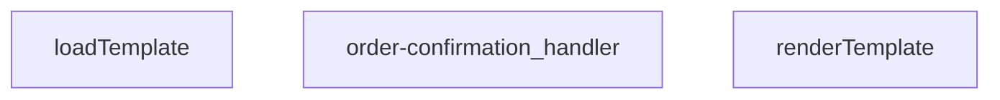

## Genel Bakış
Bu modül, bir Supabase Edge Function olarak sipariş onayı e-postası gönderiminden sorumludur. Gelen HTTP isteklerini alır, sipariş bilgileriyle dinamik HTML e-posta şablonlarını doldurur ve sonuç olarak bir HTTP yanıtı döner.

## Fonksiyon Grupları
### Şablon İşleme
Bu grup, HTML e-posta şablonlarını yöneten yardımcı fonksiyonları kapsar. Şablonu dosya sisteminden yükler ve içindeki dinamik veri alanlarını doldurarak kullanılabilir hale getirir.
- loadTemplate, renderTemplate

### Ana İş Akışı Yönetimi
Bu grup, modülün tek ve merkezi işleyicisidir. Gelen HTTP isteğini doğrulamaktan, şablonu hazırlayıp verilerle doldurmaya ve e-posta servisini çağırarak son HTTP yanıtını üretmeye kadar tüm iş akışını tek başına koordine eder.
- order-confirmation_handler

---

## AXIOMS – Mimari Varsayımlar

Bu modül, sipariş onayı e-postası gönderimi için bir Supabase Edge Function'dur. Şablon yükleme, veri ile doldurma ve HTTP istek işleme akışını yönetir.

---

## FONKSİYON DETAYLARI

### renderTemplate
**Ne yapar**: Verilen bir HTML/şablon dizesindeki koşullu blokları ve değişken yer tutucularını, sağlanan veri nesnesindeki değerlerle değiştirerek işlenmiş bir dize döndürür. Basit bir şablon motoru görevi görür.

**Nasıl yapar**: İlk olarak `{{#if key}}...{{/if}}` sözdizimini eşleştirir; ilgili `_data[key]` değeri truthy ise içeriği korur, aksi halde boş string ile değiştirir. Ardından kalan `{{key}}` yer tutucularını `_data[key]` değeriyle değiştirir; değer `null` veya `undefined` ise boş string döner, değilse `String()` ile dizeye dönüştürülür.

**Parametreler**:
- `tpl`: string — İşlenecek şablon dizesi. İçerisinde `{{#if}}...{{/if}}` koşullu blokları ve `{{değişken}}` yer tutucuları bulundurur.
- `_data`: Record<string, unknown> — Şablondaki yer tutuculara karşılık gelen değerleri içeren nesne. Anahtarlar şablondaki değişken isimleriyle eşleşmelidir.

**Dönüş**: string — İşlenmiş, tüm yer tutucuların değerlerle değiştirildiği veya koşullu blokların ayıklandığı sonuç dizesi.

### loadTemplate
**Ne yapar**: Dosya sisteminden veya uzaktan bir kaynaktan şablon dosyasını asenkron olarak okur ve içeriğini string olarak döndürür.  
**Nasıl yapar**: Promise tabanlı bir I/O operasyonu başlatır; dosya bulunamazsa `null` döner.  
**Parametreler**: *Yok*  
**Dönüş**: Promise<string | null> — Başarılı okuma durumunda şablon içeriği string, bulunamama durumunda `null`.

### order-confirmation_handler
**Ne yapar**: HTTP isteklerini alır, sipariş onayı şablonunu yükler, verileri şablona uygular ve yanıt olarak HTML içeriği döner.  
**Nasıl yapar**: Gelen `req` nesnesinden gerekli sipariş bilgilerini çıkarır, `loadTemplate` ile şablonu getirir, `renderTemplate` ile şablonu doldurur ve bir `Response` nesnesi oluşturur; hata durumunda uygun hata yanıtı üretir.  
**Parametreler**:
- req: any — HTTP istek nesnesi, içinde sipariş verileri ve diğer istek bilgileri bulunur.  
**Dönüş**: Response — HTTP yanıtı, genellikle `text/html` içerik tipinde ve doldurulmuş şablon metnini barındırır.

---

## AST POINTERS

### [N1_NASIL] AST Pointer: supabase/functions/order-confirmation/index.ts::renderTemplate
- **params**: `tpl: string`, `_data: Record<string, unknown>`
- **ic_degiskenler**:
  - `tpl` — fonksiyona alınan şablon string'ini tutar, önce `{{#if}}` blokları ile sonra `{{}}` değişkenleri ile place-holder'lar değiştirilerek modified hali return edilir
  - `_data` — şablonda kullanılacak key-value çiftlerini içeren dict, `{{key}}` ve `{{#if key}}` yapılarında referans olarak kullanılır
  - `_m` (1. replace callback) — regex eşleşen tam eşleşme metni (kullanılmıyor, discard)
  - `key` (1. replace callback) — `{{#if (\w+)}}` deseninden yakalanan değişken adı, `_data[key]` ile değeri okunur
  - `inner` (1. replace callback) — `{{#if}}` bloğunun içindeki şablon parçası, truthy ise olduğu gibi döner, aksi halde boş string döner
  - `v` (1. replace callback) — `_data[key]` ile elde edilen değer, truthy kontrolü yapılır
  - `truthy` (1. replace callback) — `v` değerinin truthy/falsy durumu, inner parçanın korunup korunmayacağını belirler
  - `_m` (2. replace callback) — regex eşleşen tam eşleşme metni (kullanılmıyor, discard)
  - `key` (2. replace callback) — `{{(\w+)}}` deseninden yakalanan değişken adı, `_data[key]` ile değeri okunur
  - `v` (2. replace callback) — `_data[key]` ile elde edilen değer, null/undefined kontrolü yapılır
- **Dönüş**: `string` — place-holder'ları değiştirilmiş şablon metni

---

## MERMAID CALL GRAPH

## NODE ID STANDARD

  file: supabase\functions\order-confirmation\index.ts
  function: supabase\functions\order-confirmation\index.ts::renderTemplate
  function: supabase\functions\order-confirmation\index.ts::loadTemplate
  function: supabase\functions\order-confirmation\index.ts::order-confirmation_handler

---

## DISA AKTARILANLAR (EXPORTS)
  export: loadTemplate
  export: order-confirmation_handler
  export: renderTemplate