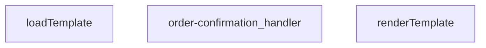

## Genel Bakış
Bu modül, sipariş onayı e-postası gönderimi için tasarlanmış bir Supabase Edge Function'dır. Gelen HTTP isteklerini alarak sipariş detaylarını işler, e-posta şablonunu dinamik verilerle doldurur ve harici bir e-posta servisi üzerinden göndererek HTTP yanıtı üretir.

## Fonksiyon Grupları
### Şablon Motoru
Bu grup, HTML e-posta şablonlarının yüklenmesini ve veriyle doldurulmasını yönetir. Şablon dosyası diskten asenkron olarak okunarak işlenmeye hazır hale getirilir, ardından basit bir şablon motoru ile dinamik içeriğe dönüştürülür.
- loadTemplate, renderTemplate

### Ana İş Akışı ve E-posta Gönderimi
Bu grup, tüm iş akışını koordine eden merkezi işleyicidir. İsteği doğrulamadan şablon seçimine, veri hazırlamadan e-posta gönderimi ve yanıt üretimi dahil tüm adımları yönetir.
- order-confirmation_handler

---

---

## FONKSİYON DETAYLARI

### renderTemplate
**Ne yapar**: Verilen bir HTML/şablon dizesindeki koşullu blokları ve değişken yer tutucularını, sağlanan veri nesnesindeki değerlerle değiştirerek işlenmiş bir dize döndürür. Basit bir şablon motoru görevi görür.

**Nasıl yapar**: İlk olarak `{{#if key}}...{{/if}}` sözdizimini eşleştirir; ilgili `_data[key]` değeri truthy ise içeriği korur, aksi halde boş string ile değiştirir. Ardından kalan `{{key}}` yer tutucularını `_data[key]` değeriyle değiştirir; değer `null` veya `undefined` ise boş string döner, değilse `String()` ile dizeye dönüştürülür.

**Parametreler**:
- `tpl`: string — İşlenecek şablon dizesi. İçerisinde `{{#if}}...{{/if}}` koşullu blokları ve `{{değişken}}` yer tutucuları bulundurur.
- `_data`: Record<string, unknown> — Şablondaki yer tutuculara karşılık gelen değerleri içeren nesne. Anahtarlar şablondaki değişken isimleriyle eşleşmelidir.

**Dönüş**: string — İşlenmiş, tüm yer tutucuların değerlerle değiştirildiği veya koşullu blokların ayıklandığı sonuç dizesi.

### loadTemplate
**Ne yapar**: Dosya sisteminden veya uzaktan bir kaynaktan şablon dosyasını asenkron olarak okur ve içeriğini string olarak döndürür.  
**Nasıl yapar**: Promise tabanlı bir I/O operasyonu başlatır; dosya bulunamazsa `null` döner.  
**Parametreler**: *Yok*  
**Dönüş**: Promise<string | null> — Başarılı okuma durumunda şablon içeriği string, bulunamama durumunda `null`.

### order-confirmation_handler
**Ne yapar**: HTTP isteklerini alır, sipariş onayı şablonunu yükler, verileri şablona uygular ve yanıt olarak HTML içeriği döner.  
**Nasıl yapar**: Gelen `req` nesnesinden gerekli sipariş bilgilerini çıkarır, `loadTemplate` ile şablonu getirir, `renderTemplate` ile şablonu doldurur ve bir `Response` nesnesi oluşturur; hata durumunda uygun hata yanıtı üretir.  
**Parametreler**:
- req: any — HTTP istek nesnesi, içinde sipariş verileri ve diğer istek bilgileri bulunur.  
**Dönüş**: Response — HTTP yanıtı, genellikle `text/html` içerik tipinde ve doldurulmuş şablon metnini barındırır.

---

## AST POINTERS

### [N1_NASIL] AST Pointer: supabase/functions/order-confirmation/index.ts::renderTemplate
- **params**: `tpl: string, _data: Record<string, unknown>`
- **ic_degiskenler**:
  - `tpl` — İşlenecek HTML şablonu metni
  - `_data` — Şablondaki degiskenlerin degerlerini iceren dict
  - `_m` — Regex eslesmesinin tam eslesen metni (callback parametresi)
  - `key` — Şablondaki degisken/koşul adı (callback parametresi)
  - `inner` — `{{#if}}` blogunun icerigi (callback parametresi)
  - `v` — `_data[key]` ile elde edilen deger
  - `truthy` — Degerin truthy olup olmadigini gosteren boolean
- **Dönüş**: `string` — Islenmis şablon

### [N2_NASIL] AST Pointer: supabase/functions/order-confirmation/index.ts::loadTemplate
- **params**: (yok)
- **ic_degiskenler**:
  - `url` — Şablon dosyasinin tam URL'si
- **Dönüş**: `Promise<string | null>` — Şablon metni veya hata durumunda null

### [N3_NASIL] AST Pointer: supabase/functions/order-confirmation/index.ts::order-confirmation_handler
- **params**: `req`
- **ic_degiskenler**:
  - `requestOrigin` — HTTP isteginin Origin header'indaki deger
  - `allowedOrigins` — İzin verilen domainlerin listesi (env'den ayrilmis)
  - `originAllowed` — İstek origin'inin izin verilen listede olup olmadigi
  - `corsHeaders` — CORS yanit headarlari objesi
  - `_text` — Request body'nin ham metin olarak okunmasi
  - `parsed` — JSON parse edilmis request body objesi
  - `order_id` — parsed['order_id']'den alinan ve trim edilmis siparis ID'si
  - `supabaseUrl` — Supabase projesi URL'si
  - `serviceKey` — Supabase service role key
  - `authHeader` — Authorization header degeri
  - `isAuthorized` — Kullanicinin yetkili olup olmadigini gosteren boolean
  - `anonKey` — Supabase anon key (auth fallback icin kullanilir)
  - `authClient` — Supabase auth client (auth fallback icin kullanilir)
  - `user` — Auth client'tan alinan kullanici objesi
  - `roleCheck` — Kullanici rolunu kontrol icin fetch sonucu
  - `arr` — roleCheck.json() sonucu array
  - `role` — Kullanicinin rolu (arr[0]?.role)
  - `resendApiKey` — Resend email API key
  - `emailFrom` — Gonderen email adresi
  - `testMode` — Test modu aktif mi (env'den okunur)
  - `testTo` — Test modunda email alacagi adres
  - `bccList` — BCC listesi (env'den ayrilmis)
  - `brandName` — Marka adi
  - `brandPrimary` — Marka ana renk kodu
  - `brandLogoUrl` — Marka logo URL'si
  - `o` — Siparis verisini cekmek icin fetch sonucu
  - `arr` — Siparis verisi array (o.json() sonucu)
  - `row` — Siparis verisi satiri (arr[0])
  - `order_number` — Siparis numarasi (row'dan)
  - `customer_email` — Musteri emaili (row'dan veya auth user'dan)
  - `customer_name` — Musteri adi (row'dan veya auth user'dan)
  - `uid` — Kullanici ID'si (row.user_id)
  - `u` — Auth user verisini cekmek icin fetch sonucu
  - `uj` — Auth user verisi (u.json() sonucu)
  - `toList` — Email gonderilecek alici listesi
  - `bcc` — BCC listesi (gonderilecek)
  - `prettyOrderNo` — Gosterim icin formatlanmis siparis numarasi
  - `subject` — Email konu basligi
  - `tpl` — Yuklenen HTML sablonu
  - `html` — Islenmis veya fallback HTML icerigi
  - `resp` — Resend API'ye email gonderme sonucu
  - `txt` — Basarisiz gonderimde hata mesaji
  - `result` — Resend API yanit sonucu
- **Dönüş**: `Response` — HTTP yanit (JSON icerikli)

---

## MERMAID CALL GRAPH

## NODE ID STANDARD

  file: supabase\functions\order-confirmation\index.ts
  function: supabase\functions\order-confirmation\index.ts::renderTemplate
  function: supabase\functions\order-confirmation\index.ts::loadTemplate
  function: supabase\functions\order-confirmation\index.ts::order-confirmation_handler

---

## DISA AKTARILANLAR (EXPORTS)
  export: loadTemplate
  export: order-confirmation_handler
  export: renderTemplate