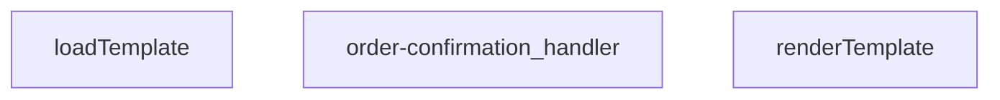

## Genel Bakış
Bu modül, bir Supabase Edge Function olarak sipariş onayı e-postası gönderiminden sorumludur. Gelen HTTP isteklerini alır, sipariş bilgileriyle dinamik HTML e-posta şablonlarını doldurur ve sonuç olarak bir HTTP yanıtı döner.

## Fonksiyon Grupları
### Şablon İşleme
Bu grup, HTML e-posta şablonlarını yöneten yardımcı fonksiyonları kapsar. Şablonu dosya sisteminden yükler ve içindeki dinamik veri alanlarını doldurarak kullanılabilir hale getirir.
- loadTemplate, renderTemplate

### Ana İş Akışı Yönetimi
Bu grup, modülün tek ve merkezi işleyicisidir. Gelen HTTP isteğini doğrulamaktan, şablonu hazırlayıp verilerle doldurmaya ve e-posta servisini çağırarak son HTTP yanıtını üretmeye kadar tüm iş akışını tek başına koordine eder.
- order-confirmation_handler

---

## AXIOMS – Mimari Varsayımlar

Bu modül, sipariş onayı e-postası gönderimi için bir Supabase Edge Function'dur. Şablon yükleme, veri ile doldurma ve HTTP istek işleme akışını yönetir.

---

## FONKSİYON DETAYLARI

### renderTemplate
**Ne yapar**: Verilen bir şablon string'indeki dinamik marker'ları (Handlebars benzeri {{değişken}} ve {{#if koşul}} bloklarını) belirli veri nesnesindeki değerlerle değiştirerek, dolu bir HTML veya metin çıktısı üretir. Bu fonksiyon, e-posta şablonlarının içeriklerini kişiselleştirmek için basit bir şablon motoru görevi görür.

**Nasıl yapar**: Fonksiyon, iki aşamalı bir regex tabanlı işleme uygular. İlk olarak `{{#if anahtar}}...{{/if}}` koşullu bloklarını tarar; eğer ilgili anahtar veri nesnesinde tanımlı ve "truthy" bir değere sahipse, bloğun içeriğini korur, aksi takdirde bloğu tamamen kaldırır. İkinci adımda, kalan `{{anahtar}}` ifadelerini tarar ve bunları veri nesnesindeki karşılıklarıyla (null veya undefined ise boş string, aksi takdirde string'e dönüştürülmüş haliyle) değiştirir.

**Parametreler**:
- `tpl`: `string` — İşlenecek şablon metni. İçerisinde `{{anahtar}}` ve `{{#if anahtar}}...{{/if}}` marker'ları bulunur.
- `_data`: `Record<string, unknown>` — Şablon marker'larının yerine konacak değerlerin bulunduğu anahtar-değer çiftlerinden oluşan nesne. Değerlerin herhangi bir tipte olmasına izin verilir.

**Dönüş**: `string` — Tüm marker'ların verilen verilerle değiştirildiği veya kaldırılmış olduğu işlenmiş şablon metni.

### loadTemplate
**Ne yapar**: Dosya sisteminden veya uzaktan bir kaynaktan şablon dosyasını asenkron olarak okur ve içeriğini string olarak döndürür.  
**Nasıl yapar**: Promise tabanlı bir I/O operasyonu başlatır; dosya bulunamazsa `null` döner.  
**Parametreler**: *Yok*  
**Dönüş**: Promise<string | null> — Başarılı okuma durumunda şablon içeriği string, bulunamama durumunda `null`.

### order-confirmation_handler
**Ne yapar**: HTTP isteklerini alır, sipariş onayı şablonunu yükler, verileri şablona uygular ve yanıt olarak HTML içeriği döner.  
**Nasıl yapar**: Gelen `req` nesnesinden gerekli sipariş bilgilerini çıkarır, `loadTemplate` ile şablonu getirir, `renderTemplate` ile şablonu doldurur ve bir `Response` nesnesi oluşturur; hata durumunda uygun hata yanıtı üretir.  
**Parametreler**:
- req: any — HTTP istek nesnesi, içinde sipariş verileri ve diğer istek bilgileri bulunur.  
**Dönüş**: Response — HTTP yanıtı, genellikle `text/html` içerik tipinde ve doldurulmuş şablon metnini barındırır.

---

## İTHALATLAR (IMPORTS)
- import: ../_shared/cors.ts::getCorsHeaders
- import: ../_shared/sentry.ts::sentryCaptureException
- import: ../_shared/tenant_config.ts::getTenantBranding
- import: ../_shared/tenant_config.ts::resolveTenantId
- import: https://deno.land/std@0.168.0/http/server.ts::serve

---

## AST POINTERS

### [N1_NASIL] AST Pointer: `supabase/functions/order-confirmation/index.ts::renderTemplate`
- **params**: `(tpl: string, _data: Record<string, unknown>)`
- **ic_degiskenler**:
  - İlk regex callback (`(_m, key, inner) => ...`) içinde:
    - `_m` — regex ile eşleşen tam kalıp metni
    - `key` — `{{#if keyword}}` içinden çıkarılan değişken adı
    - `inner` — `{{#if}}...{{/if}}` arasındaki iç blok metni
    - `v` — `_data[key]` ile elde edilen değerin kendisi
    - `truthy` — `v` değerinin truthy olup olmadığı (boolean)
  - İkinci regex callback (`(_m, key) => ...`) içinde:
    - `_m` — regex ile eşleşen tam kalıp metni (örn. `{{brand_name}}`)
    - `key` — `{{keyword}}` içinden çıkarılan değişken adı
    - `v` — `_data[key]` ile elde edilen değerin kendisi
- **Dönüş**: `string` — değiştirilmiş (render edilmiş) şablon metni

---

## MERMAID CALL GRAPH

## NODE ID STANDARD

  file: supabase\functions\order-confirmation\index.ts
  function: supabase\functions\order-confirmation\index.ts::renderTemplate
  function: supabase\functions\order-confirmation\index.ts::loadTemplate
  function: supabase\functions\order-confirmation\index.ts::order-confirmation_handler

---

## DISA AKTARILANLAR (EXPORTS)
  export: loadTemplate
  export: order-confirmation_handler
  export: renderTemplate